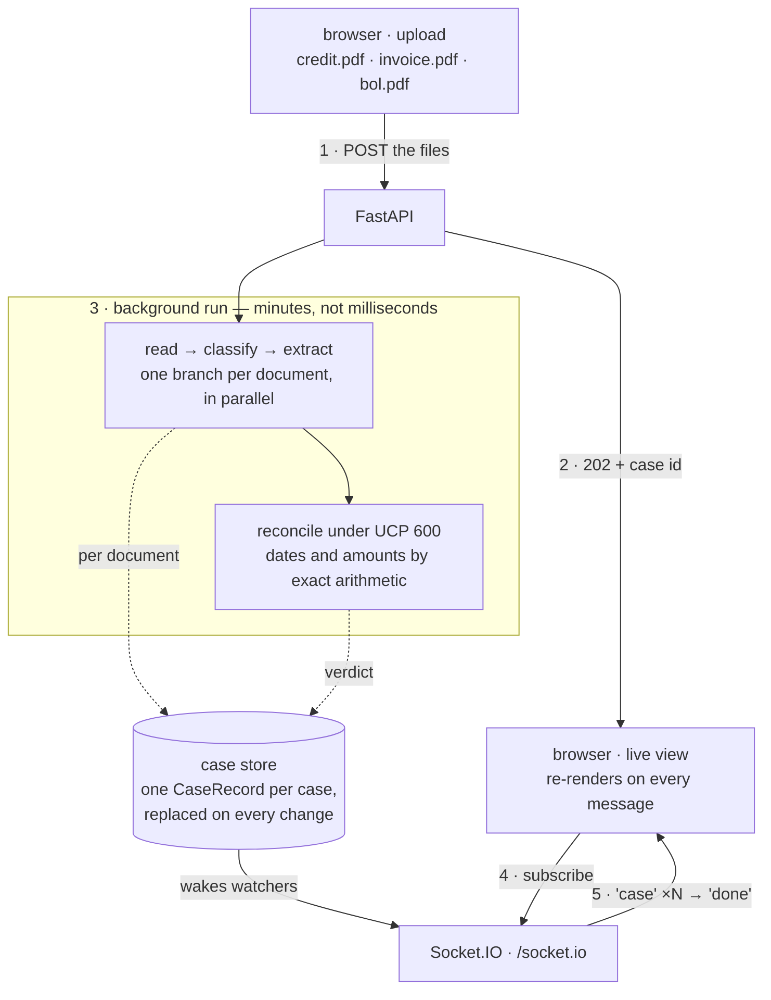
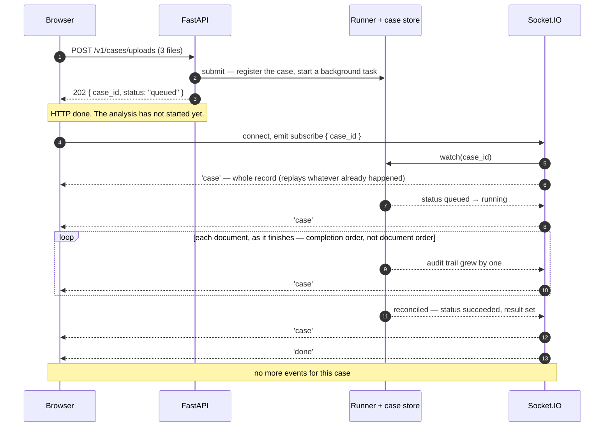

# Trade Finance Document Mismatch Detector

Cross-checks the documents presented under a letter of credit — the credit itself, the
commercial invoice, the bill of lading, the packing list and the rest — and reports the
discrepancies a bank ops examiner would raise under UCP 600, with a verdict of `clean`,
`needs_review` or `blocked`.

**The problem.** A beneficiary ships goods and presents documents to a bank to get paid.
The bank must check them against each other and against UCP 600: if the invoice says
`ACME TRADING LTD` where the credit says `ACME TRADING LIMITED`, or the goods shipped a
day after the latest shipment date, the bank refuses and the beneficiary is not paid.
By hand this takes an examiner around twenty minutes per presentation, and the mistakes
are expensive.

**What this does.** Reads every presented document into typed fields — with Amazon
Textract when they arrive as scans — cross-checks them the way an examiner would, and
returns the discrepancies with the UCP 600 article each one rests on.



**Uploading and watching are two different connections.** The `POST` (1) is over in
milliseconds: it hands back a case id (2) and nothing else — no report, because there
isn't one yet. The analysis then runs in the background (3), and everything it produces
lands in the case store. A browser that has subscribed (4) is pushed the whole record
every time that store changes (5).

So the dotted arrows are the important part: they are not one final delivery at the end,
they are **every stage reporting as it finishes** — each document as it is read,
classified and extracted, then the verdict.



A frontend is therefore about six lines, because every message is the complete state:

```js
import { io } from 'socket.io-client';

const socket = io('http://localhost:8000');            // path defaults to /socket.io
socket.emit('subscribe', { case_id });

socket.on('case',  (record) => render(record));        // whole CaseRecord — just re-render
socket.on('done',  ()       => socket.disconnect());
socket.on('error', (e)      => show(e.code, e.detail));
```

Three properties make it that small:

- **Every `case` message is the whole record, never a delta.** Render the latest one and
  you are correct — nothing to accumulate, no message types to switch on.
- **Subscribing late loses nothing.** The first message replays the current state, however
  much already happened, so there is no race between the `POST` returning and the socket
  opening, and a reconnect needs no cursor.
- **Events arrive in completion order, not document order**, because the documents are
  read and extracted in parallel. Key your UI on `document_id`.

## Run it

```bash
export GEMINI_API_KEY=...        # the models
export AWS_REGION=ap-south-1     # OCR; omit to run text-only
docker compose up --build
```

Then open **http://localhost:8000** for the UI, or `/docs` for the interactive API docs.
One service and one port: the backend serves the frontend, so the page, the REST routes
and the Socket.IO endpoint are all on the same origin and there is no CORS to configure.

Click **Load a sample presentation** to try it without hunting for documents — the sample
has planted discrepancies, so a real run comes back `blocked`.

Without Docker:

```bash
cd backend
uv sync
DETECTOR_FRONTEND_DIR=../frontend/public uv run uvicorn main:app --reload
```

Drop `DETECTOR_FRONTEND_DIR` to run API-only.

## The shape of the API

Analysing a presentation takes minutes, so **submitting and collecting are separate**: a
submission answers `202` with a case id, and the run continues in the background.

| | |
|---|---|
| `POST /v1/cases/uploads` | Submit as PDFs or images → `202` |
| `POST /v1/cases` | Submit as already-extracted text → `202` |
| `Socket.IO /socket.io` | Watch it run — emit `subscribe` with the case id |
| `GET /v1/cases/{id}` | Poll it instead |
| `DELETE /v1/cases/{id}` | Abandon a case and drop what it held |
| `GET /health` | Liveness, and whether OCR is available |

Every one of them answers with the same `CaseRecord`, so there is one shape to handle.

## Layout

| | |
|---|---|
| [`backend/`](backend/README.md) | The service: FastAPI, the pipeline, the tests |
| [`backend/Config/`](backend/Config/) | `prompts.yaml` — the system prompts, editable without a deploy |
| [`frontend/`](frontend/README.md) | A page to click through — no build step, served by the backend |

## Reading the code

| Doc | What it's for |
|---|---|
| [`backend/README.md`](backend/README.md) | **Start here** — running it, the API, configuration |
| [`backend/Detector/ARCHITECTURE.md`](backend/Detector/ARCHITECTURE.md) | How it works, upload to result |
| [`backend/WALKTHROUGH.md`](backend/WALKTHROUGH.md) | One real case followed end to end |
| [`backend/mini_detector.ipynb`](backend/mini_detector.ipynb) | A runnable miniature of the pipeline, built from scratch |
| [`frontend/README.md`](frontend/README.md) | The page, and the Socket.IO contract it demonstrates |

Each package under `backend/Detector/` also has its own README covering that layer:
[`core/`](backend/Detector/core/README.md), [`models/`](backend/Detector/models/README.md),
[`prompts/`](backend/Detector/prompts/README.md),
[`services/`](backend/Detector/services/README.md),
[`api/`](backend/Detector/api/README.md).
