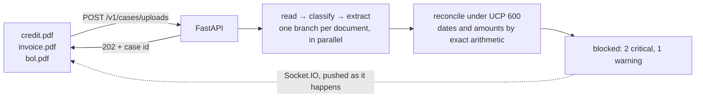

# Trade Finance Document Mismatch Detector

Cross-checks the documents presented under a letter of credit — the credit itself, the
commercial invoice, the bill of lading, the packing list and the rest — and reports the
discrepancies a bank ops examiner would raise under UCP 600, with a verdict of `clean`,
`needs_review` or `blocked`.

**The problem.** A beneficiary ships goods and presents documents to a bank to get paid.
The bank must check them against each other and against UCP 600: if the invoice says
`ACME TRADING LTD` where the credit says `ACME TRADING LIMITED`, or the goods shipped a
day after the latest shipment date, the bank refuses and the beneficiary is not paid.
By hand this takes an examiner around twenty minutes per presentation, and the mistakes
are expensive.

**What this does.** Reads every presented document into typed fields — with Amazon
Textract when they arrive as scans — cross-checks them the way an examiner would, and
returns the discrepancies with the UCP 600 article each one rests on.



## Run it

```bash
export GEMINI_API_KEY=...        # the models
export AWS_REGION=ap-south-1     # OCR; omit to run text-only
docker compose up --build
```

Or without Docker:

```bash
cd backend
uv sync
uv run uvicorn main:app --reload
```

Either way the interactive API docs are at http://localhost:8000/docs.

## The shape of the API

Analysing a presentation takes minutes, so **submitting and collecting are separate**: a
submission answers `202` with a case id, and the run continues in the background.

| | |
|---|---|
| `POST /v1/cases/uploads` | Submit as PDFs or images → `202` |
| `POST /v1/cases` | Submit as already-extracted text → `202` |
| `Socket.IO /socket.io` | Watch it run — emit `subscribe` with the case id |
| `GET /v1/cases/{id}` | Poll it instead |
| `DELETE /v1/cases/{id}` | Abandon a case and drop what it held |
| `GET /health` | Liveness, and whether OCR is available |

Every one of them answers with the same `CaseRecord`, so there is one shape to handle.

## Layout

| | |
|---|---|
| [`backend/`](backend/README.md) | The service: FastAPI, the pipeline, the tests |
| [`backend/Config/`](backend/Config/) | `prompts.yaml` — the system prompts, editable without a deploy |
| `frontend/` | Not built yet |

## Reading the code

| Doc | What it's for |
|---|---|
| [`backend/README.md`](backend/README.md) | **Start here** — running it, the API, configuration |
| [`backend/Detector/ARCHITECTURE.md`](backend/Detector/ARCHITECTURE.md) | How it works, upload to result |
| [`backend/WALKTHROUGH.md`](backend/WALKTHROUGH.md) | One real case followed end to end |
| [`backend/mini_detector.ipynb`](backend/mini_detector.ipynb) | A runnable miniature of the pipeline, built from scratch |

Each package under `backend/Detector/` also has its own README covering that layer:
[`core/`](backend/Detector/core/README.md), [`models/`](backend/Detector/models/README.md),
[`prompts/`](backend/Detector/prompts/README.md),
[`services/`](backend/Detector/services/README.md),
[`api/`](backend/Detector/api/README.md).
