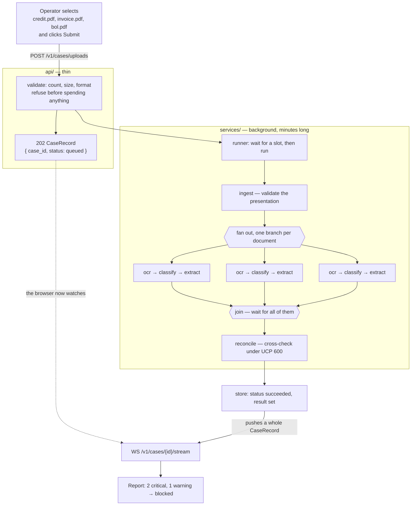
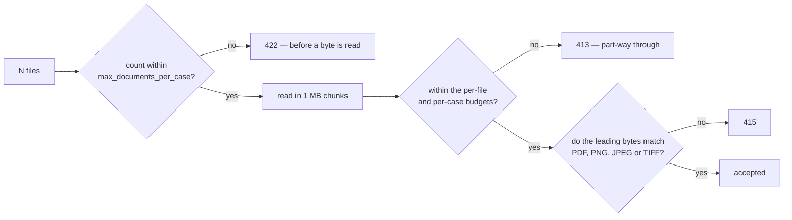
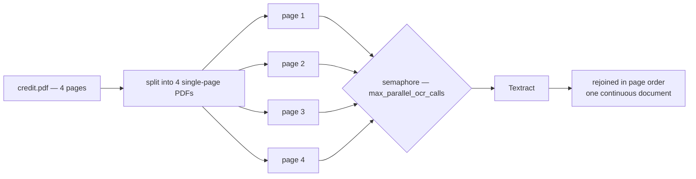
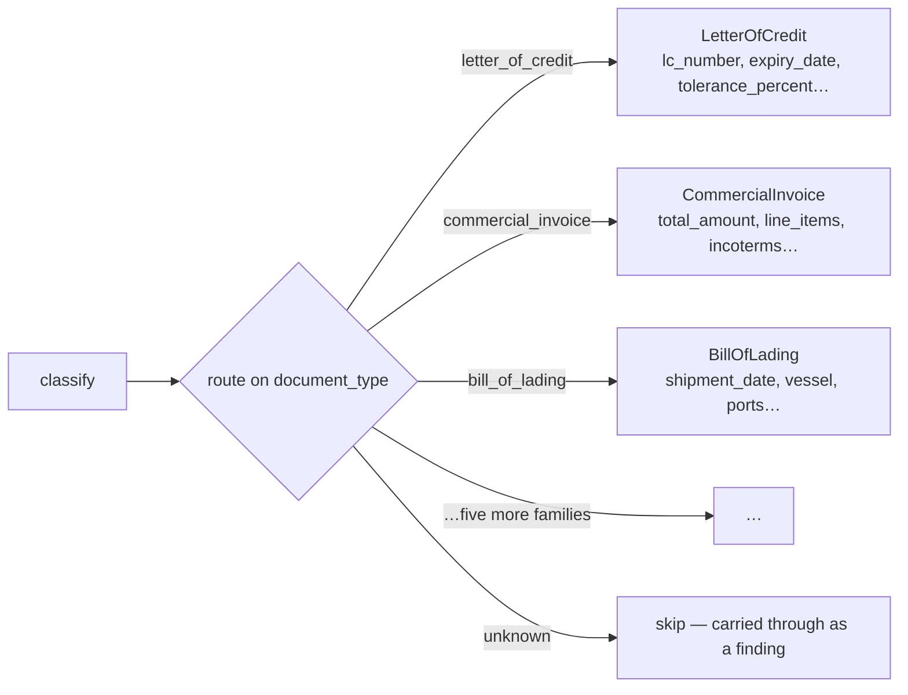
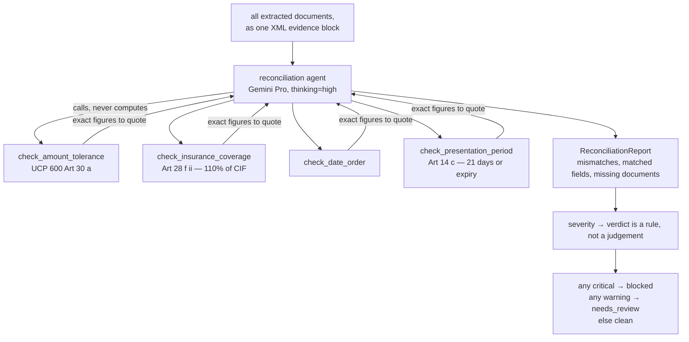
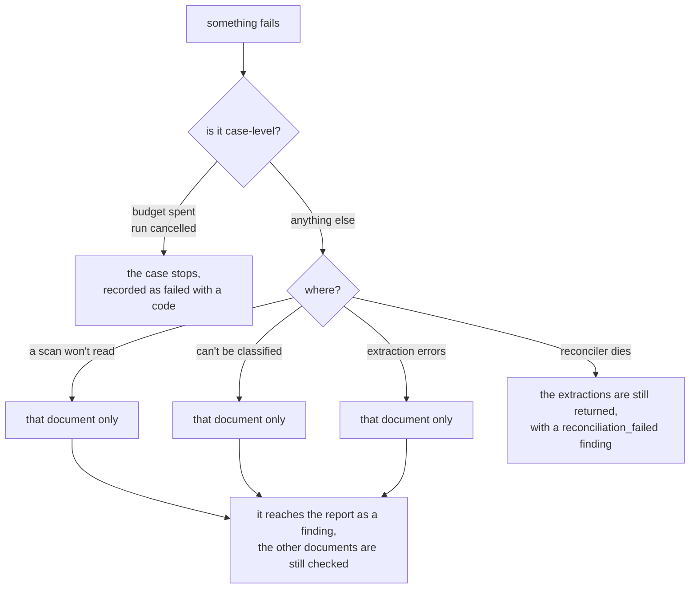
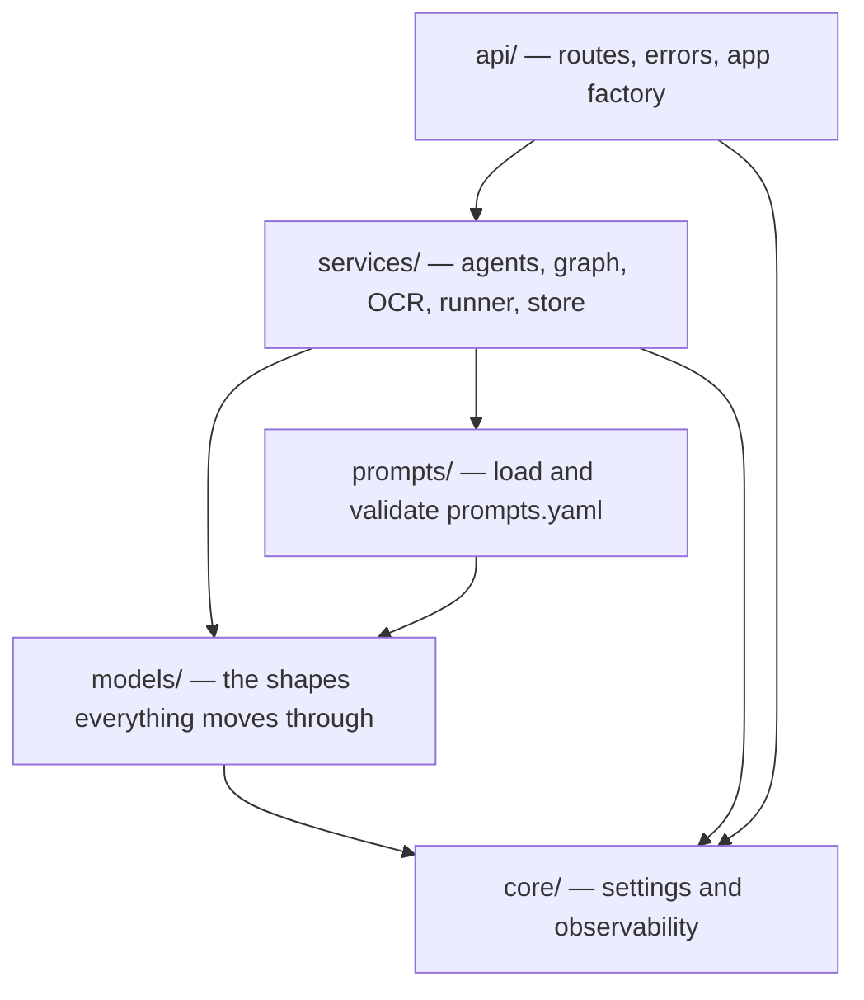

# How the detector works, end to end

From a person selecting a pile of scanned documents and clicking submit, to a report an
examiner can act on.

**The problem.** A beneficiary ships goods and presents documents to a bank to get paid —
the letter of credit itself, the commercial invoice, the bill of lading, a packing list,
an insurance certificate, and so on. The bank must check them against each other and
against UCP 600. If the invoice says `ACME TRADING LTD` and the credit says
`ACME TRADING LIMITED`, or the goods shipped a day after the latest shipment date, the
bank refuses and the beneficiary does not get paid. Doing this by hand takes an examiner
twenty minutes a presentation and the mistakes are expensive.

**What this does.** Reads every presented document into typed fields, cross-checks them
the way an examiner would, and returns the discrepancies with a verdict of `clean`,
`needs_review` or `blocked`.

---

## The whole thing in one picture



Three ideas carry the whole design:

1. **Submitting and collecting are separate.** A submission answers in milliseconds with
   a case id; the analysis continues in the background.
2. **Documents are processed in parallel.** A twelve-document case costs roughly the
   latency of its slowest single document, not twelve in a row.
3. **One thing failing never loses the rest.** A bad scan becomes a finding, not a 500.

---

## Stage by stage

### 1. Upload — refusing early

The operator's browser sends one multipart request with N files. Each check runs at the
first moment it becomes knowable, so nothing is spent on a submission that cannot work:



The format comes from the **file's leading bytes**, not its `Content-Type` header — that
is whatever the operating system guessed from the extension, and is routinely
`application/octet-stream`. So a correctly-formed PDF that the browser mislabelled is
accepted, and a renamed executable is refused before it costs a round trip to AWS.

Nothing is written to disk or to a bucket. The bytes live in memory until the document
has been read, then are dropped.

### 2. Accepted — the 202

The runner registers the case and returns immediately:

```json
{ "case_id": "case-a1b2c3d4e5f6", "status": "queued", "document_count": 3,
  "events": [], "result": null, "error": null }
```

That same `CaseRecord` shape is what every other endpoint returns too — the polling
response and every websocket message. There is nothing else to learn.

If too many submissions are already waiting, the service answers `503` with a
`Retry-After` instead. Refusing at the door beats handing back a case id that will not be
looked at for twenty minutes.

### 3. Reading — OCR, one page at a time

Textract's synchronous read takes **one page** per call, but a letter of credit runs to
three or four. So a PDF is split and its pages read concurrently, then rejoined in order:



Four calls, but roughly one call's latency. If a page fails, that whole document fails —
half a credit read as though it were the whole thing is worse than none, because the
missing half becomes a confident finding about a field that was never read.

### 4. Classifying — deciding what each document is

The uploader asserts nothing about what a file is; they upload it and the classifier
decides from the text alone. A verdict below `min_classification_confidence` (0.5) is
forced to `unknown` rather than acted on — reading a document under the wrong schema
invents fields, and an invented field becomes a discrepancy that does not exist.

### 5. Extracting — one schema per family

Each family is routed to its own agent, whose `output_type` is that family's typed
payload. The field names and docstrings of those models *are* the prompt the model sees.



Every field is optional on purpose: the extractors are told to leave a field `null`
rather than guess, because a missing field is itself something reconciliation can reason
about.

### 6. Reconciling — the actual judgement

All the extractions arrive together as one evidence set. This is the stage that runs on
the stronger model at high reasoning effort — and the one that does not do its own
arithmetic:



Date arithmetic and tolerance maths are exactly what a language model gets subtly wrong,
and exactly where being wrong costs the beneficiary a refusal. The tools are pure
functions; the prompt tells the agent to quote the figures they return.

The final verdict is **derived from the findings**, overriding whatever the model wrote
in `status`. An unreadable document also appends a warning, so a presentation with a scan
nobody could read can never come back `clean`.

### 7. Collecting the result

The record reaches `succeeded` and the report is attached. The websocket pushes the whole
record and closes; a poller sees the same thing on its next `GET`.

```json
{ "status": "succeeded",
  "result": {
    "status": "blocked",
    "report": {
      "summary": "The invoice exceeds the credit amount and shipment was late…",
      "mismatches": [
        { "code": "late_shipment", "severity": "critical",
          "field": "Shipment date", "rule_reference": "UCP 600 Art 14(c)",
          "explanation": "Shipped 2026-03-04, three days after the latest shipment date.",
          "suggested_action": "Request an amendment, or present under reserve." }
      ] } } }
```

`DELETE /v1/cases/{id}` drops the record when the caller is done with it. Otherwise it
expires on its own — it holds a whole presentation's extracted contents, so it should not
outlive the caller's interest in it.

---

## What happens when things go wrong

The rule everywhere is: **degrade rather than fail.** Each of these was once a bug.



That last branch matters commercially: by the time reconciliation runs, every document
has already been read, classified and extracted. Letting that failure escape would throw
away work already paid for.

A case that fails *after* the `202` has no request left to answer, so the same error codes
the HTTP layer would have returned are recorded on the record instead. One vocabulary,
whichever way the failure arrived.

---

## Where each part lives



The dependency direction is strictly one way. Nothing in `models/` imports Pydantic AI,
and nothing in `services/` imports FastAPI — which is why the same engine serves the API,
the notebook and the tests.

| Folder | What it does | |
|---|---|---|
| [`core/`](core/README.md) | Every tunable, and the Logfire wiring | |
| [`models/`](models/README.md) | Documents, extractions, findings, job records | |
| [`prompts/`](prompts/README.md) | Loads and validates the ten system prompts | |
| [`services/`](services/README.md) | The engine: agents, the graph, OCR, the runner | |
| [`api/`](api/README.md) | The HTTP and websocket layer | |

---

## Two things worth knowing before you deploy

**Cases are held in memory.** This runs as a single process. `CaseStore` is the seam to
swap in a shared store for a multi-process deployment; nothing above it would change.

**The stages run on different models on purpose.** Classification and extraction are
mechanical, so they use Gemini Flash. Reconciliation is the compliance judgement, so it
uses Pro at high reasoning effort. Splitting the two is most of the reason a
twenty-document case is affordable — and moving reconciliation to a cheaper model is the
change most likely to cost someone a refusal.

Further reading: [`../WALKTHROUGH.md`](../WALKTHROUGH.md) follows one real case end to
end, and [`../mini_detector.ipynb`](../mini_detector.ipynb) rebuilds a miniature of the
whole pipeline from scratch.
