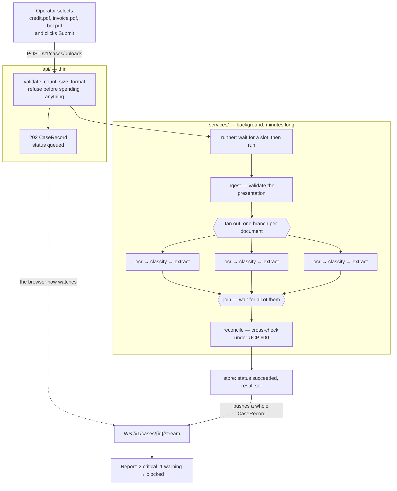
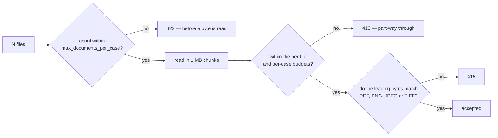
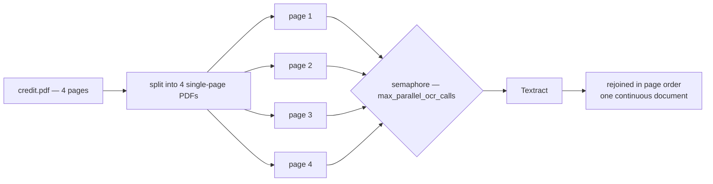
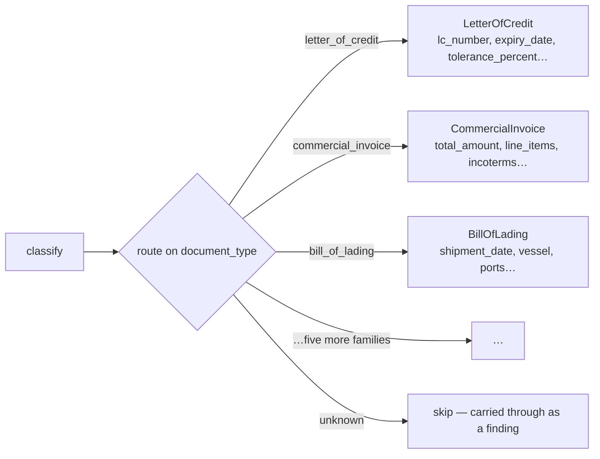
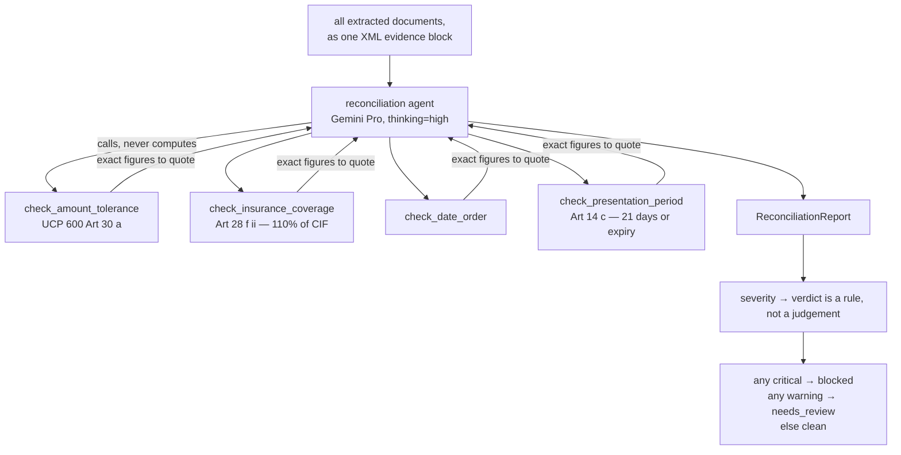
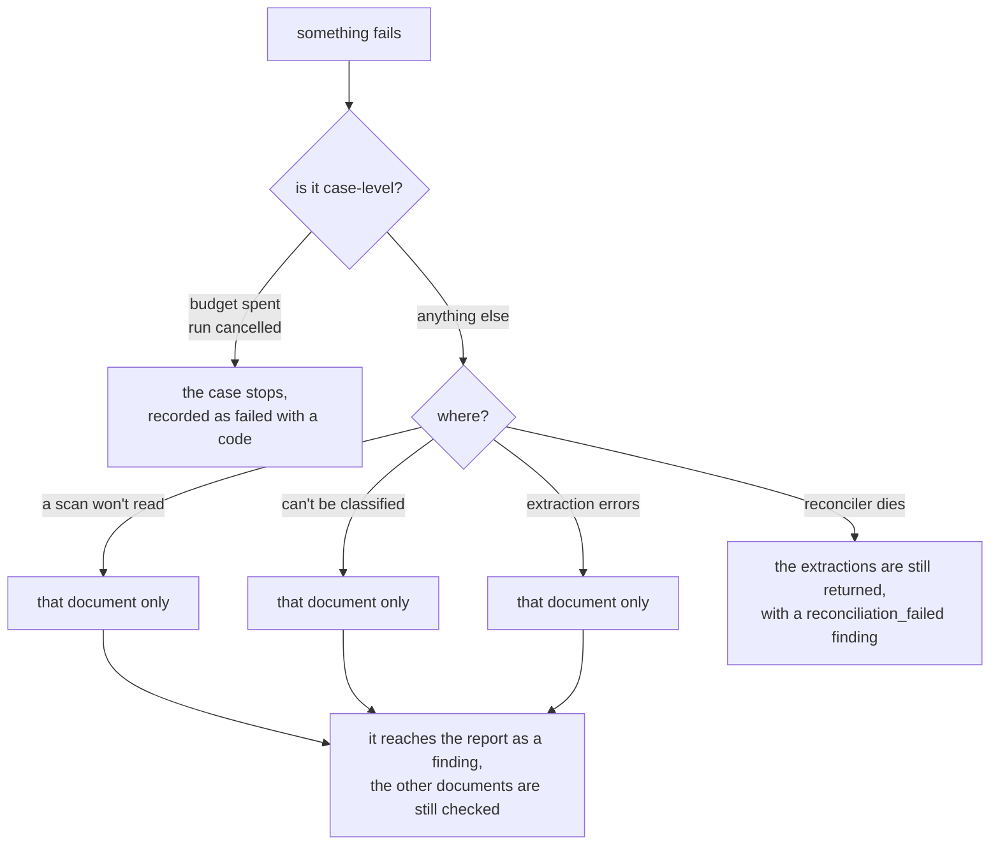
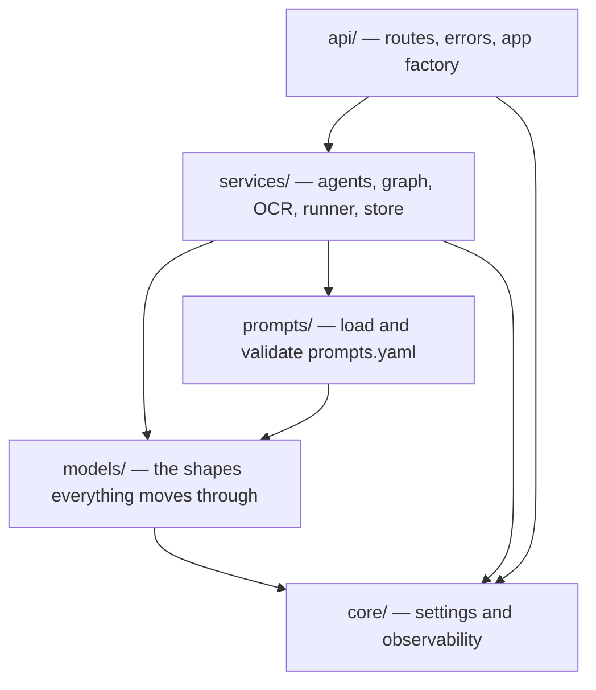

# How the detector works, end to end

From a person selecting a pile of scanned documents and clicking submit, to a report an
examiner can act on.

**The problem.** A beneficiary ships goods and presents documents to a bank to get paid —
the letter of credit itself, the commercial invoice, the bill of lading, a packing list,
an insurance certificate. The bank must check them against each other and against
UCP 600. If the invoice says `ACME TRADING LTD` and the credit says
`ACME TRADING LIMITED`, or the goods shipped a day after the latest shipment date, the
bank refuses and the beneficiary does not get paid. Doing this by hand takes an examiner
twenty minutes a presentation and the mistakes are expensive.

**What this does.** Reads every presented document into typed fields, cross-checks them
the way an examiner would, and returns the discrepancies with a verdict of `clean`,
`needs_review` or `blocked`.

---

## The whole thing in one picture



Three ideas carry the whole design:

1. **Submitting and collecting are separate.** A submission answers in milliseconds with
   a case id; the analysis continues in the background.
2. **Documents are processed in parallel.** A twelve-document case costs roughly the
   latency of its slowest single document, not twelve in a row.
3. **One thing failing never loses the rest.** A bad scan becomes a finding, not a 500.

---

## 1. Upload — refusing early

The browser sends one multipart request with N files. Each check runs at the first moment
it becomes knowable, so nothing is spent on a submission that cannot work.



The size check happens *while* the bytes arrive, not after:

```python
    ceiling = min(settings.max_document_bytes, max(budget, 0))

    chunks: list[bytes] = []
    size = 0
    while chunk := await upload.read(UPLOAD_CHUNK_BYTES):
        size += len(chunk)
        if size > ceiling:
            raise UploadRejected(...)  # 413 upload_too_large
        chunks.append(chunk)
```

And the format comes from the **file's leading bytes**, not its `Content-Type` header —
that is whatever the operating system guessed from the extension, and is routinely
`application/octet-stream`:

```python
_MAGIC: Final[tuple[tuple[bytes, str], ...]] = (
    (b'%PDF-', PDF_MEDIA_TYPE),
    (b'\x89PNG\r\n\x1a\n', 'image/png'),
    (b'\xff\xd8\xff', 'image/jpeg'),
    (b'II*\x00', 'image/tiff'),
    (b'MM\x00*', 'image/tiff'),
)


def sniff_media_type(content: bytes) -> str | None:
    """Identify a document from its leading bytes, or `None` if it is not one we read."""
    return next((media_type for magic, media_type in _MAGIC if content.startswith(magic)), None)
```

So a correctly-formed PDF the browser mislabelled is accepted, and a renamed executable
is refused before it costs a round trip to AWS.

Nothing is written to disk or to a bucket — `RawDocument.content` is excluded from
serialisation, so the bytes cannot reach a response or a log line:

```python
    content: bytes | None = Field(default=None, repr=False, exclude=True)
```

## 2. Accepted — the 202

```python
    return await runner.submit(
        CaseInput(
            case_id=case_id or new_case_id(),
            presented_on=presented_on,
            documents=documents,
        )
    )
```

`submit` registers the case and returns immediately, before any work happens:

```python
    async def submit(self, case: CaseInput) -> CaseRecord:
        """Accept a case and return its record straight away."""
        if self._closing:
            raise TooBusy('the service is shutting down and is not accepting cases')
        if self._waiting >= self.max_queued:
            raise TooBusy(
                f'{self._waiting} case(s) already waiting, at the limit of {self.max_queued}'
            )

        record = await self.store.create(case.case_id, document_count=len(case.documents))
        self._waiting += 1

        task = asyncio.create_task(self._run(case), name=f'case:{case.case_id}')
        self._tasks.add(task)
        task.add_done_callback(self._retire)
        return record
```

```json
{ "case_id": "case-a1b2c3d4e5f6", "status": "queued", "document_count": 3,
  "events": [], "result": null, "error": null, "error_code": null }
```

That same `CaseRecord` shape is what every other endpoint returns — the polling response
and every websocket message. There is nothing else to learn.

If too many submissions are already waiting, the service answers `503` with a
`Retry-After` instead. Refusing at the door beats handing back a case id nobody will look
at for twenty minutes.

## 3. Fanning out

`ingest` validates and hands the documents to a `map` fork:

```python
builder.add(
    builder.edge_from(builder.start_node).to(ingest),
    builder.edge_from(ingest)
    .label("per document")
    .map(fork_id=FAN_OUT_ID, downstream_join_id=COLLECT_ID)
    .to(ocr),
    builder.edge_from(ocr).to(classify),
    builder.edge_from(classify).to(_routing_decision()),
    builder.edge_from(*EXTRACTION_STEPS.values(), skip_unclassified).to(collect),
    builder.edge_from(collect).label("all documents").to(reconcile),
    builder.edge_from(reconcile).to(builder.end_node),
)
```

Every document now runs its own `ocr → classify → extract` branch concurrently.

## 4. Reading — OCR, one page at a time

Textract's synchronous read takes **one page** per call, but a letter of credit runs to
three or four:



```python
        media_type = sniff_media_type(content)
        if media_type is None:
            raise OcrError(...)  # not a format Textract reads
        if media_type == PDF_MEDIA_TYPE:
            pages = await asyncio.to_thread(split_pdf_pages, content, max_pages=self.max_pages)
            return await self._read_pages(pages)
        return ReadResult(text=await self._read_one(content), page_count=1)
```

Four calls, but roughly one call's latency — and they rejoin positionally, not in
completion order:

```python
        texts = await asyncio.gather(*(self._read_one(page) for page in pages))
        joined = self.page_separator.join(text for text in texts if text.strip())
        return ReadResult(text=joined, page_count=len(pages))
```

If a page fails, the whole document fails. Half a credit read as though it were the whole
thing is worse than none, because the missing half becomes a confident finding about a
field that was never read.

## 5. Classifying — deciding what each document is

The uploader asserts nothing about what a file is; they upload it and the classifier
decides from the text alone. A verdict below the confidence threshold is **forced** to
unknown rather than merely flagged:

```python
    if classification.confidence < threshold:
        ...
        # Forced to unknown rather than merely flagged: reading a document under the
        # wrong schema invents fields, and an invented field becomes a discrepancy.
        return RoutedDocument(
            raw=raw,
            classification=classification.model_copy(
                update={
                    "document_type": DocumentType.UNKNOWN,
                    "reasoning": f"{message}. Original reasoning: {classification.reasoning}",
                }
            ),
            usage=usage,
        )
```

## 6. Extracting — one schema per family



The routing table and the steps it points at are generated from one map, so they cannot
fall out of step:

```python
EXTRACTION_STEPS: dict[DocumentType, Step[CaseState, DetectorDeps, Any, ExtractedDocument]] = {
    document_type: _extraction_step(document_type)
    for document_type in EXTRACTION_PAYLOAD_TYPES
}

    for document_type, step in EXTRACTION_STEPS.items():
        decision = decision.branch(
            builder.match(RoutedDocument, matches=_is_type(document_type)).to(step)
        )
```

Each agent's `output_type` is that family's payload model, whose field docstrings are
part of the prompt the model sees:

```python
    presentation_period: str | None = None
    """Presentation period as written, e.g. 'within 21 days after shipment date'."""

    presentation_period_days: int | None = None
    """The presentation period reduced to a number of days, when it is expressed that way."""
```

Every field is optional on purpose: extractors are told to leave a field `null` rather
than guess, because a missing field is something reconciliation can reason about while an
invented one becomes a discrepancy that does not exist.

## 7. Reconciling — the actual judgement

All the extractions arrive together as one evidence set. This is the stage that runs on
the stronger model at high reasoning effort — and the one that does not do its own
arithmetic:



```python
    parts.append(
        "\nUse the deterministic tools for every date and amount comparison rather than "
        "computing them yourself, and quote the figures they return in your findings.\n"
    )
    parts.append(
        format_as_xml(evidence, root_tag="extracted_documents", item_tag="document")
    )
```

The tools are pure functions, so the same presentation always gets the same arithmetic:

```python
    period_deadline = shipment_date + timedelta(days=presentation_period_days)
    deadline = min(period_deadline, expiry_date)
    days_late = max((presented_on - deadline).days, 0)
```

And the verdict is derived from the findings, overriding whatever the model wrote:

```python
def _derive_status(mismatches: Sequence[Mismatch]) -> CaseStatus:
    """Map findings to a verdict.

    The prompt asks the model for this too, but the mapping is a rule, not a
    judgement, so the rule wins: a report with a critical finding is blocked
    whatever the model wrote in `status`.
    """
    severities = {mismatch.severity for mismatch in mismatches}
    if Severity.CRITICAL in severities:
        return CaseStatus.BLOCKED
    if Severity.WARNING in severities:
        return CaseStatus.NEEDS_REVIEW
    return CaseStatus.CLEAN
```

An unreadable document also appends a warning, so a presentation with a scan nobody could
read can never come back `clean`.

## 8. Collecting the result

The record reaches `succeeded`, the websocket pushes the whole record and closes, and a
poller sees the same thing on its next `GET`:

```python
        async for record in runner.store.watch(case_id):
            await websocket.send_text(record.model_dump_json())
```

```json
{ "status": "succeeded",
  "result": {
    "status": "blocked",
    "report": {
      "summary": "The invoice exceeds the credit amount and shipment was late…",
      "mismatches": [
        { "code": "late_shipment", "severity": "critical",
          "field": "Shipment date", "rule_reference": "UCP 600 Art 14(c)",
          "explanation": "Shipped 2026-03-04, three days after the latest shipment date.",
          "suggested_action": "Request an amendment, or present under reserve." }
      ] } } }
```

`DELETE /v1/cases/{id}` drops the record when the caller is done. Otherwise it expires on
its own — it holds a whole presentation's extracted contents, so it should not outlive
the caller's interest in it.

---

## What happens when things go wrong

The rule everywhere is **degrade rather than fail**. Each of these was once a bug.



The shape is the same at each stage — re-raise what is genuinely case-level, contain
everything else:

```python
        except (UsageLimitExceeded, RunCancelled):
            # Case-level: the budget is spent, or the whole run is going away.
            raise
        except Exception as exc:  # noqa: BLE001 - the extractions are still worth returning
            # Every document has already been read, classified and extracted by this
            # point. Letting the failure escape would throw all of that away and hand
            # the caller nothing, so the extracted fields go back with a report saying
            # the cross-checks did not run — which a human examiner can act on.
            report = _unreconciled_report(documents, exc)
```

A case that fails *after* the `202` has no request left to answer, so the runner records
the same codes the HTTP layer would have returned:

```python
        except AgentRunError as exc:
            await self.store.fail(
                case.case_id, code='model_unavailable', detail=f'the model provider failed: {exc}'
            )
        except Exception as exc:  # noqa: BLE001 - a case must always reach a terminal state
            await self.store.fail(
                case.case_id, code='internal_error', detail=f'{type(exc).__name__}: {exc}'
            )
```

One vocabulary, whichever way the failure arrived.

---

## Where each part lives



The dependency direction is strictly one way. Nothing in `models/` imports Pydantic AI,
and nothing in `services/` imports FastAPI — which is why the same engine serves the API,
the notebook and the tests:

```python
from Detector.services.pipeline import DetectorPipeline

async with DetectorPipeline.open() as pipeline:
    result = await pipeline.run(case_input)
```

| Folder | What it does |
|---|---|
| [`core/`](core/README.md) | Every tunable, and the Logfire wiring |
| [`models/`](models/README.md) | Documents, extractions, findings, job records |
| [`prompts/`](prompts/README.md) | Loads and validates the ten system prompts |
| [`services/`](services/README.md) | The engine: agents, the graph, OCR, the runner |
| [`api/`](api/README.md) | The HTTP and websocket layer |

---

## Two things worth knowing before you deploy

**Cases are held in memory.** This runs as a single process. `CaseStore` is the seam to
swap in a shared store for a multi-process deployment; nothing above it would change.

**The stages run on different models on purpose.** Splitting them is most of the reason a
twenty-document case is affordable — and moving reconciliation to a cheaper model is the
change most likely to cost someone a refusal:

```python
FAST_MODEL = 'google:gemini-3.7-flash'
"""Classification and extraction are mechanical: locate the field, copy the value out."""

REASONING_MODEL = 'google:gemini-3.1-pro-preview'
"""Reconciliation is the compliance judgement — the one stage worth the stronger model."""
```

Further reading: [`../WALKTHROUGH.md`](../WALKTHROUGH.md) follows one real case end to
end, and [`../mini_detector.ipynb`](../mini_detector.ipynb) rebuilds a miniature of the
whole pipeline from scratch.
