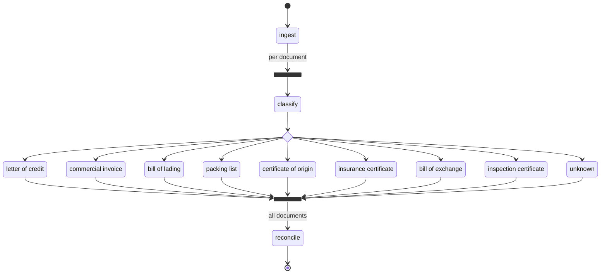

# Detector — code walkthrough

This document explains every construct in `backend/Detector/`, in the order the
code runs. It assumes you know Python and Pydantic, but not Pydantic AI or
Pydantic Graph.

**What the package does:** it takes the documents presented under a letter of
credit — the LC itself, the invoice, the bill of lading, and so on — reads each
one into typed fields, cross-checks them against each other the way a bank
operations analyst would under UCP 600, and returns a list of discrepancies
with a verdict of `clean`, `needs_review` or `blocked`.

**What it deliberately does not do:** HTTP, auth, persistence, file upload, OCR.
Those are yours. The whole package is reachable through one call:

```python
from Detector.services.pipeline import get_pipeline

result = await get_pipeline().run(case_input)
```

---

## 1. The shape of a run



You can regenerate this at any time — the diagram is derived from the wiring,
so it cannot drift out of date:

```python
from Detector.services.pipeline import DetectorPipeline
print(DetectorPipeline.diagram())
```

Read it as: validate the case once, then **one independent pipeline per
document** running concurrently, then a single reconciliation over all of them.

---

## 2. Layout

| File | Responsibility |
|---|---|
| `core/config.py` | Every tunable, as environment-overridable settings |
| `core/observability.py` | Logfire configuration and the span helper |
| `prompts/registry.py` | Loads and validates `Config/prompts.yaml` |
| `models/enums.py` | `DocumentType`, `Severity`, `CaseStatus` |
| `models/extractions.py` | One typed payload per document family |
| `models/documents.py` | Raw → classified → extracted, plus token accounting |
| `models/reconciliation.py` | Findings, the report, the case result |
| `services/tools.py` | Deterministic UCP 600 arithmetic |
| `services/agents.py` | The ten agents and the shared concurrency limiter |
| `services/deps.py` | Graph state and dependencies |
| `services/graph.py` | The graph: steps, routing, fan-out, join |
| `services/pipeline.py` | The public facade |

The dependency direction is strictly one way: `core` → `models` → `prompts` →
`services`. Nothing in `models` imports Pydantic AI.

---

## 3. Domain models

### 3.1 Enumerations — `models/enums.py`

```python
class DocumentType(StrEnum):
    LETTER_OF_CREDIT = 'letter_of_credit'
    ...
    UNKNOWN = 'unknown'
```

`StrEnum` rather than `Enum` so that `document_type == 'letter_of_credit'` is
true, JSON serialisation gives you the plain string, and the value drops
straight into a database column with no converter.

`UNKNOWN` is a real member, not an error case. A document the classifier cannot
place still flows through the pipeline and still appears in the report — an
examiner needs to know something was presented that the system could not read.

### 3.2 Extraction payloads — `models/extractions.py`

One model per document family. All of them share a base:

```python
class ExtractionBase(BaseModel):
    model_config = ConfigDict(extra='forbid', use_attribute_docstrings=True)
```

Two settings doing real work:

- `extra='forbid'` produces `additionalProperties: false` in the JSON schema,
  which is what lets the provider enforce the schema strictly rather than
  accepting invented fields.
- `use_attribute_docstrings=True` means **the docstring under each field
  becomes the field description in the schema, which the model reads at
  inference time.** This is why field docstrings here are written as
  instructions, not as notes to the next developer:

```python
    shipment_date: date | None = None
    """On-board date; this is what UCP 600 treats as the date of shipment."""
```

Every field is `| None = None`. That is deliberate and matches the prompt in
`Config/prompts.yaml` ("leave it null rather than guessing"). A missing field is
evidence in its own right; a hallucinated one is a compliance failure.

Each payload carries a literal tag:

```python
class LetterOfCredit(ExtractionBase):
    kind: Literal[DocumentType.LETTER_OF_CREDIT] = DocumentType.LETTER_OF_CREDIT
```

which lets the eight payloads form a discriminated union:

```python
ExtractionPayload = Annotated[
    LetterOfCredit | CommercialInvoice | ... , Field(discriminator='kind')
]
```

The discriminator is what makes the union round-trip: store
`ExtractedDocument` as JSON, load it back, and Pydantic knows from `kind` which
of the eight to rebuild — no isinstance ladder, no custom validator. Because
the field is a single-value `Literal` with a default, the model can only ever
emit the correct tag.

`Decimal` for money, `date` for dates. Not `float`, not `str`. Tolerance
arithmetic on a `float` is how you end up refusing a compliant presentation for
being $0.000001 over.

The module ends with the lookup the agent registry uses:

```python
EXTRACTION_PAYLOAD_TYPES: dict[DocumentType, type[ExtractionBase]] = {
    DocumentType.LETTER_OF_CREDIT: LetterOfCredit,
    ...
}
```

### 3.3 Documents in flight — `models/documents.py`

A document changes shape three times as it moves through the graph.

**`RawDocument`** — what you hand in. `text` is the only evidence the agents
ever see; the package does no OCR:

```python
class RawDocument(BaseModel):
    document_id: str
    text: str
    filename: str | None = None
    page_count: int | None = None
    declared_type: DocumentType | None = None
```

`declared_type` is what the uploader claimed. It is passed to the classifier as
a hint and never trusted — uploaders mislabel constantly.

**`RoutedDocument`** and its nine subclasses — the middle form:

```python
@dataclass(frozen=True, slots=True)
class RoutedDocument:
    raw: RawDocument
    classification: Classification
    usage: TokenUsage = TokenUsage()

@dataclass(frozen=True, slots=True)
class LetterOfCreditDoc(RoutedDocument):
    """Routed to the LC extractor."""
```

The subclasses add **no data at all.** They exist purely so the graph's routing
decision can dispatch on type. This is the single most important design choice
in the package, and section 6.4 explains why.

They are frozen dataclasses rather than Pydantic models because they never
cross a process boundary — they live for the few milliseconds between the
classify step and the extract step.

**`ExtractedDocument`** — the output of one document's branch:

```python
class ExtractedDocument(BaseModel):
    document_id: str
    document_type: DocumentType
    confidence: float
    classification_reasoning: str
    payload: ExtractionPayload | None = None
    error: str | None = None
    usage: TokenUsage = TokenUsage()
```

`payload` and `error` are complementary: exactly one is set. A document whose
extraction failed still arrives at reconciliation carrying its `error`, so the
failure becomes a warning in the report instead of a stack trace in your logs.

**`TokenUsage`** flattens Pydantic AI's live `RunUsage` accumulator into
something storable and addable:

```python
    def __add__(self, other: TokenUsage) -> TokenUsage: ...
```

Per-document usage covers classification **plus** extraction, because
`classify` passes its own usage forward on the routing envelope and `_extract`
adds to it. The case-level total in `CaseResult.usage` additionally includes
reconciliation.

### 3.4 Findings — `models/reconciliation.py`

```python
class Mismatch(BaseModel):
    code: str
    severity: Severity
    field: str
    explanation: str
    documents_involved: list[DocumentType]
    observations: list[FieldObservation]
    rule_reference: str | None = None
    suggested_action: str | None = None
```

`code` is a stable slug (`late_shipment`) so you can aggregate findings across
cases; `explanation` is prose for the examiner. `observations` carries the
conflicting values themselves — which document said what — so the UI can show
the disagreement side by side rather than making the user re-open both PDFs.

`ReconciliationReport` adds computed properties used for both the status rule
and the Logfire attributes:

```python
    @property
    def critical_count(self) -> int:
        return sum(1 for m in self.mismatches if m.severity is Severity.CRITICAL)
```

---

## 4. Prompts — `prompts/registry.py`

The system prompts live in `Config/prompts.yaml`, not in Python, so a
compliance reviewer can reword a check without a code deploy.

```python
REQUIRED_PROMPTS: Final[frozenset[str]] = frozenset(
    {CLASSIFIER_PROMPT, RECONCILIATION_PROMPT, *EXTRACTOR_PROMPTS.values()}
)

class PromptRegistry:
    def __init__(self, prompts: Mapping[str, str]) -> None:
        missing = REQUIRED_PROMPTS - prompts.keys()
        if missing:
            raise ValueError(f'prompts file is missing required system prompts: {sorted(missing)}')
```

The registry validates the whole file on load — missing keys, blank values,
non-string values. A typo in the YAML is a startup crash with the offending key
named, not a mysteriously bad extraction three hours into production.

`EXTRACTOR_PROMPTS` maps a `DocumentType` to its YAML key, which is the only
place the two naming schemes meet:

```python
EXTRACTOR_PROMPTS: Final[Mapping[DocumentType, str]] = {
    DocumentType.LETTER_OF_CREDIT: 'lc_extractor',
    DocumentType.COMMERCIAL_INVOICE: 'invoice_extractor',
    ...
}
```

---

## 5. Agents — `services/agents.py`

### 5.1 What an agent is

A Pydantic AI `Agent` is a model plus a system prompt plus an output type. The
output type is the important part:

```python
classifier = Agent(
    settings.classifier_model,
    name='document_classifier',
    output_type=Classification,
    instructions=prompts.classifier,
    retries=settings.retries,
    max_concurrency=limiter,
    model_settings=...,
)
```

`output_type=Classification` means `result.output` is a validated
`Classification` instance — not a string you have to parse, not a dict you have
to trust. Pydantic AI generates the JSON schema, asks the provider to conform to
it, validates the response, and on a validation failure feeds the error back to
the model and retries (`retries=2`).

`name=` shows up as the span name in Logfire, which is why each extractor gets
its own (`letter_of_credit_extractor run`).

### 5.2 Ten agents, three tiers

The registry holds the classifier, eight extractors, and the reconciler:

```python
    extractors: dict[DocumentType, ExtractionAgent] = {
        document_type: Agent(
            settings.extraction_model,
            name=f'{document_type.value}_extractor',
            output_type=payload_type,
            instructions=prompts.extractor(document_type),
            ...
        )
        for document_type, payload_type in EXTRACTION_PAYLOAD_TYPES.items()
    }
```

Eight separate agents rather than one agent with a dynamic output type, because
each family also needs its own system prompt, and because a per-family agent
gives per-family spans and per-family retry budgets.

### 5.3 Model settings

```python
def _model_settings(*, model, thinking, max_tokens, cache_instructions) -> ModelSettings:
    base: ModelSettings = {'max_tokens': max_tokens, 'thinking': thinking}
    if model.startswith('anthropic:') and cache_instructions:
        return AnthropicModelSettings(**base, anthropic_cache_instructions=True)
    return base
```

Two things:

- `thinking` is Pydantic AI's **provider-neutral** reasoning control. Pass
  `'low'`/`'medium'`/`'high'` and it translates to whatever the provider takes.
  On Claude Opus 5 it becomes adaptive thinking at that effort level. Because
  it is neutral, pointing a stage at a different provider stays valid.
- `anthropic_cache_instructions=True` puts a cache breakpoint after the system
  prompt. The extraction prompt is byte-identical for every document of the
  same family in a case, so from the second document onward the prompt is a
  cache read at roughly a tenth of the price. The guard is why it is only
  applied on Anthropic models — sending an Anthropic-specific key to another
  provider would fail.

Per-stage defaults: classification `low` (pattern matching), extraction
`medium` (messy OCR text), reconciliation `high` (this is the judgement worth
paying for).

### 5.4 The shared concurrency limiter

```python
def build_limiter(settings: Settings) -> ConcurrencyLimiter | None:
    if settings.max_parallel_model_calls is None:
        return None
    return ConcurrencyLimiter(
        max_running=settings.max_parallel_model_calls,
        max_queued=settings.max_queued_model_calls,
        name='detector-model-calls',
    )
```

**One limiter object is passed to all ten agents.** That is the point: every
agent bills the same provider account against the same rate limit, so the
ceiling has to be shared. Eight extractors with a limit of six *each* is not a
limit of six. See section 7.

---

## 6. Deterministic tools — `services/tools.py`

The reconciliation agent gets four plain Python functions as tools:

```python
RECONCILIATION_TOOLS = [
    check_amount_tolerance,
    check_insurance_coverage,
    check_date_order,
    check_presentation_period,
]
```

Registering them is one argument — `tools=RECONCILIATION_TOOLS` — and Pydantic
AI derives each tool's schema from the signature and its description from the
docstring. The `Args:` section becomes the per-parameter descriptions, so the
docstrings are written for the model:

```python
def check_amount_tolerance(
    credit_amount: Decimal,
    presented_amount: Decimal,
    tolerance_percent: Decimal = _ZERO,
) -> AmountVerdict:
    """Check a presented amount against a credit amount plus its stated tolerance.

    Use for invoice-against-LC and draft-against-LC amount checks. UCP 600 Art 30(a)
    allows a tolerance only when the credit states one ('about', '+/- 5 pct'); with no
    stated tolerance pass 0 and the credit amount is a hard ceiling.

    Args:
        credit_amount: The amount available under the credit.
        presented_amount: The amount actually drawn or invoiced.
        tolerance_percent: Tolerance the credit permits, as a percentage (5 means 5%).
    """
```

**Why tools rather than letting the model do the arithmetic:** date and money
maths is exactly where language models are subtly and confidently wrong, and
exactly where being wrong costs the beneficiary a refusal. The prompt built in
`_reconciliation_prompt` tells the model to use them and to quote the returned
figures.

Each returns a small typed verdict, so the finding can cite the numbers:

```python
>>> check_amount_tolerance(Decimal('250000'), Decimal('262501'), Decimal(5)).detail
'presented 262501 against credit 250000 with 5% tolerance (ceiling 262500): over by 1'

>>> check_presentation_period(date(2026, 3, 1), date(2026, 3, 15), date(2026, 3, 20)).detail
'presented 2026-03-20 against deadline 2026-03-15 (set by the expiry date): late by 5 day(s)'
```

Note the second one: `check_presentation_period` takes the **earlier** of the
21-day period and the credit expiry, per UCP 600 Art 14(c), and says which one
bound. That rule is in code, not in a prompt.

---

## 7. The graph — `services/graph.py`

This is the core. Pydantic Graph 2.37 builds graphs from typed step functions
using `GraphBuilder`.

### 7.1 The builder

```python
builder = GraphBuilder(
    name='trade_finance_doc_mismatch',
    state_type=CaseState,
    deps_type=DetectorDeps,
    input_type=CaseInput,
    output_type=CaseResult,
)
```

Four type parameters, and they mean different things:

| Parameter | Meaning | Mutable? |
|---|---|---|
| `input_type` | What the graph is called with | — |
| `output_type` | What the graph returns | — |
| `deps_type` | Injected services, same for the whole run | No (frozen dataclass) |
| `state_type` | Scratchpad the run accumulates | Yes |

`DetectorDeps` holds the agent registry, settings and usage limits.
`CaseState` holds the audit trail and running token totals.

### 7.2 Steps

A step is an async function taking a `StepContext`:

```python
@builder.step
async def ingest(ctx: StepContext[CaseState, DetectorDeps, CaseInput]) -> list[RawDocument]:
    case = ctx.inputs
    settings = ctx.deps.settings

    if len(case.documents) > settings.max_documents_per_case:
        raise ValueError(...)

    for document in case.documents:
        if len(document.text) > settings.max_document_chars:
            raise ValueError(...)

    ctx.state.record('ingest', f'accepted {len(case.documents)} document(s)')
    return case.documents
```

`ctx` gives you three things: `ctx.inputs` (this step's input), `ctx.deps`
(injected), `ctx.state` (mutable). The decorator returns a `Step` object; the
function's node id defaults to its name.

Note what `ingest` does **not** do: truncate. An oversized document raises,
because a silently truncated LC produces a confident, wrong extraction — the
worst possible failure mode here.

### 7.3 The fan-out

```python
builder.edge_from(ingest)
       .label('per document')
       .map(fork_id=FAN_OUT_ID, downstream_join_id=COLLECT_ID)
       .to(classify)
```

`.map()` is the fork. `ingest` returns `list[RawDocument]`; `.map()` splits that
list and sends **each element down its own concurrent branch**, so `classify`
receives a single `RawDocument`, not the list.

`downstream_join_id=COLLECT_ID` handles the degenerate case: mapping an empty
list. Without it, a case with zero documents would fan out to nothing and the
join would wait forever. With it, the fork jumps straight to the join, which
yields its initial value (an empty list) and reconciliation proceeds to report
"no documents presented".

### 7.4 The routing decision

This is the part worth reading twice.

```python
def _routing_decision() -> Decision[CaseState, DetectorDeps, RoutedDocuments]:
    return (
        builder.decision(node_id='route_by_document_type', note='UCP 600 document families')
        .branch(builder.match(LetterOfCreditDoc).to(extract_letter_of_credit))
        .branch(builder.match(CommercialInvoiceDoc).to(extract_commercial_invoice))
        ...
        .branch(builder.match(UnclassifiedDoc).to(skip_unclassified))
    )
```

`builder.match(X)` matches by `isinstance` against the branch's source type.
This is why `classify` returns one of nine empty subclasses instead of a single
type carrying a `document_type` string.

Compare the two designs:

```python
# What this code does NOT do:
if doc.classification.document_type == DocumentType.LETTER_OF_CREDIT:
    return extract_lc
elif ...
# add a tenth document family, forget a branch -> silently falls through
```

```python
# What it does:
.branch(builder.match(LetterOfCreditDoc).to(extract_letter_of_credit))
# add a tenth family, forget a branch -> the union member is unhandled,
# and the type checker says so, at the Decision's HandledT parameter
```

The `Decision` type accumulates the handled types in its third parameter, so
declaring the return as `Decision[..., RoutedDocuments]` asserts the branch
table covers the whole union. Adding a document family without adding a branch
is a type error rather than a runtime surprise.

`classify` builds the envelope through a lookup table:

```python
envelope = ROUTED_DOCUMENT_TYPES[classification.document_type]
return cast(RoutedDocuments, envelope(raw=raw, classification=classification, usage=usage))
```

### 7.5 The join

```python
collect = builder.join(
    reduce_list_append,
    initial_factory=list[ExtractedDocument],
    node_id=COLLECT_ID,
)
```

A join waits for every branch of its parent fork, folding results with a
reducer. `reduce_list_append` is Pydantic Graph's built-in
`(current, inputs) -> current.append(inputs); return current`;
`initial_factory` provides the empty accumulator each run starts from.

`list[ExtractedDocument]` works as a factory because calling a generic alias
constructs the underlying type — `list[int]()` is `[]`.

The join's parent fork is inferred: Pydantic Graph walks the graph and finds
the fork that dominates it, which is the `.map()` on `ingest`. `node_id` is set
explicitly only so the fan-out can name it for the empty-list path.

### 7.6 Degrading instead of failing

Both agent-calling steps use the same pattern:

```python
    try:
        result = await deps.agents.classifier.run(...)
    except (UsageLimitExceeded, RunCancelled):
        raise
    except AgentRunError as exc:
        ctx.state.record('classify', f'classification failed: {exc}', ...)
        return UnclassifiedDoc(raw=raw, classification=Classification(
            document_type=DocumentType.UNKNOWN, confidence=0.0,
            reasoning=f'classification failed: {exc}'))
```

The ordering matters. `UsageLimitExceeded` and `RunCancelled` are subclasses of
`AgentRunError`, so they are re-raised **first**: a budget breach or a
cancellation should stop the case, not be quietly absorbed into a report. Every
other agent failure degrades that one document and lets the other nineteen
finish.

There is also a confidence floor:

```python
    threshold = deps.settings.min_classification_confidence
    if classification.confidence < threshold:
        ...
        return UnclassifiedDoc(raw=raw, classification=classification, usage=usage)
```

A document classified as a packing list at 0.2 confidence is better treated as
unknown than read under the packing-list schema, which would produce a
plausible-looking extraction of the wrong fields.

### 7.7 Reconciliation, and the rule that overrides the model

```python
def _derive_status(mismatches: Sequence[Mismatch]) -> CaseStatus:
    severities = {mismatch.severity for mismatch in mismatches}
    if Severity.CRITICAL in severities:
        return CaseStatus.BLOCKED
    if Severity.WARNING in severities:
        return CaseStatus.NEEDS_REVIEW
    return CaseStatus.CLEAN
```

The prompt asks the model for `status` too, and `ReconciliationReport` has the
field. But the mapping from findings to verdict is a **rule, not a judgement**,
so the rule wins:

```python
    return report.model_copy(update={'mismatches': mismatches, 'status': _derive_status(mismatches)})
```

A report that lists a critical finding and claims `clean` comes back
`blocked`. This is the difference between a system a bank can use and a demo.

`_finalise_report` also sorts findings most-severe-first and appends a warning
for any document that failed to extract, so an unreadable scan cannot silently
reduce the evidence base without the examiner being told.

### 7.8 Wiring and validation

```python
builder.add(
    builder.edge_from(builder.start_node).to(ingest),
    builder.edge_from(ingest).label('per document').map(...).to(classify),
    builder.edge_from(classify).to(_routing_decision()),
    builder.edge_from(*EXTRACTION_STEPS).to(collect),
    builder.edge_from(collect).label('all documents').to(reconcile),
    builder.edge_from(reconcile).to(builder.end_node),
)

case_graph: Graph[CaseState, DetectorDeps, CaseInput, CaseResult] = builder.build()
```

`edge_from(*EXTRACTION_STEPS)` takes all nine terminal steps at once. `build()`
validates the structure at **import time**: every node reachable from start, no
dead ends, the end node reachable. A miswired graph fails when the module is
imported, not on the first request.

---

## 8. Parallelism

### 8.1 It is already fully parallel

The `.map()` fork runs every document's branch as its own task. Measured with a
model stubbed to take 300 ms per call, four documents:

```
if fully sequential   : 2.70s     (9 calls x 0.3s)
if fully parallel     : 0.90s     (classify | extract | reconcile)
measured              : 0.96s
```

### 8.2 There is no phase barrier either

A document's extraction starts as soon as **its own** classification finishes —
it does not wait for the other documents. Measured with classification latency
staggered per document (doc-0 fast, doc-3 slow):

```
 0.055s  start classify  doc-0    0.055s  start classify  doc-3
 0.105s  end   classify  doc-0
 0.114s  start extract   doc-0    <-- extracting while doc-3 is still classifying
 0.214s  end   extract   doc-0
 ...
 0.707s  end   classify  doc-3
 0.711s  start extract   doc-3
```

Each document is an independent `classify → route → extract` pipeline. Only the
join is a barrier, and it has to be — reconciliation needs every document.

### 8.3 What needed adding: a ceiling

Unbounded fan-out is the actual risk. A 20-document presentation opens 20
simultaneous provider connections and collects `429`s. The shared
`ConcurrencyLimiter` (section 5.4) caps in-flight calls across all ten agents.
Measured with 12 documents at 200 ms per call:

| Setting | Peak concurrent calls | Wall time |
|---|---|---|
| `max_parallel_model_calls=None` | 12 | 0.68s |
| `max_parallel_model_calls=6` (default) | 6 | 1.07s |
| `max_parallel_model_calls=2` | 2 | 2.71s |

Tune `DETECTOR_MAX_PARALLEL_MODEL_CALLS` to your provider tier. Waiting for a
slot appears as its own Logfire span, so a case that is slow from queueing
looks different from one that is slow because the model is thinking.

`max_queued_model_calls` bounds the queue: `None` (default) queues without
limit, which is right for a background job. Set it when a caller is waiting on
an HTTP response and would rather fail fast than block.

---

## 9. Observability — `core/observability.py`

### 9.1 Three layers, one call

```python
def configure_observability(settings: Settings | None = None) -> bool:
    ...
    logfire.configure(
        service_name=settings.logfire_service_name,
        environment=settings.logfire_environment,
        send_to_logfire=settings.logfire_send_to_logfire,
        console=logfire.ConsoleOptions() if settings.logfire_console else False,
    )
    logfire.instrument_pydantic_ai(
        include_content=settings.logfire_include_content,
        include_binary_content=False,
    )
```

Two of the three span layers cost nothing:

1. **Graph spans** are free — `GraphBuilder` defaults to `auto_instrument=True`,
   so you get `run graph trade_finance_doc_mismatch` and a `run node <id>` child
   per step.
2. **Agent and model spans** come from `logfire.instrument_pydantic_ai()`.
3. **The case span** is the only one this package writes, in `pipeline.py`.

The resulting tree, from a real run:

```
analyse case case-logfire
  run graph trade_finance_doc_mismatch
    run node ingest
    run node classify                     <-- two of these, side by side
      document_classifier run
        chat test
    run node extract_letter_of_credit     <-- two of these, side by side
      letter_of_credit_extractor run
        chat test
    run node reconcile
      reconciliation_engine run
        chat test
```

The fan-out is visible directly: sibling `run node classify` spans with
overlapping start and end times.

### 9.2 Content is off by default

```python
    logfire_include_content: bool = False
    """Whether prompts and completions are attached to spans.

    Off by default on purpose: the prompts here contain the full text of letters
    of credit and invoices, which means counterparty names, bank details and
    amounts."""
```

This is a deliberate default for this domain. Turn it on only where the
telemetry backend sits inside the same trust boundary as the documents.

Similarly, `send_to_logfire='if-token-present'` means a missing `LOGFIRE_TOKEN`
degrades to local-only spans instead of crashing the service at startup.

### 9.3 The span helper

```python
@contextmanager
def span(name: str, /, **attributes: Any) -> Generator[Span]:
    if not _configured:
        yield _NoopSpan()
        return
    with logfire.span(name, **attributes) as logfire_span:
        yield logfire_span
```

When Logfire is disabled this yields a no-op object rather than a real span,
which avoids both the overhead and Logfire's "not configured" warning. Callers
never branch on whether observability is on.

### 9.4 Business attributes

`pipeline.py` puts the verdict on the case span:

```python
    case_span.set_attributes({
        'case.status': result.status.value,
        'case.critical_findings': result.report.critical_count,
        'case.documents_failed': sum(1 for d in result.documents if not d.is_usable),
        'case.model_requests': result.usage.requests,
        'case.cache_read_tokens': result.usage.cache_read_tokens,
        ...
    })
```

These are the fields worth querying: *every blocked case last week*, *which
cases cost the most tokens*, *is prompt caching actually hitting* (compare
`cache_read_tokens` against `input_tokens`).

---

## 10. Configuration

Everything is environment-overridable with a `DETECTOR_` prefix, and `.env` is
read automatically.

| Setting | Default | Notes |
|---|---|---|
| `DETECTOR_CLASSIFIER_MODEL` | `anthropic:claude-opus-5` | |
| `DETECTOR_EXTRACTION_MODEL` | `anthropic:claude-opus-5` | The obvious place to trade cost for accuracy |
| `DETECTOR_RECONCILIATION_MODEL` | `anthropic:claude-opus-5` | Keep this one strong |
| `DETECTOR_CLASSIFIER_THINKING` | `low` | |
| `DETECTOR_EXTRACTION_THINKING` | `medium` | |
| `DETECTOR_RECONCILIATION_THINKING` | `high` | |
| `DETECTOR_MAX_PARALLEL_MODEL_CALLS` | `6` | `None` disables the ceiling |
| `DETECTOR_MAX_QUEUED_MODEL_CALLS` | unset | Fail fast instead of queueing |
| `DETECTOR_MAX_DOCUMENTS_PER_CASE` | `25` | |
| `DETECTOR_MAX_DOCUMENT_CHARS` | `120000` | Rejects rather than truncates |
| `DETECTOR_MIN_CLASSIFICATION_CONFIDENCE` | `0.5` | Below this, treat as unknown |
| `DETECTOR_REQUEST_LIMIT` | `8` | Per agent run, not per case |
| `DETECTOR_COST_LIMIT` | unset | USD ceiling per agent run |
| `DETECTOR_LOGFIRE_ENABLED` | `true` | |
| `DETECTOR_LOGFIRE_ENVIRONMENT` | unset | `production`, `staging`, ... |
| `DETECTOR_LOGFIRE_INCLUDE_CONTENT` | `false` | See 9.2 before enabling |
| `DETECTOR_LOGFIRE_CONSOLE` | `false` | Handy locally, noisy in a container |
| `DETECTOR_PROMPTS_PATH` | `backend/Config/prompts.yaml` | |

Model credentials use the provider's own variable — `ANTHROPIC_API_KEY`.
`Settings.uses_anthropic` reports whether all three stages are on Anthropic,
which is what gates the Anthropic-specific prompt-caching setting.

---

## 11. Calling it from your API layer

Configure observability once at startup, before anything else runs:

```python
from contextlib import asynccontextmanager

import logfire
from fastapi import FastAPI

from Detector.core.observability import configure_observability
from Detector.services.pipeline import get_pipeline


@asynccontextmanager
async def lifespan(app: FastAPI):
    configure_observability()
    logfire.instrument_fastapi(app)   # your HTTP spans become the trace root
    get_pipeline()                    # builds agents and validates prompts now,
    yield                             # so a bad config fails at boot, not on request 1
```

Then a route is four lines:

```python
@app.post('/cases/{case_id}/analyse')
async def analyse(case_id: str, documents: list[RawDocument]) -> CaseResult:
    case = CaseInput(case_id=case_id, documents=documents)
    return await get_pipeline().run(case)
```

For the Socket.IO progress feed, use the streaming variant:

```python
async def analyse_streaming(sid: str, case: CaseInput) -> CaseResult:
    async def push(event: StageEvent) -> None:
        await sio.emit('progress', {
            'stage': event.stage,
            'document_id': event.document_id,
            'message': event.message,
            'at': event.at.isoformat(),
        }, to=sid)

    return await get_pipeline().run_with_progress(case, push)
```

Events arrive in **completion order, not document order**, because the
documents are processed concurrently. Key your UI on `document_id`, not on
arrival position.

---

## 12. Testing without a network

Every agent can be swapped for `TestModel`, so the whole graph runs offline in
milliseconds:

```python
from contextlib import ExitStack
from pydantic_ai.models.test import TestModel

deps = DetectorDeps.default()
with ExitStack() as stack:
    stack.enter_context(deps.agents.classifier.override(model=TestModel(
        custom_output_args={'document_type': 'letter_of_credit',
                            'confidence': 0.95, 'reasoning': 'issuing bank named'})))
    stack.enter_context(deps.agents.extractors['letter_of_credit'].override(
        model=TestModel(custom_output_args={'kind': 'letter_of_credit', 'lc_number': 'LC-1'})))
    stack.enter_context(deps.agents.reconciler.override(model=TestModel(
        call_tools=[], custom_output_args={'status': 'clean', 'summary': 'ok',
                                           'mismatches': [], 'matched_fields': []})))

    result = await DetectorPipeline(deps).run(case)
```

`custom_output_args` is validated against the agent's real `output_type`, so
these stubs cannot drift away from the schemas. Subclass `TestModel` and
override `request()` with an `asyncio.sleep` to test timing and concurrency, as
the measurements in section 8 do.

The deterministic tools need no stubbing at all — they are pure functions and
should be unit-tested directly.

---

## 13. Adding a document family

1. Add the member to `DocumentType`.
2. Add the payload model to `models/extractions.py` with its `kind` literal,
   and register it in `EXTRACTION_PAYLOAD_TYPES`.
3. Add the routing envelope to `models/documents.py`, add it to the
   `RoutedDocuments` union and to `ROUTED_DOCUMENT_TYPES`.
4. Add the system prompt to `Config/prompts.yaml` and its key to
   `EXTRACTOR_PROMPTS`.
5. In `graph.py`, add `extract_<family> = _extraction_step(DocumentType.<X>)`,
   add it to `EXTRACTION_STEPS`, and add a `.branch(...)` to
   `_routing_decision()`.

Miss step 5 and the type checker flags the unhandled union member; miss step 4
and the prompt registry raises at startup. The failure modes are all loud.
