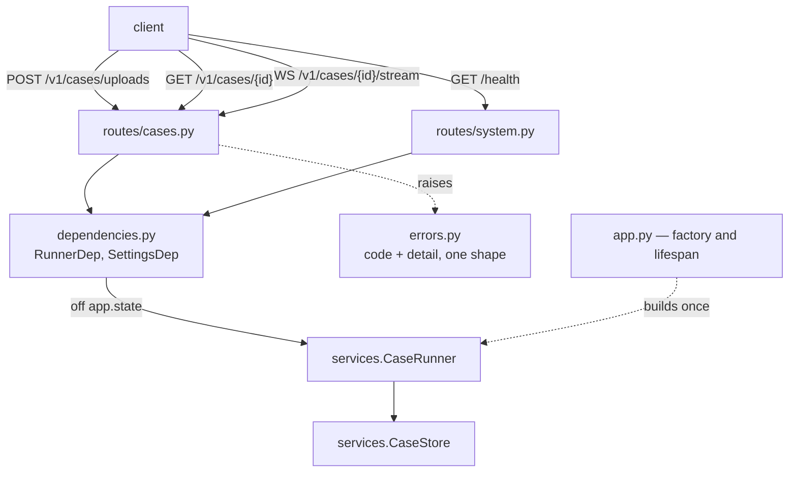
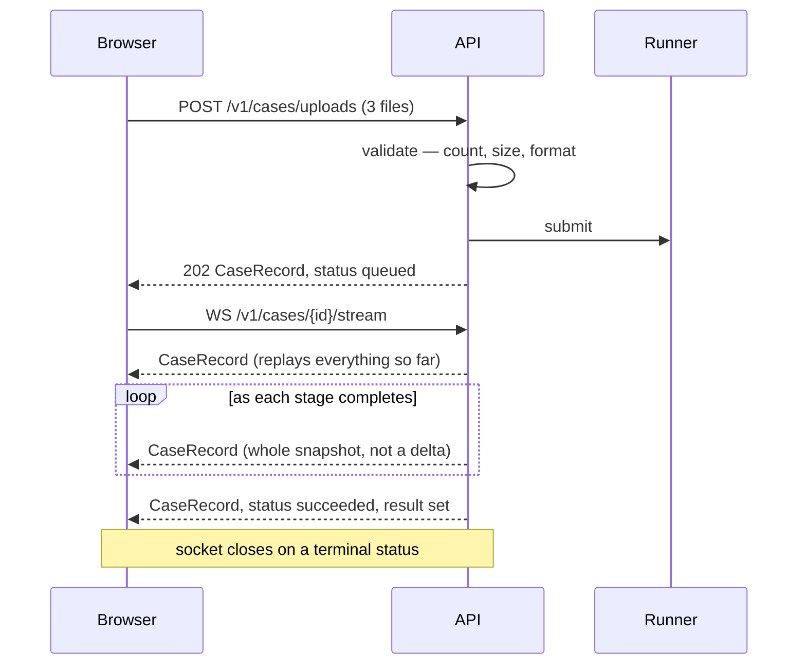
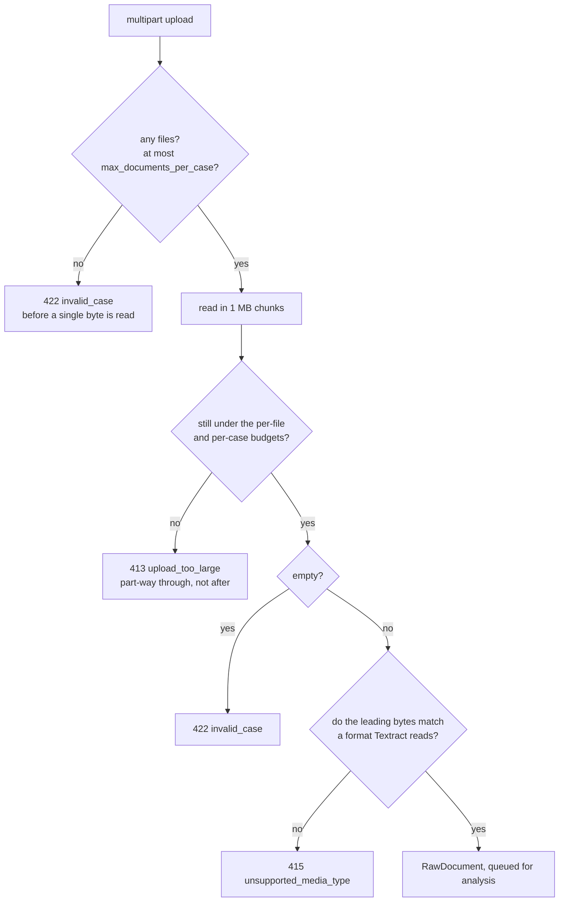
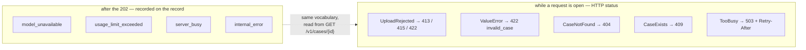
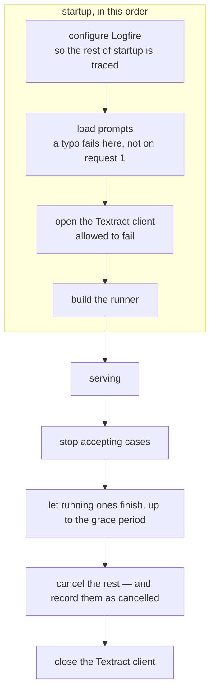

# `api/` — the HTTP layer

Thin, and deliberately so. It parses uploads, hands cases to the runner, and reads
records back out. All the work is in [`services/`](../services/README.md).

Its shape follows from one fact: **analysing a presentation takes minutes**. That is
longer than a browser, a load balancer or a person will hold a connection open, so
submitting a case and collecting its answer are two separate acts.



| | | |
|---|---|---|
| `POST` | `/v1/cases/uploads` | Submit as PDFs or images → `202` |
| `POST` | `/v1/cases` | Submit as already-extracted text → `202` |
| `WS` | `/v1/cases/{id}/stream` | Watch it run |
| `GET` | `/v1/cases/{id}` | Poll it instead |
| `DELETE` | `/v1/cases/{id}` | Abandon a case and drop what it held |
| `GET` | `/health` | Liveness, OCR availability, cases in flight |

**Every one of them answers with the same `CaseRecord`.** There is no `schemas.py`: the
domain models already are the API's answers, and a parallel hierarchy would only be a
second thing to keep in step.



---

## `routes/cases.py`

### Submitting

```python
@router.post(
    '/uploads',
    status_code=status.HTTP_202_ACCEPTED,
    summary='Submit a presentation as uploaded files',
    responses=ERRORS,
)
async def submit_uploads(
    runner: RunnerDep,
    settings: SettingsDep,
    files: Annotated[
        list[UploadFile], File(description='One file per document: PDF, PNG, JPEG or TIFF.')
    ],
    case_id: Annotated[str | None, Form()] = None,
    presented_on: Annotated[date | None, Form()] = None,
) -> CaseRecord:
    """Take a pile of scanned documents and start analysing them.

    Nothing is written to disk or to a bucket — the bytes live in memory until the
    document has been read, then are dropped.
    """
    _check_count(files, settings)

    documents: list[RawDocument] = []
    remaining = settings.max_case_bytes
    for index, upload in enumerate(files, start=1):
        content = await _read_upload(upload, index, settings, budget=remaining)
        remaining -= len(content)
        documents.append(
            RawDocument(
                document_id=f'doc-{index}',
                filename=upload.filename,
                content=content,
            )
        )

    return await runner.submit(
        CaseInput(
            case_id=case_id or new_case_id(),
            presented_on=presented_on,
            documents=documents,
        )
    )
```

`remaining` is the case-wide budget, threaded through the loop so each file is checked
against what is actually left rather than against the per-file limit alone.

### Refusing early

Each check happens at the first moment it becomes knowable:



```python
def _check_count(files: list[UploadFile], settings: Settings) -> None:
    """Refuse an unusable batch before reading a single byte.

    The document limit is enforced in the graph too, but reaching it there means every
    file has already been read into memory first.
    """
    if not files:
        raise UploadRejected(
            'no files were uploaded',
            status_code=status.HTTP_422_UNPROCESSABLE_CONTENT,
            code='invalid_case',
        )
    if len(files) > settings.max_documents_per_case:
        raise UploadRejected(
            f'{len(files)} files were uploaded, above the limit of '
            f'{settings.max_documents_per_case} documents per case',
            status_code=status.HTTP_422_UNPROCESSABLE_CONTENT,
            code='invalid_case',
        )
```

Reading in chunks is what lets the case-wide limit be enforced *while* the bytes arrive:

```python
    label = upload.filename or f'file {index}'
    ceiling = min(settings.max_document_bytes, max(budget, 0))

    chunks: list[bytes] = []
    size = 0
    while chunk := await upload.read(UPLOAD_CHUNK_BYTES):
        size += len(chunk)
        if size > ceiling:
            raise UploadRejected(
                f'{label} is larger than the {ceiling} bytes still available for this case '
                f'(per-file limit {settings.max_document_bytes}, '
                f'per-case limit {settings.max_case_bytes})',
                status_code=status.HTTP_413_CONTENT_TOO_LARGE,
                code='upload_too_large',
            )
        chunks.append(chunk)
```

And the format comes from the bytes, never from the header the browser sent:

```python
    if sniff_media_type(content) is None:
        raise UploadRejected(
            f'{label} is not a document this service can read; accepted types are '
            f'{", ".join(sorted(SUPPORTED_MEDIA_TYPES))}, and the bytes match none of them '
            f'(the browser called it {upload.content_type or "nothing in particular"})',
            status_code=status.HTTP_415_UNSUPPORTED_MEDIA_TYPE,
            code='unsupported_media_type',
        )
```

### Streaming

The whole websocket handler, because there is not much to it:

```python
@router.websocket('/{case_id}/stream')
async def stream_case(case_id: str, websocket: WebSocket, runner: RunnerDep) -> None:
    """Watch a submitted case run.

    Connect with the id the submission returned. Each message is a complete `CaseRecord`
    — the same shape `GET /v1/cases/{case_id}` returns — sent on every change, so there
    is no race between the POST returning and the socket opening, and a reconnect needs
    no cursor. The stream ends when `status` is terminal.
    """
    await websocket.accept()
    try:
        async for record in runner.store.watch(case_id):
            await websocket.send_text(record.model_dump_json())
    except CaseNotFound as exc:
        await websocket.send_json({'code': 'case_not_found', 'detail': str(exc)})
    except WebSocketDisconnect:
        return  # The client went away; nothing to report to.
    finally:
        # The client may already have gone, which closing again would complain about.
        with suppress(RuntimeError):
            await websocket.close()
```

Because re-sending complete state is idempotent, that one decision removes a surprising
amount: no tagged message union to switch on, no event accumulation on the client, no
sequence numbers, and no resume cursor.

### Deleting

```python
async def delete_case(case_id: str, runner: RunnerDep) -> Response:
    """Cancel the analysis if it is still running, then drop the record.

    A record holds the extracted contents of a presentation — counterparty names, bank
    details, amounts — so a caller that has collected its result can have it dropped now
    rather than waiting for the retention window.
    """
    await runner.store.get(case_id)  # 404 rather than a silent success on an unknown id.
    await runner.cancel(case_id)
    await runner.store.forget(case_id)
    return Response(status_code=status.HTTP_204_NO_CONTENT)
```

---

## `errors.py` — a small file, for a reason



Five handlers, because a case is analysed on a background task long after its submission
returned — a model failure has no request left to answer:

```python
def register_error_handlers(app: FastAPI) -> None:
    """Install the mapping on an app.

    Starlette resolves a handler by walking the exception's MRO, so the specific ones win
    over `ValueError` and registration order does not matter.
    """

    async def unknown_case(request: Request, exc: Exception) -> JSONResponse:
        """Unknown id, or one that finished long enough ago to have expired."""
        return _error(status.HTTP_404_NOT_FOUND, 'case_not_found', str(exc))

    async def case_exists(request: Request, exc: Exception) -> JSONResponse:
        """Nothing is malformed; the id just collides. `DELETE` frees it."""
        return _error(status.HTTP_409_CONFLICT, 'case_exists', str(exc))

    async def too_busy(request: Request, exc: Exception) -> JSONResponse:
        """Shed the load rather than accept a case and sit on it."""
        return _error(
            status.HTTP_503_SERVICE_UNAVAILABLE,
            'server_busy',
            f'the detector is at capacity: {exc}',
            **{'Retry-After': str(RETRY_AFTER_SECONDS)},
        )

    app.add_exception_handler(CaseNotFound, unknown_case)
    app.add_exception_handler(CaseExists, case_exists)
    app.add_exception_handler(UploadRejected, upload_rejected)
    app.add_exception_handler(ValueError, invalid_case)
    app.add_exception_handler(TooBusy, too_busy)
```

One error shape for the whole API:

```python
class ErrorResponse(BaseModel):
    """The body of every error this API returns."""

    model_config = ConfigDict(extra='forbid')

    code: str = Field(description="Stable slug, e.g. 'invalid_case'. Switch on this.")
    detail: str = Field(description='What went wrong, in a sentence.')
```

`UploadRejected` is a `ValueError` carrying its own status, so anything that fails to
catch it still becomes a 422 rather than a 500:

```python
class UploadRejected(ValueError):
    """An upload the API will not accept, carrying the status it should leave as.

    A `ValueError`, so anything that fails to catch it still becomes a 422 rather than a
    500 — but with its own status, because 'too big' (413) and 'not a format we read'
    (415) tell a client what to change and a flat 422 does not.
    """

    def __init__(self, detail: str, *, status_code: int, code: str) -> None:
        super().__init__(detail)
        self.status_code = status_code
        self.code = code
```

---

## `dependencies.py` — one dependency

One object leads to the rest: the runner owns the store cases are collected from and the
pipeline they run through.

```python
def get_runner(connection: HTTPConnection) -> CaseRunner:
    """The runner cases are submitted to, or a 503 while the app is still starting.

    `HTTPConnection` is the base of both `Request` and `WebSocket`, so this serves the
    routes and the progress stream alike.
    """
    runner = getattr(connection.app.state, 'runner', None)
    if not isinstance(runner, CaseRunner):  # pragma: no cover - only if the lifespan did not run
        raise HTTPException(
            status_code=status.HTTP_503_SERVICE_UNAVAILABLE,
            detail='the detector is still starting up',
        )
    return runner


RunnerDep = Annotated[CaseRunner, Depends(get_runner)]
SettingsDep = Annotated[Settings, Depends(get_app_settings)]
```

Settings deliberately do **not** come from `get_settings()` — that is the process-wide
singleton read from the environment, and an app built with an explicit `Settings` would
then validate uploads against limits it was never given:

```python
def get_app_settings(connection: HTTPConnection) -> Settings:
    """The settings *this app* was built with."""
    settings = getattr(connection.app.state, 'settings', None)
    return settings if isinstance(settings, Settings) else get_settings()
```

---

## `app.py` — startup and shutdown



```python
@asynccontextmanager
async def lifespan(app: FastAPI) -> AsyncIterator[None]:
    """Build everything the routes need once, and tear it down on the way out.

    The settings come off `app.state`, where `create_app` put them, so an app built with
    an explicit `Settings` really does start up under that configuration.
    """
    settings: Settings = getattr(app.state, 'settings', None) or get_settings()
    configure_observability(settings)
    get_prompts()

    async with AsyncExitStack() as stack:
        pipeline = await _open_pipeline(stack, settings)
        runner = CaseRunner.build(pipeline, CaseStore(settings), settings)
        # Registered before the yield so it runs before the Textract client closes:
        # a case still being read needs the client alive to finish or to fail cleanly.
        stack.push_async_callback(runner.aclose)

        app.state.runner = runner
        yield
```

The callback ordering is the subtle part: `AsyncExitStack` unwinds in reverse, so
registering `runner.aclose` *after* the Textract client means the runner is closed
*first* — and a case still being read still has a live client to finish or fail with.

**OCR is the one part allowed to fail at startup.** A deployment that only ever receives
extracted text has no reason to hold AWS credentials:

```python
async def _open_pipeline(stack: AsyncExitStack, settings: Settings) -> DetectorPipeline:
    """The pipeline, with OCR if this deployment can have it."""
    if not settings.ocr_enabled:
        return DetectorPipeline.default(settings)
    try:
        return await stack.enter_async_context(DetectorPipeline.open(settings))
    except (BotoCoreError, ClientError) as exc:
        with span('textract unavailable, continuing without OCR: {reason}', reason=str(exc)):
            return DetectorPipeline.default(settings)
```

Anything still running when the grace period expires is cancelled and *recorded* as
cancelled, so a caller polling across a deploy is told what happened:

```python
    async def aclose(self, grace: float = SHUTDOWN_GRACE_SECONDS) -> None:
        """Stop accepting cases, let the running ones finish, then cancel the rest."""
        self._closing = True
        if not self._tasks:
            return
        _, unfinished = await asyncio.wait(tuple(self._tasks), timeout=grace)
        for task in unfinished:
            task.cancel()
        if unfinished:
            await asyncio.gather(*unfinished, return_exceptions=True)
```
