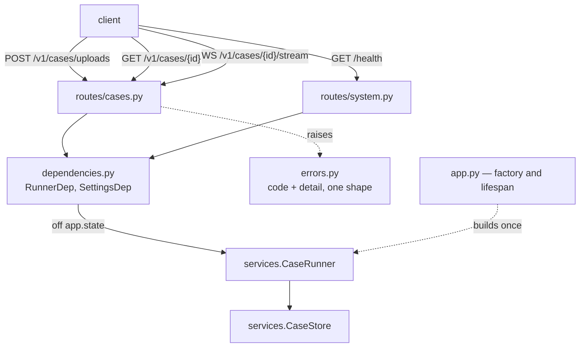
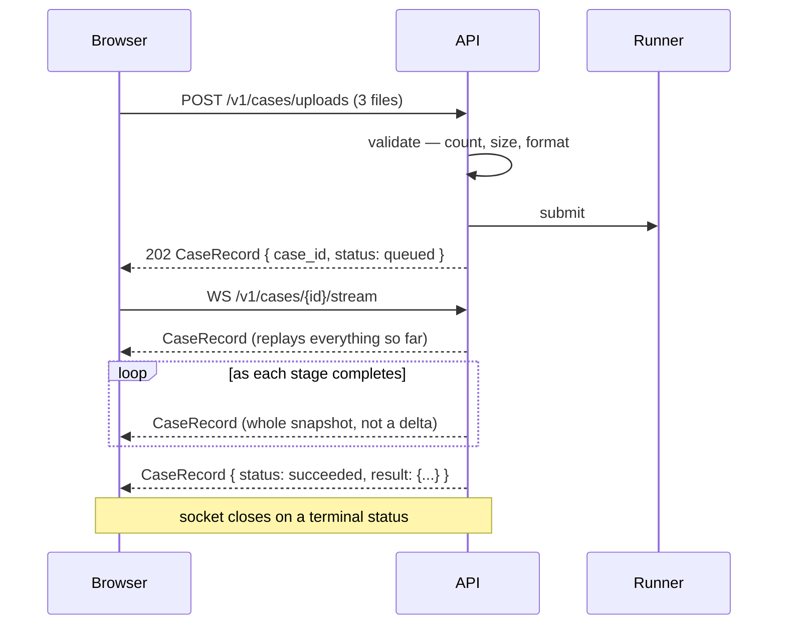
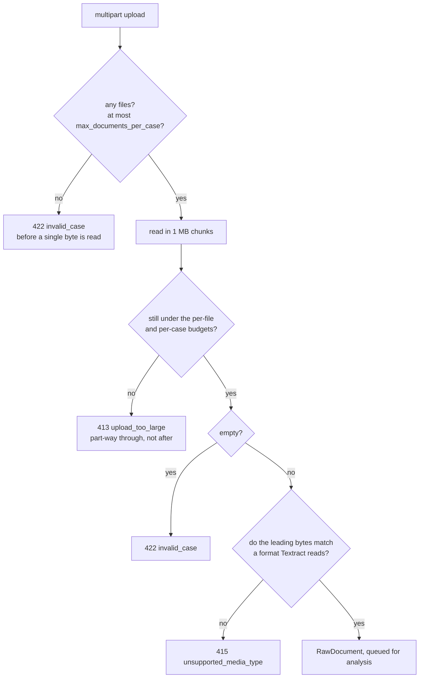
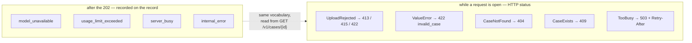
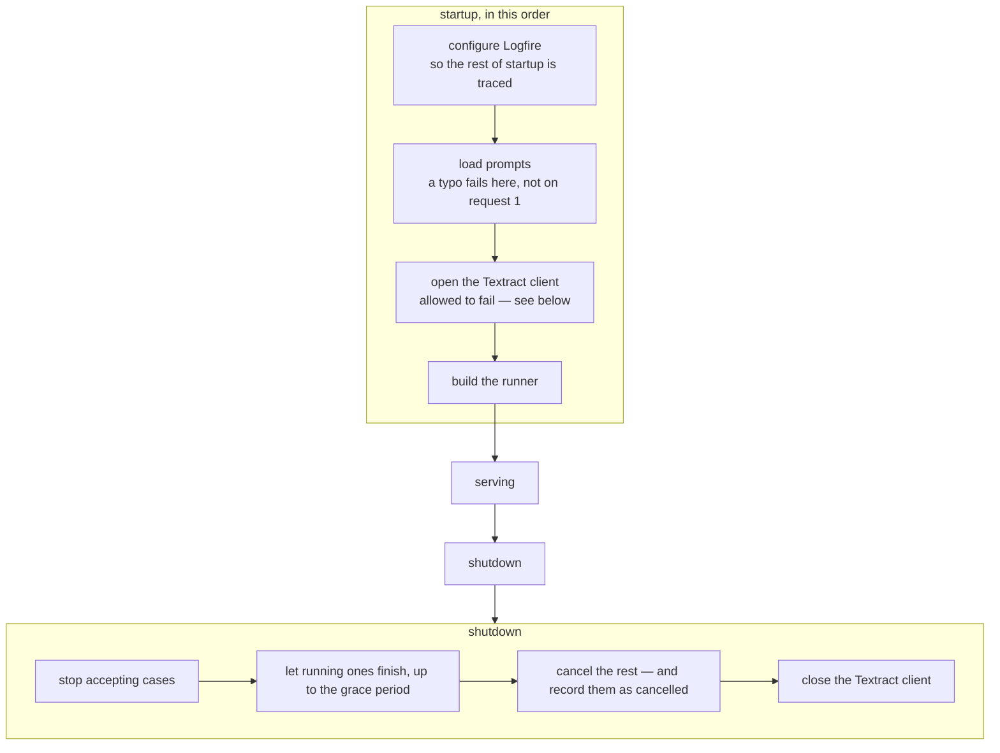

# `api/` — the HTTP layer

Thin, and deliberately so. It parses uploads, hands cases to the runner, and reads
records back out. All the work is in [`services/`](../services/README.md).

Its shape follows from one fact: **analysing a presentation takes minutes**. That is
longer than a browser, a load balancer or a person will hold a connection open, so
submitting a case and collecting its answer are two separate acts.

---

## The endpoints

| | | |
|---|---|---|
| `POST` | `/v1/cases/uploads` | Submit as PDFs or images → `202` |
| `POST` | `/v1/cases` | Submit as already-extracted text → `202` |
| `WS` | `/v1/cases/{id}/stream` | Watch it run |
| `GET` | `/v1/cases/{id}` | Poll it instead |
| `DELETE` | `/v1/cases/{id}` | Abandon a case and drop what it held |
| `GET` | `/health` | Liveness, OCR availability, cases in flight |

**Every one of them answers with the same `CaseRecord`.** There is no `schemas.py`: the
domain models already are the API's answers, and a parallel hierarchy would only be a
second thing to keep in step. The one request shape, `AnalyseRequest`, lives next to the
route that parses it.

### Why the socket sends whole records

Because re-sending complete state is idempotent, and that one decision removes a
surprising amount: no tagged message union to switch on, no event accumulation on the
client, no sequence numbers, and **no resume cursor** — a client that reconnects is
correct with no protocol for catching up. It just renders the newest message.

---

## `routes/cases.py` — refusing early

The upload route refuses what it cannot use *before* spending anything on it. Each check
happens at the first moment it becomes knowable:

Reading in chunks is what lets the case-wide limit be enforced *while* the bytes arrive.
Checking it afterwards would mean accepting a quarter of a gigabyte in full and then
rejecting it — the only version of that check worth having is the one that stops early.

---

## `errors.py` — a small file, for a reason

Every error leaves as `{"code": ..., "detail": ...}` so a client branches on the code
rather than parsing prose.

There are only five handlers because a case is analysed on a background task long after
its submission returned — a model failure or a blown budget has no request left to answer.
The runner records those codes on the record instead. What is left here is only what can
still go wrong while a request is open.

`UploadRejected` is a `ValueError` carrying its own status, so anything that fails to
catch it still becomes a 422 rather than a 500 — but 'too big' and 'wrong format' tell a
client what to change, and a flat 422 does not.

---

## `dependencies.py` — one dependency

One object leads to the rest: the runner owns the store cases are collected from and the
pipeline they run through. It is built once in the lifespan and lives on `app.state`.

`get_app_settings` deliberately does **not** call `get_settings()` directly. That is the
process-wide singleton read from the environment, and an app built with an explicit
`Settings` would then validate uploads against limits it was never given.

---

## `app.py` — startup and shutdown

**OCR is the one part allowed to fail at startup.** A deployment that only ever receives
extracted text has no reason to hold AWS credentials, so a client that cannot be opened
leaves the service running with `ocr_available: false` rather than refusing to start.

**Shutdown is not symmetric with startup, deliberately.** Cases run on background tasks
that outlive the request that submitted them, so the runner is closed *before* the
Textract client — a case still being read needs that client alive to finish or fail
cleanly. Anything still running when the grace period expires is cancelled and
*recorded* as cancelled, so a caller polling across a deploy is told what happened
instead of watching a record that will never change.
