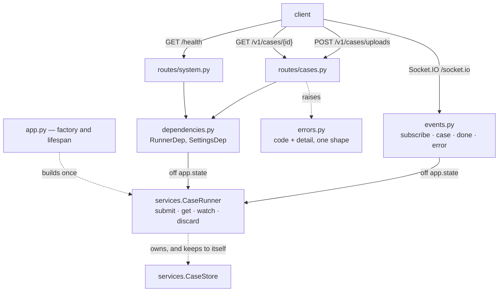
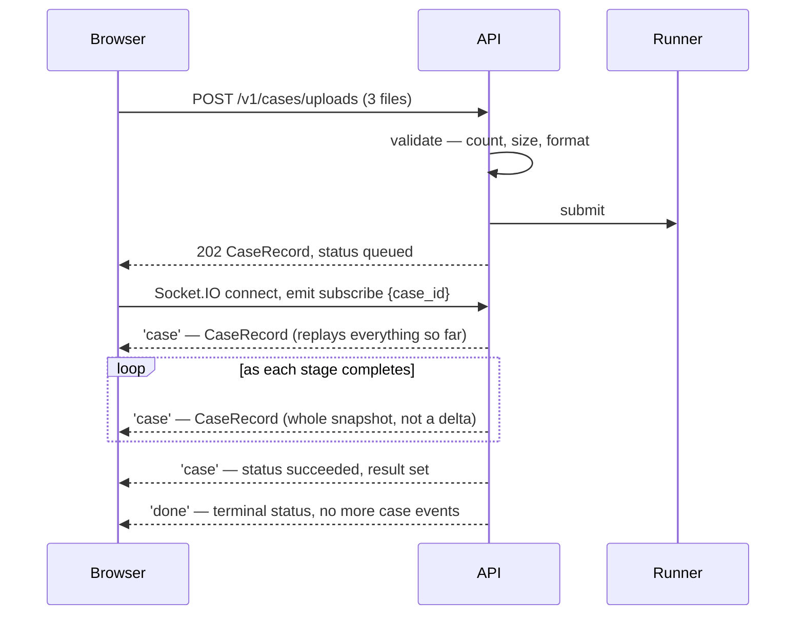
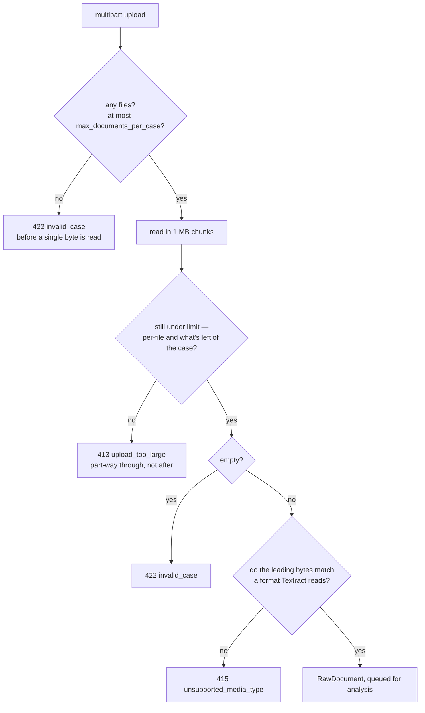
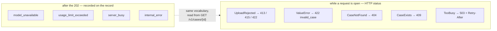
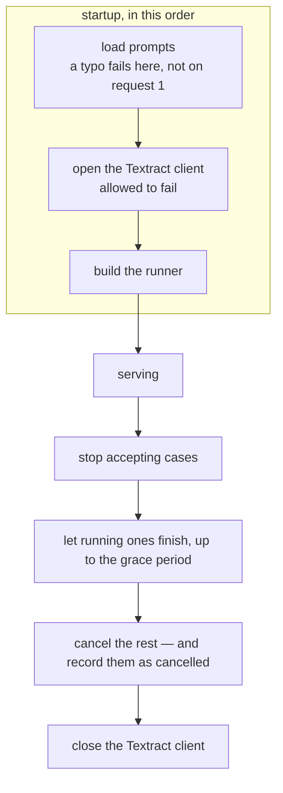

# `api/` — the HTTP layer

Thin, and deliberately so. It parses uploads, hands cases to the runner, and reads
records back out. All the work is in [`services/`](../services/README.md).

Its shape follows from one fact: **analysing a presentation takes minutes**. That is
longer than a browser, a load balancer or a person will hold a connection open, so
submitting a case and collecting its answer are two separate acts.



| | | |
|---|---|---|
| `POST` | `/v1/cases/uploads` | Submit as PDFs or images → `202` |
| `POST` | `/v1/cases` | Submit as already-extracted text → `202` |
| `Socket.IO` | `/socket.io` | Watch it run — emit `subscribe` with the case id |
| `GET` | `/v1/cases/{id}` | Poll it instead |
| `DELETE` | `/v1/cases/{id}` | Abandon a case and drop what it held |
| `GET` | `/health` | Liveness, OCR availability, cases in flight |

**Every one of them answers with the same `CaseRecord`.** There is no `schemas.py`: the
domain models already are the API's answers, and a parallel hierarchy would only be a
second thing to keep in step.



### The five files

| File | What it holds |
|---|---|
| `app.py` | the app factory and the lifespan that builds the runner |
| `dependencies.py` | `RunnerDep` and `SettingsDep`, read off `app.state` |
| `errors.py` | one error shape, and the four handlers that produce it |
| `events.py` | the Socket.IO server: subscribe to a case, get it pushed |
| `routes/` | `cases.py` — submit, poll, delete; `system.py` — `/health` |

---

## `routes/cases.py`

### Submitting

Each route body is short on purpose: check nothing itself, build a `CaseInput`, hand it
to the runner.

```python
@router.post(
    '/uploads',
    status_code=status.HTTP_202_ACCEPTED,
    summary='Submit a presentation as uploaded files',
    responses=ERRORS,
)
async def submit_uploads(
    runner: RunnerDep,
    settings: SettingsDep,
    files: Annotated[
        list[UploadFile], File(description='One file per document: PDF, PNG, JPEG or TIFF.')
    ],
    case_id: Annotated[str | None, Form()] = None,
    presented_on: Annotated[date | None, Form()] = None,
) -> CaseRecord:
    """Take a pile of scanned documents and start analysing them.

    Nothing is written to disk or to a bucket — the bytes live in memory until the
    document has been read, then are dropped.
    """
    documents = await _read_uploads(files, settings)
    return await runner.submit(
        CaseInput(
            case_id=case_id or new_case_id(),
            presented_on=presented_on,
            documents=documents,
        )
    )
```

Reading the files is the one piece of real work in this layer, so it lives in its own
function at the bottom of the module rather than in the route:

```python
async def _read_uploads(files: list[UploadFile], settings: Settings) -> list[RawDocument]:
    """Read every uploaded file into memory, refusing what cannot be used."""
    _check_count(files, settings)

    documents: list[RawDocument] = []
    remaining = settings.max_case_bytes
    for index, upload in enumerate(files, start=1):
        limit = min(settings.max_document_bytes, remaining)
        content = await _read_upload(upload, settings, limit=limit)
        remaining -= len(content)
        documents.append(
            RawDocument(
                document_id=f'doc-{index}',
                filename=upload.filename,
                content=content,
            )
        )
    return documents
```

`remaining` is the case-wide budget threaded through the loop, so each file is measured
against what is actually left rather than against the per-file limit alone. `limit` — the
smaller of the two — is the only number `_read_upload` needs.

### Refusing early

Each check happens at the first moment it becomes knowable:



```python
def _check_count(files: list[UploadFile], settings: Settings) -> None:
    """Refuse an unusable batch before reading a single byte.

    The document limit is enforced in the graph too, but reaching it there means every
    file has already been read into memory first.
    """
    if not files:
        raise UploadRejected('no files were uploaded')
    if len(files) > settings.max_documents_per_case:
        raise UploadRejected(
            f'{len(files)} files were uploaded, above the limit of '
            f'{settings.max_documents_per_case} documents per case'
        )
```

`UploadRejected` defaults to `422 invalid_case`, so the ordinary refusal is one line and
only the two that need a different status say so.

Reading in chunks is what lets the case-wide limit be enforced *while* the bytes arrive:

```python
    name = upload.filename or 'an unnamed file'

    chunks: list[bytes] = []
    size = 0
    while chunk := await upload.read(UPLOAD_CHUNK_BYTES):
        size += len(chunk)
        if size > limit:
            raise UploadRejected(
                f'{name} is larger than the {limit} bytes still available for this case '
                f'(per-file limit {settings.max_document_bytes}, '
                f'per-case limit {settings.max_case_bytes})',
                status_code=status.HTTP_413_CONTENT_TOO_LARGE,
                code='upload_too_large',
            )
        chunks.append(chunk)
```

And the format comes from the bytes, never from the header the browser sent:

```python
    content = b''.join(chunks)
    if not content:
        raise UploadRejected(f'{name} is empty')
    if sniff_media_type(content) is None:
        raise UploadRejected(
            f'{name} is not a document this service can read; accepted types are '
            f'{", ".join(sorted(SUPPORTED_MEDIA_TYPES))}, and the bytes match none of them '
            f'(the browser called it {upload.content_type or "nothing in particular"})',
            status_code=status.HTTP_415_UNSUPPORTED_MEDIA_TYPE,
            code='unsupported_media_type',
        )
    return content
```

### Streaming — `events.py`

Socket.IO rather than a bare WebSocket, so clients get reconnection, acknowledgements and
named events for free. It is a separate ASGI app, mounted rather than routed:

```python
    app.mount(MOUNT_PATH, build_socket_app(app, settings.cors_origins))
```

| Event | Direction | Payload |
|---|---|---|
| `subscribe` | client → server | `{case_id}` — start streaming that case |
| `unsubscribe` | client → server | `{case_id}` — stop; disconnecting also stops it |
| `case` | server → client | the whole `CaseRecord`, on subscribe and after every change |
| `done` | server → client | `{case_id}` — terminal status, no more `case` events |
| `error` | server → client | `{code, detail}` — the same codes the HTTP layer uses |

The pumping itself takes the transport as a parameter, which is what keeps it testable
without a Socket.IO server in the way:

```python
async def stream_case(runner: CaseRunner, case_id: str, emit: Emit) -> None:
    """Push every version of one case's record through `emit`, until it is terminal."""
    try:
        async for record in runner.watch(case_id):
            await emit(CASE, record.model_dump(mode='json'))
        await emit(DONE, {'case_id': case_id})
    except CaseNotFound as exc:
        await emit(ERROR, {'code': 'case_not_found', 'detail': str(exc)})
    except asyncio.CancelledError:
        raise  # The client went away, or the server is shutting down.
    except Exception as exc:  # noqa: BLE001 - a subscription must not kill the connection
        logger.exception('streaming case %s failed', case_id)
        await emit(ERROR, {'code': 'internal_error', 'detail': f'{type(exc).__name__}: {exc}'})
```

Because re-sending complete state is idempotent, that one decision removes a surprising
amount: no tagged message union to switch on, no event accumulation on the client, no
sequence numbers, and no resume cursor.

One task per subscription does the pumping, and a client may hold several at once. They
are tracked per session so a disconnect cancels them, rather than leaving tasks emitting
into a socket nobody is reading:

```python
    @server.event
    async def disconnect(sid: str) -> None:
        """Cancel everything this client was watching."""
        for task in streams.pop(sid, {}).values():
            task.cancel()
```

Two mount details are easy to get wrong, so both carry a comment in the code:
`socketio_path=''` because Starlette strips the prefix before the sub-app sees the
request, and `cors_allowed_origins` because FastAPI's `CORSMiddleware` never sees
requests that land inside a mount.

### Deleting

```python
async def delete_case(case_id: str, runner: RunnerDep) -> Response:
    """Cancel the analysis if it is still running, then drop the record.

    A record holds the extracted contents of a presentation — counterparty names, bank
    details, amounts — so a caller that has collected its result can have it dropped now
    rather than waiting for the retention window.
    """
    await runner.discard(case_id)
    return Response(status_code=status.HTTP_204_NO_CONTENT)
```

`discard` is the runner's, not the route's: stop the case if it is running, then forget
what it held, and raise `CaseNotFound` rather than quietly succeeding on an id that was
never here. **Nothing in `api/` mentions the store** — the runner is the only object this
layer talks to.

---

## `errors.py` — a small file, for a reason



A case is analysed on a background task long after its submission returned, so a model
failure has no request left to answer. That leaves four handlers, each a plain module-level
function of two or three lines:

```python
async def _case_not_found(request: Request, exc: Exception) -> JSONResponse:
    """Unknown id, or one that finished long enough ago to have expired."""
    return _error(status.HTTP_404_NOT_FOUND, 'case_not_found', str(exc))


async def _case_exists(request: Request, exc: Exception) -> JSONResponse:
    """Nothing is malformed; the id just collides. `DELETE` frees it."""
    return _error(status.HTTP_409_CONFLICT, 'case_exists', str(exc))


async def _invalid_case(request: Request, exc: Exception) -> JSONResponse:
    """A presentation the API will not take."""
    return _error(
        getattr(exc, 'status_code', status.HTTP_422_UNPROCESSABLE_CONTENT),
        getattr(exc, 'code', 'invalid_case'),
        str(exc),
    )


async def _too_busy(request: Request, exc: Exception) -> JSONResponse:
    """Shed the load rather than accept a case and sit on it."""
    return _error(
        status.HTTP_503_SERVICE_UNAVAILABLE,
        'server_busy',
        f'the detector is at capacity: {exc}',
        **{'Retry-After': str(RETRY_AFTER_SECONDS)},
    )
```

Registration is then a flat list, and the file reads top to bottom with no nesting:

```python
def register_error_handlers(app: FastAPI) -> None:
    """Install the mapping on an app.

    Starlette resolves a handler by walking the exception's MRO, so the specific ones win
    over `ValueError` and registration order does not matter.
    """
    app.add_exception_handler(CaseNotFound, _case_not_found)
    app.add_exception_handler(CaseExists, _case_exists)
    app.add_exception_handler(UploadRejected, _invalid_case)
    app.add_exception_handler(ValueError, _invalid_case)
    app.add_exception_handler(TooBusy, _too_busy)
```

Five registrations, four handlers: `UploadRejected` **is** a `ValueError`, so the same
handler answers both — it just reads `status_code` and `code` off the exception when they
are there. Listing it anyway says out loud that it is handled here on purpose.

One error shape for the whole API:

```python
class ErrorResponse(BaseModel):
    """The body of every error this API returns."""

    model_config = ConfigDict(extra='forbid')

    code: str = Field(description="Stable slug, e.g. 'invalid_case'. Switch on this.")
    detail: str = Field(description='What went wrong, in a sentence.')
```

`UploadRejected` is a `ValueError` carrying its own status, so anything that fails to
catch it still becomes a 422 rather than a 500 — and the defaults mean most refusals are
`raise UploadRejected('...')` and nothing more:

```python
class UploadRejected(ValueError):
    """An upload the API will not accept, carrying the status it should leave as."""

    def __init__(
        self,
        detail: str,
        *,
        status_code: int = status.HTTP_422_UNPROCESSABLE_CONTENT,
        code: str = 'invalid_case',
    ) -> None:
        super().__init__(detail)
        self.status_code = status_code
        self.code = code
```

---

## `dependencies.py` — two dependencies, one object

One object leads to the rest: the runner owns the store cases are collected from and the
pipeline they run through.

```python
def get_runner(request: Request) -> CaseRunner:
    """The runner cases are submitted to, or a 503 while the app is still starting.

    Only the HTTP routes go through here. The Socket.IO handlers in `api/events.py` read
    the same `app.state.runner` themselves, because they are not FastAPI endpoints and
    have no dependency injection to hang this on.
    """
    runner = getattr(request.app.state, 'runner', None)
    if not isinstance(runner, CaseRunner):  # pragma: no cover - only if the lifespan did not run
        raise HTTPException(
            status_code=status.HTTP_503_SERVICE_UNAVAILABLE,
            detail='the detector is still starting up',
        )
    return runner


RunnerDep = Annotated[CaseRunner, Depends(get_runner)]
SettingsDep = Annotated[Settings, Depends(get_app_settings)]
```

Settings deliberately do **not** come from `get_settings()` — that is the process-wide
singleton read from the environment, and an app built with an explicit `Settings` would
then validate uploads against limits it was never given:

```python
def get_app_settings(request: Request) -> Settings:
    """The settings *this app* was built with."""
    settings = getattr(request.app.state, 'settings', None)
    return settings if isinstance(settings, Settings) else get_settings()
```

---

## `app.py` — startup and shutdown



```python
@asynccontextmanager
async def lifespan(app: FastAPI) -> AsyncIterator[None]:
    """Build everything the routes need once, and tear it down on the way out.

    The settings come off `app.state`, where `create_app` put them, so an app built with
    an explicit `Settings` really does start up under that configuration.
    """
    settings: Settings = getattr(app.state, 'settings', None) or get_settings()
    get_prompts()

    async with AsyncExitStack() as stack:
        pipeline = await _open_pipeline(stack, settings)
        runner = CaseRunner.build(pipeline, settings=settings)
        # The stack unwinds in reverse, so registering this last means the runner closes
        # first: a case still being read keeps a live Textract client to finish or fail
        # with, rather than losing it mid-document.
        stack.push_async_callback(runner.aclose)

        app.state.runner = runner
        yield
```

The callback ordering is the subtle part, which is why it carries the only comment in the
function: `AsyncExitStack` unwinds in reverse, so registering `runner.aclose` *after* the
Textract client means the runner is closed *first*.

**OCR is the one part allowed to fail at startup.** A deployment that only ever receives
extracted text has no reason to hold AWS credentials:

```python
async def _open_pipeline(stack: AsyncExitStack, settings: Settings) -> DetectorPipeline:
    """The pipeline, with OCR if this deployment can have it."""
    if not settings.ocr_enabled:
        return DetectorPipeline.default(settings)
    try:
        return await stack.enter_async_context(DetectorPipeline.open(settings))
    except (BotoCoreError, ClientError) as exc:
        logger.warning('Textract unavailable, continuing without OCR: %s', exc)
        return DetectorPipeline.default(settings)
```

Anything still running when the grace period expires is cancelled and *recorded* as
cancelled, so a caller polling across a deploy is told what happened:

```python
    async def aclose(self, grace: float = SHUTDOWN_GRACE_SECONDS) -> None:
        """Stop accepting cases, let the running ones finish, then cancel the rest."""
        self._closing = True
        if not self._tasks:
            return
        _, unfinished = await asyncio.wait(tuple(self._tasks), timeout=grace)
        for task in unfinished:
            task.cancel()
        if unfinished:
            await asyncio.gather(*unfinished, return_exceptions=True)
```
