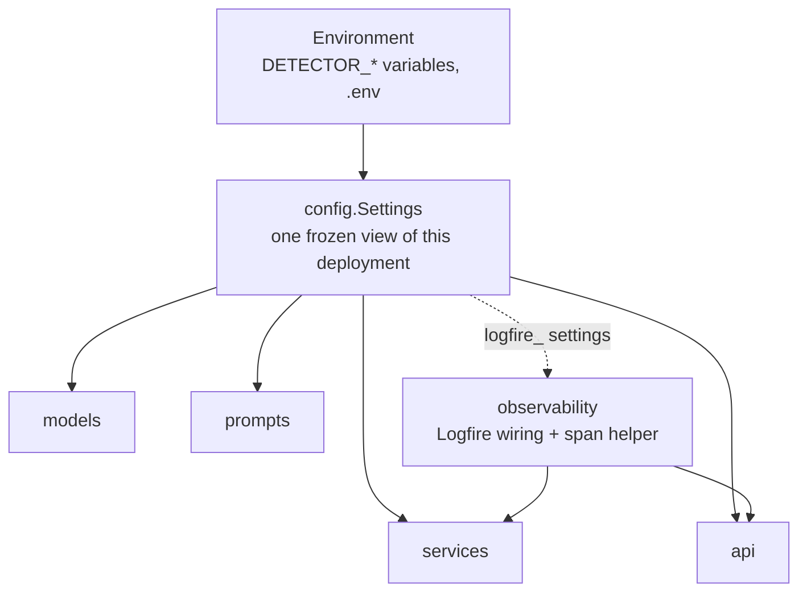
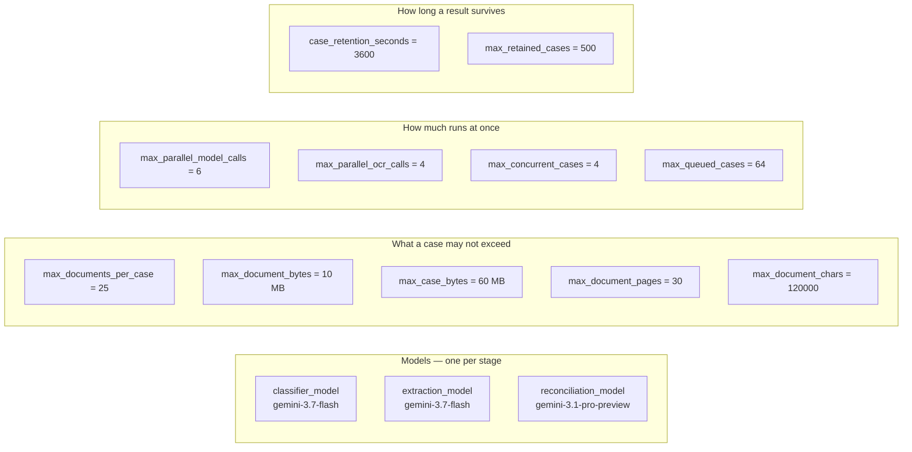
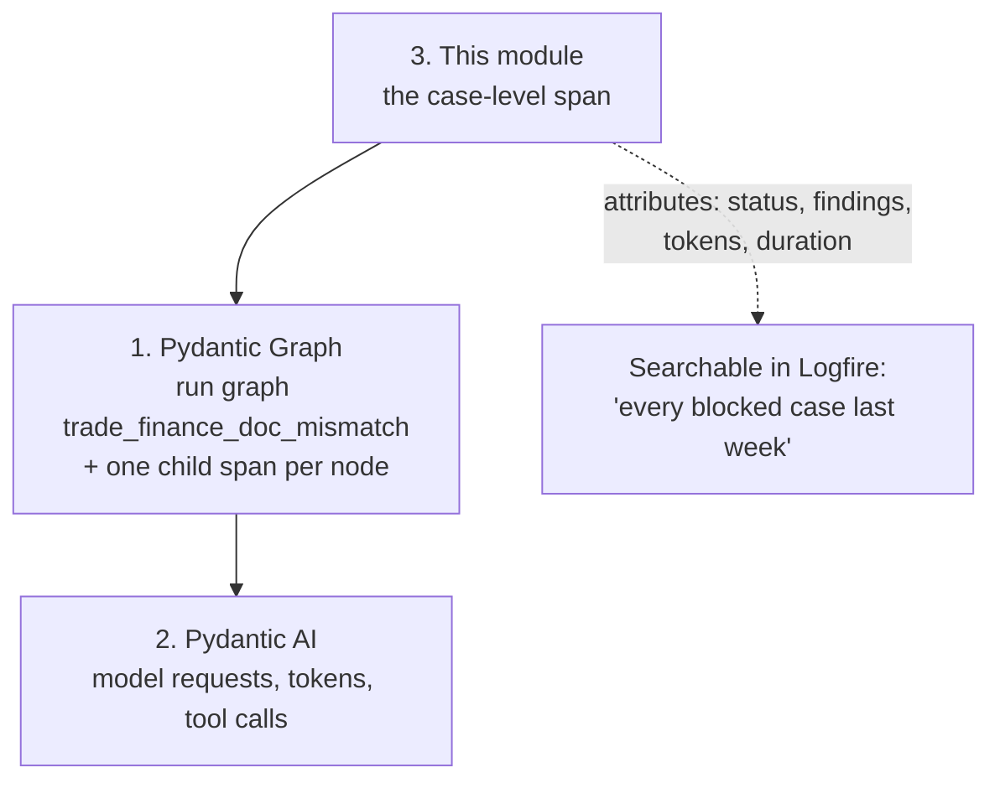

# `core/` — configuration and observability

The two things every other layer needs and neither of them owns: what this deployment is
configured to do, and where its traces go.

Nothing in `core/` imports from `models`, `prompts`, `services` or `api`. It is the
bottom of the dependency graph.



---

## `config.py` — every tunable in one place

`Settings` is a `pydantic-settings` model, so every field is overridable from the
environment with a `DETECTOR_` prefix and `.env` is read automatically:

```python
class Settings(BaseSettings):
    """Model, prompt and budget configuration for the pipeline."""

    model_config = SettingsConfigDict(
        env_prefix='DETECTOR_',
        env_file='.env',
        env_file_encoding='utf-8',
        extra='ignore',
    )
```

```bash
DETECTOR_RECONCILIATION_MODEL=google:gemini-3.1-pro-preview
DETECTOR_MAX_CONCURRENT_CASES=8
DETECTOR_OCR_ENABLED=false
```

### The models, and why the stages differ

```python
FAST_MODEL = 'google:gemini-3.7-flash'
"""Classification and extraction are mechanical: locate the field, copy the value out."""

REASONING_MODEL = 'google:gemini-3.1-pro-preview'
"""Reconciliation is the compliance judgement — the one stage worth the stronger model.

Deciding whether a bank would refuse a presentation is where the reasoning goes; the
stages before it are looking things up. Splitting the two is most of the reason a
twenty-document case is affordable."""
```

Effort and token budget rise the same way, for the same reason:

```python
    classifier_model: str = FAST_MODEL
    extraction_model: str = FAST_MODEL
    reconciliation_model: str = REASONING_MODEL

    classifier_thinking: ThinkingLevel = 'low'
    """Classification is pattern matching; it does not need deep reasoning."""

    extraction_thinking: ThinkingLevel = 'medium'
    """Extraction has to cope with messy OCR text and unlabelled fields."""

    reconciliation_thinking: ThinkingLevel = 'high'
    """The compliance judgement is the part worth spending reasoning on."""

    classifier_max_tokens: int = 2_048
    extraction_max_tokens: int = 16_000
    reconciliation_max_tokens: int = 32_000
```

`ThinkingLevel` is Pydantic AI's **provider-neutral** reasoning control — `'low'`,
`'medium'`, `'high'` translate to whatever the provider takes — so pointing one stage at
a different provider stays valid.

### The settings, grouped by what they govern



### Why there are so many ceilings

They bound different resources and none substitutes for another. The docstrings say what
each one is for — this pair is the one people conflate:

```python
    max_concurrent_cases: int = 4
    """Cases the process will analyse at once.

    A submission returns immediately with a case id and the run continues in the
    background, so without a ceiling a burst of submissions would all start at once and
    contend for the same provider rate limit. The model-call limiter bounds requests;
    this bounds runs, which is what keeps memory (uploaded bytes, per-case state) flat."""

    max_queued_cases: int = 64
    """Submissions that may wait for a slot before new ones are refused with 503.

    Queueing without limit turns an overload into an unbounded backlog where every
    caller waits and none of them are told. This is the point where the service says no."""
```

| Setting | Bounds | Without it |
|---|---|---|
| `max_parallel_model_calls` | requests in flight to the provider | a 20-document case opens 20 connections and collects 429s |
| `max_parallel_ocr_calls` | Textract calls in flight | `ProvisionedThroughputExceededException` instead of text |
| `max_concurrent_cases` | analyses running at once | uploaded bytes and per-case state pile up in memory |
| `max_queued_cases` | submissions waiting | an overload becomes a silent unbounded backlog |
| `max_case_bytes` | one submission's total size | 25 files just under the per-file limit is a quarter of a gigabyte |

The one that is not about resources:

```python
    min_classification_confidence: float = 0.5
    """Below this the document is treated as unclassified rather than sent to an
    extractor that would read it under the wrong schema."""
```

### Reading the settings

```python
@lru_cache(maxsize=1)
def get_settings() -> Settings:
    """The process-wide settings singleton."""
    return Settings()
```

Cached, so the environment is read once. The API also lets you build an app with an
explicit `Settings` — which is what the tests do, and why `api/dependencies.py` reads
settings off `app.state` rather than calling `get_settings()` directly.

---

## `observability.py` — Logfire, and the span helper

Three layers emit spans and only the third needs code here.



Layers 1 and 2 come free — `GraphBuilder(auto_instrument=True)` is the default, and
Pydantic AI instruments itself once asked:

```python
    logfire.configure(
        service_name=settings.logfire_service_name,
        service_version=settings.logfire_service_version,
        environment=settings.logfire_environment,
        send_to_logfire=settings.logfire_send_to_logfire,
        console=logfire.ConsoleOptions() if settings.logfire_console else False,
    )
    logfire.instrument_pydantic_ai(
        include_content=settings.logfire_include_content,
        include_binary_content=False,
    )
```

### The no-op span

`span()` hands back a no-op when Logfire is switched off, so calling code never has to
check whether telemetry is configured:

```python
@contextmanager
def span(name: str, /, **attributes: Any) -> Generator[Span]:
    """Open a span, or hand back a no-op if Logfire is off.

    `name` is a Logfire message template, so `'analyse case {case_id}'` with
    `case_id=...` groups every case under one span name while still showing the
    individual id on each trace.
    """
    if not _configured:
        yield _NoopSpan()
        return
    with logfire.span(name, **attributes) as logfire_span:
        yield logfire_span
```

```python
class _NoopSpan:
    """Stands in for a span when Logfire is switched off.

    Cheaper than a disabled real span, and it keeps `logfire.span()` from
    warning that Logfire was never configured.
    """

    def set_attribute(self, key: str, value: Any) -> None:
        return None

    def set_attributes(self, attributes: Mapping[str, Any]) -> None:
        return None
```

### What the case span carries

`services/pipeline.py` puts the verdict on the span, which is what makes a trace
searchable by business outcome rather than only by latency:

```python
    case_span.set_attributes(
        {
            'case.status': result.status.value,
            'case.critical_findings': result.report.critical_count,
            'case.warning_findings': result.report.warning_count,
            'case.documents_extracted': sum(1 for d in result.documents if d.is_usable),
            'case.documents_failed': sum(1 for d in result.documents if not d.is_usable),
            'case.duration_seconds': result.duration_seconds,
            'case.model_requests': result.usage.requests,
            'case.input_tokens': result.usage.input_tokens,
            'case.output_tokens': result.usage.output_tokens,
            'case.cache_read_tokens': result.usage.cache_read_tokens,
        }
    )
```

### One setting worth reading before you change it

```python
    logfire_include_content: bool = False
    """Whether prompts and completions are attached to spans.

    Off by default on purpose: the prompts here contain the full text of letters
    of credit and invoices, which means counterparty names, bank details and
    amounts. Turn it on deliberately, and only where the telemetry backend is
    inside the same trust boundary as the documents."""
```
