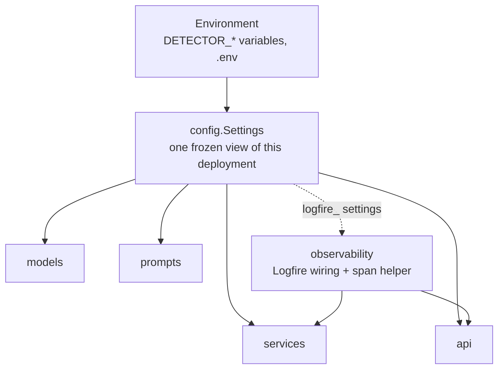
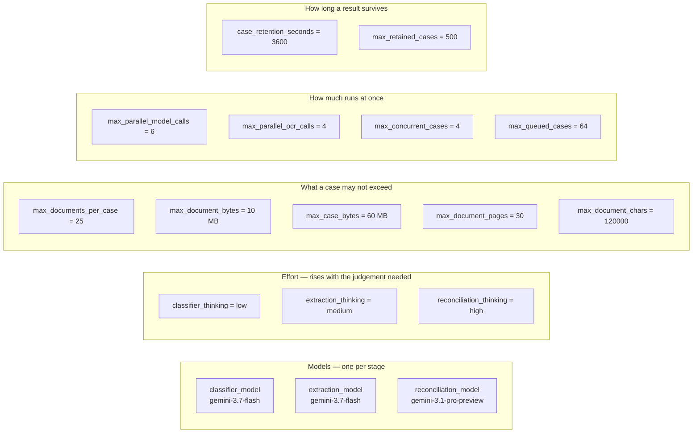
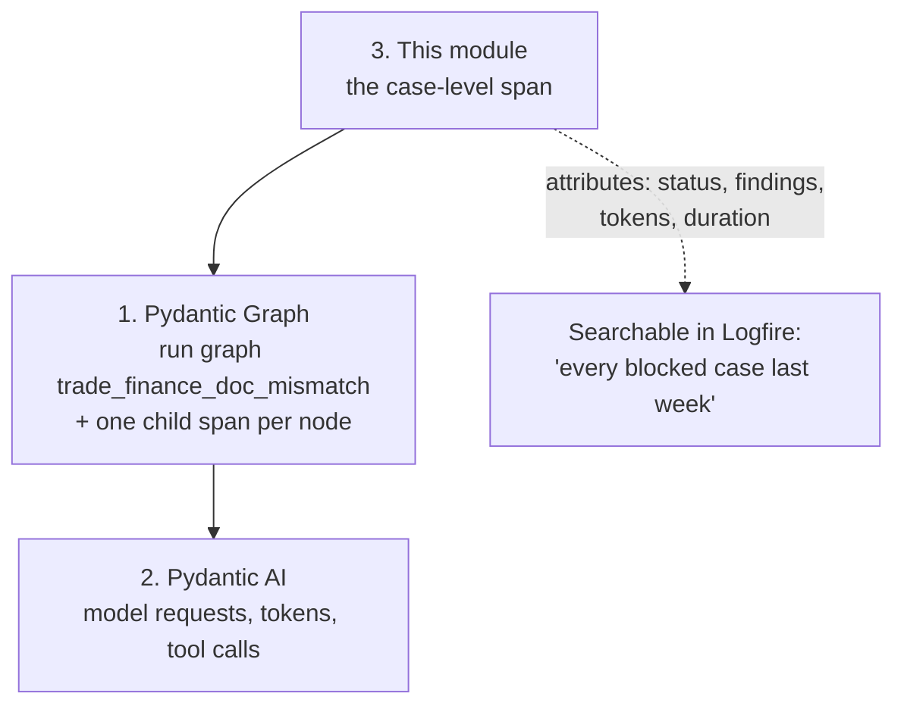

# `core/` — configuration and observability

The two things every other layer needs and neither of which belongs to any of them: what
this deployment is configured to do, and where its traces go.

Nothing in `core/` imports from `models`, `prompts`, `services` or `api`. It is the
bottom of the dependency graph.



---

## `config.py` — every tunable in one place

`Settings` is a `pydantic-settings` model. Every field is overridable from the
environment with a `DETECTOR_` prefix, and `.env` is read automatically:

```bash
DETECTOR_RECONCILIATION_MODEL=google:gemini-3.1-pro-preview
DETECTOR_MAX_CONCURRENT_CASES=8
DETECTOR_OCR_ENABLED=false
```

`get_settings()` is the process-wide singleton, cached with `lru_cache`. The API also
lets you build an app with an explicit `Settings`, which is what the tests do.

### The settings, by what they govern



**Why the stages differ.** Classification and extraction are mechanical — find the
field, copy the value out — so they run on Flash at low and medium effort.
Reconciliation is the actual compliance judgement, the one place where being wrong costs
the beneficiary a refusal, so it runs on Pro at high effort with a 32 000-token budget.
Splitting the two is most of the reason a twenty-document case is affordable.

**Why there are so many ceilings.** They bound different resources and none of them
substitutes for another:

| Setting | Bounds | Without it |
|---|---|---|
| `max_parallel_model_calls` | requests in flight to the provider | a 20-document case opens 20 connections and collects 429s |
| `max_parallel_ocr_calls` | Textract calls in flight | `ProvisionedThroughputExceededException` instead of text |
| `max_concurrent_cases` | analyses running at once | uploaded bytes and per-case state pile up in memory |
| `max_queued_cases` | submissions waiting | an overload becomes a silent unbounded backlog |
| `max_case_bytes` | one submission's total size | 25 files just under the per-file limit is a quarter of a gigabyte |

`min_classification_confidence` (0.5) is the one that is not about resources: below it, a
document is treated as unclassified rather than sent to an extractor that would read it
under the wrong schema and invent fields.

---

## `observability.py` — Logfire, and the span helper

Three layers emit spans and only the third needs code here.



`configure_observability()` is called once at startup, before the first agent run, so
every later span lands in the same trace tree. It is safe to call more than once.

`span()` is a context manager that hands back a no-op when Logfire is switched off, so
calling code never needs to check:

```python
with span('analyse case {case_id}', case_id=case.case_id) as case_span:
    ...
    case_span.set_attributes({'case.status': result.status.value})
```

### One setting worth reading before you change it

`logfire_include_content` is **off by default, deliberately**. The prompts here contain
the full text of letters of credit and invoices — counterparty names, bank details,
amounts. Turn it on only where the telemetry backend sits inside the same trust boundary
as the documents themselves.
