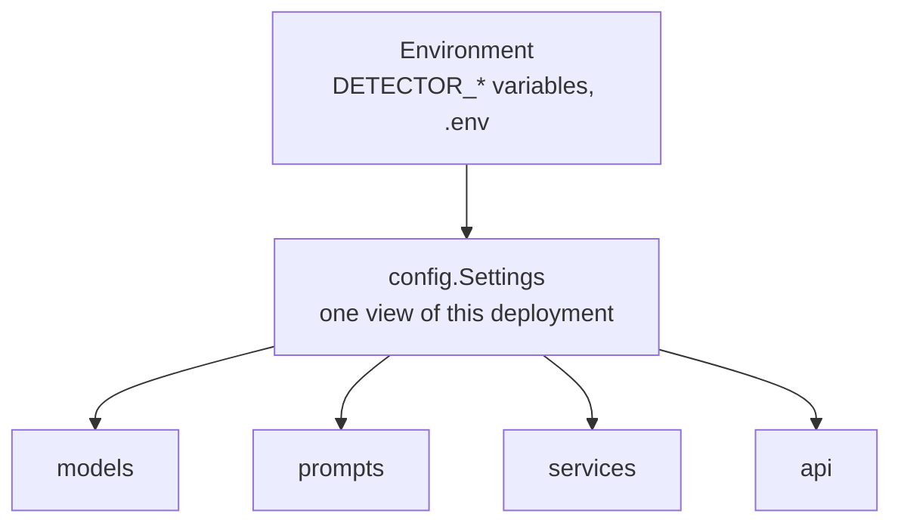
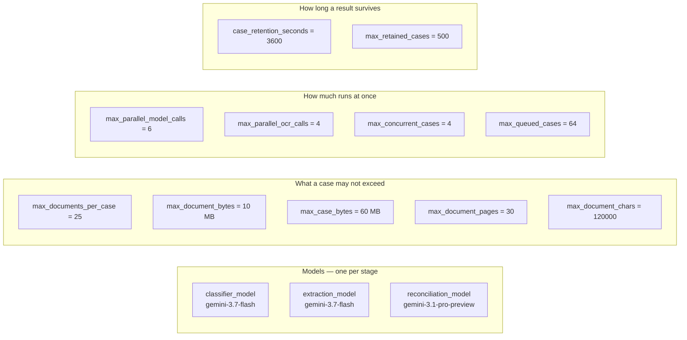

# `core/` — configuration

The one thing every other layer needs and none of them owns: what this deployment is
configured to do.

Nothing in `core/` imports from `models`, `prompts`, `services` or `api`. It is the
bottom of the dependency graph.



One file, one class, one function:

| | |
|---|---|
| `Settings` | every tunable, overridable from the environment |
| `get_settings()` | the process-wide instance, read from the environment once |

There is no telemetry layer. The service uses the standard library's `logging` for the
two things worth saying out loud — Textract being unavailable at startup, and a case task
failing unexpectedly — and nothing else. Anything that wants traces can wrap the ASGI app
from outside.

---

## `config.py` — every tunable in one place

`Settings` is a `pydantic-settings` model, so every field is overridable from the
environment with a `DETECTOR_` prefix, and `.env` is read automatically:

```python
class Settings(BaseSettings):
    """Model, prompt and budget configuration for the pipeline."""

    model_config = SettingsConfigDict(
        env_prefix='DETECTOR_',
        env_file='.env',
        env_file_encoding='utf-8',
        extra='ignore',
    )
```

```bash
DETECTOR_RECONCILIATION_MODEL=google:gemini-3.1-pro-preview
DETECTOR_MAX_CONCURRENT_CASES=8
DETECTOR_OCR_ENABLED=false
```

Credentials are deliberately **not** settings. The Google provider reads `GEMINI_API_KEY`
or `GOOGLE_API_KEY`, and boto3 resolves AWS credentials the usual way — so nothing
secret ever lands in a `Settings` repr or a log line.

The fields are grouped by what they govern, and the groups read top to bottom in the
order a case meets them:

1. **models** — one per stage, and how hard each one thinks
2. **agent runs** — prompts, retries, and the budget for a single run
3. **what one case may not exceed** — documents, characters, bytes, pages
4. **how much runs at once** — the four ceilings, each on a different resource
5. **OCR** — the Textract client
6. **holding a finished case** — how long a result stays collectable
7. **api** — CORS, and optionally serving a frontend

### The models, and why the stages differ

```python
FAST_MODEL = 'google:gemini-3.7-flash'
"""Classification and extraction are mechanical: locate the field, copy the value out."""

REASONING_MODEL = 'google:gemini-3.1-pro-preview'
"""Reconciliation is the compliance judgement — the one stage worth the stronger model."""
```

Deciding whether a bank would refuse a presentation is where the reasoning goes; the
stages before it are looking things up. Splitting the two is most of the reason a
twenty-document case is affordable — and effort and token budget rise the same way, for
the same reason:

```python
    classifier_model: str = FAST_MODEL
    extraction_model: str = FAST_MODEL
    reconciliation_model: str = REASONING_MODEL

    # Reasoning effort rises the same way, and so does room to write.
    classifier_thinking: ThinkingLevel = 'low'
    extraction_thinking: ThinkingLevel = 'medium'
    reconciliation_thinking: ThinkingLevel = 'high'

    classifier_max_tokens: int = 2_048
    extraction_max_tokens: int = 16_000
    reconciliation_max_tokens: int = 32_000
```

| Stage | Why that level |
|---|---|
| `classifier` | pattern matching — "is this a bill of lading?" needs no deep reasoning |
| `extraction` | has to cope with messy OCR text and unlabelled fields |
| `reconciliation` | the compliance judgement, and the part worth spending reasoning on |

`ThinkingLevel` is Pydantic AI's **provider-neutral** reasoning control — `'low'`,
`'medium'`, `'high'` translate to whatever the provider takes — so pointing one stage at
a different provider stays valid.

### The settings, grouped by what they govern



### Why there are so many ceilings

They bound different resources and none substitutes for another. That is the whole
comment above the group:

```python
    # --- how much runs at once ------------------------------------------------
    # Each bounds a different resource and none substitutes for another: requests to the
    # provider, calls to Textract, analyses in flight, submissions waiting for a slot.

    max_parallel_model_calls: int | None = 6  # provider requests in flight; `None` for no limit
    max_queued_model_calls: int | None = None  # calls that may wait for one of those slots
    max_parallel_ocr_calls: int = 4  # Textract is rate limited per account and region
    max_concurrent_cases: int = 4  # analyses at once; bounds memory, where the above bound requests
    max_queued_cases: int = 64  # submissions waiting before new ones are refused with a 503
```

| Setting | Bounds | Without it |
|---|---|---|
| `max_parallel_model_calls` | requests in flight to the provider | a 20-document case opens 20 connections and collects 429s |
| `max_parallel_ocr_calls` | Textract calls in flight | `ProvisionedThroughputExceededException` instead of text |
| `max_concurrent_cases` | analyses running at once | uploaded bytes and per-case state pile up in memory |
| `max_queued_cases` | submissions waiting | an overload becomes a silent unbounded backlog |
| `max_case_bytes` | one submission's total size | 25 files just under the per-file limit is a quarter of a gigabyte |
| `max_retained_cases` | finished cases held | a duration alone bounds nothing under load |

The pair people conflate is `max_parallel_model_calls` and `max_concurrent_cases`. The
first bounds **requests**; the second bounds **runs**, and a run holds uploaded bytes and
per-document state whether or not it is currently waiting on the model. Bounding runs is
what keeps memory flat.

The one limit that is not about resources at all:

```python
    min_classification_confidence: float = 0.5
    """Below this a document is left unclassified rather than read under the wrong schema."""
```

Reading a document under the wrong schema invents fields, and an invented field becomes a
discrepancy that does not exist.

### Reading the settings

```python
@lru_cache(maxsize=1)
def get_settings() -> Settings:
    """The process-wide settings, read from the environment once."""
    return Settings()
```

### Serving the frontend

```python
    frontend_dir: Path | None = None
    """Serve a static frontend from `/`, for a deployment that has no separate web server.

    Unset means the service is API-only. Set it and the page comes from the same origin
    as the API, which is why the shipped frontend needs no CORS configuration at all."""
```

`create_app` mounts it **last**, so the API keeps its paths and the frontend gets
everything else. That one setting is why `docker compose` is a single service.

### Reading the settings

Cached, so the environment is read once. The API also lets you build an app with an
explicit `Settings` — which is what the tests do, and why `api/dependencies.py` reads
settings off `app.state` rather than calling `get_settings()` directly.

