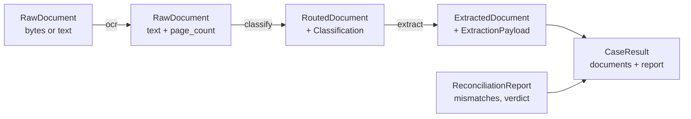
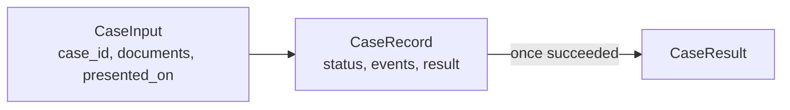
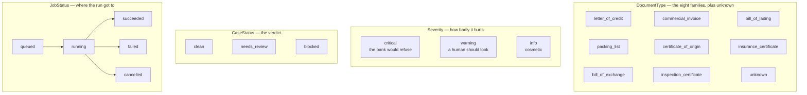
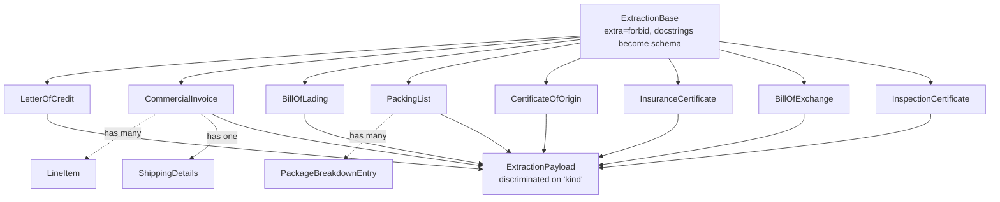
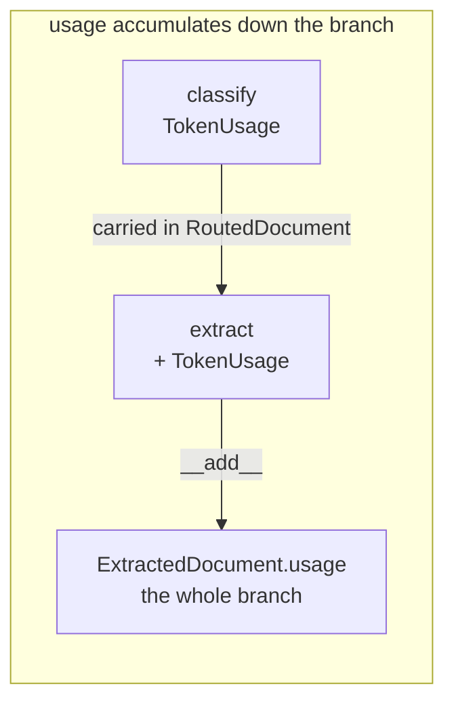
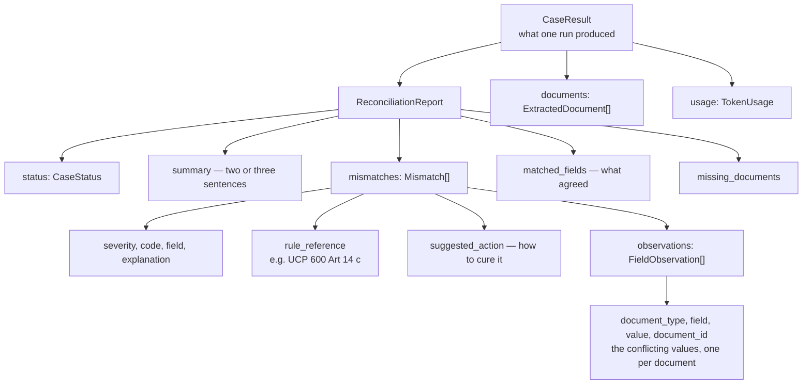
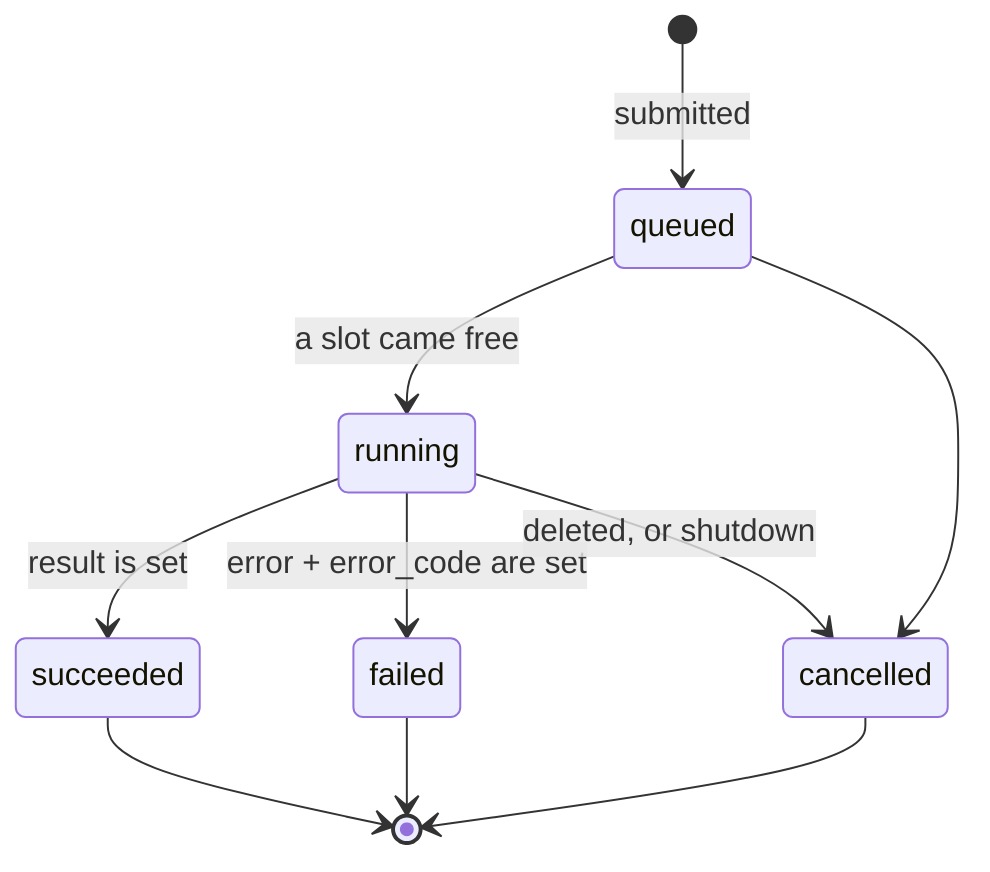

# `models/` — the shapes the pipeline moves through

Pure Pydantic and dataclasses. Nothing here imports Pydantic AI, Pydantic Graph or
FastAPI, which is what lets the same types serve the agents, the graph and the HTTP
responses without any of them leaking into the others.

These are not passive data holders. The extraction payloads **are** the agents'
`output_type`, so every field name and docstring in `extractions.py` is part of the
prompt the model sees.

## The journey of one document

And of one case:

---

## `enums.py` — the four vocabularies

`CaseStatus` and `JobStatus` are deliberately separate. A case can be `succeeded` **and**
`blocked`: the analysis ran to completion, and its answer was that the bank would refuse.

---

## `extractions.py` — one typed payload per family

Eight models, each the `output_type` of its family's agent, all sharing
`extra='forbid'` and `use_attribute_docstrings=True`.

**Every field is optional on purpose.** The extractors are told to leave a field `null`
rather than guess, because a missing field is itself something the reconciliation stage
can reason about — while an invented one becomes a discrepancy that does not exist.

Each payload carries a literal `kind` field, which is the discriminator on the
`ExtractionPayload` union. That is what lets a `CaseResult` round-trip through JSON and
come back as the right type.

`EXTRACTION_PAYLOAD_TYPES` maps `DocumentType → payload class`, and it is the single
table the rest of the system is generated from: the extraction agents, the graph's
extraction steps, and its routing branches all iterate it. **Adding a document family
means adding one entry here and one prompt.**

---

## `documents.py` — documents in flight

| Type | What it is |
|---|---|
| `RawDocument` | one uploaded document: `content` bytes *or* `text`, plus `filename`, `page_count`, `ocr_error` |
| `CaseInput` | the unit of work — every document presented under one credit |
| `Classification` | what the classifier decided: type, confidence, reasoning |
| `RoutedDocument` | a classified document on its way to an extractor |
| `ExtractedDocument` | the output of one document's whole branch |
| `TokenUsage` | a serialisable snapshot of what a stage cost |

Two details that matter:

**`RawDocument.content` is excluded from serialisation.** A presentation is megabytes of
scanned paper, and none of it belongs in an API response, a log line or a stored case
record. The bytes are read once by the OCR step and dropped.

**`CaseInput` rejects duplicate `document_id`s.** Every later stage keys on it — the
audit trail, the per-document result, the observations a finding cites — so two documents
sharing an id would make a finding point at the wrong piece of paper.

---

## `reconciliation.py` — findings and the verdict

A `Mismatch` is written to be actionable by a bank ops examiner: `explanation` says what
disagrees in plain language, `observations` shows the conflicting values side by side,
`rule_reference` cites the article relied on, and `suggested_action` says how to cure it.

---

## `jobs.py` — a submitted case as a record

`CaseRecord` is the **only** shape the API hands back: it is the `202` body, the polling
response, and every websocket message.

`events` is a list of `CaseEvent` — the audit trail, appended as the run produces it.
Because a record is a complete snapshot rather than a delta, a websocket client that
connects late or reconnects simply renders the newest one and is correct.
