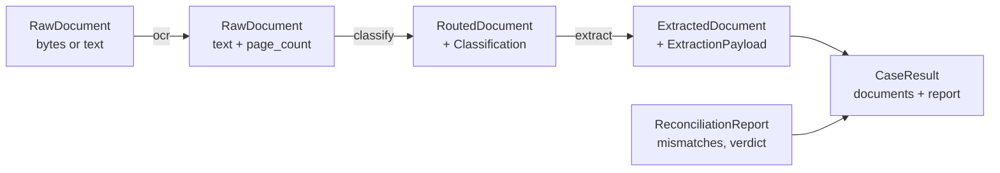
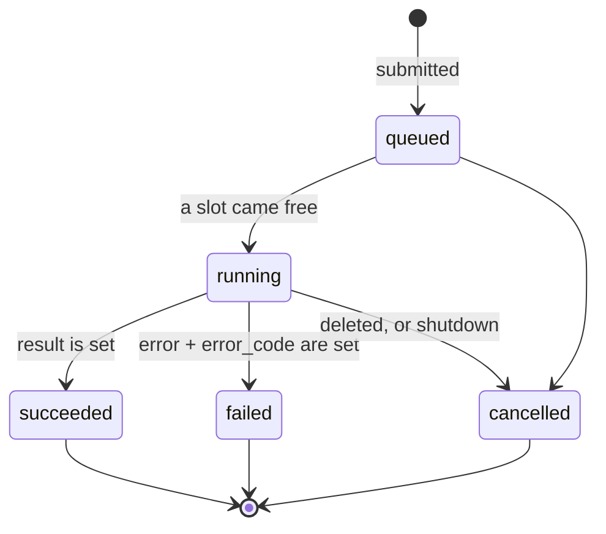
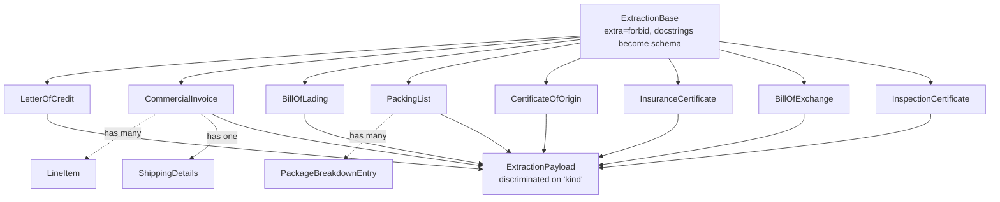
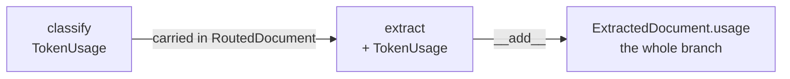
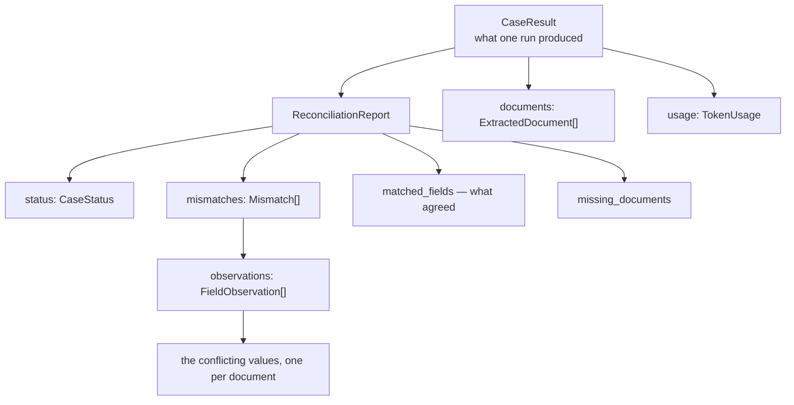

# `models/` — the shapes the pipeline moves through

Pure Pydantic and dataclasses. Nothing here imports Pydantic AI, Pydantic Graph or
FastAPI, which is what lets the same types serve the agents, the graph and the HTTP
responses without any of them leaking into the others.

These are not passive data holders. Several of them **are** an agent's `output_type`,
and those set `use_attribute_docstrings=True`, which means every field name and docstring
in them is part of the prompt the model sees. Editing one of those docstrings changes
model behaviour, so they are the one place in the codebase where prose is code:

| Model | Read by |
|---|---|
| everything in `extractions.py` | the eight extraction agents |
| `Classification` | the classifier agent |
| `ReconciliationReport`, `Mismatch`, `FieldObservation` | the reconciliation agent |
| `CaseRecord` | nothing — but the docstrings become the OpenAPI field descriptions |

Everywhere else the docstrings are for whoever reads the code next, and can be rewritten
freely.

Nothing is re-exported from `models/__init__.py`. Import from the module that defines
what you need — `from Detector.models.documents import CaseInput` — so the name says
where to look.

## The journey of one document



---

## `enums.py` — the four vocabularies

```python
class DocumentType(StrEnum):
    """The trade finance document families the detector understands."""

    LETTER_OF_CREDIT = 'letter_of_credit'
    COMMERCIAL_INVOICE = 'commercial_invoice'
    BILL_OF_LADING = 'bill_of_lading'
    PACKING_LIST = 'packing_list'
    CERTIFICATE_OF_ORIGIN = 'certificate_of_origin'
    INSURANCE_CERTIFICATE = 'insurance_certificate'
    BILL_OF_EXCHANGE = 'bill_of_exchange'
    INSPECTION_CERTIFICATE = 'inspection_certificate'
    UNKNOWN = 'unknown'


class Severity(StrEnum):
    """How badly a discrepancy hurts the presentation."""

    CRITICAL = 'critical'
    """A documentary discrepancy under LC rules: the bank would refuse."""

    WARNING = 'warning'
    """An ambiguity a human examiner should look at."""

    INFO = 'info'
    """A formatting difference or informational observation."""


class CaseStatus(StrEnum):
    """The overall verdict for a presentation."""

    CLEAN = 'clean'
    NEEDS_REVIEW = 'needs_review'
    BLOCKED = 'blocked'
```

`JobStatus` is deliberately separate from `CaseStatus`. A case can be `succeeded` **and**
`blocked`: the analysis ran to completion, and its answer was that the bank would refuse.

```python
class JobStatus(StrEnum):
    """Where a submitted case has got to.

    Distinct from `CaseStatus`, which is the compliance verdict. A case can be
    `succeeded` here and `blocked` there: the analysis ran to completion and its
    answer was that the bank would refuse.
    """

    QUEUED = 'queued'
    RUNNING = 'running'
    SUCCEEDED = 'succeeded'
    FAILED = 'failed'
    CANCELLED = 'cancelled'

    @property
    def is_terminal(self) -> bool:
        """Whether this case will not change state again."""
        return self in {JobStatus.SUCCEEDED, JobStatus.FAILED, JobStatus.CANCELLED}
```



---

## `extractions.py` — one typed payload per family



The base class is where the two decisions live that make these work as prompts:

```python
class ExtractionBase(BaseModel):
    """Shared configuration for every extraction payload."""

    model_config = ConfigDict(extra='forbid', use_attribute_docstrings=True)
```

`use_attribute_docstrings=True` means the docstring under each field becomes its schema
description — so the comment explaining a field *is* the instruction the model reads:

```python
class LetterOfCredit(ExtractionBase):
    """Structured fields of a documentary credit (MT700 style)."""

    kind: Literal[DocumentType.LETTER_OF_CREDIT] = DocumentType.LETTER_OF_CREDIT

    lc_number: str | None = None
    issuing_bank: str | None = None
    beneficiary: str | None = None
    credit_amount: Decimal | None = None
    currency: str | None = None
    expiry_date: date | None = None
    latest_shipment_date: date | None = None
    partial_shipments_allowed: bool | None = None

    presentation_period: str | None = None
    """Presentation period as written, e.g. 'within 21 days after shipment date'."""

    presentation_period_days: int | None = None
    """The presentation period reduced to a number of days, when it is expressed that way."""

    tolerance_percent: Decimal | None = None
    """Amount tolerance stated on the credit, e.g. 5 for 'about'/'+/- 5 pct'."""

    required_insurance_percent: Decimal | None = None
    """Minimum insured percentage the credit demands, e.g. 110."""
```

Note the pairing of `presentation_period` (as written) with `presentation_period_days`
(as a number). The prose is preserved for the examiner; the number is what the
deterministic tools can compute with.

**Every field is optional on purpose:**

> Every field is optional on purpose: the extractors are instructed to leave a
> field `null` rather than guess, and a missing field is itself a finding the
> reconciliation stage can reason about.

Amounts are `Decimal`, never `float` — this is money, and `0.1 + 0.2` is the wrong answer
to give a bank.

### The union, and the table everything is generated from

```python
ExtractionPayload = Annotated[
    LetterOfCredit
    | CommercialInvoice
    | BillOfLading
    | PackingList
    | CertificateOfOrigin
    | InsuranceCertificate
    | BillOfExchange
    | InspectionCertificate,
    Field(discriminator='kind'),
]
"""Any extraction payload, tagged by document type so it round-trips through JSON."""


EXTRACTION_PAYLOAD_TYPES: dict[DocumentType, type[ExtractionBase]] = {
    DocumentType.LETTER_OF_CREDIT: LetterOfCredit,
    DocumentType.COMMERCIAL_INVOICE: CommercialInvoice,
    DocumentType.BILL_OF_LADING: BillOfLading,
    DocumentType.PACKING_LIST: PackingList,
    DocumentType.CERTIFICATE_OF_ORIGIN: CertificateOfOrigin,
    DocumentType.INSURANCE_CERTIFICATE: InsuranceCertificate,
    DocumentType.BILL_OF_EXCHANGE: BillOfExchange,
    DocumentType.INSPECTION_CERTIFICATE: InspectionCertificate,
}
"""Maps a classified document type to the payload the extractor must return."""
```

`EXTRACTION_PAYLOAD_TYPES` is the **single table the rest of the system is generated
from** — the extraction agents, the graph's extraction steps, and its routing branches
all iterate it. Adding a document family means adding one entry here and one prompt.

---

## `documents.py` — documents in flight

Three shapes, one per stage, each carrying forward what the next one needs:

```python
class RawDocument(BaseModel):
    """One uploaded document on its way to the agents."""

    document_id: str
    text: str = ''
    content: bytes | None = Field(default=None, repr=False, exclude=True)
    filename: str | None = None
    page_count: int | None = None
    ocr_error: str | None = None

    @property
    def needs_ocr(self) -> bool:
        """Whether this document still has to be read before a model can see it."""
        return not self.text.strip()
```

Every field here earns its place, and it is worth saying where each one is spent:

| Field | Who fills it | Who reads it |
|---|---|---|
| `document_id` | the API, `doc-1`, `doc-2`… unless the caller brings its own | every stage after — the audit trail keys on it, and so does each finding's observations |
| `text` | the OCR step, or the caller on `POST /v1/cases` | the classifier and the extractor; it is the only evidence a model ever sees |
| `content` | the upload route | the OCR step, then dropped |
| `filename` | the uploader | shown back to the caller; never trusted to say what format the file is |
| `page_count` | the OCR step | the caller — Textract bills per page, so this is what a case cost to read |
| `ocr_error` | the OCR step | the reconciler, which turns an unread document into a finding |

`exclude=True` on `content` is load-bearing: it is what stops megabytes of scanned paper
appearing in an API response or a log line.

### Rejecting duplicate ids

Every later stage keys on `document_id` — the audit trail, the per-document result, the
observations a finding cites — so two documents sharing one would make a finding point at
the wrong piece of paper:

```python
    @model_validator(mode='after')
    def _document_ids_are_unique(self) -> CaseInput:
        counts = Counter(document.document_id for document in self.documents)
        duplicates = sorted(name for name, count in counts.items() if count > 1)
        if duplicates:
            raise ValueError(f'duplicate document ids in case {self.case_id}: {duplicates}')
        return self
```

### The routing envelope

```python
@dataclass(frozen=True, slots=True)
class RoutedDocument:
    """A classified document on its way to an extractor.

    Which extractor is decided by `classification.document_type`; the graph builds one
    branch per family from the same table it builds the extraction steps from, so there
    is nothing here to keep in step with it.
    """

    raw: RawDocument
    classification: Classification
    usage: TokenUsage = field(default_factory=TokenUsage)

    @property
    def document_type(self) -> DocumentType:
        """The family this document was routed to."""
        return self.classification.document_type
```

### Usage accounting

`TokenUsage` is the flattened, storable form of Pydantic AI's live `RunUsage`, and it
adds, so a document's cost accumulates down its whole branch. It carries exactly the four
numbers the case result reports — `RunUsage` also tracks tool calls and cache writes,
which nothing here reads, so they are not copied across:

```python
    def __add__(self, other: TokenUsage) -> TokenUsage:
        """Add two snapshots, so a case can total what its branches each spent."""
        return TokenUsage(
            requests=self.requests + other.requests,
            input_tokens=self.input_tokens + other.input_tokens,
            output_tokens=self.output_tokens + other.output_tokens,
            cache_read_tokens=self.cache_read_tokens + other.cache_read_tokens,
        )
```



---

## `reconciliation.py` — findings and the verdict



A `Mismatch` is written to be actionable by a bank ops examiner, and every field is
described in the terms they would use:

```python
class Mismatch(BaseModel):
    """A single discrepancy between two or more presented documents."""

    model_config = ConfigDict(extra='forbid', use_attribute_docstrings=True)

    code: str
    """Short stable slug for this kind of discrepancy, e.g. 'late_shipment'."""

    severity: Severity
    """critical = the bank would refuse; warning = a human should look; info = cosmetic."""

    field: str
    """The business field in dispute, e.g. 'Beneficiary' or 'Port of Discharge'."""

    explanation: str
    """Plain language a bank ops person would understand: what disagrees and why it matters."""

    documents_involved: list[DocumentType] = Field(default_factory=list)
    observations: list[FieldObservation] = Field(default_factory=list)

    rule_reference: str | None = None
    """The UCP 600 article or ISBP 745 paragraph relied on, when one applies."""

    suggested_action: str | None = None
    """What the beneficiary or the bank would do to cure it."""
```

The counts the graph uses to derive the verdict:

```python
    @property
    def critical_count(self) -> int:
        """How many findings would cause the bank to refuse."""
        return sum(1 for m in self.mismatches if m.severity is Severity.CRITICAL)

    @property
    def warning_count(self) -> int:
        """How many findings need a human examiner."""
        return sum(1 for m in self.mismatches if m.severity is Severity.WARNING)
```

---

## `jobs.py` — a submitted case as a record

`CaseRecord` is the **only** shape the API hands back: the `202` body, the polling
response, and every Socket.IO `case` event.

```python
class CaseRecord(BaseModel):
    """Everything known about one submitted case."""

    model_config = ConfigDict(use_attribute_docstrings=True)

    case_id: str
    status: JobStatus = JobStatus.QUEUED

    document_count: int = 0
    """How many documents were submitted, known before any of them are read."""

    submitted_at: datetime = Field(default_factory=lambda: datetime.now(UTC))
    finished_at: datetime | None = None

    events: list[CaseEvent] = Field(default_factory=list)
    """The audit trail so far, in the order the run produced it."""

    result: CaseResult | None = None
    """The finished report. Present only once `status` is `succeeded`."""

    error: str | None = None
    """Why the run failed. Present only once `status` is `failed`."""

    error_code: str | None = None
    """Stable slug for the failure, so a caller branches on this rather than the text."""

    @property
    def is_terminal(self) -> bool:
        """Whether this case will not change again."""
        return self.status.is_terminal
```

Because a record is a complete snapshot rather than a delta, a subscriber that
connects late or reconnects simply renders the newest one and is correct.
