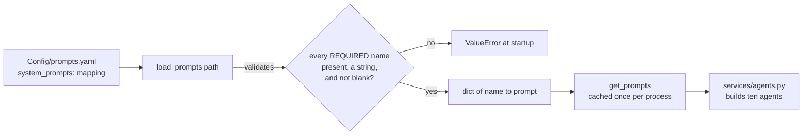
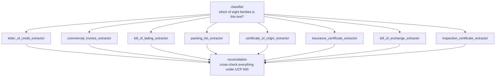

# `prompts/` — loading the system prompts

One module, and a naming rule that keeps it that small.

Prompts live in [`Config/prompts.yaml`](../../Config/prompts.yaml) rather than in Python
so an ops or compliance reviewer can reword a check without touching code or waiting for
a deploy. They are validated on load, so a typo fails at startup rather than on the first
request a customer sends.



---

## The naming rule

Every prompt name is **derivable from the document types**, so there is no table mapping
one naming scheme onto another. That rule is the whole of the module's structure:

```python
CLASSIFIER: Final = 'classifier'
RECONCILIATION: Final = 'reconciliation'


def extractor(document_type: DocumentType) -> str:
    """The prompt name for one document family's extractor."""
    return f'{document_type.value}_extractor'


REQUIRED: Final[frozenset[str]] = frozenset(
    {CLASSIFIER, RECONCILIATION}
    | {extractor(t) for t in DocumentType if t is not DocumentType.UNKNOWN}
)
"""Every prompt the agents need. Anything else in the file is ignored."""
```

`REQUIRED` is computed from the enum, so **adding a document family automatically makes
its prompt mandatory** — the service refuses to start until you have written it.

## Loading and validating

```python
def load_prompts(path: Path) -> dict[str, str]:
    """Read and validate the prompts file.

    Raises:
        FileNotFoundError: no file at `path`.
        ValueError: the file is not shaped like a prompts file, or a required prompt is
            missing or blank.
    """
    try:
        raw = yaml.safe_load(path.read_text(encoding='utf-8'))
    except FileNotFoundError as exc:
        raise FileNotFoundError(f'prompts file not found at {path}') from exc

    prompts = raw.get('system_prompts') if isinstance(raw, dict) else None
    if not isinstance(prompts, dict):
        # ValueError, not TypeError: the file's *contents* are wrong, which is a
        # configuration problem, not a caller passing the wrong kind of argument.
        raise ValueError(f"{path} must contain a 'system_prompts' mapping")

    unusable = sorted(
        name
        for name in REQUIRED
        if not isinstance(prompts.get(name), str) or not prompts[name].strip()
    )
    if unusable:
        raise ValueError(f'{path} is missing or has blank system prompts: {unusable}')

    return {name: prompts[name].strip() for name in REQUIRED}


@lru_cache(maxsize=1)
def get_prompts() -> Mapping[str, str]:
    """The process-wide prompts, loaded from the configured path."""
    return load_prompts(get_settings().prompts_path)
```

One check does the work of three: a name is unusable if it is missing, is not a string,
or is blank — all of which produce the same useless agent, so they get the same error.

## The file itself

```yaml
system_prompts:

  classifier: |
    You classify raw text extracted from an uploaded trade finance document into exactly one of:
    letter_of_credit, commercial_invoice, bill_of_lading, packing_list, certificate_of_origin,
    insurance_certificate, bill_of_exchange, inspection_certificate, or unknown if it doesn't clearly match any of these.
    Base the decision only on the text given. Look for characteristic markers:
      - letter_of_credit: 'Applicant'/'Beneficiary', LC number, issuing bank
      - commercial_invoice: 'Invoice Number', seller/buyer, line-item pricing
      - bill_of_lading: 'Shipper'/'Consignee'/'Vessel', port of loading/discharge
      ...
    If it doesn't clearly match one of these, classify as unknown rather than guessing.

  letter_of_credit_extractor: |
    You extract structured information from a Letter of Credit (LC) document.
    Only use information explicitly found in the text provided. If a field is not present,
    leave it null rather than guessing. Normalize dates to ISO format (YYYY-MM-DD) when possible.
```

The field list in each extractor prompt must agree with the payload model in
[`models/extractions.py`](../models/README.md) — the model's field docstrings are also
part of the schema the agent sees, so **change them together**.

## The ten prompts



## Using it

```python
from Detector.prompts import registry
from Detector.prompts.registry import get_prompts

prompts = get_prompts()
prompts[registry.CLASSIFIER]
prompts[registry.extractor(DocumentType.BILL_OF_LADING)]
prompts[registry.RECONCILIATION]
```

Which is exactly how `services/agents.py` reads them:

```python
    classifier = Agent(
        settings.classifier_model,
        name='document_classifier',
        output_type=Classification,
        instructions=prompts[registry.CLASSIFIER],
        ...
    )
```

`get_prompts()` is cached for the life of the process; `load_prompts(path)` is the
uncached version, for tests and for validating an alternative file. The path comes from
`Settings.prompts_path`, overridable with `DETECTOR_PROMPTS_PATH=/some/other.yaml`.
