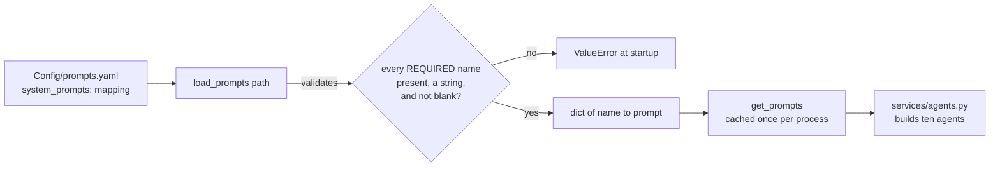
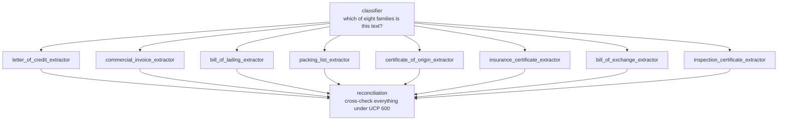

# `prompts/` — loading the system prompts

One module, three public names, and a rule that keeps it that small.

Prompts live in [`Config/prompts.yaml`](../../Config/prompts.yaml) rather than in Python
so an ops or compliance reviewer can reword a check without touching code or waiting for
a deploy. They are validated on load, so a typo fails at startup rather than on the first
request a customer sends.



---

## The naming rule

Every prompt name is **derivable from the document types**, so there is no table here
mapping one naming scheme onto another:

```
classifier
reconciliation
<document_type>_extractor      e.g. letter_of_credit_extractor
```

That is the whole of the module's structure:

```python
CLASSIFIER = 'classifier'
RECONCILIATION = 'reconciliation'

def extractor(document_type: DocumentType) -> str:
    return f'{document_type.value}_extractor'

REQUIRED = {CLASSIFIER, RECONCILIATION} | {extractor(t) for t in DocumentType if t is not UNKNOWN}
```

`REQUIRED` is computed from the enum, so **adding a document family automatically makes
its prompt mandatory** — the service refuses to start until you have written it. Anything
else in the YAML file is ignored.

## What the ten prompts are for



Each extractor prompt describes the fields of one document family and instructs the model
to leave a field `null` rather than guess. The field list itself comes from the payload
model in [`models/extractions.py`](../models/README.md) — the prompt and the schema must
agree, so change them together.

## Using it

```python
from Detector.prompts import registry, get_prompts

prompts = get_prompts()
prompts[registry.CLASSIFIER]
prompts[registry.extractor(DocumentType.BILL_OF_LADING)]
prompts[registry.RECONCILIATION]
```

`get_prompts()` is cached for the life of the process. `load_prompts(path)` is the
uncached version, for tests and for validating an alternative file.

The path comes from `Settings.prompts_path`, overridable with
`DETECTOR_PROMPTS_PATH=/some/other/prompts.yaml`.
