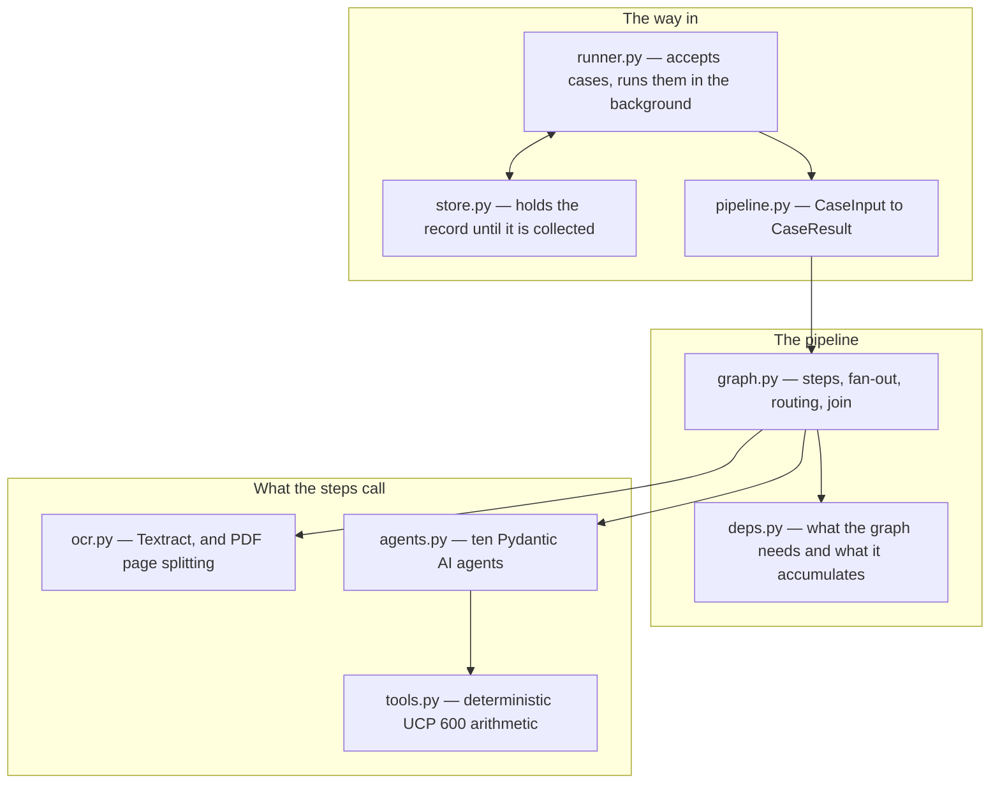
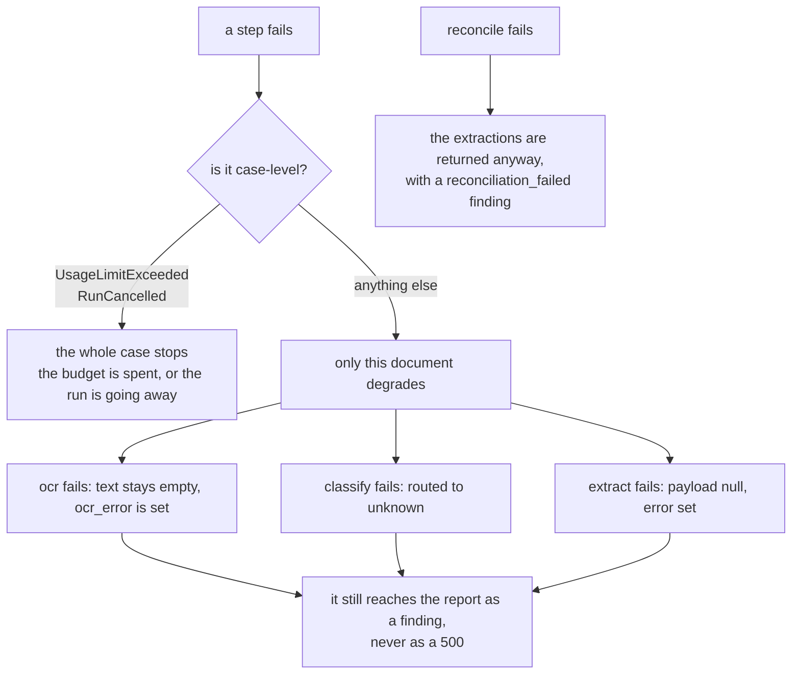
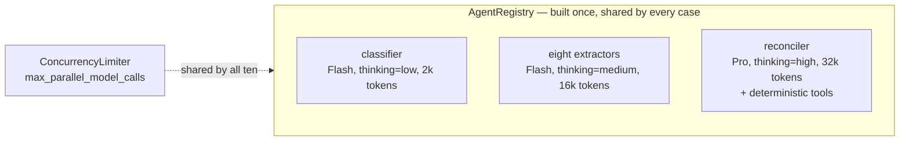
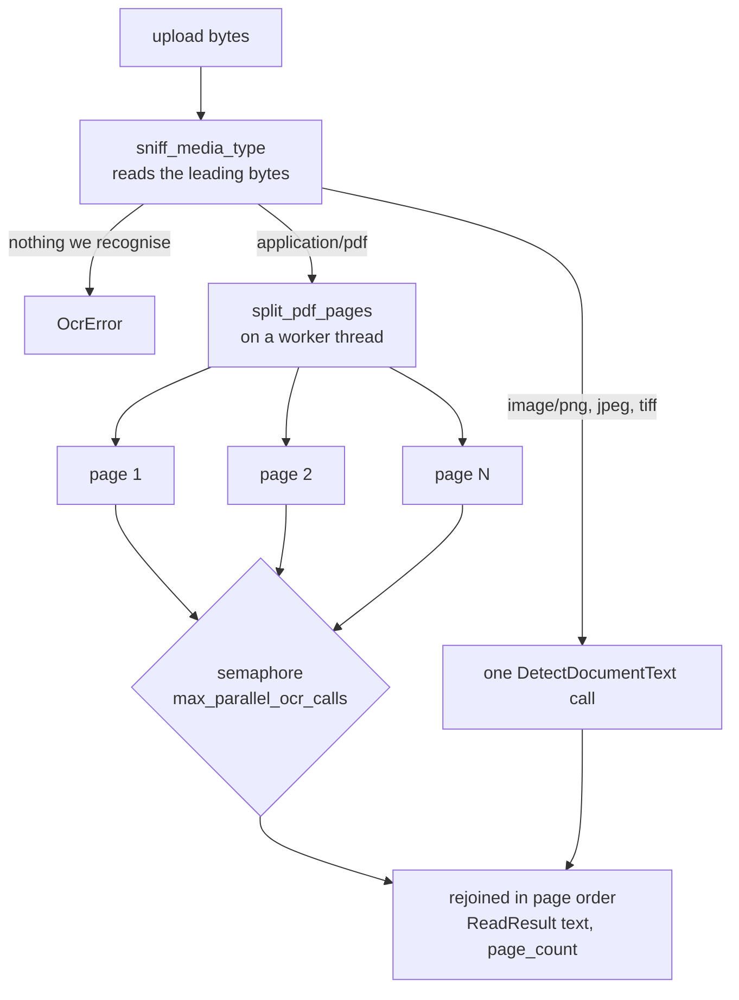
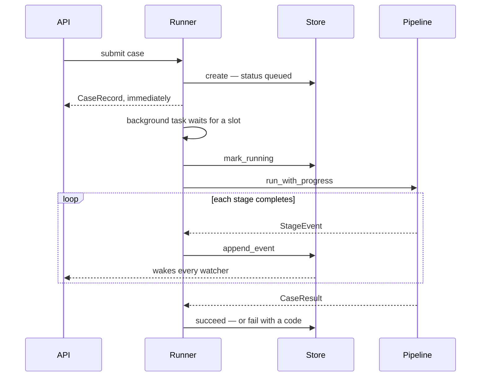

# `services/` — the engine

Everything that actually does the work. Hand `DetectorPipeline` a `CaseInput`, get a
`CaseResult` back, with no HTTP anywhere in sight — which is why the same code serves the
API, the notebook and a test.



---

## `graph.py` — the pipeline itself

A Pydantic Graph. The shape below is **generated from the wiring**, not drawn by hand,
so it cannot drift from what actually runs — `render_mermaid()` produces it:


**The fan-out is the point.** `ingest` hands the documents to a `map` fork, so a
twelve-document presentation runs twelve `ocr → classify → extract` branches
concurrently, not one after another. The `collect` join waits for all of them and hands
`reconcile` the complete set. A twelve-document case therefore costs roughly the latency
of its slowest single document, plus one reconciliation.

### The routing table is generated

Both the extraction steps and the branches that feed them are built by walking
`EXTRACTION_PAYLOAD_TYPES`:

```python
EXTRACTION_STEPS = {dt: _extraction_step(dt) for dt in EXTRACTION_PAYLOAD_TYPES}

for document_type, step in EXTRACTION_STEPS.items():
    decision = decision.branch(builder.match(RoutedDocument, matches=_is_type(document_type)).to(step))
```

So a new document family needs one entry in that table and one prompt; its step, its
route and its instrumentation span all appear on their own. There is no list of branches
to forget to update.

### Degrading instead of failing

This is the rule the whole graph is built around, and each of these was once a bug:



The last one matters commercially: by the time reconciliation runs, every document has
already been read, classified and extracted. Letting that failure escape would throw away
work you have already paid for.

### The rule that overrides the model

`_finalise_report` derives the verdict from the findings rather than trusting what the
model wrote in `status`: any critical finding means `blocked`, any warning means
`needs_review`. Mapping severities to a verdict is a rule, not a judgement, so the rule
wins. It also appends a `document_not_extracted` warning when any presented document
could not be read — so an unreadable scan can never be reported as `clean`.

---

## `agents.py` — ten agents, three tiers



Eight separate extraction agents rather than one with a dynamic output type, because each
family needs its own system prompt, and because a per-family agent gives per-family spans
and per-family retry budgets.

The agents hold no per-case state, so one registry serves every concurrent run. They
share **one** concurrency limiter, because they all draw on the same provider rate limit.

---

## `tools.py` — the arithmetic the model does not do

Date arithmetic and tolerance maths are exactly the parts of documentary compliance a
language model gets subtly wrong, and exactly the parts where being wrong costs the
beneficiary a refusal. Four pure functions, registered on the reconciler:

| Tool | Question | Rule |
|---|---|---|
| `check_amount_tolerance` | is the invoice within the credit? | UCP 600 Art 30(a) — tolerance only if the credit states one |
| `check_insurance_coverage` | is the cover adequate? | UCP 600 Art 28(f)(ii) — 110% of CIF/CIP if the credit is silent |
| `check_date_order` | did shipment beat the deadline? | reports the gap in days, either way |
| `check_presentation_period` | was it presented in time? | UCP 600 Art 14(c) — 21 days after shipment, or expiry, whichever is earlier |

Each returns a verdict with a `detail` line stating the computed numbers, which the
prompt tells the agent to quote in its finding. Same inputs, same answer, no model
involved.

---

## `ocr.py` — reading a scan

Textract's synchronous `DetectDocumentText` takes **one page** and 10 MB per call. A
presentation is not single pages — a letter of credit runs to three or four — so a PDF is
split here and rejoined in page order:



**The bytes decide what a file is**, not the `Content-Type` — that is whatever the
uploader's operating system guessed from the extension, and is routinely
`application/octet-stream`. So a mislabelled PDF is read correctly and a renamed
executable is refused.

One page failing fails that document. Half a letter of credit read as though it were the
whole thing is worse than none, because the missing half becomes a confident finding
about a field that was never read.

The alternative, `StartDocumentTextDetection`, reads a whole PDF but only from an S3
bucket — which means a bucket, a lifecycle policy, and a place where the documents come
to rest. Splitting keeps the bytes in memory and the deployment to one service.

---

## `deps.py` — what the graph needs, and what it accumulates

`DetectorDeps` is immutable and handed to every step: the agent registry, the settings,
the usage limits, and the Textract client. `CaseState` is what one run accumulates —
its start time, its running `RunUsage` total, and the ordered list of `StageEvent`s that
becomes the audit trail.

The fan-out runs as concurrent tasks on a single event loop and the state mutations
contain no `await`, so they are atomic with respect to each other and need no lock.

---

## `pipeline.py` — the facade

```python
async with DetectorPipeline.open() as pipeline:   # holds one Textract client open
    result = await pipeline.run(case_input)
```

Two ways in, and the difference is OCR. `get_pipeline()` is the cheap process-wide one
for presentations that already carry their text. `open()` additionally holds a Textract
client open for the life of the block — a client per document would pay TLS setup on
every page.

`run_with_progress(case, on_event)` is the streaming variant: `on_event` fires as each
stage completes rather than only at the end. **Events arrive in completion order, not
document order**, because the documents are processed in parallel — key a UI on
`document_id`, not on arrival position.

---

## `store.py` and `runner.py` — turning a long job into a fast response

A presentation takes minutes to analyse, which is longer than a browser or a load
balancer will hold a connection open. So submitting and collecting are separate acts.



**The runner** holds two ceilings that answer different questions. `max_concurrent`
bounds analyses running at once — the model limiter bounds *requests*, but a running case
also holds uploaded bytes and per-document state in memory. `max_queued` bounds
submissions waiting, so an overload is refused at the door rather than becoming a backlog
in which everyone waits and nobody is told.

Failures are recorded on the record, not raised — there is no request left to answer by
then — using the same codes the HTTP layer would have returned.

**The store** solves two problems that both come from the caller not being connected when
the interesting things happen:

- *Late subscribers.* A browser POSTs the files, gets an id, and only then opens the
  websocket. Every record is a complete snapshot, so a watcher gets the current one
  immediately — connecting late loses nothing, and neither does reconnecting.
- *Several watchers.* Waking them replaces an `asyncio.Event` rather than setting and
  clearing one. With a single shared event, whichever watcher woke first would clear it
  and the rest would sleep through the update.

It is bounded twice, because neither bound alone is enough: a retention window, since a
record holds a whole presentation's extracted contents, and a case ceiling, since a
duration bounds nothing under load. Running cases are never evicted.
