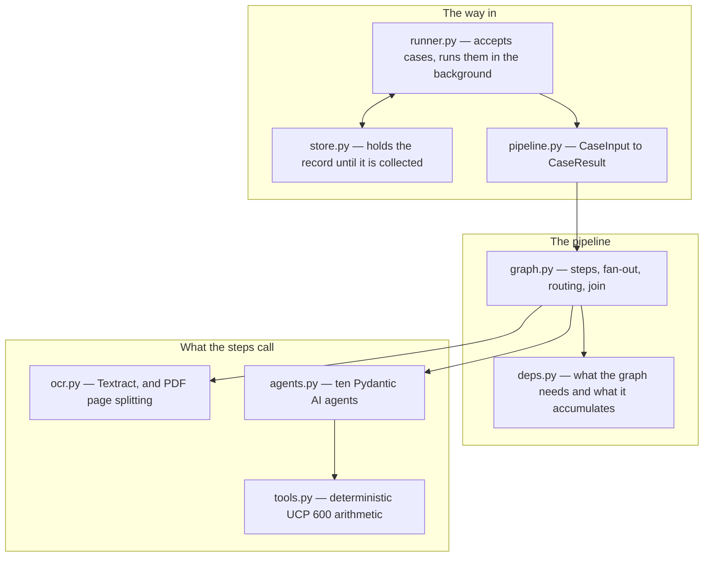
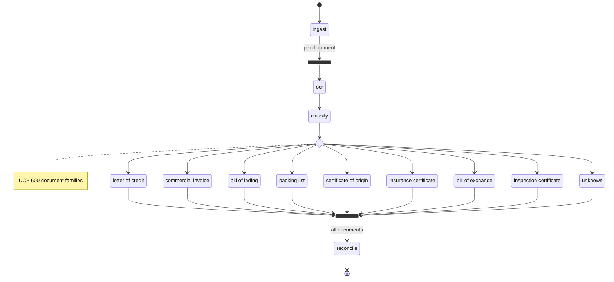
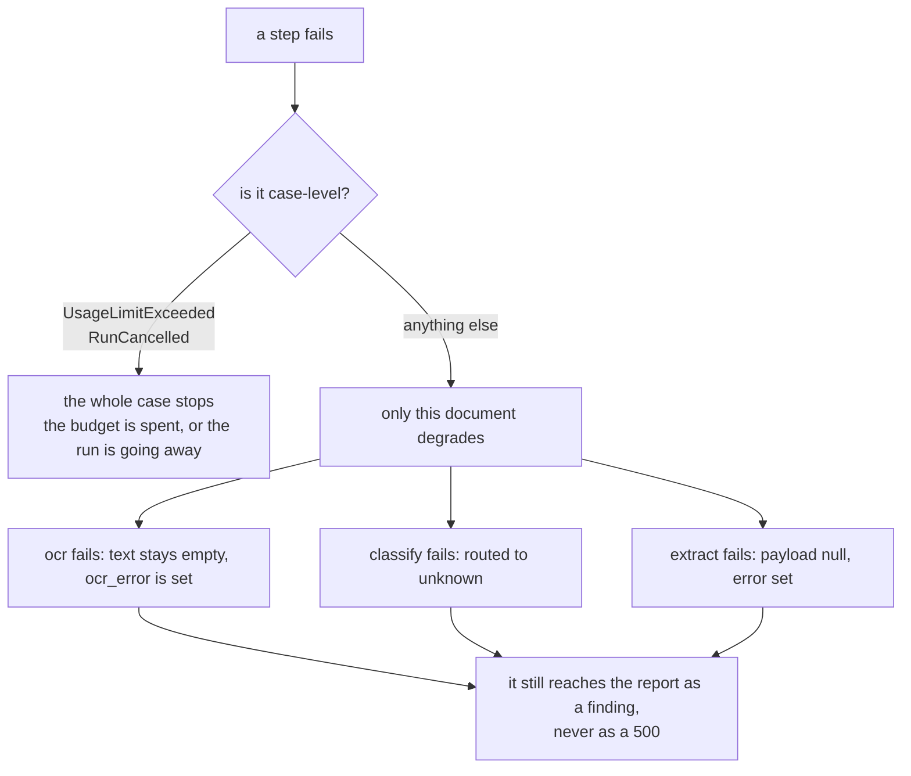
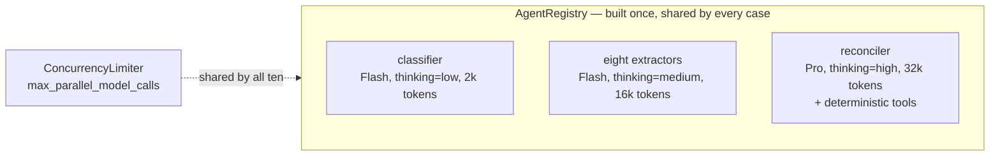
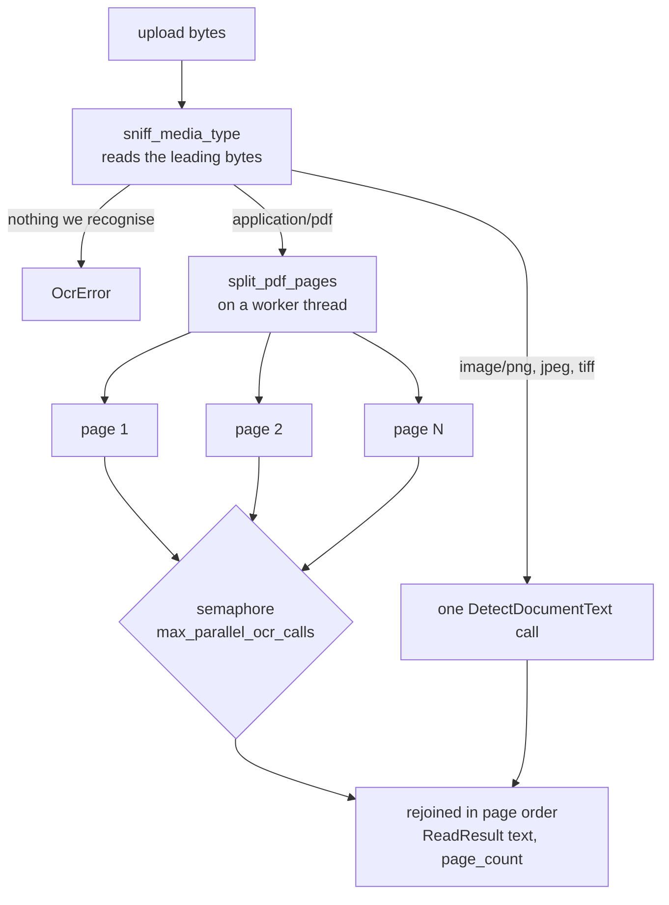
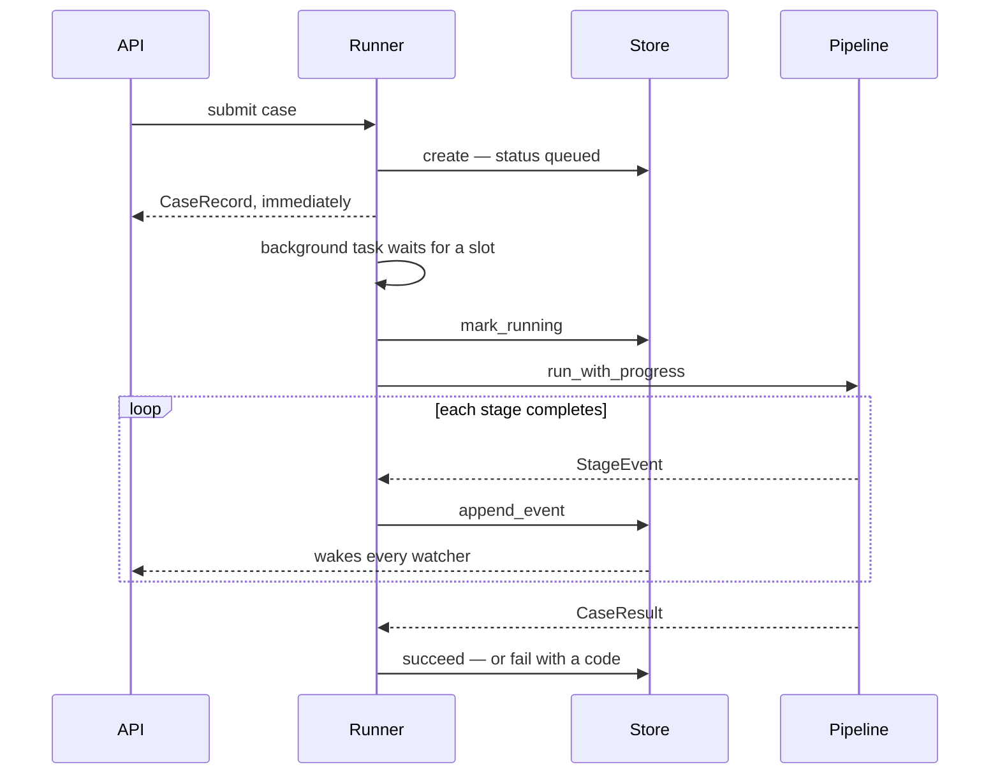

# `services/` — the engine

Everything that actually does the work. Hand `DetectorPipeline` a `CaseInput`, get a
`CaseResult` back, with no HTTP anywhere in sight — which is why the same code serves the
API, the notebook and the tests.



---

## `graph.py` — the pipeline itself

The diagram below is **generated from the wiring** by `render_mermaid()`, so it cannot
drift from what actually runs:



### The wiring that produced it

```python
builder.add(
    builder.edge_from(builder.start_node).to(ingest),
    builder.edge_from(ingest)
    .label("per document")
    .map(fork_id=FAN_OUT_ID, downstream_join_id=COLLECT_ID)
    .to(ocr),
    builder.edge_from(ocr).to(classify),
    builder.edge_from(classify).to(_routing_decision()),
    builder.edge_from(*EXTRACTION_STEPS.values(), skip_unclassified).to(collect),
    builder.edge_from(collect).label("all documents").to(reconcile),
    builder.edge_from(reconcile).to(builder.end_node),
)

case_graph: Graph[CaseState, DetectorDeps, CaseInput, CaseResult] = builder.build()
```

`.map(...)` is the fan-out: it forks one branch per document, so a twelve-document
presentation runs twelve `ocr → classify → extract` branches concurrently. The join
waits for all of them:

```python
collect = builder.join(
    reduce_list_append,
    initial_factory=list[ExtractedDocument],
    node_id=COLLECT_ID,
)
"""Gathers one `ExtractedDocument` per presented document, in completion order."""
```

A twelve-document case therefore costs roughly the latency of its slowest single
document, plus one reconciliation.

### `ingest` — refuse rather than truncate

```python
@builder.step
async def ingest(
    ctx: StepContext[CaseState, DetectorDeps, CaseInput],
) -> list[RawDocument]:
    """Validate the presentation and hand its documents to the fan-out.

    Oversized or oversubscribed cases fail here rather than being silently
    truncated, because a truncated document produces a confident wrong answer.
    """
    case = ctx.inputs
    settings = ctx.deps.settings

    if len(case.documents) > settings.max_documents_per_case:
        raise ValueError(
            f"case {case.case_id} has {len(case.documents)} documents, "
            f"above the limit of {settings.max_documents_per_case}"
        )

    for document in case.documents:
        if len(document.text) > settings.max_document_chars:
            raise ValueError(
                f"document {document.document_id} has {len(document.text)} characters, "
                f"above the limit of {settings.max_document_chars}; split it before submitting"
            )
```

### `ocr` — where one bad scan is contained

```python
    started = perf_counter()
    try:
        read = await ctx.deps.textract.read(raw.content)
    except Exception as exc:  # noqa: BLE001 - one unreadable document is a finding
        # Deliberately broad. `OcrError` and botocore's own errors are the expected
        # failures, but a real client also raises timeouts, connection resets and parse
        # errors, and every one of them means the same thing here: this document could
        # not be read. Letting any of them escape would fail a whole presentation over
        # one bad scan.
        return _unread(ctx, raw, f"could not be read: {exc}")

    if read.is_empty:
        return _unread(
            ctx,
            raw,
            f"no text found in {read.page_count} page(s); the scan may be blank or illegible",
        )
```

### `classify` — a weak guess is not acted on

```python
    if classification.confidence < threshold:
        ...
        # Forced to unknown rather than merely flagged: reading a document under the
        # wrong schema invents fields, and an invented field becomes a discrepancy.
        return RoutedDocument(
            raw=raw,
            classification=classification.model_copy(
                update={
                    "document_type": DocumentType.UNKNOWN,
                    "reasoning": f"{message}. Original reasoning: {classification.reasoning}",
                }
            ),
            usage=usage,
        )
```

### The routing table is generated

Both the extraction steps and the branches that feed them are built by walking
`EXTRACTION_PAYLOAD_TYPES`:

```python
EXTRACTION_STEPS: dict[DocumentType, Step[CaseState, DetectorDeps, Any, ExtractedDocument]] = {
    document_type: _extraction_step(document_type)
    for document_type in EXTRACTION_PAYLOAD_TYPES
}


def _routing_decision() -> Decision[CaseState, DetectorDeps, RoutedDocument]:
    """The branch table from a classified document to its extractor.

    Built by walking `EXTRACTION_STEPS`, so the routes cannot fall out of step with the
    steps they point at: there is no list of branches to forget to update.
    """
    decision = builder.decision(node_id="route_by_document_type", note="UCP 600 document families")
    for document_type, step in EXTRACTION_STEPS.items():
        decision = decision.branch(
            builder.match(RoutedDocument, matches=_is_type(document_type)).to(step)
        )
    return decision.branch(
        builder.match(RoutedDocument, matches=_is_type(DocumentType.UNKNOWN)).to(skip_unclassified)
    )


def _is_type(document_type: DocumentType) -> Callable[[RoutedDocument], bool]:
    """Match one document family. A closure, so each branch captures its own type."""
    return lambda routed: routed.document_type is document_type
```

So a new family needs one entry in that table and one prompt; its step, its route and its
instrumentation span all appear on their own.

### `reconcile` — and the failure that must not lose the work

```python
        try:
            result = await ctx.deps.agents.reconciler.run(
                _reconciliation_prompt(state, usable),
                usage_limits=ctx.deps.usage_limits,
            )
        except (UsageLimitExceeded, RunCancelled):
            # Case-level: the budget is spent, or the whole run is going away.
            raise
        except Exception as exc:  # noqa: BLE001 - the extractions are still worth returning
            # Every document has already been read, classified and extracted by this
            # point. Letting the failure escape would throw all of that away and hand
            # the caller nothing, so the extracted fields go back with a report saying
            # the cross-checks did not run — which a human examiner can act on.
            report = _unreconciled_report(documents, exc)
            state.record("reconcile", f"reconciliation failed: {exc}")
```

### Degrading instead of failing



### The rule that overrides the model

Mapping severities to a verdict is a rule, not a judgement, so the rule wins whatever the
model wrote in `status`:

```python
def _derive_status(mismatches: Sequence[Mismatch]) -> CaseStatus:
    """Map findings to a verdict.

    The prompt asks the model for this too, but the mapping is a rule, not a
    judgement, so the rule wins: a report with a critical finding is blocked
    whatever the model wrote in `status`.
    """
    severities = {mismatch.severity for mismatch in mismatches}
    if Severity.CRITICAL in severities:
        return CaseStatus.BLOCKED
    if Severity.WARNING in severities:
        return CaseStatus.NEEDS_REVIEW
    return CaseStatus.CLEAN
```

`_finalise_report` also appends a warning for anything that could not be read, so a
presentation containing an unreadable scan can never come back `clean`:

```python
    unreadable = [document for document in documents if not document.is_usable]
    if unreadable:
        mismatches.append(
            Mismatch(
                code="document_not_extracted",
                severity=Severity.WARNING,
                field="document set",
                explanation=(
                    f"{len(unreadable)} presented document(s) could not be read into structured "
                    "fields and took no part in the cross-checks: "
                    + ", ".join(f"{d.document_id} ({d.error})" for d in unreadable)
                ),
                documents_involved=[DocumentType.UNKNOWN],
                suggested_action="Re-upload a clearer copy, or examine these documents manually.",
            )
        )
```

---

## `agents.py` — ten agents, three tiers



The eight extractors are generated from the payload table, each with its own name, prompt
and output type:

```python
    extractors: dict[DocumentType, ExtractionAgent] = {
        document_type: Agent(
            settings.extraction_model,
            name=f'{document_type.value}_extractor',
            output_type=payload_type,
            instructions=prompts[registry.extractor(document_type)],
            retries=settings.retries,
            max_concurrency=limiter,
            model_settings=extraction_settings,
        )
        for document_type, payload_type in EXTRACTION_PAYLOAD_TYPES.items()
    }
```

`name=` becomes the span name in Logfire, which is why each extractor gets its own.

### One limiter, shared by all ten

```python
def build_limiter(settings: Settings) -> ConcurrencyLimiter | None:
    """One concurrency ceiling shared by every agent in the process.

    The graph fans out over documents, so a 20-document presentation would otherwise
    open 20 simultaneous model connections and collect 429s. The classifier, the eight
    extractors and the reconciler all draw on the same provider rate limit, so they
    share one limiter rather than getting one each.
    """
    if settings.max_parallel_model_calls is None:
        return None
    return ConcurrencyLimiter.from_limit(
        ConcurrencyLimit(
            max_running=settings.max_parallel_model_calls,
            max_queued=settings.max_queued_model_calls,
        ),
        name='detector-model-calls',
    )
```

### Provider-specific settings, applied per model

```python
    base: ModelSettings = {'max_tokens': max_tokens, 'thinking': thinking}
    if model.startswith('anthropic:') and cache_instructions:
        # The system prompt is byte-identical across every document in a case, so a
        # breakpoint after it turns the second and later documents into cache reads.
        return AnthropicModelSettings(**base, anthropic_cache_instructions=True)
    return base
```

The check is per model, not per process, so any stage may be pointed at any provider.

---

## `tools.py` — the arithmetic the model does not do

> Date arithmetic and tolerance maths are exactly the parts of documentary
> compliance a language model gets subtly wrong, and exactly the parts where a
> wrong answer costs the beneficiary a refusal. Each tool here is pure: same
> inputs, same verdict, no model involved.

```python
def check_presentation_period(
    shipment_date: date,
    expiry_date: date,
    presented_on: date,
    presentation_period_days: int = 21,
) -> PresentationVerdict:
    """Check that documents were presented in time.

    Under UCP 600 Art 14(c) a presentation including a transport document must be
    made no later than 21 calendar days after shipment, and in any case no later
    than the credit's expiry date. The effective deadline is the earlier of the two.
    """
    period_deadline = shipment_date + timedelta(days=presentation_period_days)
    deadline = min(period_deadline, expiry_date)
    days_late = max((presented_on - deadline).days, 0)
    passed = days_late == 0
    binding = 'expiry date' if deadline == expiry_date else f'{presentation_period_days}-day period'
    detail = (
        f'presented {presented_on.isoformat()} against deadline {deadline.isoformat()} '
        f'(set by the {binding}): {"in time" if passed else f"late by {days_late} day(s)"}'
    )
    return PresentationVerdict(
        passed=passed,
        detail=detail,
        deadline=deadline,
        days_late=days_late,
    )
```

Every tool returns a `detail` line stating the computed numbers, and the reconciliation
prompt tells the agent to quote it:

```python
    parts.append(
        "\nUse the deterministic tools for every date and amount comparison rather than "
        "computing them yourself, and quote the figures they return in your findings.\n"
    )
```

| Tool | Question | Rule |
|---|---|---|
| `check_amount_tolerance` | is the invoice within the credit? | UCP 600 Art 30(a) — tolerance only if the credit states one |
| `check_insurance_coverage` | is the cover adequate? | Art 28(f)(ii) — 110% of CIF/CIP if the credit is silent |
| `check_date_order` | did shipment beat the deadline? | reports the gap in days, either way |
| `check_presentation_period` | was it presented in time? | Art 14(c) — 21 days after shipment, or expiry, whichever is earlier |

```python
RECONCILIATION_TOOLS = [
    check_amount_tolerance,
    check_insurance_coverage,
    check_date_order,
    check_presentation_period,
]
```

---

## `ocr.py` — reading a scan

Textract's synchronous `DetectDocumentText` takes **one page** and 10 MB per call, but a
letter of credit runs to three or four. So a PDF is split and rejoined in page order:



```python
    async def read(self, content: bytes) -> ReadResult:
        """The text of one document, in reading order, however many pages it has.

        The format is taken from the bytes, not from anything the caller was told: a
        browser's `Content-Type` is a guess from the file extension, and a document that
        disagrees with its label is exactly the one worth getting right.
        """
        media_type = sniff_media_type(content)
        if media_type is None:
            raise OcrError(
                'not a document Textract can read; supported types are '
                f'{", ".join(sorted(SUPPORTED_MEDIA_TYPES))}'
            )
        if media_type == PDF_MEDIA_TYPE:
            pages = await asyncio.to_thread(split_pdf_pages, content, max_pages=self.max_pages)
            return await self._read_pages(pages)
        return ReadResult(text=await self._read_one(content), page_count=1)
```

### The bytes decide, not the label

```python
_MAGIC: Final[tuple[tuple[bytes, str], ...]] = (
    (b'%PDF-', PDF_MEDIA_TYPE),
    (b'\x89PNG\r\n\x1a\n', 'image/png'),
    (b'\xff\xd8\xff', 'image/jpeg'),
    (b'II*\x00', 'image/tiff'),
    (b'MM\x00*', 'image/tiff'),
)


def sniff_media_type(content: bytes) -> str | None:
    """Identify a document from its leading bytes, or `None` if it is not one we read.

    The browser's `Content-Type` on a multipart part is whatever the operating system
    guessed from the file extension, and it is routinely `application/octet-stream`. The
    bytes are the only thing that actually says what a file is, so they decide.
    """
    return next((media_type for magic, media_type in _MAGIC if content.startswith(magic)), None)
```

### Pages rejoin in order, and one failure fails the document

```python
    async def _read_pages(self, pages: Sequence[bytes]) -> ReadResult:
        """Read every page of a split document, keeping them in page order.

        `asyncio.gather` returns results positionally, so the pages rejoin in the order
        they appear in the file rather than the order Textract happened to finish them.
        One page failing fails the document: half a letter of credit read as if it were
        the whole thing is worse than no letter of credit at all, because the missing
        half becomes a confident finding about a field that was simply not read.
        """
        texts = await asyncio.gather(*(self._read_one(page) for page in pages))
        joined = self.page_separator.join(text for text in texts if text.strip())
        return ReadResult(text=joined, page_count=len(pages))
```

The alternative, `StartDocumentTextDetection`, reads a whole PDF but only from an S3
bucket — a bucket, a lifecycle policy, and a place where the documents come to rest.
Splitting keeps the bytes in memory and the deployment to one service.

---

## `deps.py` — what the graph needs, and what it accumulates

```python
@dataclass(slots=True)
class CaseState:
    """Mutable state for one run of the pipeline.

    The fan-out over documents runs as concurrent tasks on a single event loop.
    The mutations below contain no `await`, so they are atomic with respect to
    each other and need no lock.
    """

    case_id: str
    presented_on: date | None = None
    started_at: datetime = field(default_factory=lambda: datetime.now(UTC))
    usage: RunUsage = field(default_factory=RunUsage)
    events: list[StageEvent] = field(default_factory=list)
```

One method both records an event and folds in what the call cost, so the two can never
drift apart:

```python
    def record(
        self,
        stage: str,
        message: str,
        *,
        document_id: str | None = None,
        document_type: DocumentType | None = None,
        usage: RunUsage | None = None,
    ) -> None:
        """Append an audit event and fold in the usage of the call that produced it."""
        if usage is not None:
            self.usage.incr(usage)
        self.events.append(
            StageEvent(
                stage=stage,
                message=message,
                at=datetime.now(UTC),
                document_id=document_id,
                document_type=document_type,
            )
        )
```

---

## `pipeline.py` — the facade

```python
async with DetectorPipeline.open() as pipeline:   # holds one Textract client open
    result = await pipeline.run(case_input)
```

The streaming variant is what the runner calls:

```python
    async def run_with_progress(self, case: CaseInput, on_event: ProgressCallback) -> CaseResult:
        """Analyse one presentation, delivering audit events as they happen.

        The events arrive in completion order, not document order, because the
        documents are processed in parallel.
        """
        state = CaseState.for_case(case)
        delivered = 0

        async def drain() -> None:
            nonlocal delivered
            while delivered < len(state.events):
                event = state.events[delivered]
                delivered += 1
                await on_event(event)
```

---

## `runner.py` and `store.py` — turning a long job into a fast response



### Accepting, or refusing

```python
    async def submit(self, case: CaseInput) -> CaseRecord:
        """Accept a case and return its record straight away."""
        if self._closing:
            raise TooBusy('the service is shutting down and is not accepting cases')
        if self._waiting >= self.max_queued:
            raise TooBusy(
                f'{self._waiting} case(s) already waiting, at the limit of {self.max_queued}'
            )

        record = await self.store.create(case.case_id, document_count=len(case.documents))
        self._waiting += 1

        task = asyncio.create_task(self._run(case), name=f'case:{case.case_id}')
        # Hold a reference until the task ends, or the loop may collect it mid-analysis.
        self._tasks.add(task)
        task.add_done_callback(self._retire)
        return record
```

### A case must always reach an end

```python
        try:
            result = await self.pipeline.run_with_progress(case, on_event)
        except ValueError as exc:
            await self.store.fail(case.case_id, code='invalid_case', detail=str(exc))
        except UsageLimitExceeded as exc:
            await self.store.fail(
                case.case_id,
                code='usage_limit_exceeded',
                detail=f'the case exceeded its configured model budget: {exc}',
            )
        except RunCancelled:
            await self.store.cancel(case.case_id)
        except AgentRunError as exc:
            await self.store.fail(
                case.case_id, code='model_unavailable', detail=f'the model provider failed: {exc}'
            )
        except Exception as exc:  # noqa: BLE001 - a case must always reach a terminal state
            await self.store.fail(
                case.case_id, code='internal_error', detail=f'{type(exc).__name__}: {exc}'
            )
        else:
            await self.store.succeed(case.case_id, result)
```

The codes match the ones the HTTP layer uses, so a caller branches on the same value
whichever way the failure arrived.

### Watching — replay and follow

```python
    async def watch(self, case_id: str) -> AsyncIterator[CaseRecord]:
        """Yield the record now, and again after every change, until it is terminal.

        Each yield is the whole state, not a delta, so a client renders the latest one
        and is correct whenever it connected. Iteration ends at a terminal state, which
        lets a websocket simply run the loop to completion and close.
        """
        while True:
            async with self._lock:
                live = self._live(case_id)
                waiter, record = live.changed, live.record

            yield record
            if record.is_terminal:
                return
            await waiter.wait()
```

Capturing `waiter` **before** yielding is what closes the race: an update landing between
the read and the wait sets the very event this loop is about to wait on.

### Waking several watchers at once

```python
    def _publish(self, live: _LiveCase, **fields: object) -> None:
        """Replace the record with an updated copy and wake everyone watching.

        Records are replaced rather than mutated so that one already handed to a watcher
        stays exactly what that watcher was shown.
        """
        live.record = live.record.model_copy(update=fields)
        waiters, live.changed = live.changed, asyncio.Event()
        waiters.set()
```

The event is **replaced, never cleared**. With a single shared event, whichever watcher
woke first would clear it and the rest would sleep through the update.

### Bounded twice

```python
    def _evict(self) -> None:
        """Drop expired cases, then the oldest finished ones if too many remain.

        Called from `create` rather than a background sweeper: eviction only matters when
        the store is being used, and a sweeper is one more task to own and cancel.
        """
        cutoff = datetime.now(UTC) - self._retention
        finished = sorted(
            (live.record.finished_at, case_id)
            for case_id, live in self._cases.items()
            if live.record.finished_at is not None
        )
        overflow = len(self._cases) - self._max_retained
        for position, (finished_at, case_id) in enumerate(finished):
            if finished_at < cutoff or position < overflow:
                del self._cases[case_id]
```

A retention window because a record holds a whole presentation's extracted contents, and
a case ceiling because a duration bounds nothing under load. Running cases have no
`finished_at`, so they are never evicted.
