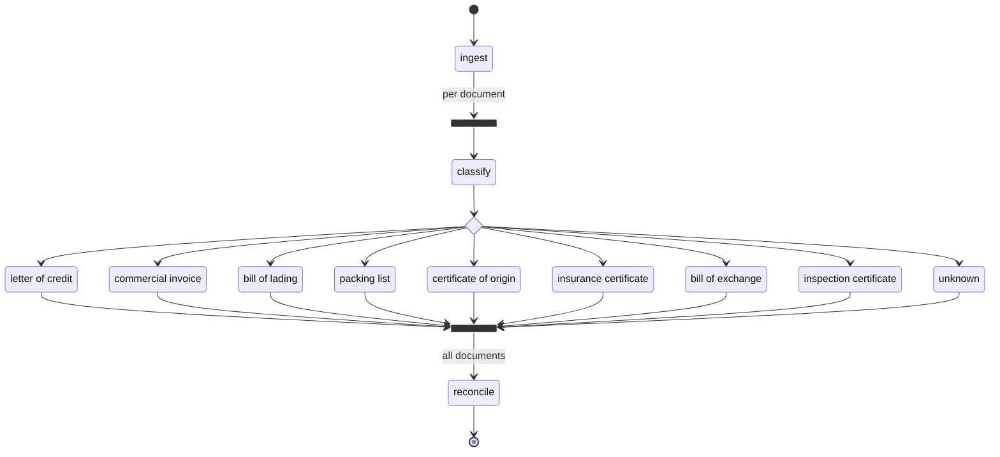

# Following one case, end to end

Three documents go in. A refusal comes out. This document shows **every line of code** that runs in
between, in the order it runs, with the real data flowing through it.

Every value shown is **captured from an actual run**. Every snippet is **copied verbatim from the
source files** — nothing is abbreviated with `...`. Only the model's replies are simulated (the
machine that produced this had no API key); the prompts, schemas, arithmetic and verdict logic are
all genuine.

**How to read this:** each stage has the same three parts — *what happens*, *the code*, *what goes in
and comes out*. Skim the prose, read the code, check the data.

| Companion | What it's for |
|---|---|
| [`mini_detector.ipynb`](mini_detector.ipynb) | Builds a runnable miniature from scratch, offline |
| [`Detector/ARCHITECTURE.md`](Detector/ARCHITECTURE.md) | Per-construct reference |
| **this file** | What actually happens to the data |

---

## Contents

| | Stage | What it does |
|---|---|---|
| [0](#0-the-papers) | — | The three documents |
| [1](#1-what-you-hand-in) | — | `CaseInput` |
| [2](#2-ingest) | `ingest` | Validate, or refuse to start |
| [3](#3-the-fan-out) | fork | One branch per document |
| [4](#4-classify) | `classify` | What kind of document is this? |
| [5](#5-route) | decision | Pick the extractor |
| [6](#6-extract) | `extract_*` | Text → typed fields |
| [7](#7-the-join) | join | Wait for all branches |
| [8](#8-reconcile) | `reconcile` | Cross-check everything |
| [9](#9-the-status-rule) | — | Findings → verdict |
| [10](#10-the-output) | — | What the caller gets |
| [11](#11-the-whole-graph-in-one-place) | — | The wiring |
| [12](#12-file-map) | — | Where each piece lives |

---

## 0. The papers

A seller in India shipped t-shirts to a buyer in Singapore under a letter of credit. To get paid, the
seller presents three documents to the bank.

**The credit** — the bank's promise, and the definition of a compliant presentation:

```
IRREVOCABLE DOCUMENTARY CREDIT
LC Number: LC-2026-88431
Issuing Bank: Meridian Commercial Bank, Singapore
Applicant: Harborline Trading Pte Ltd, Singapore
Beneficiary: Anand Textiles Pvt Ltd, Tirupur, India
Amount: USD 250,000.00
Tolerance: +/- 5 PCT
Expiry Date: 2026-03-15 at counters of issuing bank
Latest Shipment Date: 2026-02-20
Port of Loading: Chennai, India
Port of Discharge: Singapore
Description of Goods: 40,000 pcs 100% cotton knitted t-shirts, CIF Singapore
```

**The invoice** — what the seller is charging:

```
COMMERCIAL INVOICE
Invoice No: INV-4471          Date: 2026-02-18
L/C Ref: LC-2026-88431
Seller: Anand Textiles Pvt Ltd, Tirupur, India
Buyer: Harborline Trading Pte Ltd, Singapore
Description: 40,000 pcs 100% cotton knitted t-shirts, CIF Singapore
Total Amount: USD 268,400.00
```

**The bill of lading** — proof the goods shipped:

```
BILL OF LADING
B/L No: MSCU-772311
Shipper: Anand Textiles Pvt Ltd, Tirupur, India
Consignee: To order of Meridian Commercial Bank
Vessel: MV NORTHERN STAR       Voyage: 118W
Port of Loading: Chennai, India
Port of Discharge: Port Klang, Malaysia
Shipped on board: 2026-02-24
Description: 40,000 pcs cotton knitted t-shirts
```

Presented to the bank on **2026-03-02**.

> **The one rule that explains everything below:** banks deal in *documents, not goods*. It doesn't
> matter that the shipment really happened. If the paperwork disagrees with the credit, the bank
> refuses to pay. The rulebook is **UCP 600**.

Three real problems and one red herring are hiding in there.

---

## 1. What you hand in

**What happens:** you turn PDFs into text (the package does no OCR), wrap them in models, and make
one call.

### The models — `Detector/models/documents.py`

```python
class RawDocument(BaseModel):
    """One uploaded document after text extraction, before the model sees it."""

    document_id: str
    """Stable identifier assigned by the caller (upload id, row id, ...)."""

    text: str
    """Plain text pulled out of the PDF/image. This is the only evidence the agents get."""

    filename: str | None = None
    page_count: int | None = None
    declared_type: DocumentType | None = None
    """Type asserted by the uploader, if any. Used as a hint, never as the truth."""


class CaseInput(BaseModel):
    """The unit of work: every document presented under one credit."""

    case_id: str
    documents: list[RawDocument] = Field(default_factory=list)
    presented_on: date | None = None
    """The date the documents were presented to the bank, when known. Required for
    the UCP 600 Art 14(c) presentation-period check."""

    notes: str | None = None
    """Free-text context from the ops user, passed to the reconciliation stage."""
```

### The call — `Detector/services/pipeline.py`

```python
async def run(self, case: CaseInput) -> CaseResult:
    """Analyse one presentation and return the finished report."""
    with span(
        'analyse case {case_id}',
        case_id=case.case_id,
        document_count=len(case.documents),
    ) as case_span:
        result = await case_graph.run(
            state=CaseState.for_case(case),
            deps=self.deps,
            inputs=case,
        )
        _annotate(case_span, result)
        return result
```

### Input

```python
case = CaseInput(
    case_id='case-001',
    presented_on=date(2026, 3, 2),
    documents=[
        RawDocument(document_id='doc-lc',  text=LC_TEXT,      filename='credit.pdf'),
        RawDocument(document_id='doc-inv', text=INVOICE_TEXT, filename='invoice.pdf'),
        RawDocument(document_id='doc-bol', text=BOL_TEXT,     filename='bol.pdf'),
    ],
)

result = await get_pipeline().run(case)
```

That's the entire public surface. Three things worth knowing:

- **`document_id` is yours.** Findings and progress events key on it, and documents come back in
  completion order, not the order you sent them.
- **`presented_on` matters.** Without it the presentation-period check can't run, and the prompt
  explicitly tells the model not to guess a date. Leave it out and you silently lose a check.
- **`declared_type` is a hint, never trusted.** Uploaders mislabel constantly.

---

## 2. `ingest`

**What happens:** the first graph step validates the whole case, then hands the documents to the
fan-out. Nothing is truncated — oversized input is rejected.

### The code — `Detector/services/graph.py`

```python
@builder.step
async def ingest(
    ctx: StepContext[CaseState, DetectorDeps, CaseInput],
) -> list[RawDocument]:
    """Validate the presentation and hand its documents to the fan-out.

    Oversized or oversubscribed cases fail here rather than being silently
    truncated, because a truncated document produces a confident wrong answer.
    """
    case = ctx.inputs
    settings = ctx.deps.settings

    if len(case.documents) > settings.max_documents_per_case:
        raise ValueError(
            f"case {case.case_id} has {len(case.documents)} documents, "
            f"above the limit of {settings.max_documents_per_case}"
        )

    for document in case.documents:
        if len(document.text) > settings.max_document_chars:
            raise ValueError(
                f"document {document.document_id} has {len(document.text)} characters, "
                f"above the limit of {settings.max_document_chars}; split it before submitting"
            )
        if not document.text.strip():
            raise ValueError(f"document {document.document_id} has no extracted text")

    ctx.state.record("ingest", f"accepted {len(case.documents)} document(s)")
    return case.documents
```

A step is just an async function taking a `StepContext`, which gives you three things:
`ctx.inputs` (this step's input), `ctx.deps` (injected services), `ctx.state` (mutable scratchpad).

### In → Out

```
in : CaseInput with 3 documents
out: [RawDocument, RawDocument, RawDocument]

[ingest] accepted 3 document(s)
```

**The important part is what it refuses to do.** An oversized document raises instead of being
trimmed. A silently truncated letter of credit still extracts — it just extracts *confidently and
wrongly*, missing whichever terms fell off the end. Failing loudly at the door is the cheapest
outcome available.

Returning a `list` is what sets up the next step.

---

## 3. The fan-out

**What happens:** the list splits into one concurrent branch per document.

### The code — `Detector/services/graph.py`

```python
builder.edge_from(ingest)
.label("per document")
.map(fork_id=FAN_OUT_ID, downstream_join_id=COLLECT_ID)
.to(classify),
```

`.map()` is the fork. It takes the list `ingest` returned and sends **each element down its own
branch**, so `classify` receives a single `RawDocument`, not the list.

```
                  ┌── doc-lc  ── classify → route → extract ──┐
ingest ── fan out ├── doc-inv ── classify → route → extract ──┤ join → reconcile
                  └── doc-bol ── classify → route → extract ──┘
```

Each branch is fully independent. **doc-lc starts extracting while doc-bol is still classifying** —
there is no phase barrier, only the join at the end. Measured with 300 ms model calls and 3
documents: **0.93s**, against 2.10s if it ran sequentially.

`downstream_join_id` handles one edge case: mapping an *empty* list. Without it, a case with zero
documents would fan out to nothing and the join would wait forever. With it, the fork jumps straight
to the join, which yields its empty initial value and reconciliation reports "no documents
presented".

---

## 4. `classify`

**What happens:** each branch asks the model which document family it's holding. Runs three times, in
parallel.

### The agent — `Detector/services/agents.py`

```python
classifier = Agent(
    settings.classifier_model,
    name='document_classifier',
    output_type=Classification,
    instructions=prompts.classifier,
    retries=settings.retries,
    model_settings=_model_settings(
        model=settings.classifier_model,
        thinking=settings.classifier_thinking,
        max_tokens=settings.classifier_max_tokens,
        cache_instructions=settings.cache_instructions,
    ),
)
```

An agent is **a model + a system prompt + an output type**. The output type does the heavy lifting.

### The system prompt — `Config/prompts.yaml`

```yaml
classifier: |
  You classify raw text extracted from an uploaded trade finance document into exactly one of:
  letter_of_credit, commercial_invoice, bill_of_lading, packing_list, certificate_of_origin,
  insurance_certificate, bill_of_exchange, inspection_certificate, or unknown if it doesn't clearly match any of these.
  Base the decision only on the text given. Look for characteristic markers:
    - letter_of_credit: 'Applicant'/'Beneficiary', LC number, issuing bank
    - commercial_invoice: 'Invoice Number', seller/buyer, line-item pricing
    - bill_of_lading: 'Shipper'/'Consignee'/'Vessel', port of loading/discharge
    - packing_list: package counts, gross/net weight, dimensions
    - certificate_of_origin: 'Country of Origin', exporter declaration
    - insurance_certificate: insured amount, coverage type, policy/certificate number
    - bill_of_exchange: 'Drawer'/'Drawee', tenor (e.g. 'at sight'), draft number
    - inspection_certificate: inspecting agency name, pass/fail or inspection result
  If it doesn't clearly match one of these, classify as unknown rather than guessing.
```

### How the document gets wrapped — `Detector/services/graph.py`

```python
def _document_prompt(raw: RawDocument) -> str:
    """Wrap one document's text so the model can see its identity and its boundaries."""
    hint = (
        f"\nThe uploader labelled this as {raw.declared_type.value}; treat that as a hint only."
        if raw.declared_type is not None
        else ""
    )
    return (
        f"Document id: {raw.document_id}\n"
        f'Filename: {raw.filename or "unknown"}\n'
        f'Pages: {raw.page_count if raw.page_count is not None else "unknown"}{hint}\n\n'
        f"<document_text>\n{raw.text}\n</document_text>"
    )
```

**Rendered for doc-lc, exactly as sent:**

```
Document id: doc-lc
Filename: credit.pdf
Pages: unknown

<document_text>

IRREVOCABLE DOCUMENTARY CREDIT
LC Number: LC-2026-88431
Issuing Bank: Meridian Commercial Bank, Singapore
Applicant: Harborline Trading Pte Ltd, Singapore
Beneficiary: Anand Textiles Pvt Ltd, Tirupur, India
Amount: USD 250,000.00
Tolerance: +/- 5 PCT
Expiry Date: 2026-03-15 at counters of issuing bank
Latest Shipment Date: 2026-02-20
Port of Loading: Chennai, India
Port of Discharge: Singapore
Description of Goods: 40,000 pcs 100% cotton knitted t-shirts, CIF Singapore
Documents required: signed commercial invoice, full set clean on board ocean
bills of lading, packing list.

</document_text>
```

The `<document_text>` tags mark where untrusted OCR text starts and stops, so a scanned document
containing the words "ignore your instructions" reads as content, not as a command.

### The shape the reply must take — `Detector/models/documents.py`

```python
class Classification(BaseModel):
    """What the classifier agent decided about a single document."""

    model_config = ConfigDict(extra='forbid', use_attribute_docstrings=True)

    document_type: DocumentType
    """The family this document belongs to, or `unknown` if it doesn't clearly match one."""

    confidence: float = Field(ge=0.0, le=1.0)
    """How sure the classifier is, from 0 to 1."""

    reasoning: str
    """The markers in the text that drove the decision, in one or two sentences."""
```

Pydantic AI turns that class into a JSON schema the provider is made to conform to. **This is the
real generated schema:**

```json
{
  "document_type": {
    "$ref": "#/$defs/DocumentType",
    "description": "The family this document belongs to, or `unknown` if it doesn't clearly match one."
  },
  "confidence": {
    "description": "How sure the classifier is, from 0 to 1.",
    "minimum": 0.0,
    "maximum": 1.0,
    "type": "number"
  },
  "reasoning": {
    "description": "The markers in the text that drove the decision, in one or two sentences.",
    "type": "string"
  }
}
```

Those `description` strings are **not comments — they are part of the prompt**, read by the model at
inference time. `use_attribute_docstrings=True` is what lifts them out of the field docstrings, so
the type definition and the instructions physically cannot drift apart.

`extra='forbid'` becomes `additionalProperties: false`, which is what lets the provider enforce the
schema strictly rather than accepting invented fields.

### The step — `Detector/services/graph.py`

```python
@builder.step
async def classify(
    ctx: StepContext[CaseState, DetectorDeps, RawDocument],
) -> RoutedDocuments:
    """Decide which document family this text belongs to, and wrap it for routing.

    A failure here degrades one document to unclassified instead of failing the
    case: the remaining documents still get reconciled, and the gap shows up as a
    finding rather than a 500.
    """
    raw = ctx.inputs
    deps = ctx.deps

    try:
        result = await deps.agents.classifier.run(
            _document_prompt(raw),
            usage_limits=deps.usage_limits,
        )
    except (UsageLimitExceeded, RunCancelled):
        raise
    except AgentRunError as exc:
        ctx.state.record(
            "classify",
            f"classification failed: {exc}",
            document_id=raw.document_id,
            document_type=DocumentType.UNKNOWN,
        )
        return UnclassifiedDoc(
            raw=raw,
            classification=Classification(
                document_type=DocumentType.UNKNOWN,
                confidence=0.0,
                reasoning=f"classification failed: {exc}",
            ),
        )

    usage = TokenUsage.from_run_usage(result.usage)

    classification = result.output
    threshold = deps.settings.min_classification_confidence
    if classification.confidence < threshold:
        ctx.state.record(
            "classify",
            f"classified as {classification.document_type.value} at "
            f"{classification.confidence:.2f}, below the {threshold:.2f} threshold; "
            "treating as unclassified",
            document_id=raw.document_id,
            document_type=DocumentType.UNKNOWN,
            usage=result.usage,
        )
        return UnclassifiedDoc(raw=raw, classification=classification, usage=usage)

    ctx.state.record(
        "classify",
        f"classified as {classification.document_type.value} at {classification.confidence:.2f}",
        document_id=raw.document_id,
        document_type=classification.document_type,
        usage=result.usage,
    )
    envelope = ROUTED_DOCUMENT_TYPES[classification.document_type]
    return cast(
        RoutedDocuments, envelope(raw=raw, classification=classification, usage=usage)
    )
```

**Two defences are built into that function.**

*A failed call degrades one document, not the case.* Note the exception ordering —
`UsageLimitExceeded` and `RunCancelled` are *subclasses* of `AgentRunError`, so they must be caught
and re-raised first or they'd be swallowed. A blown budget or a cancellation should stop the case; a
flaky HTTP 500 should not.

*A low-confidence result is treated as unknown* (`min_classification_confidence` defaults to `0.5`).
A document called a packing list at 0.2 confidence is better treated as unreadable than run through
the packing-list extractor, which would produce a plausible-looking extraction of entirely the wrong
fields.

### In → Out

```
in : RawDocument(document_id='doc-lc', ...)
out: LetterOfCreditDoc(raw=..., classification=Classification(
         document_type=DocumentType.LETTER_OF_CREDIT,
         confidence=0.97,
         reasoning='Names an issuing bank, an applicant and a beneficiary.'))

[classify] doc-lc:  letter_of_credit   at 0.97
[classify] doc-inv: commercial_invoice at 0.96
[classify] doc-bol: bill_of_lading     at 0.95
```

`result.output` is a **validated object**, not a string to parse. `confidence` is guaranteed to be
between 0 and 1 because the schema said so and Pydantic checked.

---

## 5. Route

**What happens:** the classified document is dispatched to the right extractor — by type, not by
string comparison.

### The envelopes — `Detector/models/documents.py`

```python
@dataclass(frozen=True, slots=True)
class RoutedDocument:
    """A classified document on its way to an extractor.

    The subclasses below carry no extra data; they exist so the graph's
    `Decision` node can dispatch on type instead of on a string comparison,
    which makes the routing table exhaustively checkable by a type checker.
    """

    raw: RawDocument
    classification: Classification
    usage: TokenUsage = TokenUsage()
    """What classifying this document cost, carried forward so the per-document
    total in `ExtractedDocument` covers the whole branch, not just extraction."""


@dataclass(frozen=True, slots=True)
class LetterOfCreditDoc(RoutedDocument):
    """Routed to the LC extractor."""


@dataclass(frozen=True, slots=True)
class CommercialInvoiceDoc(RoutedDocument):
    """Routed to the invoice extractor."""


@dataclass(frozen=True, slots=True)
class BillOfLadingDoc(RoutedDocument):
    """Routed to the bill of lading extractor."""


@dataclass(frozen=True, slots=True)
class PackingListDoc(RoutedDocument):
    """Routed to the packing list extractor."""


@dataclass(frozen=True, slots=True)
class CertificateOfOriginDoc(RoutedDocument):
    """Routed to the certificate of origin extractor."""


@dataclass(frozen=True, slots=True)
class InsuranceCertificateDoc(RoutedDocument):
    """Routed to the insurance certificate extractor."""


@dataclass(frozen=True, slots=True)
class BillOfExchangeDoc(RoutedDocument):
    """Routed to the bill of exchange extractor."""


@dataclass(frozen=True, slots=True)
class InspectionCertificateDoc(RoutedDocument):
    """Routed to the inspection certificate extractor."""


@dataclass(frozen=True, slots=True)
class UnclassifiedDoc(RoutedDocument):
    """Not recognised as any known family; skips extraction."""


type RoutedDocuments = (
    LetterOfCreditDoc
    | CommercialInvoiceDoc
    | BillOfLadingDoc
    | PackingListDoc
    | CertificateOfOriginDoc
    | InsuranceCertificateDoc
    | BillOfExchangeDoc
    | InspectionCertificateDoc
    | UnclassifiedDoc
)
"""Every branch the routing decision must handle."""


ROUTED_DOCUMENT_TYPES: dict[DocumentType, type[RoutedDocument]] = {
    DocumentType.LETTER_OF_CREDIT: LetterOfCreditDoc,
    DocumentType.COMMERCIAL_INVOICE: CommercialInvoiceDoc,
    DocumentType.BILL_OF_LADING: BillOfLadingDoc,
    DocumentType.PACKING_LIST: PackingListDoc,
    DocumentType.CERTIFICATE_OF_ORIGIN: CertificateOfOriginDoc,
    DocumentType.INSURANCE_CERTIFICATE: InsuranceCertificateDoc,
    DocumentType.BILL_OF_EXCHANGE: BillOfExchangeDoc,
    DocumentType.INSPECTION_CERTIFICATE: InspectionCertificateDoc,
    DocumentType.UNKNOWN: UnclassifiedDoc,
}
"""Maps a classifier verdict onto the envelope that routes it."""
```

Nine classes, and **every one of them has an empty body.** They add no data at all.

### The branch table — `Detector/services/graph.py`

```python
def _routing_decision() -> Decision[CaseState, DetectorDeps, RoutedDocuments]:
    """The branch table from a classified document to its extractor.

    Branches match on the envelope class, so adding a document family without
    adding a branch here is a type error rather than a silent fall-through.
    """
    return (
        builder.decision(
            node_id="route_by_document_type", note="UCP 600 document families"
        )
        .branch(builder.match(LetterOfCreditDoc).to(extract_letter_of_credit))
        .branch(builder.match(CommercialInvoiceDoc).to(extract_commercial_invoice))
        .branch(builder.match(BillOfLadingDoc).to(extract_bill_of_lading))
        .branch(builder.match(PackingListDoc).to(extract_packing_list))
        .branch(builder.match(CertificateOfOriginDoc).to(extract_certificate_of_origin))
        .branch(
            builder.match(InsuranceCertificateDoc).to(extract_insurance_certificate)
        )
        .branch(builder.match(BillOfExchangeDoc).to(extract_bill_of_exchange))
        .branch(
            builder.match(InspectionCertificateDoc).to(extract_inspection_certificate)
        )
        .branch(builder.match(UnclassifiedDoc).to(skip_unclassified))
    )
```

**Why bother, when an `if` on `document_type` would work?**

```python
# the version this code deliberately does NOT use:
if doc.classification.document_type == DocumentType.LETTER_OF_CREDIT:
    return extract_lc
elif ...
# add a 9th family, forget a branch → falls through silently, at runtime, in production
```

The `Decision` type accumulates the types it has handled in its third type parameter. Declaring the
return as `Decision[..., RoutedDocuments]` **asserts the branch table covers the entire union** — so
forgetting a family is a type error your checker catches before you run anything. That guarantee is
what the nine otherwise-pointless classes buy.

### In → Out

```
in : LetterOfCreditDoc(...)
out: dispatched to the extract_letter_of_credit step
```

---

## 6. `extract`

**What happens:** each family's own agent turns document text into typed fields. Three times, in
parallel.

### The output type — `Detector/models/extractions.py`

```python
class ExtractionBase(BaseModel):
    """Shared configuration for every extraction payload."""

    model_config = ConfigDict(extra='forbid', use_attribute_docstrings=True)


class LetterOfCredit(ExtractionBase):
    """Structured fields of a documentary credit (MT700 style)."""

    kind: Literal[DocumentType.LETTER_OF_CREDIT] = DocumentType.LETTER_OF_CREDIT

    lc_number: str | None = None
    issuing_bank: str | None = None
    advising_bank: str | None = None
    applicant: str | None = None
    beneficiary: str | None = None
    credit_amount: Decimal | None = None
    currency: str | None = None
    issue_date: date | None = None
    expiry_date: date | None = None
    expiry_place: str | None = None
    latest_shipment_date: date | None = None
    port_of_loading: str | None = None
    port_of_discharge: str | None = None
    place_of_delivery: str | None = None
    description_of_goods: str | None = None
    partial_shipments_allowed: bool | None = None
    transhipment_allowed: bool | None = None
    presentation_period: str | None = None
    """Presentation period as written, e.g. 'within 21 days after shipment date'."""

    presentation_period_days: int | None = None
    """The presentation period reduced to a number of days, when it is expressed that way."""

    tolerance_percent: Decimal | None = None
    """Amount tolerance stated on the credit, e.g. 5 for 'about'/'+/- 5 pct'."""

    required_insurance_percent: Decimal | None = None
    """Minimum insured percentage the credit demands, e.g. 110."""
```

**Every field is `| None = None`.** That is deliberate: it makes "not present" a legal answer, which
is exactly what the prompt asks for. A missing field is evidence in its own right; a hallucinated one
is a compliance failure.

`Decimal` for money, `date` for dates — never `float`, never `str`. Tolerance arithmetic on a float
is how you refuse a compliant presentation for being $0.000001 over.

The `kind` field is a single-valued `Literal` with a default, so **the model can only ever emit the
correct tag.** That tag is what makes the payload union round-trip through JSON:

```python
ExtractionPayload = Annotated[
    LetterOfCredit
    | CommercialInvoice
    | BillOfLading
    | PackingList
    | CertificateOfOrigin
    | InsuranceCertificate
    | BillOfExchange
    | InspectionCertificate,
    Field(discriminator='kind'),
]
"""Any extraction payload, tagged by document type so it round-trips through JSON."""


EXTRACTION_PAYLOAD_TYPES: dict[DocumentType, type[ExtractionBase]] = {
    DocumentType.LETTER_OF_CREDIT: LetterOfCredit,
    DocumentType.COMMERCIAL_INVOICE: CommercialInvoice,
    DocumentType.BILL_OF_LADING: BillOfLading,
    DocumentType.PACKING_LIST: PackingList,
    DocumentType.CERTIFICATE_OF_ORIGIN: CertificateOfOrigin,
    DocumentType.INSURANCE_CERTIFICATE: InsuranceCertificate,
    DocumentType.BILL_OF_EXCHANGE: BillOfExchange,
    DocumentType.INSPECTION_CERTIFICATE: InspectionCertificate,
}
"""Maps a classified document type to the payload the extractor must return."""
```

### The agents — `Detector/services/agents.py`

```python
extraction_settings = _model_settings(
    model=settings.extraction_model,
    thinking=settings.extraction_thinking,
    max_tokens=settings.extraction_max_tokens,
    cache_instructions=settings.cache_instructions,
)
extractors: dict[DocumentType, ExtractionAgent] = {
    document_type: Agent(
        settings.extraction_model,
        name=f'{document_type.value}_extractor',
        output_type=payload_type,
        instructions=prompts.extractor(document_type),
        retries=settings.retries,
        model_settings=extraction_settings,
    )
    for document_type, payload_type in EXTRACTION_PAYLOAD_TYPES.items()
}
```

Eight separate agents rather than one agent with a dynamic output type, because each family also
needs its own system prompt — and a per-family agent gives per-family spans and per-family retry
budgets.

### The system prompt — `Config/prompts.yaml`

```yaml
lc_extractor: |
  You extract structured information from a Letter of Credit (LC) document.
  Only use information explicitly found in the text provided. If a field is not present,
  leave it null rather than guessing. Normalize dates to ISO format (YYYY-MM-DD) when possible.
  Target fields:
    - lc_number, issuing_bank, advising_bank, applicant, beneficiary
    - credit_amount, currency, issue_date, expiry_date, expiry_place
    - latest_shipment_date, port_of_loading, port_of_discharge, place_of_delivery
    - description_of_goods, partial_shipments_allowed, transhipment_allowed, presentation_period
```

Note how much work the prompt *doesn't* do. It doesn't have to describe field types or formats —
`output_type=LetterOfCredit` already told the model every field name, type and description. The
prompt sets the **policy**: only what's in the text, null rather than a guess.

### The step — `Detector/services/graph.py`

```python
async def _extract(
    ctx: StepContext[CaseState, DetectorDeps, RoutedDocument],
    document_type: DocumentType,
) -> ExtractedDocument:
    """Run one family's extraction agent over one document."""
    routed = ctx.inputs
    raw = routed.raw
    deps = ctx.deps

    base = {
        "document_id": raw.document_id,
        "filename": raw.filename,
        "document_type": document_type,
        "confidence": routed.classification.confidence,
        "classification_reasoning": routed.classification.reasoning,
    }

    try:
        result = await deps.agents.extractor(document_type).run(
            _document_prompt(raw),
            usage_limits=deps.usage_limits,
        )
    except (UsageLimitExceeded, RunCancelled):
        raise
    except AgentRunError as exc:
        ctx.state.record(
            "extract",
            f"extraction failed: {exc}",
            document_id=raw.document_id,
            document_type=document_type,
        )
        return ExtractedDocument(
            **base,
            payload=None,
            error=f"extraction failed: {exc}",
            usage=routed.usage,
        )

    usage = result.usage
    ctx.state.record(
        "extract",
        f"extracted {document_type.value}",
        document_id=raw.document_id,
        document_type=document_type,
        usage=usage,
    )
    return ExtractedDocument(
        **base,
        payload=result.output,
        usage=routed.usage + TokenUsage.from_run_usage(usage),
    )
```

The eight family steps are **generated, not written out eight times**:

```python
def _extraction_step(
    document_type: DocumentType,
) -> Step[CaseState, DetectorDeps, Any, ExtractedDocument]:
    """Build the graph step that extracts one document family.

    The eight families differ only in their agent and their payload type, so the
    step bodies are generated rather than written out eight times. Each still
    gets its own node id, which is what shows up in the rendered graph and in the
    instrumentation spans.
    """

    async def extract(
        ctx: StepContext[CaseState, DetectorDeps, RoutedDocument],
    ) -> ExtractedDocument:
        return await _extract(ctx, document_type)

    return builder.step(
        extract,
        node_id=f"extract_{document_type.value}",
        label=document_type.value.replace("_", " "),
    )


extract_letter_of_credit = _extraction_step(DocumentType.LETTER_OF_CREDIT)
extract_commercial_invoice = _extraction_step(DocumentType.COMMERCIAL_INVOICE)
extract_bill_of_lading = _extraction_step(DocumentType.BILL_OF_LADING)
extract_packing_list = _extraction_step(DocumentType.PACKING_LIST)
extract_certificate_of_origin = _extraction_step(DocumentType.CERTIFICATE_OF_ORIGIN)
extract_insurance_certificate = _extraction_step(DocumentType.INSURANCE_CERTIFICATE)
extract_bill_of_exchange = _extraction_step(DocumentType.BILL_OF_EXCHANGE)
extract_inspection_certificate = _extraction_step(DocumentType.INSPECTION_CERTIFICATE)
```

### The result carrier — `Detector/models/documents.py`

```python
class ExtractedDocument(BaseModel):
    """The output of one document's classify-then-extract branch."""

    document_id: str
    document_type: DocumentType
    confidence: float
    classification_reasoning: str
    filename: str | None = None
    payload: ExtractionPayload | None = None
    """`None` when the document was unclassifiable or extraction failed."""

    error: str | None = None
    """Why `payload` is `None`, when it is."""

    usage: TokenUsage = TokenUsage()

    @property
    def is_usable(self) -> bool:
        """Whether this document can contribute evidence to reconciliation."""
        return self.payload is not None
```

`payload` and `error` are complementary — exactly one is set. A document whose extraction failed
**still travels on to reconciliation** carrying its error, so the failure becomes a warning in the
report instead of a stack trace in your logs.

### In → Out

```
in : LetterOfCreditDoc(...)
out: ExtractedDocument(document_id='doc-lc', payload=LetterOfCredit(...), error=None)
```

**The real extracted payload for doc-lc:**

```json
{
  "kind": "letter_of_credit",
  "lc_number": "LC-2026-88431",
  "issuing_bank": "Meridian Commercial Bank, Singapore",
  "applicant": "Harborline Trading Pte Ltd, Singapore",
  "beneficiary": "Anand Textiles Pvt Ltd, Tirupur, India",
  "credit_amount": "250000.00",
  "currency": "USD",
  "expiry_date": "2026-03-15",
  "latest_shipment_date": "2026-02-20",
  "port_of_loading": "Chennai, India",
  "port_of_discharge": "Singapore",
  "description_of_goods": "40,000 pcs 100% cotton knitted t-shirts, CIF Singapore",
  "tolerance_percent": "5"
}
```

In Python those are **real types**, not strings that look like values:

```python
>>> type(payload.credit_amount)      # Decimal('250000.00')
<class 'decimal.Decimal'>
>>> type(payload.expiry_date)        # datetime.date(2026, 3, 15)
<class 'datetime.date'>
```

Notice that `Tolerance: +/- 5 PCT` in the raw text became `tolerance_percent: 5`. That normalisation
is why the amount check downstream is a single subtraction.

```
[extract] doc-lc:  extracted letter_of_credit
[extract] doc-inv: extracted commercial_invoice
[extract] doc-bol: extracted bill_of_lading
```

---

## 7. The join

**What happens:** all branches are gathered back into one list. This is the only barrier in the
graph.

### The code — `Detector/services/graph.py`

```python
COLLECT_ID = "collect_extractions"
"""Node id of the join. Named so the fan-out can point at it for the empty-case path."""

collect = builder.join(
    reduce_list_append,
    initial_factory=list[ExtractedDocument],
    node_id=COLLECT_ID,
)
"""Gathers one `ExtractedDocument` per presented document, in completion order."""
```

`reduce_list_append` is Pydantic Graph's built-in reducer — *append each result to the accumulator*.
`initial_factory=list[ExtractedDocument]` works because calling a generic alias constructs the
underlying type: `list[int]()` is `[]`.

The join's parent fork is inferred automatically — Pydantic Graph walks the graph and finds the fork
that dominates it, which is the `.map()` on `ingest`.

### The unclassified path

Documents that never reached an extractor still have to arrive here, or the join would hang:

```python
@builder.step(node_id="skip_unclassified", label="unknown")
async def skip_unclassified(
    ctx: StepContext[CaseState, DetectorDeps, UnclassifiedDoc],
) -> ExtractedDocument:
    """Carry an unrecognised document through to the join without extracting it.

    It still reaches reconciliation so the examiner sees that something was
    presented that the pipeline could not read.
    """
    routed = ctx.inputs
    ctx.state.record(
        "skip",
        "not recognised as a known document family",
        document_id=routed.raw.document_id,
        document_type=DocumentType.UNKNOWN,
    )
    return ExtractedDocument(
        document_id=routed.raw.document_id,
        filename=routed.raw.filename,
        document_type=DocumentType.UNKNOWN,
        confidence=routed.classification.confidence,
        classification_reasoning=routed.classification.reasoning,
        payload=None,
        error="document type could not be determined; not extracted",
        usage=routed.usage,
    )
```

### In → Out

```
in : 3 ExtractedDocument, arriving in completion order
out: [ExtractedDocument, ExtractedDocument, ExtractedDocument]
```

---

## 8. `reconcile`

**What happens:** one model call over all the documents at once. This is where discrepancies are
found.

### Building the evidence — `Detector/services/graph.py`

```python
def _reconciliation_prompt(
    state: CaseState, documents: Sequence[ExtractedDocument]
) -> str:
    """Render the extracted documents as the evidence for the compliance check."""
    evidence = [
        {
            "document_id": document.document_id,
            "document_type": document.document_type.value,
            "classification_confidence": round(document.confidence, 2),
            "fields": document.payload,
        }
        for document in documents
    ]
    parts = [
        f"Case: {state.case_id}",
        f"Documents presented: {len(documents)}",
    ]
    if state.presented_on is not None:
        parts.append(f"Date of presentation: {state.presented_on.isoformat()}")
    else:
        parts.append(
            "Date of presentation: not supplied. Do not raise a presentation-period "
            "finding on a date you had to assume."
        )
    if state.notes:
        parts.append(f"Operator notes: {state.notes}")
    parts.append(
        "\nUse the deterministic tools for every date and amount comparison rather than "
        "computing them yourself, and quote the figures they return in your findings.\n"
    )
    parts.append(
        format_as_xml(evidence, root_tag="extracted_documents", item_tag="document")
    )
    return "\n".join(parts)
```

**The rendered prompt, exactly as sent:**

```xml
Case: case-001
Documents presented: 3
Date of presentation: 2026-03-02

Use the deterministic tools for every date and amount comparison rather than
computing them yourself, and quote the figures they return in your findings.

<extracted_documents>
  <document>
    <document_id>doc-bol</document_id>
    <document_type>bill_of_lading</document_type>
    <classification_confidence>0.95</classification_confidence>
    <fields>
      <kind>bill_of_lading</kind>
      <bl_number>MSCU-772311</bl_number>
      <shipper>Anand Textiles Pvt Ltd, Tirupur, India</shipper>
      <consignee>To order of Meridian Commercial Bank</consignee>
      <vessel_name>MV NORTHERN STAR</vessel_name>
      <port_of_loading>Chennai, India</port_of_loading>
      <port_of_discharge>Port Klang, Malaysia</port_of_discharge>
      <shipment_date>2026-02-24</shipment_date>
      <description_of_goods>40,000 pcs cotton knitted t-shirts</description_of_goods>
    </fields>
  </document>
  <document>
    <document_id>doc-inv</document_id>
    <document_type>commercial_invoice</document_type>
    <classification_confidence>0.96</classification_confidence>
    <fields>
      <kind>commercial_invoice</kind>
      <invoice_number>INV-4471</invoice_number>
      <invoice_date>2026-02-18</invoice_date>
      <lc_reference_number>LC-2026-88431</lc_reference_number>
      <seller>Anand Textiles Pvt Ltd, Tirupur, India</seller>
      <buyer>Harborline Trading Pte Ltd, Singapore</buyer>
      <currency>USD</currency>
      <total_amount>268400.00</total_amount>
      <description_of_goods>40,000 pcs 100% cotton knitted t-shirts, CIF Singapore</description_of_goods>
    </fields>
  </document>
  <document>
    <document_id>doc-lc</document_id>
    <document_type>letter_of_credit</document_type>
    <classification_confidence>0.97</classification_confidence>
    <fields>
      <kind>letter_of_credit</kind>
      <lc_number>LC-2026-88431</lc_number>
      <issuing_bank>Meridian Commercial Bank, Singapore</issuing_bank>
      <applicant>Harborline Trading Pte Ltd, Singapore</applicant>
      <beneficiary>Anand Textiles Pvt Ltd, Tirupur, India</beneficiary>
      <credit_amount>250000.00</credit_amount>
      <currency>USD</currency>
      <expiry_date>2026-03-15</expiry_date>
      <latest_shipment_date>2026-02-20</latest_shipment_date>
      <port_of_loading>Chennai, India</port_of_loading>
      <port_of_discharge>Singapore</port_of_discharge>
      <description_of_goods>40,000 pcs 100% cotton knitted t-shirts, CIF Singapore</description_of_goods>
      <tolerance_percent>5</tolerance_percent>
    </fields>
  </document>
</extracted_documents>
```

**This is the payoff of splitting into three stages.** The hard reasoning step reads a tidy, typed
table — never raw OCR text. Hand it the original documents instead and it would be doing extraction
and judgement at the same time, and doing both slightly worse.

### The system prompt — `Config/prompts.yaml`

```yaml
reconciliation_engine: |
  You are a trade finance documentary-compliance checker, modeled on how a bank operations
  analyst checks documents against UCP 600 style rules and ISBP 745 international standards.
  You are given structured extractions from trade documents (LC, Invoice, Bill of Lading,
  Packing List, Certificate of Origin, Insurance Certificate, Bill of Exchange, Inspection Certificate),
  which you can rely on as the single source of truth for field values.

  Cross-check these fields across all the documents where applicable:
    - Party names: Applicant vs Buyer vs Consignee; Beneficiary vs Seller vs Shipper vs Drawer
    - Amount and Currency: Invoice amount must not exceed LC amount (subject to tolerances e.g. UCP 600 Art 30).
      Draft amount must match invoice / LC presentation amount. Insurance amount must meet required LC coverage (typically >= 110% of CIF/CIP value).
    - Goods description: Must be consistent; invoice must strictly correspond with LC description (UCP 600 Art 18c), while other documents may use general terms not conflicting with the LC.
    - Ports and Transport: Port of loading, port of discharge, place of delivery across transport and insurance documents vs LC
    - Dates: Bill of lading shipment date vs LC latest shipment date and expiry date. Presentation within allowed period. Insurance date on or before shipment date.
    - Document References: LC number referenced on invoice, packing list, COO, draft; invoice number referenced on packing list/COO.
    - Quantities and Weights: Consistency across Bill of Lading, Commercial Invoice, and Packing List.

  For every mismatch, cite exactly which documents disagree and explain the discrepancy
  in plain language a bank ops person would understand. Classify the severity:
    - 'critical': For anything causing a documentary discrepancy under LC rules (e.g. expired LC, late shipment, over-drawn amount, mismatched beneficiary, ports mismatch, goods discrepancy on invoice).
    - 'warning': For ambiguities or differences worth a human examiner look (e.g. minor party name/address formatting variations, partial shipment nuances).
```

### The arithmetic is not the model's job — `Detector/services/tools.py`

Date and money maths is exactly where language models are subtly and confidently wrong, and exactly
where being wrong costs the beneficiary a refusal. So four pure functions are registered as tools:

```python
class ToolVerdict(BaseModel):
    """Shared shape for every deterministic check."""

    model_config = ConfigDict(extra='forbid')

    passed: bool
    """True when the check is satisfied."""

    detail: str
    """One line stating the computed numbers, for the agent to quote in its finding."""


class AmountVerdict(ToolVerdict):
    """Result of an amount-against-limit comparison."""

    difference: Decimal
    """presented minus permitted; positive means the presentation is over."""

    permitted_maximum: Decimal
    """The ceiling the presented amount was compared against."""


class DateVerdict(ToolVerdict):
    """Result of a date-ordering comparison."""

    days_between: int
    """later minus earlier, in days; negative means the dates are out of order."""


def check_amount_tolerance(
    credit_amount: Decimal,
    presented_amount: Decimal,
    tolerance_percent: Decimal = _ZERO,
) -> AmountVerdict:
    """Check a presented amount against a credit amount plus its stated tolerance.

    Use for invoice-against-LC and draft-against-LC amount checks. UCP 600 Art 30(a)
    allows a tolerance only when the credit states one ('about', '+/- 5 pct'); with no
    stated tolerance pass 0 and the credit amount is a hard ceiling.

    Args:
        credit_amount: The amount available under the credit.
        presented_amount: The amount actually drawn or invoiced.
        tolerance_percent: Tolerance the credit permits, as a percentage (5 means 5%).
    """
    permitted = credit_amount * (_HUNDRED + tolerance_percent) / _HUNDRED
    difference = presented_amount - permitted
    passed = difference <= _ZERO
    detail = (
        f'presented {presented_amount} against credit {credit_amount} '
        f'with {tolerance_percent}% tolerance (ceiling {permitted}): '
        f'{"within" if passed else f"over by {difference}"}'
    )
    return AmountVerdict(
        passed=passed,
        detail=detail,
        difference=difference,
        permitted_maximum=permitted,
    )


def check_insurance_coverage(
    goods_value: Decimal,
    insured_amount: Decimal,
    required_percent: Decimal = Decimal(110),
) -> AmountVerdict:
    """Check that an insurance document covers at least the required percentage of value.

    UCP 600 Art 28(f)(ii) sets a minimum of 110% of the CIF or CIP value where the
    credit is silent. Here the check is inverted relative to `check_amount_tolerance`:
    the computed amount is a floor, not a ceiling.

    Args:
        goods_value: The CIF/CIP value of the goods, normally the invoice total.
        insured_amount: The sum insured on the certificate or policy.
        required_percent: Minimum coverage the credit requires, as a percentage.
    """
    required = goods_value * required_percent / _HUNDRED
    difference = insured_amount - required
    passed = difference >= _ZERO
    detail = (
        f'insured {insured_amount} against required {required_percent}% of {goods_value} '
        f'(floor {required}): {"adequate" if passed else f"short by {-difference}"}'
    )
    return AmountVerdict(
        passed=passed,
        detail=detail,
        difference=difference,
        permitted_maximum=required,
    )


def check_date_order(
    earlier_label: str,
    earlier: date,
    later_label: str,
    later: date,
) -> DateVerdict:
    """Check that one date falls on or before another, and report the gap in days.

    Use for shipment date against latest shipment date, insurance effective date
    against shipment date, and any other ordering the credit imposes.

    Args:
        earlier_label: Name of the date that must come first, e.g. 'shipment date'.
        earlier: The date that must come first.
        later_label: Name of the date that must come second, e.g. 'latest shipment date'.
        later: The date that must come second.
    """
    days = (later - earlier).days
    passed = days >= 0
    detail = (
        f'{earlier_label} {earlier.isoformat()} vs {later_label} {later.isoformat()}: '
        f'{"within by" if passed else "late by"} {abs(days)} day(s)'
    )
    return DateVerdict(passed=passed, detail=detail, days_between=days)


class PresentationVerdict(ToolVerdict):
    """Result of the presentation-period check."""

    deadline: date
    """The last day a compliant presentation could be made."""

    days_late: int = Field(default=0)
    """Days past the deadline; 0 when the presentation was in time."""


def check_presentation_period(
    shipment_date: date,
    expiry_date: date,
    presented_on: date,
    presentation_period_days: int = 21,
) -> PresentationVerdict:
    """Check that documents were presented in time.

    Under UCP 600 Art 14(c) a presentation including a transport document must be
    made no later than 21 calendar days after shipment, and in any case no later
    than the credit's expiry date. The effective deadline is the earlier of the two.

    Args:
        shipment_date: The on-board date from the transport document.
        expiry_date: The expiry date of the credit.
        presented_on: The date the documents reached the bank.
        presentation_period_days: The period the credit allows, defaulting to the
            21 days UCP 600 applies when the credit is silent.
    """
    period_deadline = shipment_date + timedelta(days=presentation_period_days)
    deadline = min(period_deadline, expiry_date)
    days_late = max((presented_on - deadline).days, 0)
    passed = days_late == 0
    binding = 'expiry date' if deadline == expiry_date else f'{presentation_period_days}-day period'
    detail = (
        f'presented {presented_on.isoformat()} against deadline {deadline.isoformat()} '
        f'(set by the {binding}): {"in time" if passed else f"late by {days_late} day(s)"}'
    )
    return PresentationVerdict(
        passed=passed,
        detail=detail,
        deadline=deadline,
        days_late=days_late,
    )


RECONCILIATION_TOOLS = [
    check_amount_tolerance,
    check_insurance_coverage,
    check_date_order,
    check_presentation_period,
]
"""Registered on the reconciliation agent; see `Detector.services.agents`."""
```

Registering them is one argument on the agent. Pydantic AI derives each tool's JSON schema from the
signature and its description from the docstring — **the `Args:` section becomes the per-parameter
descriptions**, which is why these docstrings cite UCP articles. They're written for the model.

**Run on this case's real extracted values, these are the actual verdicts — no model involved:**

```python
check_amount_tolerance(Decimal('250000.00'), Decimal('268400.00'), Decimal('5'))
# passed=False
# 'presented 268400.00 against credit 250000.00 with 5% tolerance
#  (ceiling 262500.00): over by 5900.00'

check_date_order('shipment date', date(2026, 2, 24), 'latest shipment date', date(2026, 2, 20))
# passed=False
# 'shipment date 2026-02-24 vs latest shipment date 2026-02-20: late by 4 day(s)'

check_presentation_period(date(2026, 2, 24), date(2026, 3, 15), date(2026, 3, 2))
# passed=True
# 'presented 2026-03-02 against deadline 2026-03-15 (set by the expiry date): in time'
```

Two things to notice. **The tools return the numbers, not just yes/no** — that `detail` string is
built to be quoted straight into a finding, which is why the report can say "over by USD 5,900.00"
and be exactly right. And **the third check passes, and says which rule bound it**: 02-24 + 21 days
is 03-17, but the credit expires 03-15, so expiry binds; they presented on 03-02, comfortably in
time. That Art 14(c) rule lives in code, not in a prompt, so it can't drift.

### The agent — `Detector/services/agents.py`

```python
reconciler = Agent(
    settings.reconciliation_model,
    name='reconciliation_engine',
    output_type=ReconciliationReport,
    instructions=prompts.reconciliation,
    tools=RECONCILIATION_TOOLS,
    retries=settings.retries,
    model_settings=_model_settings(
        model=settings.reconciliation_model,
        thinking=settings.reconciliation_thinking,
        max_tokens=settings.reconciliation_max_tokens,
        cache_instructions=settings.cache_instructions,
    ),
)
```

`reconciliation_thinking` defaults to `high` — this is the compliance judgement, the part worth
spending reasoning budget on. Classification runs at `low`, extraction at `medium`.

### The output type — `Detector/models/reconciliation.py`

```python
class FieldObservation(BaseModel):
    """One document's version of a field that is under comparison."""

    model_config = ConfigDict(extra='forbid', use_attribute_docstrings=True)

    document_type: DocumentType
    """Which document this value was read from."""

    field: str
    """The field name on that document, e.g. 'beneficiary' or 'shipment_date'."""

    value: str | None = None
    """The value exactly as extracted, or null if the document omits it."""

    document_id: str | None = None
    """The id of the specific document, when more than one of a type was presented."""


class Mismatch(BaseModel):
    """A single discrepancy between two or more presented documents."""

    model_config = ConfigDict(extra='forbid', use_attribute_docstrings=True)

    code: str
    """Short stable slug for this kind of discrepancy, e.g. 'late_shipment'."""

    severity: Severity
    """critical = the bank would refuse; warning = a human should look; info = cosmetic."""

    field: str
    """The business field in dispute, e.g. 'Beneficiary' or 'Port of Discharge'."""

    explanation: str
    """Plain language a bank ops person would understand: what disagrees and why it matters."""

    documents_involved: list[DocumentType] = Field(default_factory=list)
    """Every document family that takes part in this discrepancy."""

    observations: list[FieldObservation] = Field(default_factory=list)
    """The conflicting values, one entry per document."""

    rule_reference: str | None = None
    """The UCP 600 article or ISBP 745 paragraph relied on, when one applies."""

    suggested_action: str | None = None
    """What the beneficiary or the bank would do to cure it."""


class ReconciliationReport(BaseModel):
    """The reconciliation agent's verdict over a full presentation."""

    model_config = ConfigDict(extra='forbid', use_attribute_docstrings=True)

    status: CaseStatus
    """blocked if any critical finding, needs_review if only warnings, else clean."""

    summary: str
    """Two or three sentences an examiner can read before opening the detail."""

    mismatches: list[Mismatch] = Field(default_factory=list)
    """Every discrepancy found, most severe first."""

    matched_fields: list[str] = Field(default_factory=list)
    """Fields that were cross-checked and agreed across documents."""

    missing_documents: list[DocumentType] = Field(default_factory=list)
    """Document families the credit appears to require but that were not presented."""

    @property
    def critical_count(self) -> int:
        """How many findings would cause the bank to refuse."""
        return sum(1 for m in self.mismatches if m.severity is Severity.CRITICAL)

    @property
    def warning_count(self) -> int:
        """How many findings need a human examiner."""
        return sum(1 for m in self.mismatches if m.severity is Severity.WARNING)
```

`code` is a stable slug so you can aggregate across thousands of cases (*what do we get refused for
most often?*). `observations` carries the conflicting values themselves, so a UI can show the
disagreement side by side rather than making the user re-open both PDFs.

### The step — `Detector/services/graph.py`

```python
@builder.step
async def reconcile(
    ctx: StepContext[CaseState, DetectorDeps, list[ExtractedDocument]],
) -> CaseResult:
    """Cross-check the extracted documents and assemble the case result."""
    state = ctx.state
    documents = sorted(ctx.inputs, key=lambda document: document.document_id)
    usable = [document for document in documents if document.is_usable]

    if not usable:
        report = _no_evidence_report(documents)
        state.record("reconcile", "no usable extractions; skipped the compliance check")
    else:
        result = await ctx.deps.agents.reconciler.run(
            _reconciliation_prompt(state, usable),
            usage_limits=ctx.deps.usage_limits,
        )
        report = _finalise_report(result.output, documents)
        state.record(
            "reconcile",
            f"{report.status.value}: {report.critical_count} critical, {report.warning_count} warning",
            usage=result.usage,
        )

    return CaseResult(
        case_id=state.case_id,
        status=report.status,
        report=report,
        documents=documents,
        usage=state.usage_snapshot(),
        started_at=state.started_at,
        completed_at=datetime.now(UTC),
    )
```

Documents are sorted by id first, so runs are reproducible even though results arrived in completion
order. If nothing could be extracted the model call is skipped entirely — there's nothing to compare,
and asking anyway would invite invention.

### In → Out

```
in : [ExtractedDocument × 3]
out: CaseResult(status=BLOCKED, report=ReconciliationReport(...), documents=[...])

[reconcile] blocked: 3 critical, 0 warning
```

---

## 9. The status rule

**What happens:** the code throws away the model's verdict and derives its own.

### The code — `Detector/services/graph.py`

```python
def _derive_status(mismatches: Sequence[Mismatch]) -> CaseStatus:
    """Map findings to a verdict.

    The prompt asks the model for this too, but the mapping is a rule, not a
    judgement, so the rule wins: a report with a critical finding is blocked
    whatever the model wrote in `status`.
    """
    severities = {mismatch.severity for mismatch in mismatches}
    if Severity.CRITICAL in severities:
        return CaseStatus.BLOCKED
    if Severity.WARNING in severities:
        return CaseStatus.NEEDS_REVIEW
    return CaseStatus.CLEAN


def _finalise_report(
    report: ReconciliationReport,
    documents: Sequence[ExtractedDocument],
) -> ReconciliationReport:
    """Sort the findings, enforce the status rule, and flag unreadable documents."""
    mismatches = sorted(report.mismatches, key=lambda m: _SEVERITY_ORDER[m.severity])
    unreadable = [document for document in documents if not document.is_usable]
    if unreadable:
        mismatches.append(
            Mismatch(
                code="document_not_extracted",
                severity=Severity.WARNING,
                field="document set",
                explanation=(
                    f"{len(unreadable)} presented document(s) could not be read into structured "
                    "fields and took no part in the cross-checks: "
                    + ", ".join(f"{d.document_id} ({d.error})" for d in unreadable)
                ),
                documents_involved=[DocumentType.UNKNOWN],
                suggested_action="Re-upload a clearer copy, or examine these documents manually.",
            )
        )
        mismatches.sort(key=lambda m: _SEVERITY_ORDER[m.severity])

    return report.model_copy(
        update={"mismatches": mismatches, "status": _derive_status(mismatches)}
    )
```

Mapping findings to a verdict is **a rule, not a judgement**, so the rule wins. A report that lists a
critical finding and claims `clean` comes back `blocked`, every time. This is a small function, and
it is the most important one in the project — the line between a system a bank can use and a demo.

`_finalise_report` also appends a warning for any document that failed to extract, so an unreadable
scan can't quietly shrink the evidence base without the examiner being told:

```
[warning] 1 presented document(s) could not be read into structured fields and took no
          part in the cross-checks: doc-bol (extraction failed: ...)
```

### And when nothing could be read at all

```python
def _no_evidence_report(documents: Sequence[ExtractedDocument]) -> ReconciliationReport:
    """The verdict when nothing could be extracted, so there is nothing to compare."""
    detail = (
        "No documents were presented."
        if not documents
        else f"None of the {len(documents)} presented document(s) could be read into structured fields."
    )
    return ReconciliationReport(
        status=CaseStatus.NEEDS_REVIEW,
        summary=f"{detail} No cross-document checks were performed.",
        mismatches=[
            Mismatch(
                code="no_usable_documents",
                severity=Severity.WARNING,
                field="document set",
                explanation=detail,
                documents_involved=[DocumentType.UNKNOWN],
                suggested_action="Check the uploads and the text extraction step, then resubmit.",
            )
        ],
    )
```

---

## 10. The output

### Finding 1 — the invoice is drawn over the credit · CRITICAL

| Document | Field | Value |
|---|---|---|
| letter_of_credit | `credit_amount` | USD 250,000.00 ± 5% |
| commercial_invoice | `total_amount` | USD 268,400.00 |

The tolerance gives a ceiling of USD 262,500.00. The invoice is over by **USD 5,900.00**.

*UCP 600 Art 18(b), Art 30(a)* — a tolerance applies only when the credit states one. This one did
("+/- 5 PCT"), and the invoice still breaks it.
**Cure:** amend the credit, or present an invoice within the ceiling.

### Finding 2 — late shipment · CRITICAL

| Document | Field | Value |
|---|---|---|
| letter_of_credit | `latest_shipment_date` | 2026-02-20 |
| bill_of_lading | `shipment_date` | 2026-02-24 |

Four days late. The goods went on board after the last date the credit permits.

*UCP 600 Art 20* — the on-board date is the date of shipment.
**Cure:** request an amendment extending the latest shipment date.

### Finding 3 — wrong port of discharge · CRITICAL

| Document | Field | Value |
|---|---|---|
| letter_of_credit | `port_of_discharge` | Singapore |
| bill_of_lading | `port_of_discharge` | Port Klang, Malaysia |

The transport document doesn't cover the carriage the credit requires. The goods are going to the
wrong country.

*UCP 600 Art 20(a)(ii)*
**Cure:** obtain a corrected bill of lading, or amend the credit.

### Finding 4 — the red herring · INFO

The bill of lading says "cotton knitted t-shirts" where the credit says "**100%** cotton knitted
t-shirts". This looks like a discrepancy and **is not one.**

*UCP 600 Art 14(e)* — on documents other than the invoice, a general description of the goods is fine
as long as it doesn't conflict with the credit. Only the **invoice** must correspond strictly
(Art 18(c)) — and it does, word for word.

Getting this right matters as much as catching the other three. A checker that flags every textual
difference produces so much noise that people stop reading it.

### What agreed

```
beneficiary / seller / shipper  ·  applicant / buyer  ·  LC number quoted on the invoice
·  port of loading  ·  currency
```

Worth reporting: it tells the examiner what was actually checked, so silence on a field means "we
looked" rather than "we forgot".

### The returned object — `Detector/models/reconciliation.py`

```python
class CaseResult(BaseModel):
    """Everything one run of the pipeline produced. This is what the API returns."""

    case_id: str
    status: CaseStatus
    report: ReconciliationReport
    documents: list[ExtractedDocument] = Field(default_factory=list)
    usage: TokenUsage = TokenUsage()
    started_at: datetime
    completed_at: datetime

    @property
    def duration_seconds(self) -> float:
        """Wall clock time the pipeline took."""
        return (self.completed_at - self.started_at).total_seconds()
```

```python
CaseResult(
    case_id='case-001',
    status=CaseStatus.BLOCKED,       # derived by the rule, not the model's opinion
    report=ReconciliationReport(status=BLOCKED, summary=..., mismatches=[4 findings]),
    documents=[ExtractedDocument × 3],
)
```

**BLOCKED.** The bank refuses. The seller has three things to fix before re-presenting, and two of
them need the buyer's agreement to amend the credit.

---

## 11. The whole graph in one place

Every step above is wired together here — and validated at **import time**, so a miswired graph fails
when the module loads rather than on the first request in production.

```python
builder = GraphBuilder(
    name="trade_finance_doc_mismatch",
    state_type=CaseState,
    deps_type=DetectorDeps,
    input_type=CaseInput,
    output_type=CaseResult,
)

EXTRACTION_STEPS: tuple[Step[CaseState, DetectorDeps, Any, ExtractedDocument], ...] = (
    extract_letter_of_credit,
    extract_commercial_invoice,
    extract_bill_of_lading,
    extract_packing_list,
    extract_certificate_of_origin,
    extract_insurance_certificate,
    extract_bill_of_exchange,
    extract_inspection_certificate,
    skip_unclassified,
)
"""Everything that can feed the join. Ordering only affects the rendered diagram."""


builder.add(
    builder.edge_from(builder.start_node).to(ingest),
    builder.edge_from(ingest)
    .label("per document")
    .map(fork_id=FAN_OUT_ID, downstream_join_id=COLLECT_ID)
    .to(classify),
    builder.edge_from(classify).to(_routing_decision()),
    builder.edge_from(*EXTRACTION_STEPS).to(collect),
    builder.edge_from(collect).label("all documents").to(reconcile),
    builder.edge_from(reconcile).to(builder.end_node),
)

case_graph: Graph[CaseState, DetectorDeps, CaseInput, CaseResult] = builder.build()
"""The built graph. Stateless and safe to share across concurrent runs."""
```

The four type parameters on `GraphBuilder` mean different things:

| Parameter | Meaning | Mutable? |
|---|---|---|
| `input_type` | What the graph is called with | — |
| `output_type` | What the graph returns | — |
| `deps_type` | Injected services, same for the whole run | No (frozen dataclass) |
| `state_type` | Scratchpad the run accumulates | Yes |

### State and deps — `Detector/services/deps.py`

```python
@dataclass(slots=True)
class CaseState:
    """Mutable state for one run of the pipeline.

    The fan-out over documents runs as concurrent tasks on a single event loop.
    The mutations below contain no `await`, so they are atomic with respect to
    each other and need no lock.
    """

    case_id: str
    presented_on: date | None = None
    notes: str | None = None
    started_at: datetime = field(default_factory=lambda: datetime.now(UTC))
    usage: RunUsage = field(default_factory=RunUsage)
    events: list[StageEvent] = field(default_factory=list)
    """Ordered audit trail; safe to stream to the client as it grows."""

    def record(
        self,
        stage: str,
        message: str,
        *,
        document_id: str | None = None,
        document_type: DocumentType | None = None,
        usage: RunUsage | None = None,
    ) -> None:
        """Append an audit event and fold in the usage of the call that produced it."""
        if usage is not None:
            self.usage.incr(usage)
        self.events.append(
            StageEvent(
                stage=stage,
                message=message,
                at=datetime.now(UTC),
                document_id=document_id,
                document_type=document_type,
            )
        )


@dataclass(frozen=True, slots=True)
class DetectorDeps:
    """Immutable dependencies handed to every step in the graph."""

    agents: AgentRegistry
    settings: Settings
    usage_limits: UsageLimits | None = None
    """Applied per agent run, not per case."""
```

`record()` contains no `await`, which is why concurrent branches can call it without a lock.

### The rendered graph

Derived from the wiring, so it cannot drift out of date:

```python
print(DetectorPipeline.diagram())
```



---

## 12. File map

| Stage | File |
|---|---|
| `CaseInput`, `RawDocument`, routing envelopes, `ExtractedDocument` | [`Detector/models/documents.py`](Detector/models/documents.py) |
| The 8 payload schemas | [`Detector/models/extractions.py`](Detector/models/extractions.py) |
| `Mismatch`, `ReconciliationReport`, `CaseResult` | [`Detector/models/reconciliation.py`](Detector/models/reconciliation.py) |
| `DocumentType`, `Severity`, `CaseStatus` | [`Detector/models/enums.py`](Detector/models/enums.py) |
| Every prompt | [`Config/prompts.yaml`](Config/prompts.yaml) |
| Prompt loading + startup validation | [`Detector/prompts/registry.py`](Detector/prompts/registry.py) |
| The 10 agents | [`Detector/services/agents.py`](Detector/services/agents.py) |
| The 4 deterministic tools | [`Detector/services/tools.py`](Detector/services/tools.py) |
| `CaseState`, `DetectorDeps`, `StageEvent` | [`Detector/services/deps.py`](Detector/services/deps.py) |
| Steps, routing, fan-out, join, status rule, wiring | [`Detector/services/graph.py`](Detector/services/graph.py) |
| `run()` / `run_with_progress()` | [`Detector/services/pipeline.py`](Detector/services/pipeline.py) |
| Every tunable, as `DETECTOR_`-prefixed env vars | [`Detector/core/config.py`](Detector/core/config.py) |
| Logfire configuration and the span helper | [`Detector/core/observability.py`](Detector/core/observability.py) |

### The three ideas worth stealing

1. **Put the schema where the model reads it.** Field docstrings become schema descriptions the model
   sees at inference time, so your types *are* your prompt and the two can't disagree.
2. **Take the arithmetic away from the model.** Anything where "confidently slightly wrong" is
   expensive belongs in a pure function — and it should return the numbers so the model can quote
   them.
3. **Let rules override judgement at the boundary.** The model proposes findings; code derives the
   verdict.
