# Following one case, end to end

Three documents go in. A refusal comes out. This is what happens in between.

Every value below is **captured from a real run**. Code is **copied from the source files**, trimmed
to the lines that carry the argument — each snippet names its file, so the full version is one click
away. Only the model's replies are simulated (the machine that produced this had no API key); the
prompts, schemas, arithmetic and verdict logic are genuine.

**How to read this.** Every stage has the same four parts:

> **the idea** → **a diagram** → **the code** → **in / out**

Read the idea and the diagram. Drop into the code only where you want to.

| Companion | What it's for |
|---|---|
| [`mini_detector.ipynb`](mini_detector.ipynb) | Builds a runnable miniature from scratch, offline |
| [`Detector/ARCHITECTURE.md`](Detector/ARCHITECTURE.md) | Per-construct reference |
| **this file** | What actually happens to the data |

---

## The 60-second version

A seller in India shipped t-shirts to a buyer in Singapore. The buyer's bank promised to pay — *if*
the seller hands over paperwork matching the credit exactly. Banks pay against **documents, not
goods**: if the paper disagrees with the credit, the bank refuses, even when the shipment plainly
happened. A clerk normally checks this by hand, field by field.

This project is that clerk.

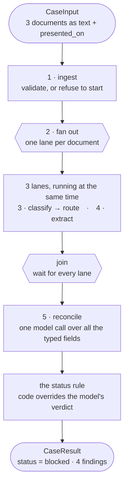

| # | Move | In plain words |
|---|---|---|
| 1 | `ingest` | Is there anything to work with? An empty case stops here, before spending a model call. |
| 2 | fan out | Split into one lane per document. The lanes run at the same time. |
| 3 | `classify` → route | *"What am I looking at?"* — then hand it to the specialist for that family. |
| 4 | `extract` | The specialist fills in a form: text ➜ typed fields, real `Decimal`s and `date`s. |
| 5 | `reconcile` | The lanes rejoin. One model reads the tidy fields side by side and lists what disagrees. |

**What came out** — three genuine problems and one trap:

| What it found | Severity |
|---|---|
| Invoice is USD 268,400 against a USD 250,000 credit — over the ceiling even with the stated 5% tolerance | `critical` |
| Shipped 2026-02-24, four days past the latest shipment date | `critical` |
| Discharge port is Port Klang, Malaysia; the credit says Singapore | `critical` |
| Goods worded differently on the bill of lading than on the credit — permitted, so **not** a discrepancy | `info` |

Verdict: **`blocked`**.

### Why not one big prompt?

A model asked to read messy OCR *and* judge compliance at the same time does both slightly badly.

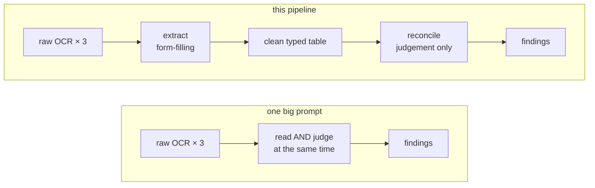

Extraction is form-filling. Reconciliation is judgement. Split apart, the hard step gets to read a
clean table instead of raw scan noise.

### The one idea to carry into the code below

The model *finds* discrepancies, but it never gets the last word.

- Money and date arithmetic runs in plain Python ([§8](#8-reconcile)).
- The final verdict is a rule, not an opinion ([§9](#9-the-status-rule)).

A report that lists a critical finding while claiming `clean` comes back `blocked`, every time.

---

## Contents

| | Stage | What it does |
|---|---|---|
| [0](#0-the-papers) | — | The three documents |
| [1](#1-what-you-hand-in) | — | `CaseInput` |
| [2](#2-ingest) | `ingest` | Validate, or refuse to start |
| [3](#3-the-fan-out) | fork | One lane per document |
| [4](#4-classify) | `classify` | What kind of document is this? |
| [5](#5-route) | decision | Pick the extractor — *and why nine empty classes* |
| [6](#6-extract) | `extract_*` | Text → typed fields |
| [7](#7-the-join) | join | Wait for all lanes |
| [8](#8-reconcile) | `reconcile` | Cross-check everything |
| [9](#9-the-status-rule) | — | Findings → verdict |
| [10](#10-the-output) | — | What the caller gets |
| [11](#11-the-wiring) | — | How the graph is built |
| [12](#12-file-map) | — | Where each piece lives |

**The shape of the data, all the way through** — each stage is one arrow:

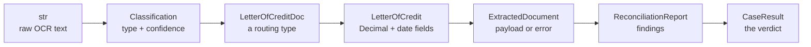

---

## 0. The papers

**The credit** — the bank's promise, and the definition of a compliant presentation:

```
IRREVOCABLE DOCUMENTARY CREDIT
LC Number: LC-2026-88431
Issuing Bank: Meridian Commercial Bank, Singapore
Applicant: Harborline Trading Pte Ltd, Singapore
Beneficiary: Anand Textiles Pvt Ltd, Tirupur, India
Amount: USD 250,000.00
Tolerance: +/- 5 PCT
Expiry Date: 2026-03-15 at counters of issuing bank
Latest Shipment Date: 2026-02-20
Port of Loading: Chennai, India
Port of Discharge: Singapore
Description of Goods: 40,000 pcs 100% cotton knitted t-shirts, CIF Singapore
```

**The invoice** — what the seller is charging:

```
COMMERCIAL INVOICE
Invoice No: INV-4471          Date: 2026-02-18
L/C Ref: LC-2026-88431
Seller: Anand Textiles Pvt Ltd, Tirupur, India
Buyer: Harborline Trading Pte Ltd, Singapore
Description: 40,000 pcs 100% cotton knitted t-shirts, CIF Singapore
Total Amount: USD 268,400.00
```

**The bill of lading** — proof the goods shipped:

```
BILL OF LADING
B/L No: MSCU-772311
Shipper: Anand Textiles Pvt Ltd, Tirupur, India
Consignee: To order of Meridian Commercial Bank
Vessel: MV NORTHERN STAR       Voyage: 118W
Port of Loading: Chennai, India
Port of Discharge: Port Klang, Malaysia
Shipped on board: 2026-02-24
Description: 40,000 pcs cotton knitted t-shirts
```

Presented to the bank on **2026-03-02**.

> **The one rule that explains everything below:** banks deal in *documents, not goods*. It doesn't
> matter that the shipment really happened. If the paperwork disagrees with the credit, the bank
> refuses to pay. The rulebook is **UCP 600**.

Three real problems and one red herring are hiding in there. Try to spot them before §10.

---

## 1. What you hand in

**The idea.** This package starts where the PDF ends — you do the OCR, it takes text. Wrap each
document in a `RawDocument`, drop them into a `CaseInput` with the date the bank received them, and
call `run()` once. That is the entire public surface.

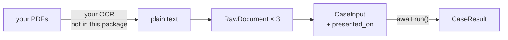

### The code — [`Detector/models/documents.py`](Detector/models/documents.py)

```python
class RawDocument(BaseModel):
    """One uploaded document after text extraction, before the model sees it."""

    document_id: str
    """Stable identifier assigned by the caller (upload id, row id, ...)."""

    text: str
    """Plain text pulled out of the PDF/image. This is the only evidence the agents get."""

    filename: str | None = None
    page_count: int | None = None


class CaseInput(BaseModel):
    """The unit of work: every document presented under one credit."""

    case_id: str
    documents: list[RawDocument] = Field(default_factory=list)
    presented_on: date | None = None
    """The date the documents were presented to the bank, when known. Required for
    the UCP 600 Art 14(c) presentation-period check."""
```

### In

```python
case = CaseInput(
    case_id='case-001',
    presented_on=date(2026, 3, 2),
    documents=[
        RawDocument(document_id='doc-lc',  text=LC_TEXT,      filename='credit.pdf'),
        RawDocument(document_id='doc-inv', text=INVOICE_TEXT, filename='invoice.pdf'),
        RawDocument(document_id='doc-bol', text=BOL_TEXT,     filename='bol.pdf'),
    ],
)

result = await get_pipeline().run(case)
```

Three things worth knowing:

- **`document_id` is yours.** Findings and progress events key on it, and documents come back in
  completion order, not the order you sent them.
- **`presented_on` matters.** Without it the presentation-period check can't run, and the prompt
  tells the model not to guess a date. Leave it out and you silently lose a check.
- **You describe nothing.** There is no field for saying what a document is. A box asking someone to
  label their own upload gets mislabelled or left blank, and either way you can't act on it. It also
  means no operator prose ever reaches a prompt — the only untrusted text in the system is document
  text, and that arrives fenced inside `<document_text>` tags.

---

## 2. `ingest`

**The idea.** The doorman. Before a single model call gets paid for, it asks three questions of the
case and refuses the whole thing if any answer is wrong. Everything downstream is then free to assume
its input is sane.

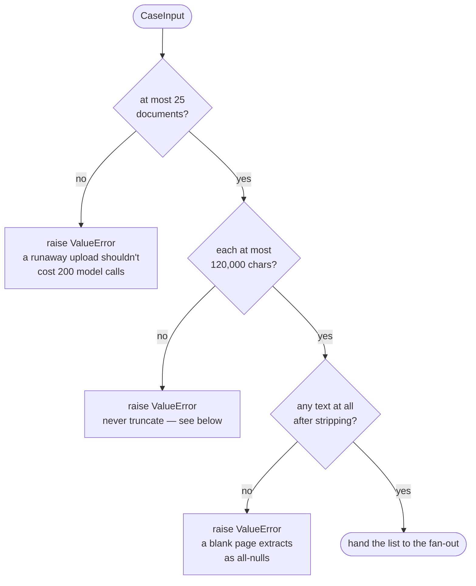

**The middle one is the dangerous one.** A letter of credit cut off halfway **still extracts
successfully** — it just quietly loses whichever terms fell off the end, and reconciliation then finds
nothing wrong with a presentation that actually breaks them. Truncation doesn't produce an error, it
produces a *confident wrong answer*. Failing loudly at the door is the cheapest outcome on the menu.

### The code — [`Detector/services/graph.py`](Detector/services/graph.py)

```python
@builder.step
async def ingest(
    ctx: StepContext[CaseState, DetectorDeps, CaseInput],
) -> list[RawDocument]:
    """Validate the presentation and hand its documents to the fan-out.

    Oversized or oversubscribed cases fail here rather than being silently
    truncated, because a truncated document produces a confident wrong answer.
    """
    case = ctx.inputs
    settings = ctx.deps.settings

    if len(case.documents) > settings.max_documents_per_case:
        raise ValueError(
            f"case {case.case_id} has {len(case.documents)} documents, "
            f"above the limit of {settings.max_documents_per_case}"
        )

    for document in case.documents:
        if len(document.text) > settings.max_document_chars:
            raise ValueError(
                f"document {document.document_id} has {len(document.text)} characters, "
                f"above the limit of {settings.max_document_chars}; split it before submitting"
            )
        if not document.text.strip():
            raise ValueError(f"document {document.document_id} has no extracted text")

    ctx.state.record("ingest", f"accepted {len(case.documents)} document(s)")
    return case.documents
```

A step is just an async function taking a `StepContext`, which gives you three things:

| | Is |
|---|---|
| `ctx.inputs` | this step's input |
| `ctx.deps` | injected services — agents, settings |
| `ctx.state` | a mutable scratchpad for the whole run |

### In → Out

```
in : CaseInput with 3 documents
out: [RawDocument, RawDocument, RawDocument]

[ingest] accepted 3 document(s)
```

Returning a `list` is what sets up the next step.

---

## 3. The fan-out

**The idea.** One clerk reading three documents in turn is slower than three clerks reading one each.
`.map()` hires the three clerks.

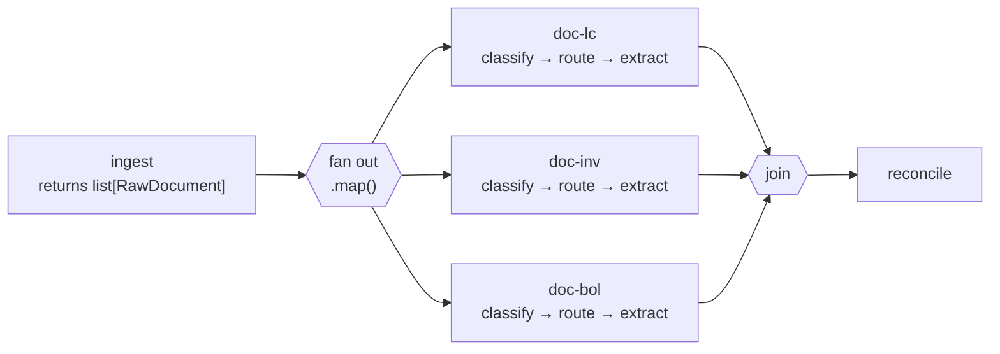

The step signatures are the tell. `ingest` returns `list[RawDocument]` (plural), but `classify` takes
a single `RawDocument` — because by the time `classify` runs, the list has already been split up.

### The code — [`Detector/services/graph.py`](Detector/services/graph.py)

```python
builder.edge_from(ingest)
.label("per document")
.map(fork_id=FAN_OUT_ID, downstream_join_id=COLLECT_ID)
.to(classify),
```

Each lane is fully independent. **doc-lc starts extracting while doc-bol is still classifying** —
there is no phase barrier, only the join at the end.

| 3 documents, 300 ms model calls | Wall clock |
|---|---|
| this pipeline, in parallel | **0.93 s** |
| the same work, sequentially | 2.10 s |

`downstream_join_id` handles one edge case: mapping an *empty* list. Without it, a case with zero
documents would fan out to nothing and the join would wait forever. With it, the fork jumps straight
to the join, which yields its empty initial value and reconciliation reports "no documents presented".

### In → Out

```
in : [RawDocument, RawDocument, RawDocument]     # one list, from ingest
out: 3 independent lanes, one RawDocument each   # all running at the same time
```

Nothing is computed here. The fan-out is pure control flow — it changes *how many things are
happening*, not what any of them are.

---

## 4. `classify`

**The idea.** Every lane opens with the same question: *"what am I holding?"* The answer decides which
form gets filled in next, so it has to be settled first. A deliberately small, cheap call — pick one
label out of nine, don't read anything closely.

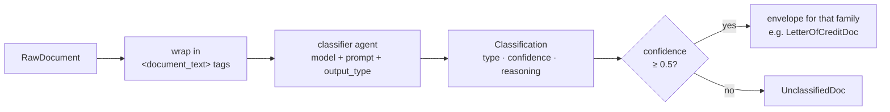

### The agent — [`Detector/services/agents.py`](Detector/services/agents.py)

An agent is **a model + a system prompt + an output type**. The output type does the heavy lifting.

```python
classifier = Agent(
    settings.classifier_model,
    name='document_classifier',
    output_type=Classification,
    instructions=prompts.classifier,
    retries=settings.retries,
    model_settings=_model_settings(...),
)
```

### The prompt — [`Config/prompts.yaml`](Config/prompts.yaml)

```yaml
classifier: |
  You classify raw text extracted from an uploaded trade finance document into exactly one of:
  letter_of_credit, commercial_invoice, bill_of_lading, packing_list, certificate_of_origin,
  insurance_certificate, bill_of_exchange, inspection_certificate, or unknown if it doesn't clearly match any of these.
  Base the decision only on the text given. Look for characteristic markers:
    - letter_of_credit: 'Applicant'/'Beneficiary', LC number, issuing bank
    - commercial_invoice: 'Invoice Number', seller/buyer, line-item pricing
    - bill_of_lading: 'Shipper'/'Consignee'/'Vessel', port of loading/discharge
    - ...
  If it doesn't clearly match one of these, classify as unknown rather than guessing.
```

### How the document is wrapped — [`Detector/services/graph.py`](Detector/services/graph.py)

```python
def _document_prompt(raw: RawDocument) -> str:
    """Wrap one document's text so the model can see its identity and its boundaries."""
    return (
        f"Document id: {raw.document_id}\n"
        f'Filename: {raw.filename or "unknown"}\n'
        f'Pages: {raw.page_count if raw.page_count is not None else "unknown"}\n\n'
        f"<document_text>\n{raw.text}\n</document_text>"
    )
```

Two things that prompt does:

- **It says nothing about what the document is.** The id and filename let the model *refer* to the
  document, not identify it — naming a file `credit.pdf` doesn't make it a credit.
- **The `<document_text>` tags mark where untrusted OCR text starts and stops**, so a scanned document
  containing the words "ignore your instructions" reads as content, not as a command.

### The shape the reply must take — [`Detector/models/documents.py`](Detector/models/documents.py)

```python
class Classification(BaseModel):
    """What the classifier agent decided about a single document."""

    model_config = ConfigDict(extra='forbid', use_attribute_docstrings=True)

    document_type: DocumentType
    """The family this document belongs to, or `unknown` if it doesn't clearly match one."""

    confidence: float = Field(ge=0.0, le=1.0)
    """How sure the classifier is, from 0 to 1."""

    reasoning: str
    """The markers in the text that drove the decision, in one or two sentences."""
```

**Those docstrings are not comments — they are part of the prompt.** Pydantic AI turns the class into
a JSON schema the provider must conform to, and `use_attribute_docstrings=True` lifts each docstring
into the schema as a `description` the model reads at inference time:

```json
"confidence": {
  "description": "How sure the classifier is, from 0 to 1.",
  "minimum": 0.0, "maximum": 1.0, "type": "number"
}
```

So the type definition and the instructions physically cannot drift apart. `extra='forbid'` becomes
`additionalProperties: false`, which is what lets the provider enforce the schema strictly rather than
accepting invented fields.

### The step's two defences — [`Detector/services/graph.py`](Detector/services/graph.py)

```python
    try:
        result = await deps.agents.classifier.run(
            _document_prompt(raw), usage_limits=deps.usage_limits
        )
    except (UsageLimitExceeded, RunCancelled):
        raise                                   # a blown budget must stop the case
    except AgentRunError as exc:
        return UnclassifiedDoc(...)             # a flaky HTTP 500 must not

    classification = result.output
    if classification.confidence < deps.settings.min_classification_confidence:
        return UnclassifiedDoc(raw=raw, classification=classification, usage=usage)

    envelope = ROUTED_DOCUMENT_TYPES[classification.document_type]
    return cast(RoutedDocuments, envelope(raw=raw, classification=classification, usage=usage))
```

| Defence | Why |
|---|---|
| **a failed call degrades one document, not the case** | the other documents still get reconciled, and the gap shows up as a finding rather than a 500 |
| **the exception order** | `UsageLimitExceeded` and `RunCancelled` are *subclasses* of `AgentRunError`, so they must be re-raised first or they'd be swallowed |
| **low confidence → unknown** | a document called a packing list at 0.2 confidence is better treated as unreadable than run through the packing-list extractor, which would produce a plausible extraction of entirely the wrong fields |

### In → Out

```
in : RawDocument(document_id='doc-lc', ...)
out: LetterOfCreditDoc(raw=..., classification=Classification(
         document_type=DocumentType.LETTER_OF_CREDIT,
         confidence=0.97,
         reasoning='Names an issuing bank, an applicant and a beneficiary.'))

[classify] doc-lc:  letter_of_credit   at 0.97
[classify] doc-inv: commercial_invoice at 0.96
[classify] doc-bol: bill_of_lading     at 0.95
```

`result.output` is a **validated object**, not a string to parse. `confidence` is guaranteed to sit
between 0 and 1 because the schema said so and Pydantic checked.

---

## 5. Route

**The idea.** The classifier said "letter of credit". Something now has to send this document to the
LC extractor and not the invoice one.

The whole section exists for one goal: **adding a document family and forgetting to wire it up should
be a type error, not a bug you meet in production.** That explains everything odd-looking below.

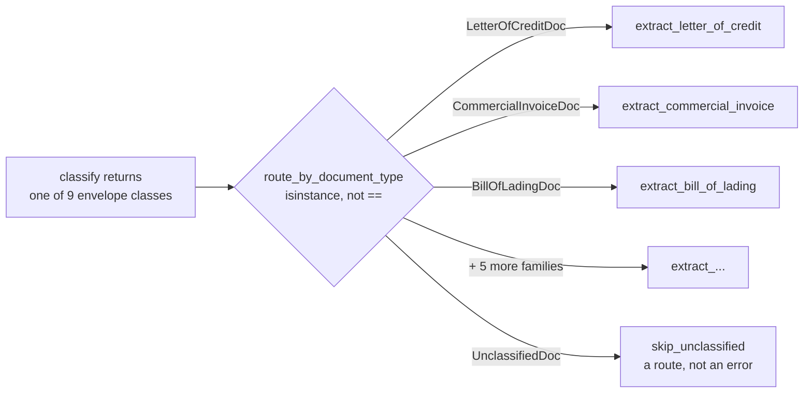

### Step 1 — the version almost every codebase would write

```python
if doc.classification.document_type == DocumentType.LETTER_OF_CREDIT:
    return extract_lc
elif doc.classification.document_type == DocumentType.COMMERCIAL_INVOICE:
    return extract_invoice
elif ...
```

This works. It has one flaw: **nothing checks that the chain is complete.** Add a ninth family next
year, forget one `elif`, and nothing objects — not your editor, not the type checker, not a test you
didn't think to write. You find out in front of a customer.

Nothing *can* check it, either, and the reason is worth naming: `document_type` is a **value**. Values
get compared while the program runs, so a type checker has no way to see which ones you covered.

### Step 2 — make the family a *type* instead of a value

So `classify` hands on **one of nine classes**, one per family, each adding nothing whatsoever:

```python
@dataclass(frozen=True, slots=True)
class LetterOfCreditDoc(RoutedDocument):
    """Routed to the LC extractor."""      # <- the docstring is the entire body
```

Nine classes, nine empty bodies, no new fields between them. Their **only** job is to be nine
*different types* — and then to be named together as one:

```python
type RoutedDocuments = (
    LetterOfCreditDoc | CommercialInvoiceDoc | BillOfLadingDoc | PackingListDoc
    | CertificateOfOriginDoc | InsuranceCertificateDoc | BillOfExchangeDoc
    | InspectionCertificateDoc | UnclassifiedDoc
)
"""Every branch the routing decision must handle."""
```

### Step 3 — dispatch on the type

```python
def _routing_decision() -> Decision[CaseState, DetectorDeps, RoutedDocuments]:
    """The branch table from a classified document to its extractor.

    Branches match on the envelope class, so adding a document family without
    adding a branch here is a type error rather than a silent fall-through.
    """
    return (
        builder.decision(node_id="route_by_document_type", note="UCP 600 document families")
        .branch(builder.match(LetterOfCreditDoc).to(extract_letter_of_credit))
        .branch(builder.match(CommercialInvoiceDoc).to(extract_commercial_invoice))
        .branch(builder.match(BillOfLadingDoc).to(extract_bill_of_lading))
        # ... five more ...
        .branch(builder.match(UnclassifiedDoc).to(skip_unclassified))
    )
```

`builder.match(SomeClass)` is an `isinstance` test rather than a string comparison. At runtime the
behaviour is the same as the `if` chain — but now every branch names a *type*.

### Step 4 — and that is what makes the difference

`Decision` accumulates the types it has handled in a type parameter, branch by branch. So the return
annotation `Decision[..., RoutedDocuments]` is an **assertion that the branch table covers the whole
union**. Miss a family and the accumulated type is narrower, the annotation stops holding, and the
type checker says so — before anything runs.

| | `if` on a string | `match` on a type |
|---|---|---|
| you forget a family | silent fall-through | the annotation fails |
| when you find out | a customer's presentation, in production | in your editor, before the commit |

That guarantee is the entire return on nine otherwise-pointless classes.

### Step 5 — why frozen dataclasses and not Pydantic models

These envelopes live for the few milliseconds between `classify` and `extract` and never cross a
process boundary, so they need no validation, no JSON schema and no serialisation. `frozen=True` makes
them immutable, `slots=True` drops the per-instance dict. They're the cheapest object that can carry a
type.

The classifier's verdict picks the envelope through one table in
[`Detector/models/documents.py`](Detector/models/documents.py):

```python
ROUTED_DOCUMENT_TYPES: dict[DocumentType, type[RoutedDocument]] = {
    DocumentType.LETTER_OF_CREDIT: LetterOfCreditDoc,
    DocumentType.COMMERCIAL_INVOICE: CommercialInvoiceDoc,
    # ... one row per family ...
    DocumentType.UNKNOWN: UnclassifiedDoc,
}
"""Maps a classifier verdict onto the envelope that routes it."""
```

Note that `skip_unclassified` is a branch like any other. "We couldn't read this" is a route, not an
error — which is why an unreadable document still reaches the join and still appears in the report.

### In → Out

```
in : LetterOfCreditDoc(...)
out: dispatched to the extract_letter_of_credit step
```

---

## 6. `extract`

**The idea.** Filling in a form. Routing already decided *which* form — now the specialist for that
family reads the document and writes each value into a named, typed box. Text goes in;
`Decimal('250000.00')` and `date(2026, 3, 15)` come out.

The one instruction that matters: **leave it blank rather than guess.** A blank field is evidence the
next stage can reason about; an invented one is a compliance failure nobody will catch.

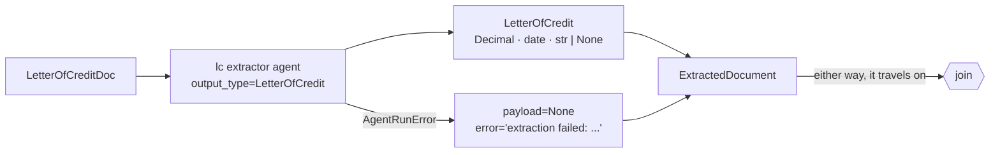

### The output type — [`Detector/models/extractions.py`](Detector/models/extractions.py)

```python
class LetterOfCredit(ExtractionBase):
    """Structured fields of a documentary credit (MT700 style)."""

    kind: Literal[DocumentType.LETTER_OF_CREDIT] = DocumentType.LETTER_OF_CREDIT

    lc_number: str | None = None
    issuing_bank: str | None = None
    applicant: str | None = None
    beneficiary: str | None = None
    credit_amount: Decimal | None = None
    currency: str | None = None
    expiry_date: date | None = None
    latest_shipment_date: date | None = None
    port_of_loading: str | None = None
    port_of_discharge: str | None = None
    description_of_goods: str | None = None

    tolerance_percent: Decimal | None = None
    """Amount tolerance stated on the credit, e.g. 5 for 'about'/'+/- 5 pct'."""

    required_insurance_percent: Decimal | None = None
    """Minimum insured percentage the credit demands, e.g. 110."""

    # ... and 9 more fields; see the file for the full list
```

Three decisions in that block:

| Decision | Why |
|---|---|
| **every field is `\| None = None`** | makes "not present" a legal answer, which is exactly what the prompt asks for |
| **`Decimal` for money, `date` for dates** — never `float`, never `str` | tolerance arithmetic on a float is how you refuse a compliant presentation for being $0.000001 over |
| **`kind` is a single-valued `Literal` with a default** | the model can only ever emit the correct tag, and is never even offered the choice |

### Why `kind` exists — `ExtractionPayload` in three steps

**The problem.** When a document finishes its lane it becomes an `ExtractedDocument`, which has to
carry whatever was pulled out of it. What type is that field? The eight families share almost no
fields:

| `LetterOfCredit` | `CommercialInvoice` | `BillOfLading` |
|---|---|---|
| `lc_number` | `invoice_number` | `bl_number` |
| `credit_amount` | `total_amount` | `shipment_date` |
| `expiry_date` | `invoice_date` | `vessel_name` |

**A plain union isn't enough.** `LetterOfCredit | CommercialInvoice | …` is fine in memory. It breaks
the moment the object is written to a database or an HTTP response and read back, because **JSON has
no classes** — a stored payload is just a bag of keys, and Pydantic has to work out which class to
rebuild. Every field is optional, so most classes fit most bags. With no tag it does not raise, it
*guesses*:

```
in  : {'reference': 'INV-4471', 'amount': '268400.00'}   # this row came off an invoice
out : LooksLikeACredit  <- wrong class, and nothing raised
```

Every later check reading `payload.credit_amount` is now reading an invoice total.

**The fix: write the answer into the data.**

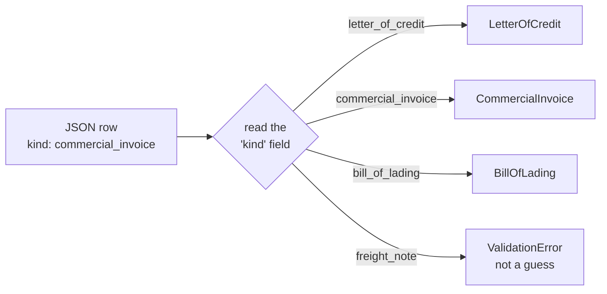

```python
ExtractionPayload = Annotated[
    LetterOfCredit | CommercialInvoice | …,   # (1) the choices
    Field(discriminator='kind'),              # (2) how to choose
]
```

One English sentence: **"one of these eight — read `kind` to know which."** `Annotated[X, Y]` creates
no new type; it is `X` with a note `Y` stapled on for tools that care. To a type checker
`ExtractionPayload` is just the eight-way union; to Pydantic it is a **tagged union**, and the
guessing is gone.

Two names, opposite directions — worth not mixing up:

| | Direction | Used when |
|---|---|---|
| `ExtractionPayload` | `kind` string ➜ class | rebuilding a payload **out of** JSON |
| `EXTRACTION_PAYLOAD_TYPES` | `DocumentType` ➜ class | picking which agent and schema to run **before** extraction |

Round-tripped through JSON on this case's real data:

```
in  : {'kind': 'commercial_invoice', 'invoice_number': 'INV-4471',
       'total_amount': '268400.00', 'invoice_date': '2026-02-18'}
out : CommercialInvoice
      total_amount = Decimal('268400.00')       <- Decimal, not a string
      invoice_date = datetime.date(2026, 2, 18) <- a real date

back through JSON and equal to the original? True
```

**Where it's used — and where it isn't.** One place: `ExtractedDocument.payload`. Each extraction
agent gets one **concrete** class as its `output_type`, never the union, because by the time an agent
runs the routing decision has already fixed the family. The union exists for the payload's life
**after** extraction — through the API response and the database row, and back out a
`CommercialInvoice` rather than a `dict`.

### The agents — [`Detector/services/agents.py`](Detector/services/agents.py)

```python
extractors: dict[DocumentType, ExtractionAgent] = {
    document_type: Agent(
        settings.extraction_model,
        name=f'{document_type.value}_extractor',
        output_type=payload_type,
        instructions=prompts.extractor(document_type),
        retries=settings.retries,
        model_settings=extraction_settings,
    )
    for document_type, payload_type in EXTRACTION_PAYLOAD_TYPES.items()
}
```

Eight separate agents rather than one agent with a dynamic output type, because each family also needs
its own system prompt — and a per-family agent gives per-family spans and per-family retry budgets.

The eight graph steps are likewise **generated, not written out eight times**:

```python
def _extraction_step(document_type: DocumentType) -> Step[...]:
    async def extract(ctx: StepContext[CaseState, DetectorDeps, RoutedDocument]) -> ExtractedDocument:
        return await _extract(ctx, document_type)

    return builder.step(
        extract,
        node_id=f"extract_{document_type.value}",       # its own node in the rendered graph
        label=document_type.value.replace("_", " "),    # and its own instrumentation span
    )


extract_letter_of_credit = _extraction_step(DocumentType.LETTER_OF_CREDIT)
extract_commercial_invoice = _extraction_step(DocumentType.COMMERCIAL_INVOICE)
# ... six more ...
```

### The prompt — [`Config/prompts.yaml`](Config/prompts.yaml)

```yaml
lc_extractor: |
  You extract structured information from a Letter of Credit (LC) document.
  Only use information explicitly found in the text provided. If a field is not present,
  leave it null rather than guessing. Normalize dates to ISO format (YYYY-MM-DD) when possible.
  Target fields:
    - lc_number, issuing_bank, advising_bank, applicant, beneficiary
    - credit_amount, currency, issue_date, expiry_date, expiry_place
    - latest_shipment_date, port_of_loading, port_of_discharge, place_of_delivery
    - description_of_goods, partial_shipments_allowed, transhipment_allowed, presentation_period
```

Note how much work the prompt *doesn't* do. It never describes field types or formats —
`output_type=LetterOfCredit` already told the model every field name, type and description. The prompt
sets the **policy**: only what's in the text, null rather than a guess.

### The result carrier — [`Detector/models/documents.py`](Detector/models/documents.py)

```python
class ExtractedDocument(BaseModel):
    """The output of one document's classify-then-extract branch."""

    document_id: str
    document_type: DocumentType
    confidence: float
    classification_reasoning: str
    filename: str | None = None
    payload: ExtractionPayload | None = None
    """`None` when the document was unclassifiable or extraction failed."""

    error: str | None = None
    """Why `payload` is `None`, when it is."""

    usage: TokenUsage = TokenUsage()

    @property
    def is_usable(self) -> bool:
        """Whether this document can contribute evidence to reconciliation."""
        return self.payload is not None
```

`payload` and `error` are complementary — exactly one is set. A document whose extraction failed
**still travels on to reconciliation** carrying its error, so the failure becomes a warning in the
report instead of a stack trace in your logs.

### In → Out

**The real extracted payload for doc-lc:**

```json
{
  "kind": "letter_of_credit",
  "lc_number": "LC-2026-88431",
  "issuing_bank": "Meridian Commercial Bank, Singapore",
  "applicant": "Harborline Trading Pte Ltd, Singapore",
  "beneficiary": "Anand Textiles Pvt Ltd, Tirupur, India",
  "credit_amount": "250000.00",
  "currency": "USD",
  "expiry_date": "2026-03-15",
  "latest_shipment_date": "2026-02-20",
  "port_of_loading": "Chennai, India",
  "port_of_discharge": "Singapore",
  "description_of_goods": "40,000 pcs 100% cotton knitted t-shirts, CIF Singapore",
  "tolerance_percent": "5"
}
```

In Python those are **real types**, not strings that look like values:

```python
>>> type(payload.credit_amount)      # Decimal('250000.00')
<class 'decimal.Decimal'>
>>> type(payload.expiry_date)        # datetime.date(2026, 3, 15)
<class 'datetime.date'>
```

Notice that `Tolerance: +/- 5 PCT` in the raw text became `tolerance_percent: 5`. That normalisation
is why the amount check downstream is a single subtraction.

```
[extract] doc-lc:  extracted letter_of_credit
[extract] doc-inv: extracted commercial_invoice
[extract] doc-bol: extracted bill_of_lading
```

---

## 7. The join

**The idea.** The three lanes set off together but finish at different times. The join is the desk they
each hand their finished form to; when the last one arrives, the whole pile moves on as a single list.

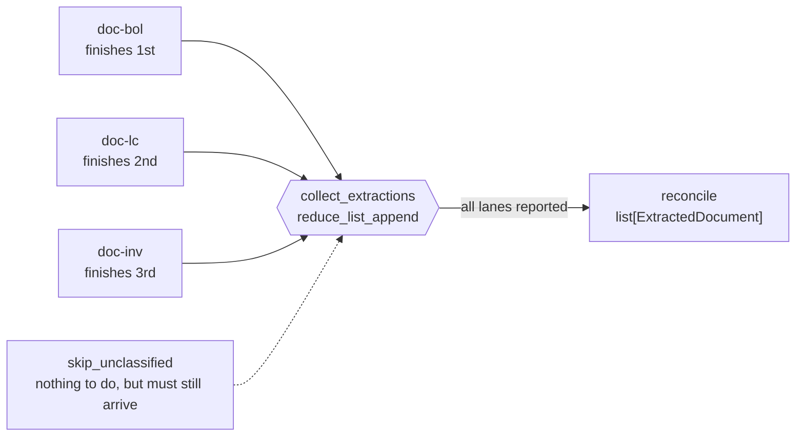

Two consequences worth carrying forward:

- **Results arrive in completion order, not submission order.** doc-bol may well come back before
  doc-lc. That is why every finding keys on `document_id` and never on a position in a list.
- **Every lane has to arrive — including the ones with nothing to do.** An unclassified document has
  no extractor to visit, so `skip_unclassified` exists purely to walk it to the join. Delete it and
  the join waits forever for a lane that never reports, and the case hangs.

### The code — [`Detector/services/graph.py`](Detector/services/graph.py)

```python
COLLECT_ID = "collect_extractions"
"""Node id of the join. Named so the fan-out can point at it for the empty-case path."""

collect = builder.join(
    reduce_list_append,
    initial_factory=list[ExtractedDocument],
    node_id=COLLECT_ID,
)
"""Gathers one `ExtractedDocument` per presented document, in completion order."""
```

`reduce_list_append` is Pydantic Graph's built-in reducer — *append each result to the accumulator*.
`initial_factory=list[ExtractedDocument]` works because calling a generic alias constructs the
underlying type: `list[int]()` is `[]`. The join's parent fork is inferred automatically.

### The unclassified path

```python
@builder.step(node_id="skip_unclassified", label="unknown")
async def skip_unclassified(
    ctx: StepContext[CaseState, DetectorDeps, UnclassifiedDoc],
) -> ExtractedDocument:
    """Carry an unrecognised document through to the join without extracting it.

    It still reaches reconciliation so the examiner sees that something was
    presented that the pipeline could not read.
    """
    routed = ctx.inputs
    ctx.state.record("skip", "not recognised as a known document family", ...)
    return ExtractedDocument(
        document_id=routed.raw.document_id,
        document_type=DocumentType.UNKNOWN,
        payload=None,
        error="document type could not be determined; not extracted",
        ...
    )
```

### In → Out

```
in : 3 ExtractedDocument, arriving in completion order
out: [ExtractedDocument, ExtractedDocument, ExtractedDocument]
```

---

## 8. `reconcile`

**The idea.** Everything up to now was preparation. This is the actual job: one model call that sees
every document's typed fields laid out side by side, and is asked what disagrees.

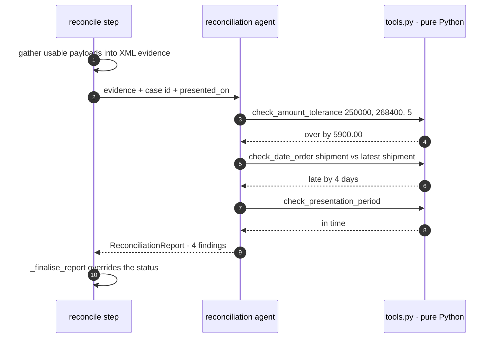

**Why XML here, when everything else is JSON?** The evidence is a stack of nested records the model has
to *read*, not parse. Tagged blocks keep every field name pressed against its value at every level of
nesting, so `<port_of_discharge>Singapore</port_of_discharge>` stays unambiguous three documents deep
— and a field that is absent is visibly absent, rather than a `null` sitting in a list of commas.

### Building the evidence — [`Detector/services/graph.py`](Detector/services/graph.py)

```python
def _reconciliation_prompt(state: CaseState, documents: Sequence[ExtractedDocument]) -> str:
    """Render the extracted documents as the evidence for the compliance check."""
    evidence = [
        {
            "document_id": document.document_id,
            "document_type": document.document_type.value,
            "classification_confidence": round(document.confidence, 2),
            "fields": document.payload,
        }
        for document in documents
    ]
    parts = [f"Case: {state.case_id}", f"Documents presented: {len(documents)}"]
    if state.presented_on is not None:
        parts.append(f"Date of presentation: {state.presented_on.isoformat()}")
    else:
        parts.append(
            "Date of presentation: not supplied. Do not raise a presentation-period "
            "finding on a date you had to assume."
        )
    parts.append(
        "\nUse the deterministic tools for every date and amount comparison rather than "
        "computing them yourself, and quote the figures they return in your findings.\n"
    )
    parts.append(format_as_xml(evidence, root_tag="extracted_documents", item_tag="document"))
    return "\n".join(parts)
```

**The rendered prompt, exactly as sent** (two of the three documents shown):

```xml
Case: case-001
Documents presented: 3
Date of presentation: 2026-03-02

Use the deterministic tools for every date and amount comparison rather than
computing them yourself, and quote the figures they return in your findings.

<extracted_documents>
  <document>
    <document_id>doc-bol</document_id>
    <document_type>bill_of_lading</document_type>
    <classification_confidence>0.95</classification_confidence>
    <fields>
      <kind>bill_of_lading</kind>
      <bl_number>MSCU-772311</bl_number>
      <shipper>Anand Textiles Pvt Ltd, Tirupur, India</shipper>
      <consignee>To order of Meridian Commercial Bank</consignee>
      <vessel_name>MV NORTHERN STAR</vessel_name>
      <port_of_loading>Chennai, India</port_of_loading>
      <port_of_discharge>Port Klang, Malaysia</port_of_discharge>
      <shipment_date>2026-02-24</shipment_date>
      <description_of_goods>40,000 pcs cotton knitted t-shirts</description_of_goods>
    </fields>
  </document>
  <document>
    <document_id>doc-lc</document_id>
    <document_type>letter_of_credit</document_type>
    <classification_confidence>0.97</classification_confidence>
    <fields>
      <kind>letter_of_credit</kind>
      <lc_number>LC-2026-88431</lc_number>
      <issuing_bank>Meridian Commercial Bank, Singapore</issuing_bank>
      <applicant>Harborline Trading Pte Ltd, Singapore</applicant>
      <beneficiary>Anand Textiles Pvt Ltd, Tirupur, India</beneficiary>
      <credit_amount>250000.00</credit_amount>
      <currency>USD</currency>
      <expiry_date>2026-03-15</expiry_date>
      <latest_shipment_date>2026-02-20</latest_shipment_date>
      <port_of_loading>Chennai, India</port_of_loading>
      <port_of_discharge>Singapore</port_of_discharge>
      <description_of_goods>40,000 pcs 100% cotton knitted t-shirts, CIF Singapore</description_of_goods>
      <tolerance_percent>5</tolerance_percent>
    </fields>
  </document>
  <!-- doc-inv omitted here for length; it is rendered the same way -->
</extracted_documents>
```

**This is the payoff of splitting into stages.** The hard reasoning step reads a tidy, typed table —
never raw OCR text.

### The prompt — [`Config/prompts.yaml`](Config/prompts.yaml)

```yaml
reconciliation_engine: |
  You are a trade finance documentary-compliance checker, modeled on how a bank operations
  analyst checks documents against UCP 600 style rules and ISBP 745 international standards.
  You are given structured extractions from trade documents ... which you can rely on as the
  single source of truth for field values.

  Cross-check these fields across all the documents where applicable:
    - Party names: Applicant vs Buyer vs Consignee; Beneficiary vs Seller vs Shipper vs Drawer
    - Amount and Currency: Invoice amount must not exceed LC amount (subject to tolerances e.g. UCP 600 Art 30) ...
    - Goods description: invoice must strictly correspond with LC description (UCP 600 Art 18c), while
      other documents may use general terms not conflicting with the LC.
    - Ports and Transport, Dates, Document References, Quantities and Weights ...

  For every mismatch, cite exactly which documents disagree and explain the discrepancy
  in plain language a bank ops person would understand. Classify the severity:
    - 'critical': anything causing a documentary discrepancy under LC rules
    - 'warning': ambiguities or differences worth a human examiner look
```

### The arithmetic is not the model's job — [`Detector/services/tools.py`](Detector/services/tools.py)

The model is good at *noticing* that an invoice amount and a credit amount ought to be compared. It is
not reliable at doing the comparison. "268,400 against 250,000 with a 5% tolerance" is three
operations, and a model that gets one of them slightly wrong writes a confident, wrong,
impossible-to-falsify sentence.

So the noticing stays with the model and the arithmetic moves into Python:

| The model decides | Python computes |
|---|---|
| *these two amounts should be compared, and the credit states 5%* | `250000 × 1.05 = 262500`; `268400 − 262500 = 5900` → over |
| *this shipment date should be checked against that deadline* | `2026-02-24` vs `2026-02-20` → 4 days late |

Four pure functions are registered as tools:

| Tool | Checks | Rule |
|---|---|---|
| `check_amount_tolerance` | presented amount against credit + stated tolerance | UCP 600 Art 30(a) |
| `check_insurance_coverage` | insured sum against a percentage floor of goods value | UCP 600 Art 28(f)(ii) |
| `check_date_order` | one date falls on or before another, with the gap in days | — |
| `check_presentation_period` | documents reached the bank in time | UCP 600 Art 14(c) |

One of them in full — the others follow the same shape:

```python
def check_amount_tolerance(
    credit_amount: Decimal,
    presented_amount: Decimal,
    tolerance_percent: Decimal = _ZERO,
) -> AmountVerdict:
    """Check a presented amount against a credit amount plus its stated tolerance.

    Use for invoice-against-LC and draft-against-LC amount checks. UCP 600 Art 30(a)
    allows a tolerance only when the credit states one ('about', '+/- 5 pct'); with no
    stated tolerance pass 0 and the credit amount is a hard ceiling.

    Args:
        credit_amount: The amount available under the credit.
        presented_amount: The amount actually drawn or invoiced.
        tolerance_percent: Tolerance the credit permits, as a percentage (5 means 5%).
    """
    permitted = credit_amount * (_HUNDRED + tolerance_percent) / _HUNDRED
    difference = presented_amount - permitted
    passed = difference <= _ZERO
    detail = (
        f'presented {presented_amount} against credit {credit_amount} '
        f'with {tolerance_percent}% tolerance (ceiling {permitted}): '
        f'{"within" if passed else f"over by {difference}"}'
    )
    return AmountVerdict(
        passed=passed, detail=detail, difference=difference, permitted_maximum=permitted
    )
```

Registering them is one argument on the agent. Pydantic AI derives each tool's JSON schema from the
signature and its description from the docstring — **the `Args:` section becomes the per-parameter
descriptions**, which is why these docstrings cite UCP articles. They're written for the model.

**Run on this case's real extracted values — no model involved:**

```python
check_amount_tolerance(Decimal('250000.00'), Decimal('268400.00'), Decimal('5'))
# passed=False
# 'presented 268400.00 against credit 250000.00 with 5% tolerance
#  (ceiling 262500.00): over by 5900.00'

check_date_order('shipment date', date(2026, 2, 24), 'latest shipment date', date(2026, 2, 20))
# passed=False
# 'shipment date 2026-02-24 vs latest shipment date 2026-02-20: late by 4 day(s)'

check_presentation_period(date(2026, 2, 24), date(2026, 3, 15), date(2026, 3, 2))
# passed=True
# 'presented 2026-03-02 against deadline 2026-03-15 (set by the expiry date): in time'
```

Two things to notice:

- **The tools return the numbers, not just yes/no.** That `detail` string is built to be quoted
  straight into a finding, which is why the report can say "over by USD 5,900.00" and be exactly right.
- **The third check passes, and says which rule bound it.** 02-24 + 21 days is 03-17, but the credit
  expires 03-15, so expiry binds; they presented on 03-02, comfortably in time. That Art 14(c) rule
  lives in code, not in a prompt, so it can't drift.

### The agent — [`Detector/services/agents.py`](Detector/services/agents.py)

```python
reconciler = Agent(
    settings.reconciliation_model,
    name='reconciliation_engine',
    output_type=ReconciliationReport,
    instructions=prompts.reconciliation,
    tools=RECONCILIATION_TOOLS,
    retries=settings.retries,
    model_settings=_model_settings(...),
)
```

Reasoning budget is spent where the judgement is:

| Stage | `thinking` |
|---|---|
| classification — pattern matching | `low` |
| extraction — messy OCR, unlabelled fields | `medium` |
| **reconciliation — the compliance judgement** | **`high`** |

### The output type — [`Detector/models/reconciliation.py`](Detector/models/reconciliation.py)

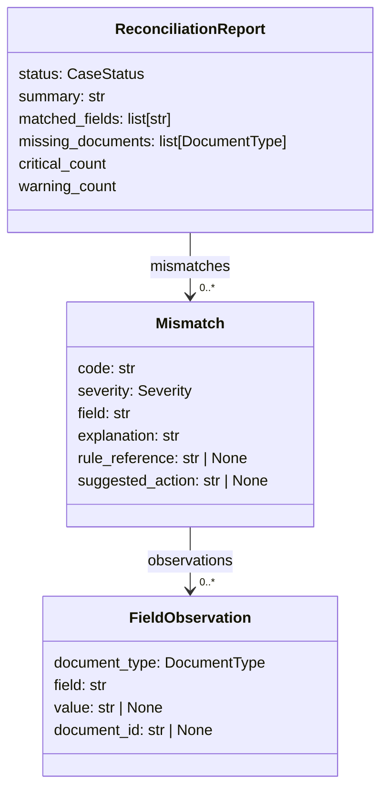

```python
class Mismatch(BaseModel):
    """A single discrepancy between two or more presented documents."""

    code: str
    """Short stable slug for this kind of discrepancy, e.g. 'late_shipment'."""

    severity: Severity
    """critical = the bank would refuse; warning = a human should look; info = cosmetic."""

    field: str
    """The business field in dispute, e.g. 'Beneficiary' or 'Port of Discharge'."""

    explanation: str
    """Plain language a bank ops person would understand: what disagrees and why it matters."""

    documents_involved: list[DocumentType] = Field(default_factory=list)
    observations: list[FieldObservation] = Field(default_factory=list)
    """The conflicting values, one entry per document."""

    rule_reference: str | None = None
    """The UCP 600 article or ISBP 745 paragraph relied on, when one applies."""

    suggested_action: str | None = None
    """What the beneficiary or the bank would do to cure it."""
```

`code` is a stable slug so you can aggregate across thousands of cases (*what do we get refused for
most often?*). `observations` carries the conflicting values themselves, so a UI can show the
disagreement side by side rather than making the user re-open both PDFs.

### The step — [`Detector/services/graph.py`](Detector/services/graph.py)

```python
@builder.step
async def reconcile(
    ctx: StepContext[CaseState, DetectorDeps, list[ExtractedDocument]],
) -> CaseResult:
    """Cross-check the extracted documents and assemble the case result."""
    state = ctx.state
    documents = sorted(ctx.inputs, key=lambda document: document.document_id)
    usable = [document for document in documents if document.is_usable]

    if not usable:
        report = _no_evidence_report(documents)
        state.record("reconcile", "no usable extractions; skipped the compliance check")
    else:
        result = await ctx.deps.agents.reconciler.run(
            _reconciliation_prompt(state, usable), usage_limits=ctx.deps.usage_limits
        )
        report = _finalise_report(result.output, documents)
        state.record("reconcile", f"{report.status.value}: ...", usage=result.usage)

    return CaseResult(
        case_id=state.case_id,
        status=report.status,
        report=report,
        documents=documents,
        usage=state.usage_snapshot(),
        started_at=state.started_at,
        completed_at=datetime.now(UTC),
    )
```

Documents are sorted by id first, so runs are reproducible even though results arrived in completion
order. If nothing could be extracted the model call is skipped entirely — there's nothing to compare,
and asking anyway would invite invention.

### In → Out

```
in : [ExtractedDocument × 3]
out: CaseResult(status=BLOCKED, report=ReconciliationReport(...), documents=[...])

[reconcile] blocked: 3 critical, 0 warning
```

---

## 9. The status rule

**The idea.** The model is asked for a verdict, and then the code ignores its answer and works the
verdict out itself. Not because the model is usually wrong — but because "is this blocked?" is a
lookup, not an opinion, and a lookup should never be left to something capable of having an off day.

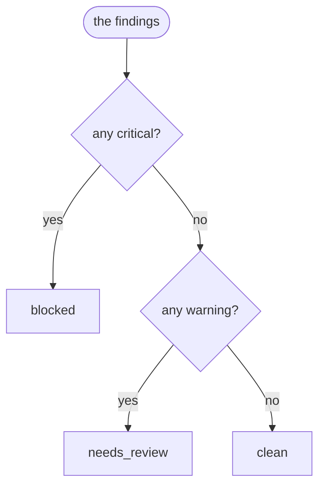

Three lines of Python, and the most load-bearing function in the project. It is the difference between
a system whose worst case is *"flagged something it needn't have"* and one whose worst case is *"told
a bank that a discrepant presentation was clean"*.

### The code — [`Detector/services/graph.py`](Detector/services/graph.py)

```python
def _derive_status(mismatches: Sequence[Mismatch]) -> CaseStatus:
    """Map findings to a verdict.

    The prompt asks the model for this too, but the mapping is a rule, not a
    judgement, so the rule wins: a report with a critical finding is blocked
    whatever the model wrote in `status`.
    """
    severities = {mismatch.severity for mismatch in mismatches}
    if Severity.CRITICAL in severities:
        return CaseStatus.BLOCKED
    if Severity.WARNING in severities:
        return CaseStatus.NEEDS_REVIEW
    return CaseStatus.CLEAN


def _finalise_report(
    report: ReconciliationReport, documents: Sequence[ExtractedDocument]
) -> ReconciliationReport:
    """Sort the findings, enforce the status rule, and flag unreadable documents."""
    mismatches = sorted(report.mismatches, key=lambda m: _SEVERITY_ORDER[m.severity])
    unreadable = [document for document in documents if not document.is_usable]
    if unreadable:
        mismatches.append(
            Mismatch(
                code="document_not_extracted",
                severity=Severity.WARNING,
                field="document set",
                explanation=(
                    f"{len(unreadable)} presented document(s) could not be read into structured "
                    "fields and took no part in the cross-checks: "
                    + ", ".join(f"{d.document_id} ({d.error})" for d in unreadable)
                ),
                documents_involved=[DocumentType.UNKNOWN],
                suggested_action="Re-upload a clearer copy, or examine these documents manually.",
            )
        )
        mismatches.sort(key=lambda m: _SEVERITY_ORDER[m.severity])

    return report.model_copy(
        update={"mismatches": mismatches, "status": _derive_status(mismatches)}
    )
```

A report that lists a critical finding and claims `clean` comes back `blocked`, every time.

`_finalise_report` also appends a warning for any document that failed to extract, so an unreadable
scan can't quietly shrink the evidence base without the examiner being told:

```
[warning] 1 presented document(s) could not be read into structured fields and took no
          part in the cross-checks: doc-bol (extraction failed: ...)
```

### And when nothing could be read at all

The model is never called. `_no_evidence_report` returns `needs_review` with a single
`no_usable_documents` warning — because "we compared nothing and found nothing wrong" must never look
like `clean`.

---

## 10. The output

Four findings, sorted worst-first. Three are real problems; the fourth is the trap — the one a naive
field-by-field comparison would report and be wrong about.

Each finding carries the field that disagrees, which documents disagree about it, the UCP 600 article
it rests on, and what to do about it — because "discrepancy found" without a cure is just an obstacle.

### Finding 1 — the invoice is drawn over the credit · `CRITICAL`

| Document | Field | Value |
|---|---|---|
| letter_of_credit | `credit_amount` | USD 250,000.00 ± 5% |
| commercial_invoice | `total_amount` | USD 268,400.00 |

The tolerance gives a ceiling of USD 262,500.00. The invoice is over by **USD 5,900.00**.

*UCP 600 Art 18(b), Art 30(a)* — a tolerance applies only when the credit states one. This one did
("+/- 5 PCT"), and the invoice still breaks it.
**Cure:** amend the credit, or present an invoice within the ceiling.

### Finding 2 — late shipment · `CRITICAL`

| Document | Field | Value |
|---|---|---|
| letter_of_credit | `latest_shipment_date` | 2026-02-20 |
| bill_of_lading | `shipment_date` | 2026-02-24 |

Four days late. The goods went on board after the last date the credit permits.

*UCP 600 Art 20* — the on-board date is the date of shipment.
**Cure:** request an amendment extending the latest shipment date.

### Finding 3 — wrong port of discharge · `CRITICAL`

| Document | Field | Value |
|---|---|---|
| letter_of_credit | `port_of_discharge` | Singapore |
| bill_of_lading | `port_of_discharge` | Port Klang, Malaysia |

The transport document doesn't cover the carriage the credit requires. The goods are going to the
wrong country.

*UCP 600 Art 20(a)(ii)*
**Cure:** obtain a corrected bill of lading, or amend the credit.

### Finding 4 — the red herring · `INFO`

The bill of lading says "cotton knitted t-shirts" where the credit says "**100%** cotton knitted
t-shirts". This looks like a discrepancy and **is not one.**

*UCP 600 Art 14(e)* — on documents other than the invoice, a general description of the goods is fine
as long as it doesn't conflict with the credit. Only the **invoice** must correspond strictly
(Art 18(c)) — and it does, word for word.

Getting this right matters as much as catching the other three. A checker that flags every textual
difference produces so much noise that people stop reading it.

### What agreed

```
beneficiary / seller / shipper  ·  applicant / buyer  ·  LC number quoted on the invoice
·  port of loading  ·  currency
```

Worth reporting: it tells the examiner what was actually checked, so silence on a field means "we
looked" rather than "we forgot".

### The returned object — [`Detector/models/reconciliation.py`](Detector/models/reconciliation.py)

```python
class CaseResult(BaseModel):
    """Everything one run of the pipeline produced. This is what the API returns."""

    case_id: str
    status: CaseStatus
    report: ReconciliationReport
    documents: list[ExtractedDocument] = Field(default_factory=list)
    usage: TokenUsage = TokenUsage()
    started_at: datetime
    completed_at: datetime

    @property
    def duration_seconds(self) -> float:
        """Wall clock time the pipeline took."""
        return (self.completed_at - self.started_at).total_seconds()
```

```python
CaseResult(
    case_id='case-001',
    status=CaseStatus.BLOCKED,       # derived by the rule, not the model's opinion
    report=ReconciliationReport(status=BLOCKED, summary=..., mismatches=[4 findings]),
    documents=[ExtractedDocument × 3],
)
```

**BLOCKED.** The bank refuses. The seller has three things to fix before re-presenting, and two of
them need the buyer's agreement to amend the credit.

---

## 11. The wiring

Every step above is connected here — and validated at **import time**, so a miswired graph fails when
the module loads rather than on the first request in production.

The wiring reads as six sentences:

| The line | In English |
|---|---|
| `edge_from(start).to(ingest)` | start at `ingest` |
| `edge_from(ingest).map(...).to(classify)` | split the list — one `classify` per document |
| `edge_from(classify).to(_routing_decision())` | send each classified document to the switchboard |
| `edge_from(*EXTRACTION_STEPS).to(collect)` | every extractor, and the skip step, reports to the join |
| `edge_from(collect).to(reconcile)` | once all have reported, reconcile the whole pile at once |
| `edge_from(reconcile).to(end)` | and that report is the result |

```python
builder = GraphBuilder(
    name="trade_finance_doc_mismatch",
    state_type=CaseState,
    deps_type=DetectorDeps,
    input_type=CaseInput,
    output_type=CaseResult,
)

EXTRACTION_STEPS: tuple[Step[CaseState, DetectorDeps, Any, ExtractedDocument], ...] = (
    extract_letter_of_credit,
    extract_commercial_invoice,
    # ... six more ...
    skip_unclassified,
)
"""Everything that can feed the join. Ordering only affects the rendered diagram."""


builder.add(
    builder.edge_from(builder.start_node).to(ingest),
    builder.edge_from(ingest)
    .label("per document")
    .map(fork_id=FAN_OUT_ID, downstream_join_id=COLLECT_ID)
    .to(classify),
    builder.edge_from(classify).to(_routing_decision()),
    builder.edge_from(*EXTRACTION_STEPS).to(collect),
    builder.edge_from(collect).label("all documents").to(reconcile),
    builder.edge_from(reconcile).to(builder.end_node),
)

case_graph: Graph[CaseState, DetectorDeps, CaseInput, CaseResult] = builder.build()
"""The built graph. Stateless and safe to share across concurrent runs."""
```

The four type parameters on `GraphBuilder` mean different things:

| Parameter | Meaning | Mutable? |
|---|---|---|
| `input_type` | What the graph is called with | — |
| `output_type` | What the graph returns | — |
| `deps_type` | Injected services, same for the whole run | No — frozen dataclass |
| `state_type` | Scratchpad the run accumulates | Yes |

### State and deps — [`Detector/services/deps.py`](Detector/services/deps.py)

```python
@dataclass(slots=True)
class CaseState:
    """Mutable state for one run of the pipeline.

    The fan-out over documents runs as concurrent tasks on a single event loop.
    The mutations below contain no `await`, so they are atomic with respect to
    each other and need no lock.
    """

    case_id: str
    presented_on: date | None = None
    started_at: datetime = field(default_factory=lambda: datetime.now(UTC))
    usage: RunUsage = field(default_factory=RunUsage)
    events: list[StageEvent] = field(default_factory=list)
    """Ordered audit trail; safe to stream to the client as it grows."""

    def record(self, stage: str, message: str, *, ..., usage: RunUsage | None = None) -> None:
        """Append an audit event and fold in the usage of the call that produced it."""
        if usage is not None:
            self.usage.incr(usage)
        self.events.append(StageEvent(stage=stage, message=message, at=datetime.now(UTC), ...))


@dataclass(frozen=True, slots=True)
class DetectorDeps:
    """Immutable dependencies handed to every step in the graph."""

    agents: AgentRegistry
    settings: Settings
    usage_limits: UsageLimits | None = None
    """Applied per agent run, not per case."""
```

`record()` contains no `await`, which is why concurrent lanes can call it without a lock. That same
event list is what `run_with_progress()` streams to a websocket as the run happens.

### The rendered graph

Derived from the wiring, so it cannot drift out of date:

```python
print(DetectorPipeline.diagram())
```


---

## 12. File map

| Stage | File |
|---|---|
| `CaseInput`, `RawDocument`, routing envelopes, `ExtractedDocument` | [`Detector/models/documents.py`](Detector/models/documents.py) |
| The 8 payload schemas | [`Detector/models/extractions.py`](Detector/models/extractions.py) |
| `Mismatch`, `ReconciliationReport`, `CaseResult` | [`Detector/models/reconciliation.py`](Detector/models/reconciliation.py) |
| `DocumentType`, `Severity`, `CaseStatus` | [`Detector/models/enums.py`](Detector/models/enums.py) |
| Every prompt | [`Config/prompts.yaml`](Config/prompts.yaml) |
| Prompt loading + startup validation | [`Detector/prompts/registry.py`](Detector/prompts/registry.py) |
| The 10 agents | [`Detector/services/agents.py`](Detector/services/agents.py) |
| The 4 deterministic tools | [`Detector/services/tools.py`](Detector/services/tools.py) |
| `CaseState`, `DetectorDeps`, `StageEvent` | [`Detector/services/deps.py`](Detector/services/deps.py) |
| Steps, routing, fan-out, join, status rule, wiring | [`Detector/services/graph.py`](Detector/services/graph.py) |
| `run()` / `run_with_progress()` | [`Detector/services/pipeline.py`](Detector/services/pipeline.py) |
| Every tunable, as `DETECTOR_`-prefixed env vars | [`Detector/core/config.py`](Detector/core/config.py) |
| Logfire configuration and the span helper | [`Detector/core/observability.py`](Detector/core/observability.py) |

### The three ideas worth stealing

1. **Put the schema where the model reads it.** Field docstrings become schema descriptions the model
   sees at inference time, so your types *are* your prompt and the two can't disagree.
2. **Take the arithmetic away from the model.** Anything where "confidently slightly wrong" is
   expensive belongs in a pure function — and it should return the numbers so the model can quote
   them.
3. **Let rules override judgement at the boundary.** The model proposes findings; code derives the
   verdict.
