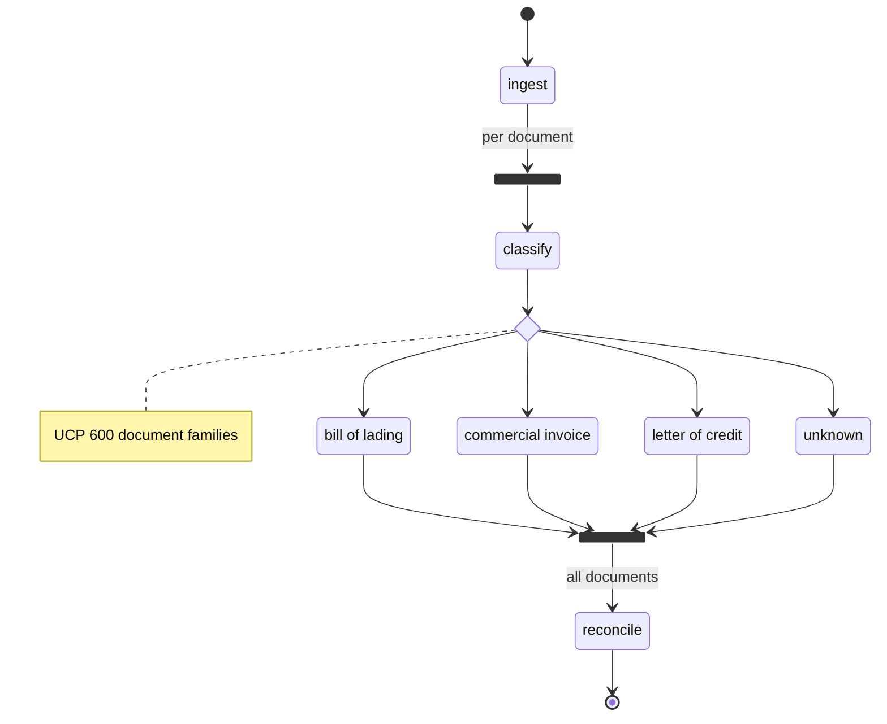
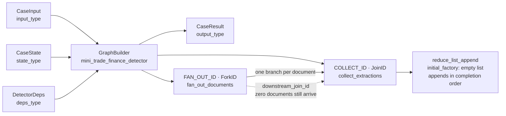
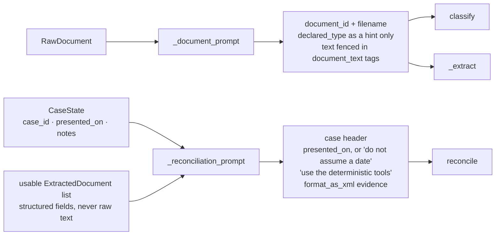
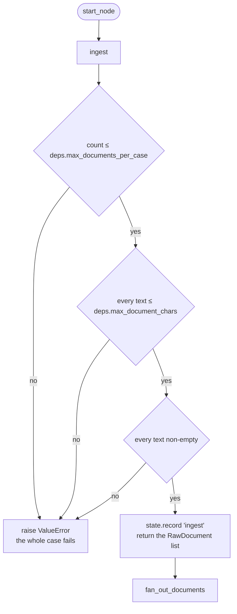
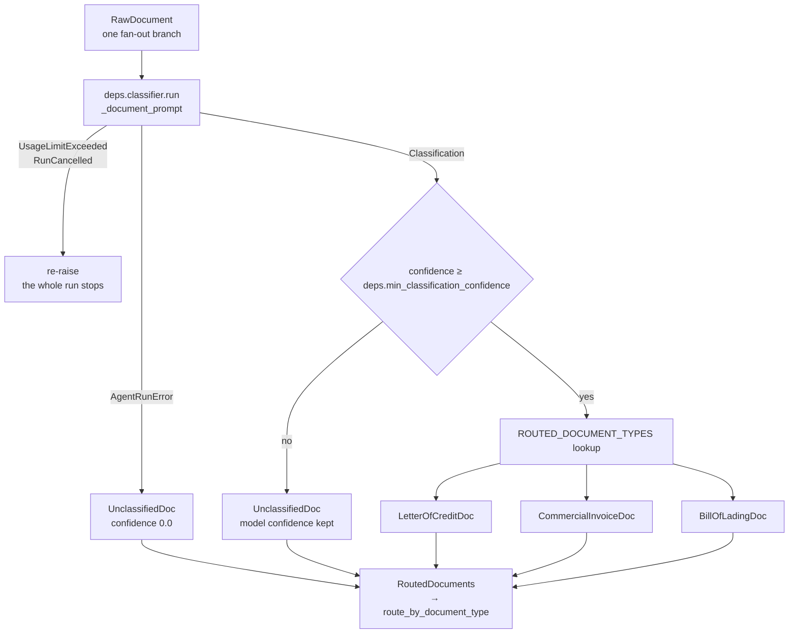
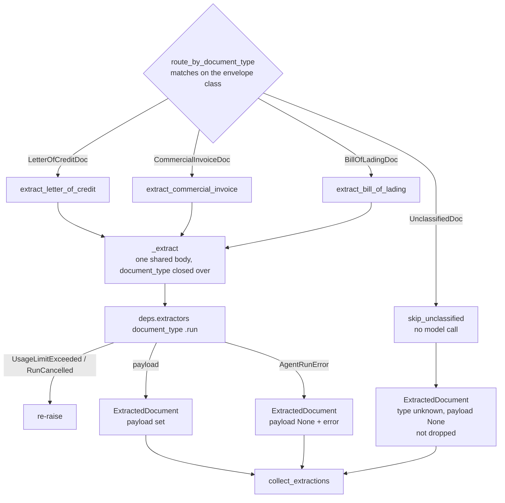
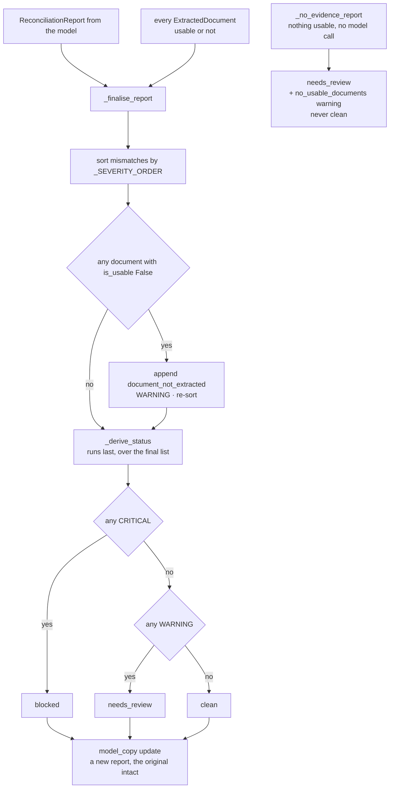
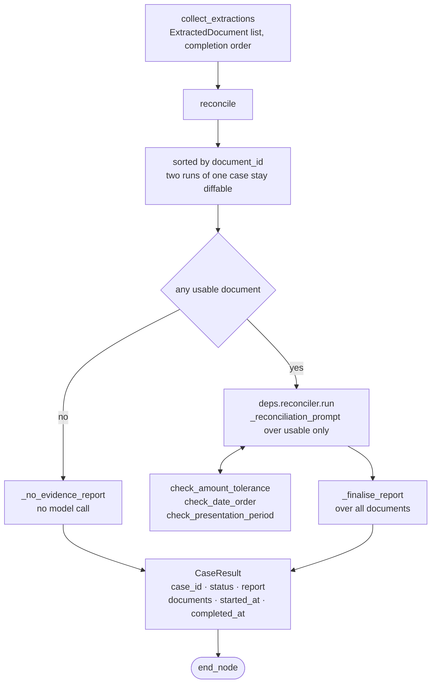
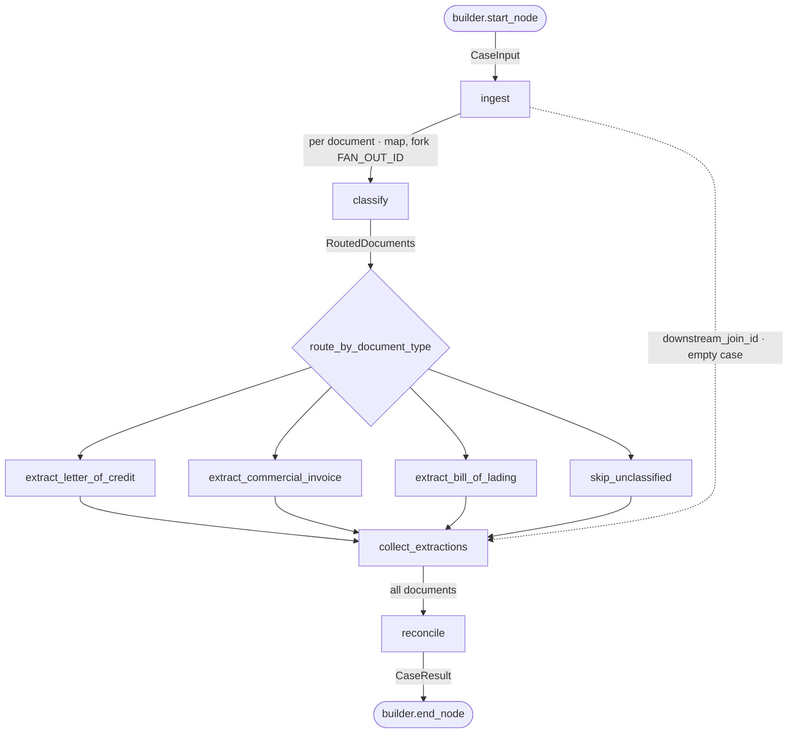
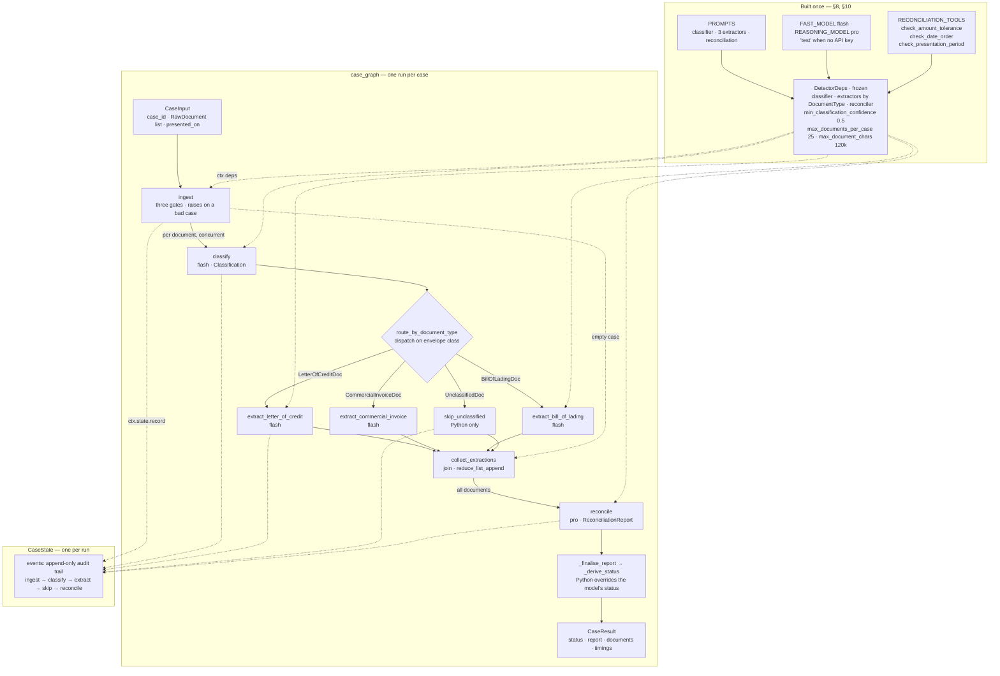

# `mini_detector.ipynb` — a complete walkthrough

This document explains every line of [`mini_detector.ipynb`](mini_detector.ipynb),
a self-contained trade finance document-mismatch detector that runs top to bottom in
one notebook.

The notebook is a **miniature** of the production package in [`Detector/`](Detector/):
three document families instead of eight, one file instead of a package, but the same
architecture — classify each document, extract it under a schema chosen by that
classification, then reconcile the whole set against UCP 600 banking rules.

You do not need to know anything about trade finance to follow along. Part 1 explains
the domain; everything after that is Python.

---

## Contents

| Part | What it covers |
|---|---|
| [Part 0 — Orientation](#part-0--orientation) | What it does, how to run it, what you need |
| [Part 1 — The domain in five minutes](#part-1--the-domain-in-five-minutes) | Letters of credit, discrepancies, why this matters |
| [Part 2 — The shape of a run](#part-2--the-shape-of-a-run) | The pipeline diagram and the one idea behind it |
| [Part 3 — The code, section by section](#part-3--the-code-section-by-section) | §1–§14, every cell explained |
| [Part 4 — Complete symbol reference](#part-4--complete-symbol-reference) | All 72 names the notebook defines |
| [Part 5 — Design decisions](#part-5--design-decisions) | The five choices worth arguing about |
| [Part 6 — Extending and troubleshooting](#part-6--extending-and-troubleshooting) | Adding a family, common failures |
| [Appendix — the whole graph in one picture](#appendix--the-whole-graph-in-one-picture) | Every moving part on one page |

---

## Part 0 — Orientation

### What it does

You hand it a pile of text from documents presented under one letter of credit. It
tells you whether a bank would accept or refuse the presentation, and exactly why.

```
in:   3 documents (a credit, an invoice, a bill of lading) as plain text
out:  VERDICT: BLOCKED
      1. [CRITICAL] Total Amount — overdrawn_amount
         Invoiced 268,400 exceeds the LC maximum of 262,500 (250,000 + 5% tolerance).
         rule: UCP 600 Art 30(a)
      2. [CRITICAL] Shipment Date — late_shipment ...
      3. [CRITICAL] Port of Discharge — port_mismatch ...
```

### Running it

The notebook needs a Google Gemini API key for the final cell only.

```bash
export GEMINI_API_KEY=...      # GOOGLE_API_KEY also works
```

Then run every cell top to bottom.

**Without a key it still runs.** Every agent falls back to pydantic-ai's built-in
`test` model, so §1–§13 execute normally and §14 prints a message and skips itself.
That makes the notebook safe to read and re-run offline; only §14 costs money.

### What it depends on

| Package | Used for |
|---|---|
| `pydantic` | Every data shape. The models *are* the prompts — see §3. |
| `pydantic-ai` | The five agents, structured output, tool calling |
| `pydantic-graph` | The pipeline: fan-out, routing, join |
| `google-genai` | Pulled in by pydantic-ai for the `google:` provider |

Python 3.14+ (the notebook uses PEP 695 `type` statements and `StrEnum`).

### Cost and shape of one run

Seven model calls: three classifications and three extractions that fan out
concurrently, then one reconciliation over the collected evidence.

| Stage | Model | Thinking | Max tokens |
|---|---|---|---|
| Classify | `google:gemini-3.7-flash` | `low` | 2,048 |
| Extract | `google:gemini-3.7-flash` | `medium` | 16,000 |
| Reconcile | `google:gemini-3.1-pro-preview` | `high` | 32,000 |

Classification and extraction are mechanical — find the field, copy the value — so
they run on Flash. Reconciliation is the actual compliance judgement, so it runs on
Pro. See [§10](#10-the-agents).

---

## Part 1 — The domain in five minutes

Skip this if you already know what a documentary credit is.

### The players

A buyer in Singapore wants 40,000 t-shirts from a seller in India. Neither trusts the
other to go first. So the buyer's bank issues a **letter of credit** (LC): a written
promise to pay the seller, provided the seller presents documents proving they shipped
what was agreed.

| Term | Who it is | In the sample case |
|---|---|---|
| **Applicant** | The buyer, who asked for the credit | Harborline Trading Pte Ltd |
| **Beneficiary** | The seller, who gets paid | Anand Textiles Pvt Ltd |
| **Issuing bank** | The bank that promises to pay | Meridian Commercial Bank |

### The documents

The seller ships the goods and presents a set of documents:

| Document | What it proves |
|---|---|
| **Letter of credit** | The terms everything else is judged against |
| **Commercial invoice** | What was sold, and for how much |
| **Bill of lading** | The carrier's receipt — that goods went on board, when, and where to |

### The job

The bank pays against *documents*, not against goods. Nobody at the bank inspects a
t-shirt. So an examiner reads the documents and checks that they agree with the credit
and with each other. Any disagreement is a **discrepancy**, and a discrepancy lets the
bank refuse to pay.

Discrepancies are ordinary and expensive: a large share of first presentations are
refused, and each refusal costs fees and delay. The rules are **UCP 600** (the
Uniform Customs and Practice for Documentary Credits) and **ISBP 745** (the
international standard banking practice that interprets it).

### What "mismatch" means here

Three examples, all planted in the sample case in [§12](#12-a-sample-case):

| Discrepancy | The rule | What went wrong |
|---|---|---|
| Over-drawn amount | UCP 600 Art 30(a) | Invoice is USD 268,400; the credit allows 250,000 **+5%** = 262,500. Over by 5,900. |
| Late shipment | UCP 600 Art 20 | Bill of lading shows on-board 2026-02-24; the credit's latest shipment date is 2026-02-20. Four days late. |
| Port mismatch | UCP 600 Art 20(a)(iii) | Bill of lading discharges at Port Klang, Malaysia; the credit says Singapore. |

Each is fatal on its own. The bank would refuse.

---

## Part 2 — The shape of a run



That diagram is not drawn by hand. It is `case_graph.render()` — generated from the
wiring in [§11.6](#116--wiring-it-together), so it cannot drift out of date.

It is the skeleton. Each subsection of [§11](#11-the-graph) draws the one node it
covers, and the [appendix](#appendix--the-whole-graph-in-one-picture) puts the agents,
the tools and the state back on top of it.

### Why not one big prompt?

You could paste all three documents into one prompt and ask for discrepancies. This
pipeline splits the work instead, for four reasons:

1. **Each stage gets one job.** A classifier that only classifies is easy to make
   accurate. A reconciler handed clean structured fields does not also have to parse
   OCR noise.
2. **The stages have different costs.** Classification is cheap and mechanical;
   reconciliation is the expensive judgement. Splitting lets you spend the money where
   it matters ([§10](#10-the-agents)).
3. **Extraction fans out.** Twenty documents means twenty concurrent branches, not one
   enormous prompt that blows the context window.
4. **Failure stays local.** One unreadable document degrades to a warning; the other
   documents still get checked ([§11.3](#113--the-extractors)).

### The one idea to carry into the code

**The type system does the routing.** When the classifier says "this is a bill of
lading", the notebook does not pass the string `'bill_of_lading'` around. It wraps
the document in a `BillOfLadingDoc` class, and the graph dispatches on that class.

Adding a ninth document family without wiring a branch for it becomes a *type error*
at build time, rather than a silent fall-through at 3am. This is the thread that runs
through [§5](#5-routing-envelopes), [§11.2](#112--classify) and
[§11.6](#116--wiring-it-together).

---

## Part 3 — The code, section by section

Section numbers match the notebook's own headings, so you can read this beside it.

### 1. Setup

```python
from __future__ import annotations

import os
from dataclasses import dataclass, field
from datetime import UTC, date, datetime, timedelta
from decimal import Decimal
from enum import StrEnum
from typing import Annotated, Any, Literal, cast

from pydantic import BaseModel, ConfigDict, Field
```

Standard library and Pydantic only. pydantic-ai does not appear until §9, and that is
deliberate: the first eight sections define *types*, and the types are what the model
is eventually asked to fill in. Get those right and the prompting is almost incidental.

Two imports worth naming:

- **`Decimal`**, never `float`. Money and percentage tolerances are compared for
  exact ceilings; `float` would make `262500.00000000003` possible and a compliance
  finding must not hinge on binary rounding.
- **`from __future__ import annotations`** makes every annotation a string, so forward
  references work anywhere and the dataclasses below never evaluate their field types
  at class-creation time.

### 2. Enumerations

Three closed vocabularies.

```python
class DocumentType(StrEnum):
    LETTER_OF_CREDIT = 'letter_of_credit'
    COMMERCIAL_INVOICE = 'commercial_invoice'
    BILL_OF_LADING = 'bill_of_lading'
    UNKNOWN = 'unknown'


class Severity(StrEnum):
    CRITICAL = 'critical'    # a documentary discrepancy: the bank would refuse
    WARNING = 'warning'      # an ambiguity a human examiner should look at
    INFO = 'info'            # a formatting difference


class CaseStatus(StrEnum):
    CLEAN = 'clean'
    NEEDS_REVIEW = 'needs_review'
    BLOCKED = 'blocked'
```

`StrEnum` rather than `Enum` so members compare equal to their wire strings
(`DocumentType.LETTER_OF_CREDIT == 'letter_of_credit'` is `True`) and serialise to
plain JSON without a custom encoder. That matters because these values cross the model
boundary in both directions.

`UNKNOWN` is a first-class member, not an error case. A document the pipeline cannot
identify still has to travel through to the report — see
[§11.3](#113--the-extractors).

### 3. Extraction payloads — the schema *is* the prompt

This is the section to understand if you only read one.

```python
class ExtractionBase(BaseModel):
    model_config = ConfigDict(extra='forbid', use_attribute_docstrings=True)
```

Two settings, both doing real work:

| Setting | Effect |
|---|---|
| `extra='forbid'` | Emits `additionalProperties: false`. The model cannot invent fields. |
| `use_attribute_docstrings=True` | A docstring under an attribute becomes that field's `description` in the JSON schema. |

**pydantic-ai sends this model's JSON schema to the extractor as its output
contract.** So a `description=` is not a comment for the next developer — it is an
instruction the model reads at inference time:

```python
class LetterOfCredit(ExtractionBase):
    kind: Literal[DocumentType.LETTER_OF_CREDIT] = DocumentType.LETTER_OF_CREDIT

    lc_number: str | None = None
    issuing_bank: str | None = None
    applicant: str | None = Field(
        default=None, description='The buyer, who asked the bank to issue the credit.'
    )
    beneficiary: str | None = Field(
        default=None,
        description='The seller, who gets paid against a compliant presentation.',
    )
    credit_amount: Decimal | None = None
    currency: str | None = None
    expiry_date: date | None = None
    latest_shipment_date: date | None = None
    port_of_loading: str | None = None
    port_of_discharge: str | None = None
    description_of_goods: str | None = None
    tolerance_percent: Decimal | None = Field(
        default=None,
        description="Amount tolerance stated on the credit, e.g. 5 for 'about' / '+/- 5 pct'.",
    )
```

`applicant` and `beneficiary` carry descriptions because "applicant" and "beneficiary"
are jargon whose direction is easy to reverse. `lc_number` does not, because it needs
no explanation. **Write a description exactly where a new hire would ask a question.**

Every field is `| None = None`. An extractor that cannot find a value must return
`null`, never a guess — a hallucinated port of discharge is worse than a missing one,
because a missing one is visible.

`CommercialInvoice` and `BillOfLading` follow the same pattern:

```python
class CommercialInvoice(ExtractionBase):
    kind: Literal[DocumentType.COMMERCIAL_INVOICE] = DocumentType.COMMERCIAL_INVOICE
    invoice_number: str | None = None
    invoice_date: date | None = None
    lc_reference_number: str | None = Field(
        default=None,
        description='The LC number quoted on the invoice, which must match the credit.',
    )
    seller: str | None = None
    buyer: str | None = None
    currency: str | None = None
    total_amount: Decimal | None = None
    description_of_goods: str | None = None


class BillOfLading(ExtractionBase):
    kind: Literal[DocumentType.BILL_OF_LADING] = DocumentType.BILL_OF_LADING
    bl_number: str | None = None
    shipper: str | None = None
    consignee: str | None = None
    vessel_name: str | None = None
    port_of_loading: str | None = None
    port_of_discharge: str | None = None
    shipment_date: date | None = Field(
        default=None,
        description='On-board date; this is what UCP 600 treats as the date of shipment.',
    )
    description_of_goods: str | None = None
```

`shipment_date` earns its description because a bill of lading can show several dates
(issue, received-for-shipment, on-board) and only the on-board date counts under
UCP 600 Art 20.

#### The `kind` field and the tagged union

Every payload carries a constant `kind`:

```python
kind: Literal[DocumentType.LETTER_OF_CREDIT] = DocumentType.LETTER_OF_CREDIT
```

It has one job. When an `ExtractedDocument` is written to JSON and read back, Pydantic
needs to know which of the three classes to rebuild. `kind` is the tag it reads:

```python
ExtractionPayload = Annotated[
    LetterOfCredit | CommercialInvoice | BillOfLading,
    Field(discriminator='kind'),
]
```

Without `discriminator='kind'` Pydantic would try each member in turn and take the
first that validates — and since every field is optional, an invoice would happily
validate as a letter of credit with everything null. The discriminator turns an
ambiguous guess into an O(1) lookup that either matches or fails loudly.

```python
EXTRACTION_PAYLOAD_TYPES: dict[
    DocumentType, type[LetterOfCredit | CommercialInvoice | BillOfLading]
] = {
    DocumentType.LETTER_OF_CREDIT: LetterOfCredit,
    DocumentType.COMMERCIAL_INVOICE: CommercialInvoice,
    DocumentType.BILL_OF_LADING: BillOfLading,
}
```

One table, two consumers: [§10](#10-the-agents) builds one extraction agent per entry,
and the value type is what each agent declares as its `output_type`. The annotation
names the three concrete classes rather than `type[ExtractionBase]` on purpose — with
the base class, `result.output` would be typed `ExtractionBase`, which is not
assignable to `ExtractionPayload`, and the type checker would reject
[§11.3](#113--the-extractors).

Note `DocumentType.UNKNOWN` is absent. There is no schema for a document nobody
recognised, so there is no extractor for it.

### 4. What comes in

```python
class RawDocument(BaseModel):
    document_id: str
    """Stable identifier assigned by the caller (upload id, row id, ...)."""

    text: str
    """Plain text pulled out of the PDF/image. The only evidence the agents get."""

    filename: str | None = None
    declared_type: DocumentType | None = None
    """Type asserted by the uploader, if any. A hint, never the truth."""
```

The notebook starts *after* OCR. `text` is the entire evidence base; no agent sees a
PDF or an image.

`declared_type` is what the uploader claimed. It is passed to the classifier as a hint
and explicitly framed as untrustworthy ([§11 prompt construction](#prompt-construction)),
because an ops user picking the wrong dropdown value must not be able to send a
document to the wrong extractor.

```python
class CaseInput(BaseModel):
    case_id: str
    documents: list[RawDocument] = Field(default_factory=list)
    presented_on: date | None = None
    """When the documents reached the bank. Needed for the UCP 600 Art 14(c) check."""

    notes: str | None = None
    """Free-text context from the ops user, passed to reconciliation."""
```

The unit of work is the **case** — every document presented under one credit — not the
individual document. Checking an invoice alone is meaningless; the whole point is
cross-document agreement.

`presented_on` is optional, and its absence is handled explicitly rather than defaulted
to today: see [`_reconciliation_prompt`](#prompt-construction).

```python
class Classification(BaseModel):
    model_config = ConfigDict(extra='forbid', use_attribute_docstrings=True)

    document_type: DocumentType = Field(
        description="The family this document belongs to, or 'unknown' if it doesn't clearly "
        'match one.'
    )
    confidence: float = Field(
        ge=0.0, le=1.0, description='How sure the classifier is, from 0 to 1.'
    )
    reasoning: str = Field(
        description='The markers in the text that drove the decision, in one or two sentences.'
    )
```

Three fields, each load-bearing:

- `document_type` selects the extractor.
- `confidence` is compared against a threshold in [§11.2](#112--classify). `ge=0.0,
  le=1.0` is enforced by Pydantic, so an out-of-range value triggers a retry rather
  than corrupting the comparison.
- `reasoning` is carried all the way to the final report, so a human can see *why* a
  document was read under the schema it was.

### 5. Routing envelopes

```python
@dataclass(frozen=True, slots=True)
class RoutedDocument:
    raw: RawDocument
    classification: Classification


@dataclass(frozen=True, slots=True)
class LetterOfCreditDoc(RoutedDocument):
    """Routed to the LC extractor."""


@dataclass(frozen=True, slots=True)
class CommercialInvoiceDoc(RoutedDocument):
    """Routed to the invoice extractor."""


@dataclass(frozen=True, slots=True)
class BillOfLadingDoc(RoutedDocument):
    """Routed to the bill of lading extractor."""


@dataclass(frozen=True, slots=True)
class UnclassifiedDoc(RoutedDocument):
    """Not recognised as any known family; skips extraction."""
```

Four subclasses that add **no fields at all**. This looks pointless. It is the most
important trick in the notebook.

Compare the two ways to route a classified document:

```python
# The version almost every codebase writes:
if routed.classification.document_type == DocumentType.LETTER_OF_CREDIT:
    ...
elif routed.classification.document_type == DocumentType.COMMERCIAL_INVOICE:
    ...
# add a ninth family, forget a branch here -> it silently falls through
```

```python
# What this notebook does — dispatch on the class:
builder.match(LetterOfCreditDoc).to(extract_letter_of_credit)
builder.match(CommercialInvoiceDoc).to(extract_commercial_invoice)
# add a ninth family, forget a branch -> the union no longer matches, type error
```

By promoting the classifier's *value* into a *type*, exhaustiveness becomes something
a type checker can verify:

```python
type RoutedDocuments = (
    LetterOfCreditDoc | CommercialInvoiceDoc | BillOfLadingDoc | UnclassifiedDoc
)
```

`classify` declares it returns `RoutedDocuments`, and the decision in
[§11.6](#116--wiring-it-together) must cover that union.

**Why frozen dataclasses and not Pydantic models?** These objects never cross a
serialisation boundary — they exist only between two nodes inside one run. A Pydantic
model would re-validate `raw` and `classification` on every construction, which is
pure cost for data that was validated moments earlier. `slots=True` drops the instance
dict; `frozen=True` means a fan-out branch cannot mutate a document another branch is
reading.

```python
ROUTED_DOCUMENT_TYPES: dict[DocumentType, type[RoutedDocument]] = {
    DocumentType.LETTER_OF_CREDIT: LetterOfCreditDoc,
    DocumentType.COMMERCIAL_INVOICE: CommercialInvoiceDoc,
    DocumentType.BILL_OF_LADING: BillOfLadingDoc,
    DocumentType.UNKNOWN: UnclassifiedDoc,
}
```

The one place the enum still maps to a class, used by `classify`. Unlike
`EXTRACTION_PAYLOAD_TYPES`, this table *does* include `UNKNOWN` — every classifier
verdict needs an envelope, including the one that means "no idea".

#### The output of one branch

```python
class ExtractedDocument(BaseModel):
    document_id: str
    document_type: DocumentType
    confidence: float
    classification_reasoning: str
    payload: ExtractionPayload | None = None
    """`None` when the document was unclassifiable or extraction failed."""

    error: str | None = None
    """Why `payload` is `None`, when it is."""

    @property
    def is_usable(self) -> bool:
        return self.payload is not None
```

What one document's entire journey — classify, route, extract — reduces to.

The `payload`/`error` pair is the notebook's failure model: a branch that fails does
not raise, it returns an `ExtractedDocument` with `payload=None` and an `error` string.
One bad document costs you that document, not the case. `is_usable` is the single
predicate that asks "can this contribute evidence?", used in
[§11.4](#114--the-rule-that-overrides-the-model) and [§11.5](#115--reconcile).

### 6. The findings

The reconciler's output contract, and the richest schema here.

```python
class FieldObservation(BaseModel):
    model_config = ConfigDict(extra='forbid', use_attribute_docstrings=True)

    document_type: DocumentType = Field(description='Which document this value was read from.')
    field: str = Field(
        description="The field name on that document, e.g. 'beneficiary' or 'shipment_date'."
    )
    value: str | None = Field(
        default=None,
        description='The value exactly as extracted, or null if the document omits it.',
    )
```

One document's version of a field under comparison. This is what makes a finding
auditable instead of an assertion — the report shows the conflicting values side by
side, so a human can check the model's claim without reopening the source documents.

```python
class Mismatch(BaseModel):
    model_config = ConfigDict(extra='forbid', use_attribute_docstrings=True)

    code: str = Field(
        description="Short stable slug for this kind of discrepancy, e.g. 'late_shipment'."
    )
    severity: Severity = Field(
        description='critical = the bank would refuse; warning = a human should look; '
        'info = cosmetic.'
    )
    field: str = Field(
        description="The business field in dispute, e.g. 'Beneficiary' or 'Port of Discharge'."
    )
    explanation: str = Field(
        description='Plain language a bank ops person would understand: what disagrees and '
        'why it matters.'
    )
    documents_involved: list[DocumentType] = Field(
        default_factory=list,
        description='Every document family that takes part in this discrepancy.',
    )
    observations: list[FieldObservation] = Field(
        default_factory=list, description='The conflicting values, one entry per document.'
    )
    rule_reference: str | None = Field(
        default=None,
        description='The UCP 600 article or ISBP 745 paragraph relied on, when one applies.',
    )
    suggested_action: str | None = Field(
        default=None, description='What the beneficiary or the bank would do to cure it.'
    )
```

| Field | Why it exists |
|---|---|
| `code` | A stable slug you can count, alert on, and group by across cases. `explanation` is prose and will vary between runs; `code` should not. |
| `severity` | Drives the verdict in §11.4 — and it is the *only* part of the model's output that decides status. |
| `field` | Human-facing name of what disagrees |
| `explanation` | The sentence an ops person reads |
| `documents_involved` | Which families take part, for filtering |
| `observations` | The evidence — see `FieldObservation` above |
| `rule_reference` | `None` when no article applies, rather than a fabricated citation |
| `suggested_action` | The cure: amend, waive, or re-present |

```python
class ReconciliationReport(BaseModel):
    model_config = ConfigDict(extra='forbid', use_attribute_docstrings=True)

    status: CaseStatus = Field(
        description='blocked if any critical finding, needs_review if only warnings, else clean.'
    )
    summary: str = Field(
        description='Two or three sentences an examiner can read before opening the detail.'
    )
    mismatches: list[Mismatch] = Field(
        default_factory=list, description='Every discrepancy found, most severe first.'
    )
    matched_fields: list[str] = Field(
        default_factory=list,
        description='Fields that were cross-checked and agreed across documents.',
    )

    @property
    def critical_count(self) -> int:
        return sum(1 for m in self.mismatches if m.severity is Severity.CRITICAL)

    @property
    def warning_count(self) -> int:
        return sum(1 for m in self.mismatches if m.severity is Severity.WARNING)
```

`matched_fields` is easy to overlook and genuinely useful: it records what was checked
*and agreed*. Without it a clean report is indistinguishable from a lazy one — you
cannot tell whether the model verified twelve fields or gave up after two.

The model is asked for `status`, and then [§11.4](#114--the-rule-that-overrides-the-model)
overrules it. Asking anyway is deliberate: it keeps the model reasoning about the
verdict, which improves the findings, while the code retains the decision.

`critical_count` and `warning_count` are computed properties, so they can never
disagree with `mismatches`.

```python
class CaseResult(BaseModel):
    case_id: str
    status: CaseStatus
    report: ReconciliationReport
    documents: list[ExtractedDocument] = Field(default_factory=list)
    started_at: datetime
    completed_at: datetime

    @property
    def duration_seconds(self) -> float:
        return (self.completed_at - self.started_at).total_seconds()
```

Everything one run produced — the verdict, the findings, and every document including
the ones that failed. This is the shape an API layer would return.

### 7. Deterministic tools — the arithmetic the model is not allowed to do

Tolerance ceilings and date deadlines are exactly the arithmetic a language model gets
subtly wrong, and exactly the arithmetic a bank cannot afford to have wrong. So they
are Python functions registered as **tools**: the model decides *what* to compare,
these decide the answer.

```python
_ZERO = Decimal(0)
_HUNDRED = Decimal(100)


class ToolVerdict(BaseModel):
    model_config = ConfigDict(extra='forbid')

    passed: bool = Field(description='True when the check is satisfied.')
    detail: str = Field(
        description='One line stating the computed numbers, for the agent to quote '
        'in its finding.'
    )


class AmountVerdict(ToolVerdict):
    difference: Decimal = Field(
        description='presented minus permitted; positive means the presentation is over.'
    )
    permitted_maximum: Decimal = Field(
        description='The ceiling or floor the presented amount was compared against.'
    )


class DateVerdict(ToolVerdict):
    days_between: int = Field(
        description='later minus earlier, in days; negative means the dates are out of order.'
    )


class PresentationVerdict(ToolVerdict):
    deadline: date = Field(description='The last day a compliant presentation could be made.')
    days_late: int = Field(
        default=0, description='Days past the deadline; 0 when the presentation was in time.'
    )
```

Every verdict carries `detail`: a pre-formatted sentence stating the computed numbers.
The reconciliation prompt tells the model to quote it. That is how the figures in the
final report come from Python rather than from the model's arithmetic.

#### `check_amount_tolerance`

```python
def check_amount_tolerance(
    credit_amount: Decimal,
    presented_amount: Decimal,
    tolerance_percent: Decimal = _ZERO,
) -> AmountVerdict:
    """Check a presented amount against a credit amount plus its stated tolerance.

    Use for invoice-against-LC and draft-against-LC amount checks. UCP 600 Art 30(a)
    allows a tolerance only when the credit states one ('about', '+/- 5 pct'); with no
    stated tolerance pass 0 and the credit amount is a hard ceiling.

    Args:
        credit_amount: The amount available under the credit.
        presented_amount: The amount actually drawn or invoiced.
        tolerance_percent: Tolerance the credit permits, as a percentage (5 means 5%).
    """
    permitted = credit_amount * (_HUNDRED + tolerance_percent) / _HUNDRED
    difference = presented_amount - permitted
    passed = difference <= _ZERO
    detail = (
        f'presented {presented_amount} against credit {credit_amount} '
        f'with {tolerance_percent}% tolerance (ceiling {permitted}): '
        f'{"within" if passed else f"over by {difference}"}'
    )
    return AmountVerdict(
        passed=passed, detail=detail, difference=difference, permitted_maximum=permitted
    )
```

The docstring is not decoration. **pydantic-ai turns the signature and docstring into
the tool's JSON schema**, so `Args:` entries become parameter descriptions and the
summary tells the model when to reach for it. The `Use for...` sentence is targeting
advice; the UCP 600 note prevents the model from inventing a tolerance the credit
never stated.

```
check_amount_tolerance(Decimal('250000'), Decimal('262501'), Decimal(5))
  -> passed=False, 'presented 262501 against credit 250000 with 5% tolerance
     (ceiling 262500): over by 1'

check_amount_tolerance(Decimal('250000'), Decimal('262500'), Decimal(5))
  -> passed=True,  '... (ceiling 262500): within'
```

Exactly on the ceiling passes. That boundary is why `Decimal` and not `float`.

#### `check_date_order`

```python
def check_date_order(
    earlier_label: str, earlier: date, later_label: str, later: date
) -> DateVerdict:
    """Check that one date falls on or before another, and report the gap in days.

    Use for shipment date against latest shipment date, insurance effective date
    against shipment date, and any other ordering the credit imposes.
    """
    days = (later - earlier).days
    passed = days >= 0
    detail = (
        f'{earlier_label} {earlier.isoformat()} vs {later_label} {later.isoformat()}: '
        f'{"within by" if passed else "late by"} {abs(days)} day(s)'
    )
    return DateVerdict(passed=passed, detail=detail, days_between=days)
```

The `_label` parameters exist so `detail` reads as a sentence about *this* comparison
rather than a generic one — the model passes the business names in, and gets back a
line it can quote verbatim.

```
check_date_order('shipment', date(2026, 2, 24), 'latest shipment', date(2026, 2, 20))
  -> passed=False, 'shipment 2026-02-24 vs latest shipment 2026-02-20: late by 4 day(s)'
```

#### `check_presentation_period`

```python
def check_presentation_period(
    shipment_date: date,
    expiry_date: date,
    presented_on: date,
    presentation_period_days: int = 21,
) -> PresentationVerdict:
    """Check that documents were presented in time.

    Under UCP 600 Art 14(c) a presentation including a transport document must be made
    no later than 21 calendar days after shipment, and in any case no later than the
    credit's expiry date. The effective deadline is the earlier of the two.
    """
    period_deadline = shipment_date + timedelta(days=presentation_period_days)
    deadline = min(period_deadline, expiry_date)
    days_late = max((presented_on - deadline).days, 0)
    passed = days_late == 0
    binding = 'expiry date' if deadline == expiry_date else f'{presentation_period_days}-day period'
    detail = (
        f'presented {presented_on.isoformat()} against deadline {deadline.isoformat()} '
        f'(set by the {binding}): {"in time" if passed else f"late by {days_late} day(s)"}'
    )
    return PresentationVerdict(
        passed=passed, detail=detail, deadline=deadline, days_late=days_late
    )
```

The genuinely tricky rule, and the best argument for tools over prompting. Two
deadlines apply at once and the earlier one binds. `binding` reports *which*, so the
finding can say why:

```
check_presentation_period(date(2026,3,1), date(2026,3,15), date(2026,3,20))
  -> 'presented 2026-03-20 against deadline 2026-03-15 (set by the expiry date): late by 5 day(s)'

check_presentation_period(date(2026,3,1), date(2026,4,30), date(2026,3,30))
  -> 'presented 2026-03-30 against deadline 2026-03-22 (set by the 21-day period): late by 8 day(s)'
```

Same function, different binding constraint. Asking a model to get that consistently
right across thousands of cases is a bet you do not need to take.

```python
RECONCILIATION_TOOLS = [check_amount_tolerance, check_date_order, check_presentation_period]
```

Passed to the reconciler as `tools=` in [§10](#10-the-agents). Plain functions —
pydantic-ai derives the schemas.

### 8. Prompts

```python
PROMPTS: dict[str, str] = { 'classifier': ..., 'letter_of_credit': ...,
                            'commercial_invoice': ..., 'bill_of_lading': ...,
                            'reconciliation': ... }
```

Five system prompts. The three extractor keys are **exactly the `DocumentType`
values**, which is what lets §10 build the extractors in a loop:
`PROMPTS[document_type.value]`.

The classifier prompt lists the markers that distinguish each family and ends with the
instruction that does the most work:

> If it doesn't clearly match one of these, classify as unknown rather than guessing.

The three extraction prompts are near-identical and deliberately thin:

> Only use information explicitly found in the text provided. If a field is not
> present, leave it null rather than guessing. Normalise dates to ISO format.

They are short because the *schema* carries the detail — the field list and every
description come from §3. The prompt only has to set the policy: no guessing,
ISO dates.

The reconciliation prompt is the long one. It names the checks to perform (party
names, amount and currency, goods description, ports, dates, document references),
defines the three severities in banking terms, and closes with:

> Use the deterministic tools for every date and amount comparison rather than
> computing them yourself, and quote the figures they return in your findings.

That sentence appears **twice** — here and again in the per-run prompt built by
`_reconciliation_prompt` — because it is the instruction that keeps the arithmetic in
Python.

In the production package these live in [`Config/prompts.yaml`](Config/prompts.yaml)
so they can be edited without a deploy.

### 9. Deps and state

```python
from pydantic_ai import Agent

type ClassifierAgent = Agent[None, Classification]
type ExtractionAgent = Agent[None, ExtractionPayload]
type ReconcilerAgent = Agent[None, ReconciliationReport]
```

**Read this even if you skim everything else.** `Agent` is generic in two parameters
with defaults:

```python
AgentDepsT  = TypeVar('AgentDepsT',  default=object)
OutputDataT = TypeVar('OutputDataT', default=str)   # <- str
```

So a bare `Agent` does not mean "some agent". It means `Agent[object, str]` — an agent
whose `.output` is a **string**. Annotating a field as `Agent` silently tells every
type checker that `result.output` is text, and every downstream `result.output.confidence`
becomes an error the annotation itself caused.

The three aliases say what each stage actually returns. `None` is the deps parameter:
these agents take no pydantic-ai dependencies of their own.

```python
@dataclass(frozen=True, slots=True)
class DetectorDeps:
    """Immutable dependencies handed to every step in the graph."""

    classifier: ClassifierAgent
    extractors: dict[DocumentType, ExtractionAgent]
    """Keyed by family because a step reaches its agent through `ctx.deps` at run time,
    long after the graph was wired — the routing itself dispatches on type, not on this key."""

    reconciler: ReconcilerAgent
    min_classification_confidence: float = 0.5
    """Below this, treat the document as unclassified rather than trusting the label."""

    max_documents_per_case: int = 25
    max_document_chars: int = 120_000
```

Everything a step needs and cannot get from its input. Frozen, so no step can mutate
what another step is reading.

**Why is `extractors` a dict keyed by `DocumentType`, when §5 argued for type
dispatch?** Because the two are different jobs. The agents live in `deps`, constructed
per run, so an extraction step cannot capture its agent when the graph is *wired* — it
has to look it up at *run time* via `ctx.deps.extractors[document_type]`. The key is
lookup. Dispatch still happens on the envelope class in §11.6.

The three limits are policy, not magic numbers:

| Limit | Default | Purpose |
|---|---|---|
| `min_classification_confidence` | `0.5` | Below this the document is unclassified, not mis-extracted |
| `max_documents_per_case` | `25` | Stops one case fanning out into unbounded model calls |
| `max_document_chars` | `120_000` | Reject an oversized document rather than silently truncate it |

```python
@dataclass(slots=True)
class CaseState:
    """Mutable state for one run of the pipeline."""

    case_id: str
    presented_on: date | None = None
    notes: str | None = None
    started_at: datetime = field(default_factory=lambda: datetime.now(UTC))
    events: list[str] = field(default_factory=list)
    """Ordered audit trail; safe to stream to the client as it grows."""

    def record(self, stage: str, message: str) -> None:
        """Append an audit event. No `await` inside, so concurrent branches can't interleave it."""
        self.events.append(f'{stage}: {message}')
        print(f'   [{stage:9}] {message}')
```

The mutable half, one instance per run. `events` is an append-only audit trail — the
`[classify]` and `[extract]` lines you see when §14 runs.

The comment on `record` is a real concurrency guarantee. Three `classify` branches run
at once on one event loop; because `record` contains no `await`, it runs to completion
before any other branch resumes. Add an `await` inside and events could interleave
mid-append.

`started_at` uses `default_factory` — a bare `datetime.now(UTC)` default would be
evaluated once at class definition and every case would claim the same start time.

### 10. The agents

```python
from pydantic_ai.settings import ModelSettings

HAS_KEY = bool(os.getenv('GEMINI_API_KEY') or os.getenv('GOOGLE_API_KEY'))
"""pydantic-ai's Google provider accepts either name; this repo sets `GEMINI_API_KEY`."""

FAST_MODEL = 'google:gemini-3.7-flash'
"""Classification and extraction are mechanical: locate the field, copy the value out."""

REASONING_MODEL = 'google:gemini-3.1-pro-preview'
"""Reconciliation is the compliance judgement — the one stage worth the stronger model."""

if not HAS_KEY:
    FAST_MODEL = REASONING_MODEL = 'test'
```

The `google:` prefix selects the Gemini Developer API, which reads `GEMINI_API_KEY`
(or `GOOGLE_API_KEY`). Use `google-cloud:` instead for Vertex AI.

The `test` fallback is what makes the notebook readable offline: pydantic-ai's built-in
`test` model satisfies any output schema without a network call, so §9–§13 execute and
§14 skips itself.

```python
def build_deps(fast: str, reasoning: str) -> DetectorDeps:
    """Build the five agents and the deps that carry them into the graph.

    Built once and reused: the agents hold no per-case state.
    """
    classifier = Agent(
        fast,
        name='document_classifier',
        output_type=Classification,
        instructions=PROMPTS['classifier'],
        retries=2,
        model_settings=ModelSettings(max_tokens=2_048, thinking='low'),
    )

    extractors: dict[DocumentType, ExtractionAgent] = {
        document_type: Agent(
            fast,
            name=f'{document_type.value}_extractor',
            output_type=payload_type,
            instructions=PROMPTS[document_type.value],
            retries=2,
            model_settings=ModelSettings(max_tokens=16_000, thinking='medium'),
        )
        for document_type, payload_type in EXTRACTION_PAYLOAD_TYPES.items()
    }

    reconciler = Agent(
        reasoning,
        name='reconciliation_engine',
        output_type=ReconciliationReport,
        instructions=PROMPTS['reconciliation'],
        tools=RECONCILIATION_TOOLS,
        retries=2,
        model_settings=ModelSettings(max_tokens=32_000, thinking='high'),
    )

    return DetectorDeps(classifier=classifier, extractors=extractors, reconciler=reconciler)


detector_deps = build_deps(FAST_MODEL, REASONING_MODEL)
```

Five agents, built once. They hold no per-case state, so the same objects serve every
case concurrently.

`build_deps` returns `DetectorDeps` rather than a tuple of its three parts. That is not
cosmetic — a tuple would restate the same three types the dataclass already declares,
leaving two shapes to keep in step.

`output_type=` is the whole structured-output mechanism: pydantic-ai derives the JSON
schema, sends it as the contract, validates the reply, and on failure feeds the
validation error back for up to `retries=2` attempts.

The extractor loop is why §3's `EXTRACTION_PAYLOAD_TYPES` and §8's `PROMPTS` keys line
up with `DocumentType` values. Adding a family means adding a payload model, a prompt,
and a table entry — never a new `Agent(...)` block.

**The model and thinking split:**

| | Model | Thinking | Max tokens | Why |
|---|---|---|---|---|
| Classifier | Flash | `low` | 2,048 | Pattern matching against a handful of markers |
| Extractors | Flash | `medium` | 16,000 | Messy OCR text, unlabelled fields |
| Reconciler | Pro | `high` | 32,000 | The compliance judgement, plus tool calls |

On Gemini, thinking tokens are billed against `max_tokens`, which is why the budgets
rise with the thinking level rather than with the size of the expected output.

### 11. The graph

```python
from pydantic_ai.exceptions import AgentRunError, RunCancelled, UsageLimitExceeded
from pydantic_ai.format_prompt import format_as_xml
from pydantic_graph import (
    Decision, Graph, GraphBuilder, Step, StepContext, reduce_list_append,
)
from pydantic_graph.id_types import ForkID, JoinID

COLLECT_ID = JoinID('collect_extractions')
"""Node id of the join. Named so the fan-out can point at it for the empty-case path."""

FAN_OUT_ID = ForkID('fan_out_documents')
"""Node id of the map fork over the case's documents."""

_SEVERITY_ORDER = {Severity.CRITICAL: 0, Severity.WARNING: 1, Severity.INFO: 2}

builder = GraphBuilder(
    name='mini_trade_finance_detector',
    state_type=CaseState,
    deps_type=DetectorDeps,
    input_type=CaseInput,
    output_type=CaseResult,
)

collect = builder.join(
    reduce_list_append,
    initial_factory=list[ExtractedDocument],
    node_id=COLLECT_ID,
)
```

`GraphBuilder` is parameterised with all four types up front, so every step declared
below is checked against them.

`JoinID` and `ForkID` are `NewType`s over `str`, not plain strings. `.map()` requires
them, and the wrapper is what stops an arbitrary string being passed as a node id.

The ids are named because the fan-out has to point at the join: with
`downstream_join_id=COLLECT_ID`, a case containing **zero** documents still reaches
`collect` (with an empty list) instead of stranding the graph. That is the empty-case
path.

`collect` is a **join**: it waits for every fan-out branch and reduces their outputs
with `reduce_list_append` into a `list[ExtractedDocument]`, in completion order.

The four type parameters and the two named ids, in one picture:



#### Prompt construction

```python
def _document_prompt(raw: RawDocument) -> str:
    """Wrap one document's text so the model sees its identity and its boundaries."""
    hint = (
        f'\nThe uploader labelled this as {raw.declared_type.value}; treat that as a hint only.'
        if raw.declared_type is not None
        else ''
    )
    return (
        f'Document id: {raw.document_id}\n'
        f'Filename: {raw.filename or "unknown"}{hint}\n\n'
        f'<document_text>\n{raw.text}\n</document_text>'
    )
```

Used by both `classify` and `_extract`. Two details matter:

- The `<document_text>` tags mark where the document starts and ends. Document text is
  untrusted input; delimiting it makes prompt injection from inside a scanned PDF
  meaningfully harder.
- `treat that as a hint only` neutralises the uploader's `declared_type`.

```python
def _reconciliation_prompt(state: CaseState, documents: list[ExtractedDocument]) -> str:
    """Render the extracted documents as the evidence for the compliance check."""
    evidence = [
        {
            'document_id': d.document_id,
            'document_type': d.document_type.value,
            'classification_confidence': round(d.confidence, 2),
            'fields': d.payload,
        }
        for d in documents
    ]
    parts = [f'Case: {state.case_id}', f'Documents presented: {len(documents)}']

    if state.presented_on is not None:
        parts.append(f'Date of presentation: {state.presented_on.isoformat()}')
    else:
        parts.append(
            'Date of presentation: not supplied. Do not raise a presentation-period '
            'finding on a date you had to assume.'
        )
    if state.notes:
        parts.append(f'Operator notes: {state.notes}')

    parts.append(
        '\nUse the deterministic tools for every date and amount comparison rather than '
        'computing them yourself, and quote the figures they return in your findings.\n'
    )
    parts.append(format_as_xml(evidence, root_tag='extracted_documents', item_tag='document'))
    return '\n'.join(parts)
```

The reconciler never sees raw document text — only structured extractions. That is the
point of the two earlier stages: by here, "what does this document say?" is settled,
and the only question left is "do they agree?".

The missing-`presented_on` branch is the notebook's sharpest anti-hallucination move.
The naive fallback is `presented_on or date.today()`, which invents a fact and can
produce a late-presentation finding out of nothing. Instead the prompt states the
absence and forbids the finding.

`format_as_xml` renders the evidence as tagged XML, which models follow more reliably
than deep JSON. `classification_confidence` is included so the reconciler can weigh a
0.55-confidence extraction differently from a 0.99 one.

Both prompt builders, and who consumes them:



#### 11.1 — `ingest`

```python
@builder.step
async def ingest(ctx: StepContext[CaseState, DetectorDeps, CaseInput]) -> list[RawDocument]:
    """Validate the presentation and hand its documents to the fan-out."""
    case = ctx.inputs
    deps = ctx.deps

    if len(case.documents) > deps.max_documents_per_case:
        raise ValueError(
            f'case {case.case_id} has {len(case.documents)} documents, '
            f'above the limit of {deps.max_documents_per_case}'
        )

    for document in case.documents:
        if len(document.text) > deps.max_document_chars:
            raise ValueError(
                f'document {document.document_id} has {len(document.text)} characters, '
                f'above the limit of {deps.max_document_chars}; split it before submitting'
            )
        if not document.text.strip():
            raise ValueError(f'document {document.document_id} has no extracted text')

    ctx.state.record('ingest', f'accepted {len(case.documents)} document(s)')
    return case.documents
```

The cheapest possible gate, placed before a single token is spent. Three checks: too
many documents, one document too large, or a document whose OCR produced nothing.

These `raise` rather than degrade — unlike every later stage. The distinction is
deliberate: a malformed *case* is a caller error and should fail loudly, while a
malformed *document* inside a valid case is an expected condition to be reported.

`ctx` carries `state`, `deps` and `inputs`, all typed by the `StepContext` parameters.

Three gates and one way through:



#### 11.2 — `classify`

```python
@builder.step
async def classify(ctx: StepContext[CaseState, DetectorDeps, RawDocument]) -> RoutedDocuments:
    """Decide which document family this text belongs to, and wrap it for routing."""
    raw = ctx.inputs
    deps = ctx.deps

    try:
        result = await deps.classifier.run(_document_prompt(raw))
    except (UsageLimitExceeded, RunCancelled):
        raise
    except AgentRunError as exc:
        ctx.state.record('classify', f'{raw.document_id}: classification failed: {exc}')
        return UnclassifiedDoc(
            raw=raw,
            classification=Classification(
                document_type=DocumentType.UNKNOWN,
                confidence=0.0,
                reasoning=f'classification failed: {exc}',
            ),
        )

    classification = result.output
    threshold = deps.min_classification_confidence

    if classification.confidence < threshold:
        ctx.state.record(
            'classify',
            f'{raw.document_id}: {classification.document_type.value} at '
            f'{classification.confidence:.2f}, below the {threshold:.2f} threshold; '
            'treating as unclassified',
        )
        return UnclassifiedDoc(raw=raw, classification=classification)

    ctx.state.record(
        'classify',
        f'{raw.document_id}: {classification.document_type.value} '
        f'at {classification.confidence:.2f}',
    )
    envelope = ROUTED_DOCUMENT_TYPES[classification.document_type]
    return cast(RoutedDocuments, envelope(raw=raw, classification=classification))
```

Note the input type: `RawDocument`, singular. This step runs **once per document**, in
parallel — the fan-out in §11.6 is what turns `ingest`'s list into many `classify`
branches.

**The exception ordering is the important part.**

```python
except (UsageLimitExceeded, RunCancelled):
    raise                    # stop the whole run
except AgentRunError as exc:
    ...                      # degrade this document only
```

`UsageLimitExceeded` means the budget is gone and `RunCancelled` means someone pulled
the plug — continuing would burn more of a budget that is already spent. They are
caught first *only* to be re-raised, because both subclass `AgentRunError`; reverse the
order and a cancelled run would quietly turn into a document marked "unclassified".

**The confidence threshold** is the second defence. A 0.3-confidence guess of
"bill of lading" is worse than no guess: send it to the BOL extractor and you get
confidently-shaped nonsense read under the wrong schema. Below the threshold the
document becomes an `UnclassifiedDoc`, which skips extraction and surfaces in the
report as something a human should look at.

The `cast` is required because `ROUTED_DOCUMENT_TYPES` is typed `type[RoutedDocument]`
(the base), while the return type is the narrower union — the dict lookup is correct
by construction but not provably so to a type checker.

Three ways out, and every one of them but the re-raise produces a `RoutedDocuments`:



#### 11.3 — the extractors

```python
async def _extract(
    ctx: StepContext[CaseState, DetectorDeps, RoutedDocument],
    document_type: DocumentType,
) -> ExtractedDocument:
    """Run one family's extraction agent over one document."""
    routed = ctx.inputs
    raw = routed.raw

    base = {
        'document_id': raw.document_id,
        'document_type': document_type,
        'confidence': routed.classification.confidence,
        'classification_reasoning': routed.classification.reasoning,
    }

    try:
        result = await ctx.deps.extractors[document_type].run(_document_prompt(raw))
    except (UsageLimitExceeded, RunCancelled):
        raise
    except AgentRunError as exc:
        ctx.state.record('extract', f'{raw.document_id}: extraction failed: {exc}')
        return ExtractedDocument(**base, payload=None, error=f'extraction failed: {exc}')

    ctx.state.record('extract', f'{raw.document_id}: extracted {document_type.value}')
    return ExtractedDocument(**base, payload=result.output)
```

Same exception discipline as `classify`. `base` holds the fields common to both the
success and failure returns, so the classification metadata cannot drift between the
two paths.

```python
def _extraction_step(
    document_type: DocumentType,
) -> Step[CaseState, DetectorDeps, Any, ExtractedDocument]:
    """Build the graph step that extracts one document family."""

    async def extract(
        ctx: StepContext[CaseState, DetectorDeps, RoutedDocument],
    ) -> ExtractedDocument:
        return await _extract(ctx, document_type)

    return builder.step(
        extract,
        node_id=f'extract_{document_type.value}',
        label=document_type.value.replace('_', ' '),
    )


extract_letter_of_credit = _extraction_step(DocumentType.LETTER_OF_CREDIT)
extract_commercial_invoice = _extraction_step(DocumentType.COMMERCIAL_INVOICE)
extract_bill_of_lading = _extraction_step(DocumentType.BILL_OF_LADING)
```

A factory, because the three extraction steps differ only in which agent they call —
but the graph needs three *distinct nodes* so the diagram and the routing can address
them individually. The closure captures `document_type`; `node_id` and `label` control
how the node appears in the rendered diagram.

```python
@builder.step(node_id='skip_unclassified', label='unknown')
async def skip_unclassified(
    ctx: StepContext[CaseState, DetectorDeps, UnclassifiedDoc],
) -> ExtractedDocument:
    """Carry an unrecognised document through to the join without extracting it.

    It still reaches reconciliation so the examiner sees that something was presented
    which the pipeline could not read.
    """
    routed = ctx.inputs
    ctx.state.record('skip', f'{routed.raw.document_id}: not a known document family')
    return ExtractedDocument(
        document_id=routed.raw.document_id,
        document_type=DocumentType.UNKNOWN,
        confidence=routed.classification.confidence,
        classification_reasoning=routed.classification.reasoning,
        payload=None,
        error='document type could not be determined; not extracted',
    )
```

The fourth branch, and the one that is easy to get wrong. An unrecognised document is
**not** dropped. It travels to the join with `payload=None`, so §11.4 can raise a
warning about it. Silently discarding it would produce a clean report on an incomplete
presentation — the worst possible failure for this system.

Four branches, one shared body, one output type:



#### 11.4 — the rule that overrides the model

```python
def _derive_status(mismatches: list[Mismatch]) -> CaseStatus:
    """Map findings to a verdict. A rule, not a judgement — so it overrides the model."""
    severities = {m.severity for m in mismatches}
    if Severity.CRITICAL in severities:
        return CaseStatus.BLOCKED
    if Severity.WARNING in severities:
        return CaseStatus.NEEDS_REVIEW
    return CaseStatus.CLEAN
```

Six lines that decide the verdict. Any critical finding means `blocked` — that is
arithmetic on severities, not a judgement the model gets to make. If the model returns
`status='clean'` while reporting a critical discrepancy, this overrules it.

```python
def _finalise_report(
    report: ReconciliationReport, documents: list[ExtractedDocument]
) -> ReconciliationReport:
    """Sort the findings, enforce the status rule, and flag unreadable documents."""
    mismatches = sorted(report.mismatches, key=lambda m: _SEVERITY_ORDER[m.severity])

    unreadable = [d for d in documents if not d.is_usable]
    if unreadable:
        mismatches.append(
            Mismatch(
                code='document_not_extracted',
                severity=Severity.WARNING,
                field='document set',
                explanation=(
                    f'{len(unreadable)} presented document(s) could not be read into structured '
                    'fields and took no part in the cross-checks: '
                    + ', '.join(f'{d.document_id} ({d.error})' for d in unreadable)
                ),
                documents_involved=[DocumentType.UNKNOWN],
                suggested_action='Re-upload a clearer copy, or examine these documents manually.',
            )
        )
        mismatches.sort(key=lambda m: _SEVERITY_ORDER[m.severity])

    return report.model_copy(
        update={'mismatches': mismatches, 'status': _derive_status(mismatches)}
    )
```

Three jobs: sort findings most-severe-first via `_SEVERITY_ORDER`, append a warning for
any document that never made it into the evidence, then recompute the status from the
final list — including that appended warning, which is why `_derive_status` runs last.

`model_copy(update=...)` returns a new report rather than mutating the model's output,
so the original stays intact for logging.

```python
def _no_evidence_report(documents: list[ExtractedDocument]) -> ReconciliationReport:
    """The verdict when nothing could be extracted, so there is nothing to compare."""
    detail = (
        'No documents were presented.'
        if not documents
        else f'None of the {len(documents)} presented document(s) could be read into fields.'
    )
    return ReconciliationReport(
        status=CaseStatus.NEEDS_REVIEW,
        summary=f'{detail} No cross-document checks were performed.',
        mismatches=[
            Mismatch(
                code='no_usable_documents',
                severity=Severity.WARNING,
                field='document set',
                explanation=detail,
                documents_involved=[DocumentType.UNKNOWN],
                suggested_action='Check the uploads and the text extraction step, then resubmit.',
            )
        ],
    )
```

The empty-evidence verdict, built in Python without a model call. Status is
`needs_review`, never `clean` — "we checked nothing" must never look like "we checked
everything and it was fine".

The three pure functions, and the order that makes the appended warning count:



#### 11.5 — `reconcile`

```python
@builder.step
async def reconcile(
    ctx: StepContext[CaseState, DetectorDeps, list[ExtractedDocument]],
) -> CaseResult:
    """Cross-check the extracted documents and assemble the case result."""
    state = ctx.state
    documents = sorted(ctx.inputs, key=lambda d: d.document_id)
    usable = [d for d in documents if d.is_usable]

    if not usable:
        report = _no_evidence_report(documents)
        state.record('reconcile', 'no usable extractions; skipped the compliance check')
    else:
        result = await ctx.deps.reconciler.run(_reconciliation_prompt(state, usable))
        report = _finalise_report(result.output, documents)
        state.record(
            'reconcile',
            f'{report.status.value}: {report.critical_count} critical, '
            f'{report.warning_count} warning',
        )

    return CaseResult(
        case_id=state.case_id,
        status=report.status,
        report=report,
        documents=documents,
        started_at=state.started_at,
        completed_at=datetime.now(UTC),
    )
```

Input is `list[ExtractedDocument]` — the join has already collected every branch.

The `sorted(...)` matters more than it looks. The join collects in *completion* order,
which is non-deterministic under concurrency; sorting by `document_id` makes the prompt
and the report stable across runs, so two runs of the same case are diffable.

Only `usable` documents go into the prompt, but *all* `documents` go to
`_finalise_report` — that is how unreadable ones still earn their warning.

The last step end to end:



#### 11.6 — wiring it together

```python
def _routing_decision() -> Decision[CaseState, DetectorDeps, RoutedDocuments]:
    """The branch table from a classified document to its extractor.

    Branches match on the envelope class, so adding a document family without adding a
    branch here is a type error rather than a silent fall-through.
    """
    return (
        builder.decision(node_id='route_by_document_type', note='UCP 600 document families')
        .branch(builder.match(LetterOfCreditDoc).to(extract_letter_of_credit))
        .branch(builder.match(CommercialInvoiceDoc).to(extract_commercial_invoice))
        .branch(builder.match(BillOfLadingDoc).to(extract_bill_of_lading))
        .branch(builder.match(UnclassifiedDoc).to(skip_unclassified))
    )
```

The payoff for §5. Four branches matching on **class**, and the `Decision` is typed
over `RoutedDocuments` — so the branches must cover that union.

```python
EXTRACTION_STEPS = (
    extract_letter_of_credit,
    extract_commercial_invoice,
    extract_bill_of_lading,
    skip_unclassified,
)
"""Everything that can feed the join. Ordering only affects the rendered diagram."""

builder.add(
    builder.edge_from(builder.start_node).to(ingest),
    builder.edge_from(ingest)
    .label('per document')
    .map(fork_id=FAN_OUT_ID, downstream_join_id=COLLECT_ID)
    .to(classify),
    builder.edge_from(classify).to(_routing_decision()),
    builder.edge_from(*EXTRACTION_STEPS).to(collect),
    builder.edge_from(collect).label('all documents').to(reconcile),
    builder.edge_from(reconcile).to(builder.end_node),
)

case_graph: Graph[CaseState, DetectorDeps, CaseInput, CaseResult] = builder.build()
```

Six edges, and the whole pipeline:

| Edge | What it does |
|---|---|
| `start -> ingest` | Entry |
| `ingest -> classify` **`.map()`** | **The fan-out.** Splits `list[RawDocument]` into one concurrent `classify` per document |
| `classify -> decision` | Route by envelope class |
| `4 extractors -> collect` | Every branch feeds the join |
| `collect -> reconcile` | Fires once, with all documents |
| `reconcile -> end` | Exit |

`.map()` is the only concurrency primitive in the notebook. `downstream_join_id`
guarantees `collect` is reached even for an empty document list.

`builder.build()` validates the graph: every step reachable, every decision branch
handled, every edge type-compatible. A wiring mistake fails here, before any model call.

```python
print(case_graph.render())
```

Emits the mermaid diagram in [Part 2](#part-2--the-shape-of-a-run) — generated from
the wiring, so it cannot drift.

The same six edges, labelled with what travels along each one. The dotted line is
the empty-case path — real wiring, but a `downstream_join_id` rather than an edge, so
it does not appear in the rendered diagram:



### 12. A sample case

Three documents defined as plain strings — `LC_TEXT`, `INVOICE_TEXT`, `BOL_TEXT` —
roughly as OCR would emit them, with discrepancies planted on purpose.

```python
LC_TEXT = """
IRREVOCABLE DOCUMENTARY CREDIT
LC Number: LC-2026-88431
Issuing Bank: Meridian Commercial Bank, Singapore
Applicant: Harborline Trading Pte Ltd, Singapore
Beneficiary: Anand Textiles Pvt Ltd, Tirupur, India
Amount: USD 250,000.00
Tolerance: +/- 5 PCT
Expiry Date: 2026-03-15 at counters of issuing bank
Latest Shipment Date: 2026-02-20
Port of Loading: Chennai, India
Port of Discharge: Singapore
Description of Goods: 40,000 pcs 100% cotton knitted t-shirts, CIF Singapore
Documents required: signed commercial invoice, full set clean on board ocean
bills of lading, packing list.
"""
```

```python
INVOICE_TEXT = """
COMMERCIAL INVOICE
Invoice No: INV-4471          Date: 2026-02-18
L/C Ref: LC-2026-88431
Seller: Anand Textiles Pvt Ltd, Tirupur, India
Buyer: Harborline Trading Pte Ltd, Singapore
Description: 40,000 pcs 100% cotton knitted t-shirts, CIF Singapore
Total Amount: USD 268,400.00
"""
```

```python
BOL_TEXT = """
BILL OF LADING
B/L No: MSCU-772311
Shipper: Anand Textiles Pvt Ltd, Tirupur, India
Consignee: To order of Meridian Commercial Bank
Vessel: MV NORTHERN STAR       Voyage: 118W
Port of Loading: Chennai, India
Port of Discharge: Port Klang, Malaysia
Shipped on board: 2026-02-24
Description: 40,000 pcs cotton knitted t-shirts
"""
```

```python
sample_case = CaseInput(
    case_id='case-001',
    presented_on=date(2026, 3, 2),
    documents=[
        RawDocument(document_id='doc-lc', text=LC_TEXT, filename='credit.pdf'),
        RawDocument(document_id='doc-inv', text=INVOICE_TEXT, filename='invoice.pdf'),
        RawDocument(document_id='doc-bol', text=BOL_TEXT, filename='bol.pdf'),
    ],
)
```

**The planted discrepancies, and what should catch each:**

| # | Discrepancy | Evidence | Caught by |
|---|---|---|---|
| 1 | Invoice over the credit | 268,400 vs a 262,500 ceiling (250,000 + 5%) | `check_amount_tolerance` |
| 2 | Late shipment | On board 2026-02-24 vs latest 2026-02-20 | `check_date_order` |
| 3 | Port mismatch | Port Klang, Malaysia vs Singapore | The reconciler, by comparison |

**And the traps that should *not* fire:**

- Presentation on 2026-03-02 is **in time** (deadline 2026-03-15, set by expiry — the
  21-day period would have ended 2026-03-17). A correct run reports this under
  `matched_fields`, not as a finding.
- The bill of lading says `40,000 pcs cotton knitted t-shirts`, dropping `100%` and the
  CIF term. Under UCP 600 Art 14(e) a transport document may use general terms not in
  conflict with the credit, so this is **not** a discrepancy. Only the *invoice* must
  correspond strictly (Art 18(c)), and it does.

Two false-positive traps and three real findings, which is what makes this a test and
not a demo.

### 13. The report

```python
def print_report(result: CaseResult) -> None:
    """Render a CaseResult the way an examiner's screen might."""
    report = result.report
    bar = '=' * 78

    print(bar)
    print(f'CASE {result.case_id}   VERDICT: {report.status.value.upper()}')
    print(bar)
    print()
    print('SUMMARY')
    print(f'  {report.summary}')
    print()
    print(f'DOCUMENTS ({len(result.documents)})')
    for d in result.documents:
        mark = 'ok  ' if d.is_usable else 'FAIL'
        print(f'  [{mark}] {d.document_id:9} {d.document_type.value:20} '
              f'confidence {d.confidence:.2f}')
        if d.error:
            print(f'         {d.error}')
    print()
    print(f'FINDINGS ({report.critical_count} critical, {report.warning_count} warning, '
          f'{len(report.mismatches)} total)')
    print()
    for i, m in enumerate(report.mismatches, 1):
        print(f'  {i}. [{m.severity.value.upper()}] {m.field} — {m.code}')
        print(f'     {m.explanation}')
        for obs in m.observations:
            print(f'       · {obs.document_type.value:20} {obs.field:22} = {obs.value}')
        if m.rule_reference:
            print(f'     rule: {m.rule_reference}')
        if m.suggested_action:
            print(f'     cure: {m.suggested_action}')
        print()
    if report.matched_fields:
        print('CROSS-CHECKED AND AGREED')
        for f in report.matched_fields:
            print(f'  · {f}')
    print(bar)
```

Pure presentation — no logic, no model. It reads the verdict, then every document with
its confidence (and error, if any), then each finding with its evidence, rule and cure,
and finally what was checked and agreed.

The order matters: verdict first, evidence under each claim, and `matched_fields` last
so a reader can see the checks that *passed* rather than only the failures.

### 14. Running it against Gemini

```python
if not HAS_KEY:
    print('No GEMINI_API_KEY — set it, restart the kernel, and re-run from the top.')
else:
    result = await case_graph.run(
        state=CaseState(
            case_id='case-001',
            presented_on=sample_case.presented_on,
        ),
        deps=detector_deps,
        inputs=sample_case,
    )
    print()
    print_report(result)
    print()
    for document in result.documents:
        if document.payload is None:
            continue
        print(f'--- {document.document_id}  ({type(document.payload).__name__}) ---')
        for name, value in document.payload.model_dump(exclude_none=True).items():
            print(f'  {name:24} {value!r}')
        print()
```

One call. `case_graph.run` takes the three things `GraphBuilder` was parameterised
with: `state` (fresh per run), `deps` (built once in §10), and `inputs`.

`await` at the top level works because Jupyter runs cells inside an event loop. In a
script you would need `asyncio.run`.

The trailing loop dumps each extracted payload, so you can check the structured fields
against the source text yourself. `exclude_none=True` hides the fields nobody filled.

**Actual output** (abridged; the model's prose varies between runs):

```
   [ingest   ] accepted 3 document(s)
   [classify ] doc-inv: commercial_invoice at 0.99
   [classify ] doc-bol: bill_of_lading at 0.99
   [classify ] doc-lc: letter_of_credit at 0.99
   [extract  ] doc-bol: extracted bill_of_lading
   [extract  ] doc-lc: extracted letter_of_credit
   [extract  ] doc-inv: extracted commercial_invoice
   [reconcile] blocked: 3 critical, 0 warning

==============================================================================
CASE case-001   VERDICT: BLOCKED
==============================================================================

FINDINGS (3 critical, 0 warning, 3 total)

  1. [CRITICAL] Total Amount — overdrawn_amount
     The invoiced amount is 268,400, which exceeds the LC's maximum permitted amount
     of 262,500 (250,000 plus a 5% tolerance). It is overdrawn by 5,900.
       · letter_of_credit     credit_amount          = 250000 (Tolerance: 5%)
       · commercial_invoice   total_amount           = 268400
     rule: UCP 600 Art 30(a)
     cure: Beneficiary must submit a revised invoice ...

  2. [CRITICAL] Shipment Date — late_shipment ...
  3. [CRITICAL] Port of Discharge — port_mismatch ...

CROSS-CHECKED AND AGREED
  · Beneficiary / Seller / Shipper details
  · Description of Goods (Invoice matches LC exactly; Bill of Lading uses acceptable
    general terms)
  · Presentation Period (presented on 2026-03-02, in time for deadline 2026-03-15)
==============================================================================
```

Two things to notice. The `[classify]` lines arrive **out of order** — that is the
fan-out running concurrently. And both false-positive traps from §12 landed in
`matched_fields` rather than in findings.

---

## Part 4 — Complete symbol reference

Every name the notebook defines, in definition order. Imports are omitted.

### Enumerations — §2

| Name | Kind | Purpose |
|---|---|---|
| `DocumentType` | `StrEnum` | The four document families, including `UNKNOWN` |
| `Severity` | `StrEnum` | `CRITICAL` / `WARNING` / `INFO` |
| `CaseStatus` | `StrEnum` | `CLEAN` / `NEEDS_REVIEW` / `BLOCKED` |

### Extraction payloads — §3

| Name | Kind | Purpose |
|---|---|---|
| `ExtractionBase` | model | Shared config: `extra='forbid'`, attribute docstrings |
| `LetterOfCredit` | model | 13 fields of a documentary credit |
| `CommercialInvoice` | model | 9 fields of an invoice |
| `BillOfLading` | model | 9 fields of a bill of lading |
| `ExtractionPayload` | alias | Tagged union of the three, discriminated on `kind` |
| `EXTRACTION_PAYLOAD_TYPES` | dict | `DocumentType` → payload class (drives §10's extractor loop) |

### Inputs — §4

| Name | Kind | Purpose |
|---|---|---|
| `RawDocument` | model | One upload after OCR: `document_id`, `text`, `filename`, `declared_type` |
| `CaseInput` | model | The unit of work: `case_id`, `documents`, `presented_on`, `notes` |
| `Classification` | model | Classifier output: `document_type`, `confidence`, `reasoning` |

### Routing — §5

| Name | Kind | Purpose |
|---|---|---|
| `RoutedDocument` | dataclass | Base envelope: `raw` + `classification` |
| `LetterOfCreditDoc` | dataclass | Empty subclass → LC extractor |
| `CommercialInvoiceDoc` | dataclass | Empty subclass → invoice extractor |
| `BillOfLadingDoc` | dataclass | Empty subclass → BOL extractor |
| `UnclassifiedDoc` | dataclass | Empty subclass → skips extraction |
| `RoutedDocuments` | `type` alias | Union of the four; what the decision must cover |
| `ROUTED_DOCUMENT_TYPES` | dict | `DocumentType` → envelope class (includes `UNKNOWN`) |
| `ExtractedDocument` | model | One branch's result; `payload`/`error`; `.is_usable` |

### Findings — §6

| Name | Kind | Purpose |
|---|---|---|
| `FieldObservation` | model | One document's value for a compared field |
| `Mismatch` | model | One discrepancy: code, severity, evidence, rule, cure |
| `ReconciliationReport` | model | Verdict + summary + findings + `matched_fields`; `.critical_count`, `.warning_count` |
| `CaseResult` | model | Everything one run produced; `.duration_seconds` |

### Deterministic tools — §7

| Name | Kind | Purpose |
|---|---|---|
| `_ZERO`, `_HUNDRED` | `Decimal` | Constants for exact percentage arithmetic |
| `ToolVerdict` | model | Base: `passed` + `detail` |
| `AmountVerdict` | model | Adds `difference`, `permitted_maximum` |
| `DateVerdict` | model | Adds `days_between` |
| `PresentationVerdict` | model | Adds `deadline`, `days_late` |
| `check_amount_tolerance` | function | Invoice vs credit + tolerance (Art 30(a)) |
| `check_date_order` | function | One date on or before another, with the gap |
| `check_presentation_period` | function | Presentation vs the earlier of expiry / 21 days (Art 14(c)) |
| `RECONCILIATION_TOOLS` | list | The three, registered on the reconciler |

### Prompts — §8

| Name | Kind | Purpose |
|---|---|---|
| `PROMPTS` | dict | Five system prompts; extractor keys are `DocumentType` values |

### Deps, state and agents — §9–§10

| Name | Kind | Purpose |
|---|---|---|
| `ClassifierAgent` | `type` alias | `Agent[None, Classification]` |
| `ExtractionAgent` | `type` alias | `Agent[None, ExtractionPayload]` |
| `ReconcilerAgent` | `type` alias | `Agent[None, ReconciliationReport]` |
| `DetectorDeps` | dataclass | Agents + the three policy limits; frozen |
| `CaseState` | dataclass | Per-run mutable state; `events`, `.record()` |
| `HAS_KEY` | bool | Whether a Gemini key is set |
| `FAST_MODEL` | str | Flash, for classify + extract (or `'test'`) |
| `REASONING_MODEL` | str | Pro, for reconcile (or `'test'`) |
| `build_deps` | function | Builds the five agents, returns `DetectorDeps` |
| `detector_deps` | `DetectorDeps` | The module-level instance §14 runs with |

### The graph — §11

| Name | Kind | Purpose |
|---|---|---|
| `COLLECT_ID` | `JoinID` | Join node id; the empty-case target |
| `FAN_OUT_ID` | `ForkID` | Fork node id for the map |
| `_SEVERITY_ORDER` | dict | Sort key: critical → warning → info |
| `builder` | `GraphBuilder` | Parameterised with state / deps / input / output |
| `collect` | join | Reduces branch outputs into `list[ExtractedDocument]` |
| `_document_prompt` | function | Wraps one document in `<document_text>` tags |
| `_reconciliation_prompt` | function | Renders evidence as XML; handles missing `presented_on` |
| `ingest` | step | Validates count, size, emptiness — raises on failure |
| `classify` | step | One model call per document; threshold + failure defences |
| `_extract` | function | Shared extraction body |
| `_extraction_step` | factory | Builds one extraction step per family |
| `extract_letter_of_credit` | step | LC extraction node |
| `extract_commercial_invoice` | step | Invoice extraction node |
| `extract_bill_of_lading` | step | BOL extraction node |
| `skip_unclassified` | step | Carries an unknown document to the join |
| `_derive_status` | function | Severities → verdict. Overrides the model. |
| `_finalise_report` | function | Sort, flag unreadable documents, recompute status |
| `_no_evidence_report` | function | The verdict when nothing was extractable |
| `reconcile` | step | Sorts, calls the reconciler, assembles `CaseResult` |
| `_routing_decision` | function | Four class-matched branches |
| `EXTRACTION_STEPS` | tuple | Everything that feeds the join |
| `case_graph` | `Graph` | The built, validated pipeline |

### Sample case and output — §12–§13

| Name | Kind | Purpose |
|---|---|---|
| `LC_TEXT`, `INVOICE_TEXT`, `BOL_TEXT` | str | The three source documents |
| `sample_case` | `CaseInput` | `case-001`, presented 2026-03-02 |
| `print_report` | function | Renders a `CaseResult` for a terminal |

---

## Part 5 — Design decisions

The five choices worth arguing about, and why they went the way they did.

### 1. The schema is the prompt

Field descriptions in §3 are sent to the model as its output contract. The extraction
prompts are three lines each because everything specific lives in the Pydantic model.

**Consequence:** to improve extraction, edit a `description=`, not the prompt. To add a
field, add it to the model — no prompt change at all.

### 2. Arithmetic is not the model's job

Every amount and date comparison runs through §7's tools. The model chooses *what* to
compare and quotes the returned `detail`.

**Why:** a tolerance ceiling that is wrong by one unit is a wrong compliance decision.
Deterministic, testable, auditable arithmetic is worth more here than a slightly
shorter prompt.

### 3. The verdict is a rule, not a judgement

`_derive_status` computes status from severities and overrides whatever the model said.

**Why:** "does any critical finding exist?" is a boolean, and booleans belong in code.
The model still produces `status`, which keeps it reasoning about the verdict and
improves the findings — but the code decides.

### 4. Types do the routing

Empty subclasses in §5, class-matched branches in §11.6. Adding a family without
wiring it is a type error, not a runtime fall-through.

**Cost:** four classes that look redundant. **Benefit:** the compiler enforces
exhaustiveness where a string comparison could only hope for it.

### 5. Degrade per document, fail per case

A malformed *case* raises in `ingest`. A malformed *document* becomes an
`ExtractedDocument` with `payload=None` and surfaces as a warning.

**Why:** nineteen good documents should still be checked when the twentieth is a blurry
scan. But the report must always say what it could not read — which is exactly what
`_finalise_report` guarantees.

---

## Part 6 — Extending and troubleshooting

### Adding a document family

Say you want packing lists. Five edits, none of them to a graph step:

1. **§2** — add `PACKING_LIST = 'packing_list'` to `DocumentType`.
2. **§3** — add a `PackingList(ExtractionBase)` model with `kind: Literal[...]`, add it
   to the `ExtractionPayload` union and to `EXTRACTION_PAYLOAD_TYPES`.
3. **§5** — add `PackingListDoc(RoutedDocument)`, add it to the `RoutedDocuments` union
   and to `ROUTED_DOCUMENT_TYPES`.
4. **§8** — add a `'packing_list'` prompt (the key must equal the enum value).
5. **§11.3 / §11.6** — add `extract_packing_list = _extraction_step(DocumentType.PACKING_LIST)`,
   a `.branch(builder.match(PackingListDoc).to(extract_packing_list))`, and the new step
   to `EXTRACTION_STEPS`.

Skip step 5 and the type checker flags it: `RoutedDocuments` now has a member the
decision does not cover. That is the §5 design paying for itself.

### Common problems

| Symptom | Cause | Fix |
|---|---|---|
| `UserError: Set the GOOGLE_API_KEY environment variable` | Key absent when an agent runs | `export GEMINI_API_KEY=...`, restart the kernel, re-run from the top |
| §14 prints "No GEMINI_API_KEY" | `HAS_KEY` was `False` when §10 ran | The key must be set *before* the kernel starts, or restart it |
| Everything runs but findings are nonsense | Agents built on `'test'` | Same as above — check §10's printed model names |
| `ValidationError` after retries | Model would not fit the output schema | Raise the stage's `max_tokens`; on Gemini, thinking tokens count against it |
| Empty or absurd extraction | OCR text is poor | Inspect `RawDocument.text` first — the agents only ever see that string |
| A document lands as `unknown` | Confidence below `0.5` | Check `classification_reasoning` in the report before lowering the threshold |
| Diagram out of date | It cannot be | `case_graph.render()` is generated from the wiring |

### Where to go next

| | |
|---|---|
| [`Detector/models/`](Detector/models/) | The production versions of §2–§6, split into modules |
| [`Detector/services/agents.py`](Detector/services/agents.py) | §10, with eight families and a prompt registry |
| [`Detector/services/graph.py`](Detector/services/graph.py) | §11, with concurrency limits and usage budgets |
| [`Detector/core/config.py`](Detector/core/config.py) | Per-stage models, thinking levels and budgets as settings |
| [`Config/prompts.yaml`](Config/prompts.yaml) | §8, editable without a deploy |

The production package adds what a notebook has no room for: a shared concurrency
limiter across all stages, per-run usage and cost budgets, Logfire tracing, and
persistence. The architecture in this notebook is unchanged by any of it.


---

## Appendix — the whole graph in one picture

[Part 2](#part-2--the-shape-of-a-run) shows the nodes and nothing else, because that is
what `case_graph.render()` knows about. This one adds the three things the renderer
cannot see: which agent each node reaches for, where the deterministic tools enter, and
what every node writes to `CaseState` on the way past.



Read it in three passes.

**Down the middle — the data.** A `CaseInput` becomes a list of `RawDocument`, each of
those becomes one `RoutedDocuments` envelope, each envelope becomes one
`ExtractedDocument`, the join turns those back into a list, and reconciliation turns the
list into one `CaseResult`. Every arrow is a type change, and every type is declared in
§2–§6.

**Left to right — the money.** Only four node kinds call a model: one `classify` and one
extractor per document on the cheap model, and exactly one `reconcile` on the expensive
one. `skip_unclassified`, both rule functions and the three tools are ordinary Python
and cost nothing. The fan-out is the only place the count scales with the number of
documents.

**The dotted edges — what is not on the happy path.** `deps` is read at run time rather
than captured at wiring time, which is what lets one set of agents serve every case
concurrently. `state.record` runs at every stage, so the audit trail is complete even
for a case that ends in `needs_review` with no evidence. And the `empty case` line is
the reason a presentation with zero readable documents still produces a report instead
of a hung graph.
